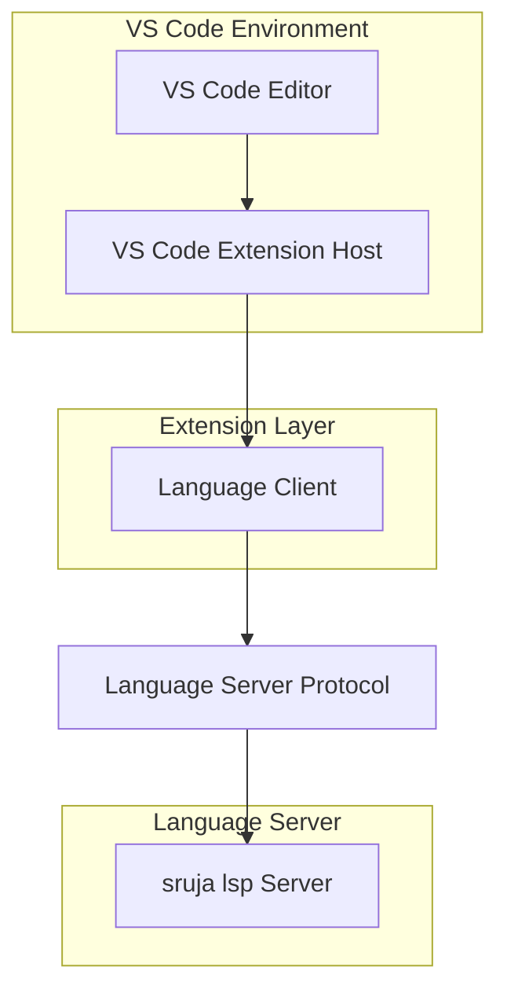
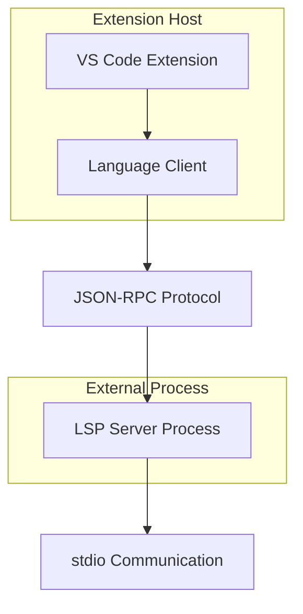
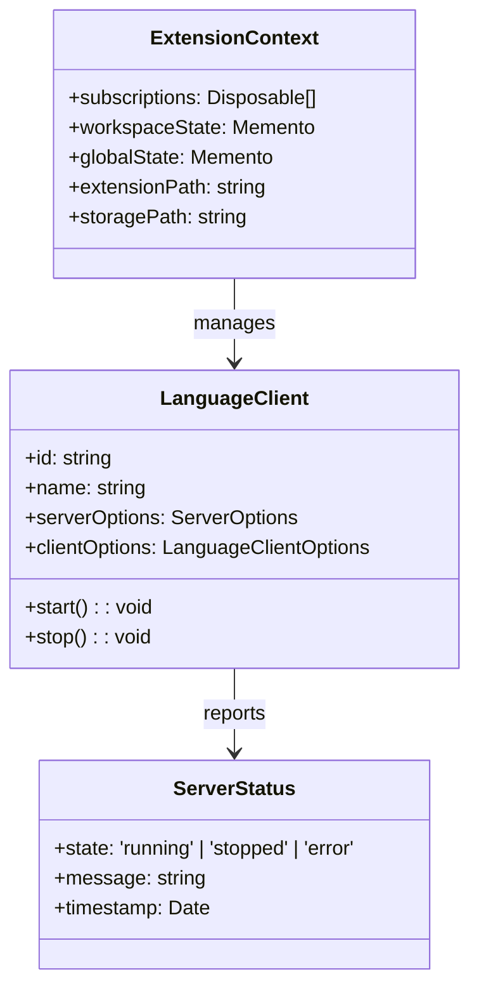

## 1. Architecture Design



## 2. Technology Description

* **Frontend**: TypeScript + VS Code Extension API

* **Initialization Tool**: yo code (VS Code Extension Generator)

* **Backend**: None (uses external `sruja lsp` server)

* **Communication**: Language Server Protocol (stdio)

## 3. Route Definitions

| Route                    | Purpose                                |
| ------------------------ | -------------------------------------- |
| extension.activate       | Triggered when .sruja files are opened |
| extension.formatDocument | Format entire Sruja document           |
| extension.goToDefinition | Navigate to symbol definition          |
| extension.findReferences | Find all symbol references             |
| extension.restartServer  | Restart LSP server connection          |

## 4. API Definitions

### 4.1 Core Extension APIs

**Language Server Configuration**

```typescript
interface LanguageServerConfig {
    command: string;        // Path to sruja lsp executable
    args: string[];         // Additional server arguments
    fileTypes: string[];    // ['.sruja']
    initializationOptions: object;
}
```

**Extension Settings**

```typescript
interface ExtensionSettings {
    srujaLanguageServer: {
        path: string;           // Custom LSP server path
        enableLogging: boolean;
        logLevel: 'error' | 'warn' | 'info' | 'debug';
    };
    formatting: {
        enabled: boolean;
        tabSize: number;
        insertSpaces: boolean;
    };
}
```

## 5. Server Architecture Diagram



## 6. Data Model

### 6.1 Extension State Management



### 6.2 Key Components

**Extension Manifest (package.json)**

```json
{
  "name": "sruja-language-support",
  "displayName": "Sruja DSL Language Support",
  "activationEvents": ["onLanguage:sruja"],
  "main": "./out/extension.js",
  "contributes": {
    "languages": [{
      "id": "sruja",
      "extensions": [".sruja"],
      "configuration": "./language-configuration.json"
    }],
    "configuration": {
      "title": "Sruja Language Server",
      "properties": {
        "srujaLanguageServer.path": {
          "type": "string",
          "default": "sruja-lsp",
          "description": "Path to sruja language server executable"
        }
      }
    }
  }
}
```

**Language Configuration**

```json
{
  "comments": {
    "lineComment": "//",
    "blockComment": ["/*", "*/"]
  },
  "brackets": [
    ["{", "}"],
    ["[", "]"],
    ["(", ")"]
  ],
  "autoClosingPairs": [
    ["{", "}"],
    ["[", "]"],
    ["(", ")"],
    ["\"", "\""],
    ["'", "'"]
  ]
}
```

