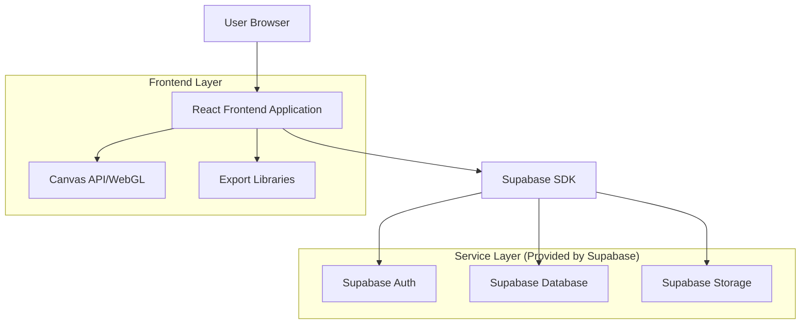
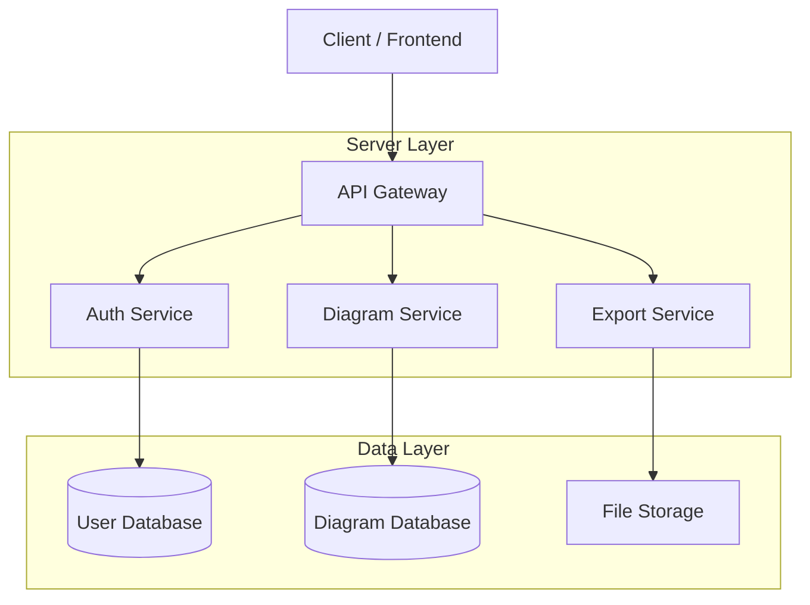
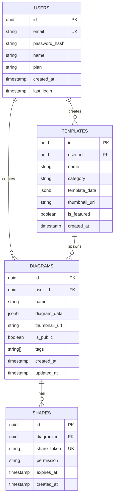

## 1. Architecture Design



## 2. Technology Description
- Frontend: React@18 + TypeScript + TailwindCSS@3 + Vite
- Initialization Tool: vite-init
- Backend: Supabase (Auth, Database, Storage)
- Canvas Rendering: HTML5 Canvas API + Fabric.js
- Export Libraries: html2canvas, jsPDF, FileSaver.js
- Real-time Collaboration: Supabase Realtime

## 3. Route Definitions
| Route | Purpose |
|-------|---------|
| / | Landing page with tool overview and get started button |
| /dashboard | User dashboard showing saved diagrams and templates |
| /editor/:id | Main canvas editor for creating/editing diagrams |
| /templates | Gallery of pre-built diagram templates |
| /share/:id | Public share link for viewing diagrams |
| /settings | User account settings and preferences |
| /login | User authentication page |
| /register | New user registration page |

## 4. API Definitions

### 4.1 Core API

**Diagram Management**
```
GET /api/diagrams
POST /api/diagrams
PUT /api/diagrams/:id
DELETE /api/diagrams/:id
```

Request (POST/PUT):
| Param Name | Param Type | isRequired | Description |
|------------|------------|------------|-------------|
| name | string | true | Diagram name/title |
| data | object | true | Diagram JSON data (shapes, connections, positions) |
| thumbnail | string | false | Base64 encoded thumbnail image |
| is_public | boolean | false | Public sharing flag |
| tags | array | false | Array of tag strings |

Response:
| Param Name | Param Type | Description |
|------------|------------|-------------|
| id | string | Unique diagram identifier |
| name | string | Diagram name |
| created_at | timestamp | Creation timestamp |
| updated_at | timestamp | Last modification timestamp |
| owner_id | string | User ID of diagram owner |

**Template Management**
```
GET /api/templates
GET /api/templates/:id
```

**Export Operations**
```
POST /api/export/png
POST /api/export/svg
POST /api/export/pdf
```

## 5. Server Architecture Diagram



## 6. Data Model

### 6.1 Data Model Definition


### 6.2 Data Definition Language

**Users Table**
```sql
-- create table
CREATE TABLE users (
  id UUID PRIMARY KEY DEFAULT gen_random_uuid(),
  email VARCHAR(255) UNIQUE NOT NULL,
  password_hash VARCHAR(255) NOT NULL,
  name VARCHAR(100) NOT NULL,
  plan VARCHAR(20) DEFAULT 'free' CHECK (plan IN ('free', 'premium', 'enterprise')),
  last_login TIMESTAMP WITH TIME ZONE,
  created_at TIMESTAMP WITH TIME ZONE DEFAULT NOW(),
  updated_at TIMESTAMP WITH TIME ZONE DEFAULT NOW()
);

-- create index
CREATE INDEX idx_users_email ON users(email);
CREATE INDEX idx_users_plan ON users(plan);

-- RLS policies
ALTER TABLE users ENABLE ROW LEVEL SECURITY;
CREATE POLICY "Users can view own profile" ON users FOR SELECT USING (auth.uid() = id);
CREATE POLICY "Users can update own profile" ON users FOR UPDATE USING (auth.uid() = id);
```

**Diagrams Table**
```sql
-- create table
CREATE TABLE diagrams (
  id UUID PRIMARY KEY DEFAULT gen_random_uuid(),
  user_id UUID NOT NULL REFERENCES users(id) ON DELETE CASCADE,
  name VARCHAR(255) NOT NULL,
  diagram_data JSONB NOT NULL,
  thumbnail_url TEXT,
  is_public BOOLEAN DEFAULT false,
  tags TEXT[] DEFAULT '{}',
  created_at TIMESTAMP WITH TIME ZONE DEFAULT NOW(),
  updated_at TIMESTAMP WITH TIME ZONE DEFAULT NOW()
);

-- create index
CREATE INDEX idx_diagrams_user_id ON diagrams(user_id);
CREATE INDEX idx_diagrams_public ON diagrams(is_public) WHERE is_public = true;
CREATE INDEX idx_diagrams_tags ON diagrams USING GIN(tags);
CREATE INDEX idx_diagrams_updated_at ON diagrams(updated_at DESC);

-- RLS policies
ALTER TABLE diagrams ENABLE ROW LEVEL SECURITY;
CREATE POLICY "Users can view own diagrams" ON diagrams FOR SELECT USING (auth.uid() = user_id);
CREATE POLICY "Users can view public diagrams" ON diagrams FOR SELECT USING (is_public = true);
CREATE POLICY "Users can create diagrams" ON diagrams FOR INSERT WITH CHECK (auth.uid() = user_id);
CREATE POLICY "Users can update own diagrams" ON diagrams FOR UPDATE USING (auth.uid() = user_id);
CREATE POLICY "Users can delete own diagrams" ON diagrams FOR DELETE USING (auth.uid() = user_id);
```

**Templates Table**
```sql
-- create table
CREATE TABLE templates (
  id UUID PRIMARY KEY DEFAULT gen_random_uuid(),
  user_id UUID REFERENCES users(id) ON DELETE SET NULL,
  name VARCHAR(255) NOT NULL,
  category VARCHAR(50) NOT NULL,
  template_data JSONB NOT NULL,
  thumbnail_url TEXT,
  is_featured BOOLEAN DEFAULT false,
  created_at TIMESTAMP WITH TIME ZONE DEFAULT NOW()
);

-- create index
CREATE INDEX idx_templates_category ON templates(category);
CREATE INDEX idx_templates_featured ON templates(is_featured) WHERE is_featured = true;

-- RLS policies
ALTER TABLE templates ENABLE ROW LEVEL SECURITY;
CREATE POLICY "Anyone can view templates" ON templates FOR SELECT USING (true);
CREATE POLICY "Admins can manage templates" ON templates FOR ALL USING (auth.jwt() ->> 'role' = 'admin');
```

**Shares Table**
```sql
-- create table
CREATE TABLE shares (
  id UUID PRIMARY KEY DEFAULT gen_random_uuid(),
  diagram_id UUID NOT NULL REFERENCES diagrams(id) ON DELETE CASCADE,
  share_token VARCHAR(64) UNIQUE NOT NULL,
  permission VARCHAR(20) DEFAULT 'view' CHECK (permission IN ('view', 'edit')),
  expires_at TIMESTAMP WITH TIME ZONE,
  created_at TIMESTAMP WITH TIME ZONE DEFAULT NOW()
);

-- create index
CREATE INDEX idx_shares_token ON shares(share_token);
CREATE INDEX idx_shares_diagram ON shares(diagram_id);
CREATE INDEX idx_shares_expires ON shares(expires_at) WHERE expires_at IS NOT NULL;

-- RLS policies
ALTER TABLE shares ENABLE ROW LEVEL SECURITY;
CREATE POLICY "Diagram owners can manage shares" ON shares FOR ALL USING (EXISTS (
  SELECT 1 FROM diagrams WHERE diagrams.id = diagram_id AND diagrams.user_id = auth.uid()
));
CREATE POLICY "Anyone can view valid shares" ON shares FOR SELECT USING (
  expires_at IS NULL OR expires_at > NOW()
);
```

**Grant Permissions**
```sql
-- Grant basic access to anon role
GRANT SELECT ON users TO anon;
GRANT SELECT ON templates TO anon;
GRANT SELECT ON diagrams TO anon WHERE is_public = true;
GRANT SELECT ON shares TO anon;

-- Grant full access to authenticated users
GRANT ALL PRIVILEGES ON users TO authenticated;
GRANT ALL PRIVILEGES ON diagrams TO authenticated;
GRANT ALL PRIVILEGES ON templates TO authenticated;
GRANT ALL PRIVILEGES ON shares TO authenticated;
```