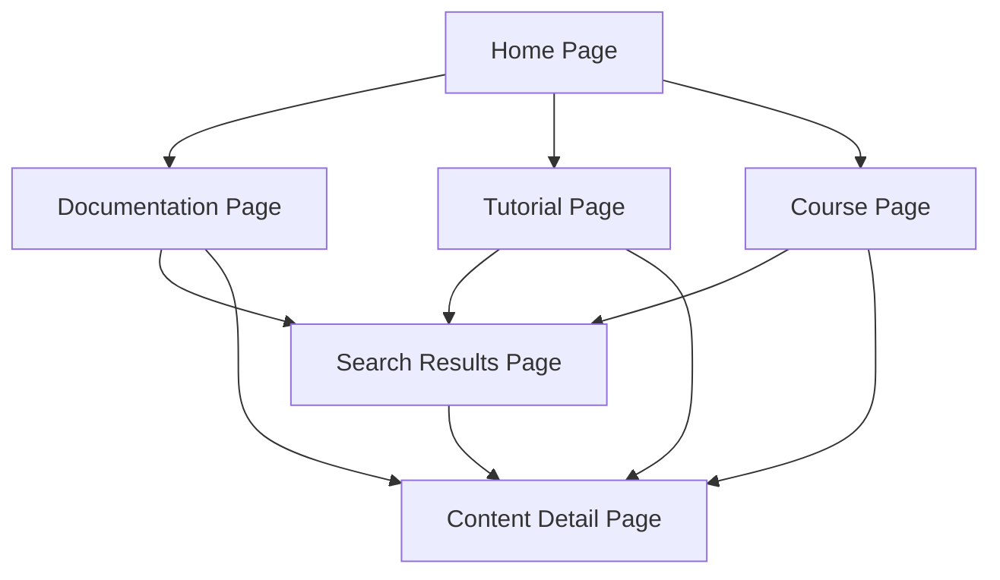

## 1. Product Overview

A content website featuring documentation, tutorials, and courses with left navigation and search functionality. The platform enables users to discover and navigate educational content efficiently through a structured sidebar navigation and powerful search capabilities.

Target users include developers, learners, and technical professionals seeking structured educational content with easy navigation and discovery features.

## 2. Core Features

### 2.1 User Roles

| Role               | Registration Method      | Core Permissions                                         |
| ------------------ | ------------------------ | -------------------------------------------------------- |
| Visitor            | No registration required | Browse and search all public content                     |
| Authenticated User | Email registration       | Bookmark content, track progress, access premium content |

### 2.2 Feature Module

Our content website consists of the following main pages:

1. **Home page**: hero section, navigation menu, featured content showcase.
2. **Documentation page**: left sidebar navigation, content display, search bar.
3. **Tutorial page**: tutorial list, filtering, detailed tutorial view.
4. **Course page**: course catalog, course details, progress tracking.
5. **Search results page**: search interface, filtered results, content preview.

### 2.3 Page Details

| Page Name           | Module Name             | Feature description                                                            |
| ------------------- | ----------------------- | ------------------------------------------------------------------------------ |
| Home page           | Hero section            | Display featured content with carousel/slider, show latest updates.            |
| Home page           | Navigation menu         | Top navigation bar with links to docs, tutorials, courses, search.             |
| Home page           | Featured content        | Showcase popular documentation, trending tutorials, new courses.               |
| Documentation page  | Left sidebar navigation | Hierarchical tree structure with collapsible sections, highlight current page. |
| Documentation page  | Content display         | Render markdown/MDX content with syntax highlighting, table of contents.       |
| Documentation page  | Search bar              | Real-time search with autocomplete, search across all content types.           |
| Tutorial page       | Tutorial list           | Grid/list view with filtering by category, difficulty, duration.               |
| Tutorial page       | Tutorial details        | Step-by-step content, code examples, progress indicators.                      |
| Course page         | Course catalog          | Browse courses by category, skill level, duration, popularity.                 |
| Course page         | Course details          | Course overview, curriculum breakdown, enrollment options.                     |
| Course page         | Progress tracking       | Show completion status, bookmark lessons, resume learning.                     |
| Search results page | Search interface        | Advanced search with filters for content type, category, date.                 |
| Search results page | Results display         | Paginated results with snippets, highlight search terms.                       |

## 3. Core Process

**Visitor Flow:**

1. User lands on homepage and sees featured content
2. User navigates to documentation, tutorials, or courses via top navigation
3. User uses left sidebar to browse documentation categories
4. User utilizes search bar to find specific content
5. User views content with proper formatting and navigation

**Authenticated User Flow:**

1. User logs in to access personalized features
2. User bookmarks interesting content for later reference
3. User tracks progress in courses and tutorials
4. User accesses premium content based on subscription

## 4. User Interface Design

### 4.1 Design Style

* **Primary colors**: Deep blue (#1e40af) for headers, light gray (#f8fafc) for backgrounds

* **Secondary colors**: Accent orange (#f97316) for CTAs, dark gray (#1f2937) for text

* **Button style**: Rounded corners (8px radius), subtle shadows, hover effects

* **Font**: Inter for headings, system-ui for body text, 16px base size

* **Layout style**: Card-based design with consistent spacing, left sidebar navigation

* **Icons**: Heroicons for consistency, outlined style for better visibility

### 4.2 Page Design Overview

| Page Name          | Module Name  | UI Elements                                                                              |
| ------------------ | ------------ | ---------------------------------------------------------------------------------------- |
| Home page          | Hero section | Full-width banner with gradient overlay, animated text, prominent CTA button.            |
| Documentation page | Left sidebar | Fixed position, 280px width, collapsible sections, active page highlighting.             |
| Documentation page | Content area | Responsive grid, max-width 800px, syntax-highlighted code blocks, breadcrumb navigation. |
| Documentation page | Search bar   | Sticky header position, 400px width, dropdown suggestions, clear button.                 |
| Tutorial page      | Content grid | 3-column responsive grid, card shadows, hover animations, difficulty badges.             |
| Course page        | Course cards | Horizontal layout with thumbnail, progress bar, enrollment status indicator.             |

### 4.3 Responsiveness

Desktop-first design approach with mobile adaptation. Left sidebar transforms to hamburger menu on tablets and mobile devices. Search bar remains accessible but adapts to screen size. Content reflows to single column on mobile
