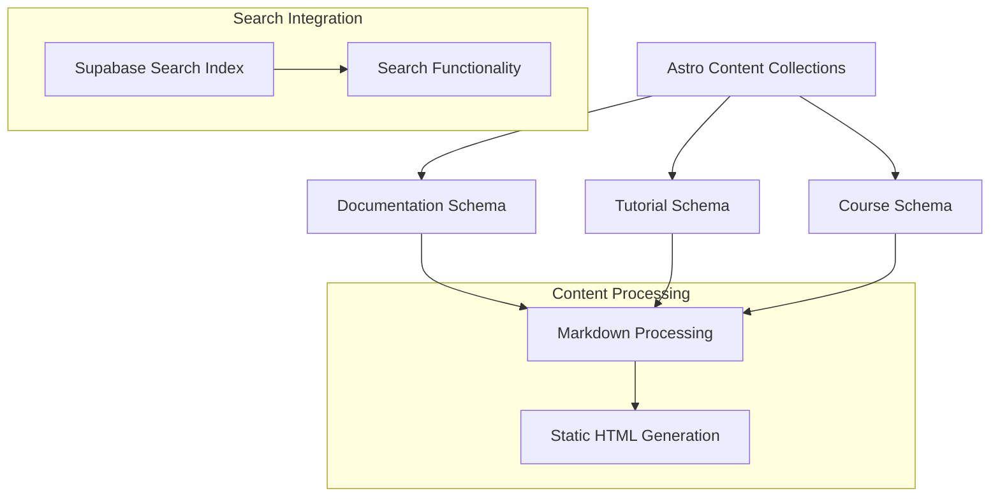

## 1. Architecture Design

```mermaid
graph TD
  A[User Browser] --> B[Astro Static Site]
  B --> C[Content Collections API]
  C --> D[Markdown/MDX Files]
  C --> E[Supabase Search Index]
  F[@sruja/ui Components] --> B

  subgraph "Frontend Layer"
    B
    F
  end

  subgraph "Content Layer"
    C
    D
  end

  subgraph "Service Layer"
    E
  end
```

## 2. Technology Description
- **Frontend**: Astro@4 + @sruja/ui component library + TailwindCSS@3
- **Initialization Tool**: npm create astro@latest
- **Backend**: None (Static site generation)
- **Content Management**: Astro Content Collections
- **Search**: Supabase for search index and querying
- **Styling**: TailwindCSS with custom theme configuration

## 3. Route Definitions
| Route | Purpose |
|-------|---------|
| / | Home page with featured content and navigation |
| /docs/[...slug] | Documentation pages with left navigation |
| /tutorials | Tutorial listing page with filtering |
| /tutorials/[...slug] | Individual tutorial pages |
| /courses | Course catalog page |
| /courses/[...slug] | Individual course pages |
| /search | Search results page |

## 4. API Definitions

### 4.1 Search API
```
GET /api/search
```

Request:
| Param Name| Param Type  | isRequired  | Description |
|-----------|-------------|-------------|-------------|
| query     | string      | true        | Search query text |
| type      | string      | false       | Content type filter (docs, tutorials, courses) |
| category  | string      | false       | Category filter |
| limit     | number      | false       | Result limit (default: 20) |

Response:
| Param Name| Param Type  | Description |
|-----------|-------------|-------------|
| results   | array       | Array of search result objects |
| total     | number      | Total number of matches |

Example Response:
```json
{
  "results": [
    {
      "id": "doc-123",
      "title": "Getting Started",
      "type": "documentation",
      "category": "basics",
      "excerpt": "Learn the basics of...",
      "url": "/docs/getting-started"
    }
  ],
  "total": 42
}
```

## 5. Content Architecture



## 6. Data Model

### 6.1 Content Schema Definitions

Documentation Schema:
```javascript
const docsCollection = defineCollection({
  schema: z.object({
    title: z.string(),
    description: z.string(),
    category: z.string(),
    order: z.number(),
    tags: z.array(z.string()).optional(),
    lastUpdated: z.date(),
  })
})
```

Tutorial Schema:
```javascript
const tutorialsCollection = defineCollection({
  schema: z.object({
    title: z.string(),
    description: z.string(),
    difficulty: z.enum(['beginner', 'intermediate', 'advanced']),
    duration: z.number(), // minutes
    category: z.string(),
    tags: z.array(z.string()),
    prerequisites: z.array(z.string()).optional(),
    publishedDate: z.date(),
  })
})
```

Course Schema:
```javascript
const coursesCollection = defineCollection({
  schema: z.object({
    title: z.string(),
    description: z.string(),
    level: z.enum(['beginner', 'intermediate', 'advanced']),
    duration: z.string(),
    modules: z.number(),
    category: z.string(),
    instructor: z.string(),
    price: z.number().optional(),
    publishedDate: z.date(),
  })
})
```

### 6.2 Supabase Search Index Table
```sql
-- Create search index table
CREATE TABLE search_index (
  id UUID PRIMARY KEY DEFAULT gen_random_uuid(),
  title VARCHAR(255) NOT NULL,
  content TEXT NOT NULL,
  type VARCHAR(50) NOT NULL CHECK (type IN ('documentation', 'tutorial', 'course')),
  category VARCHAR(100),
  url VARCHAR(500) NOT NULL,
  excerpt TEXT,
  tags TEXT[],
  created_at TIMESTAMP WITH TIME ZONE DEFAULT NOW(),
  updated_at TIMESTAMP WITH TIME ZONE DEFAULT NOW()
);

-- Create indexes for search performance
CREATE INDEX idx_search_title ON search_index USING gin(to_tsvector('english', title));
CREATE INDEX idx_search_content ON search_index USING gin(to_tsvector('english', content));
CREATE INDEX idx_search_type ON search_index(type);
CREATE INDEX idx_search_category ON search_index(category);

-- Grant permissions
GRANT SELECT ON search_index TO anon;
GRANT ALL PRIVILEGES ON search_index TO authenticated;
```

## 7. Component Architecture

### 7.1 @sruja/ui Integration
- **Navigation Components**: Sidebar, Breadcrumbs, Pagination
- **Content Components**: ContentCard, CodeBlock, TableOfContents
- **Search Components**: SearchBar, SearchResults, FilterPanel
- **Layout Components**: PageLayout, ContentLayout, GridLayout

### 7.2 Theme Configuration
```javascript
// tailwind.config.js
export default {
  theme: {
    extend: {
      colors: {
        primary: {
          50: '#eff6ff',
          500: '#3b82f6',
          900: '#1e3a8a',
        },
        accent: {
          500: '#f97316',
        }
      },
      fontFamily: {
        sans: ['Inter', 'system-ui', 'sans-serif'],
      }
    }
  }
}
```

## 8. Build Process
1. **Content Processing**: Astro processes markdown/MDX files through content collections
2. **Search Index Generation**: Build script generates search index in Supabase
3. **Static Generation**: Astro generates static HTML for all routes
4. **Component Integration**: @sruja/ui components are imported and styled with theme
5. **Deployment**: Static files deployed to CDN with Supabase for search functionality