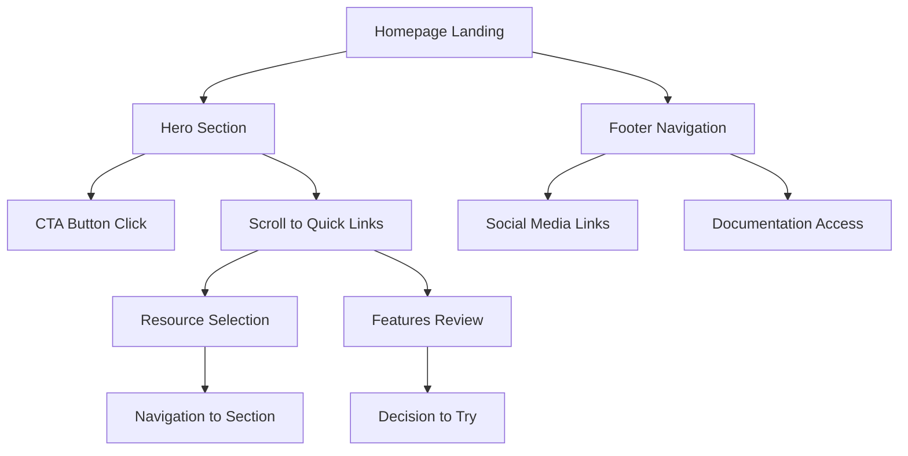

## 1. Product Overview
Revamp the Sruja documentation website homepage with a modern, engaging design featuring hero section, quick links, and compelling call-to-action elements. Add a comprehensive sitewide footer with navigation, social links, and copyright information to improve site navigation and user experience.

This enhancement aims to create a more professional and user-friendly entry point that better showcases Sruja's capabilities as a developer-friendly language for software architecture modeling and visualization.

## 2. Core Features

### 2.1 User Roles
| Role | Registration Method | Core Permissions |
|------|---------------------|------------------|
| Visitor | No registration required | Browse all public content, access documentation, view examples |

### 2.2 Feature Module
The homepage revamp consists of the following main components:
1. **Hero Section**: Eye-catching headline, compelling subtitle, and prominent CTA buttons
2. **Quick Links Section**: Easy access to key resources and features
3. **Features Showcase**: Highlight core benefits and capabilities
4. **Sitewide Footer**: Navigation links, social media, and copyright

### 2.3 Page Details
| Page Name | Module Name | Feature description |
|-----------|-------------|---------------------|
| Homepage | Hero Section | Display impactful headline "Build Better Software Systems", engaging subtitle about Sruja's value proposition, and two CTA buttons (Get Started, View on GitHub) with hover effects and modern styling |
| Homepage | Quick Links Grid | Present 4 key navigation cards (Courses, Documentation, Tutorials, Blogs) with icons, titles, and descriptions in a responsive grid layout with hover animations |
| Homepage | Features Showcase | Highlight 4 core benefits (Code-First, C4 Model, Diagrams as Code, Validation) with icons and descriptive text in an attractive grid layout |
| Sitewide Footer | Navigation Links | Provide organized footer navigation with sections for Documentation, Resources, Community, and Company links |
| Sitewide Footer | Social Links | Include social media icons and links (GitHub, Twitter, LinkedIn, Discord) with hover effects |
| Sitewide Footer | Copyright | Display copyright information, terms of service, privacy policy, and current year |

## 3. Core Process
**Visitor Flow:**
1. Visitor lands on homepage → Views compelling hero section → Clicks CTA to explore further
2. Visitor browses quick links → Selects relevant resource → Navigates to chosen section
3. Visitor reviews features → Understands Sruja benefits → Decides to try the tool
4. Visitor scrolls to footer → Accesses additional navigation → Connects via social media

## 4. User Interface Design

### 4.1 Design Style
- **Primary Colors**: Purple gradient (#7C3AED to #2563EB) for hero background
- **Secondary Colors**: Pink (#DB2777) for primary buttons, white with transparency for secondary buttons
- **Button Style**: Rounded corners (8px), modern flat design with hover animations and box shadows
- **Typography**: Large, bold headlines (3.5em), clean sans-serif fonts with proper hierarchy
- **Layout Style**: Card-based grid layouts with curved bottom hero section, full-width containers
- **Icons**: Emoji-style icons (🎓📚🛠️📝) with gradient effects, consistent sizing (3.5em)

### 4.2 Page Design Overview
| Page Name | Module Name | UI Elements |
|-----------|-------------|-------------|
| Homepage | Hero Section | Full-width gradient background with curved bottom, centered white text, large headline (3.5em), subtitle with max-width constraint, dual button layout with hover transforms |
| Homepage | Quick Links | 4-column responsive grid, white cards with rounded corners (16px), emoji icons with pink gradients, hover effects with elevation and border color change |
| Homepage | Features | 4-column grid with white background cards, emoji icons, consistent spacing (40px gap), hover animations with subtle elevation |
| Footer | Navigation | Dark background with organized link sections, clear typography hierarchy, responsive column layout |
| Footer | Social Links | Icon-based social media buttons with hover effects, consistent spacing and alignment |

### 4.3 Responsiveness
- **Desktop-first approach**: Optimized for desktop viewing with full-width hero section
- **Mobile adaptive**: Responsive grid layouts that stack on mobile devices
- **Touch optimization**: Large tap targets for buttons and links, appropriate spacing for mobile interaction
- **Breakpoint handling**: Specific mobile styles for hero text size reduction (2.5em) and button stacking