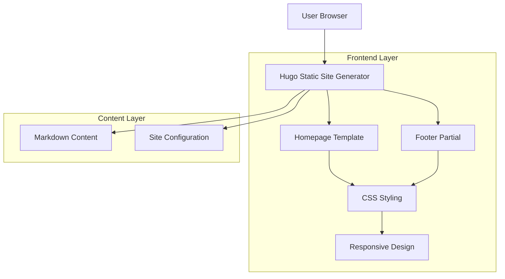
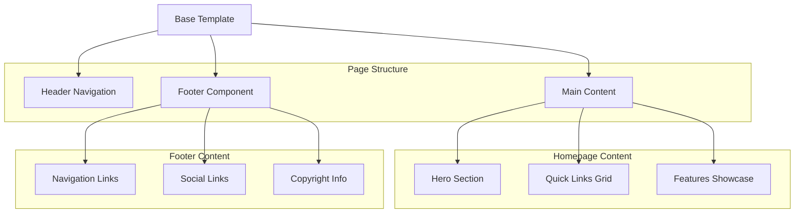

## 1. Architecture design



## 2. Technology Description
- **Frontend**: Hugo static site generator with custom templates
- **Styling**: CSS3 with modern features (gradients, backdrop-filter, transitions)
- **Layout**: Hugo Book theme with custom overrides
- **Icons**: Emoji characters with CSS gradient effects
- **Responsive**: CSS Grid and Flexbox with media queries
- **No Backend**: Static site deployment only

## 3. Route definitions

| Route | Purpose |
|-------|---------|
| / | Homepage with hero section, quick links, and features showcase |
| /* | All pages include the sitewide footer component |
| /docs/ | Documentation section |
| /courses/ | Course catalog |
| /tutorials/ | Tutorial collection |
| /blogs/ | Blog posts |

## 4. File Structure Implementation

### 4.1 Homepage Template
- **File**: `/docs/layouts/_default/baseof.html` (extends Book theme)
- **File**: `/docs/layouts/_default/list.html` (homepage override)
- **Content**: `/docs/content/_index.md` (homepage content)

### 4.2 Footer Implementation
- **Partial**: `/docs/layouts/partials/footer.html` (footer component)
- **Styling**: `/docs/static/css/footer.css` (footer-specific styles)
- **Integration**: Added to base template for sitewide inclusion

### 4.3 Styling Architecture
- **Main Styles**: `/docs/static/css/home.css` (homepage-specific)
- **Theme Overrides**: `/docs/assets/_custom.scss` (Book theme customizations)
- **Responsive**: Media queries for mobile adaptation

## 5. Component Architecture



## 6. CSS Architecture

### 6.1 Homepage Styles
```css
/* Modular CSS classes */
.home-hero { /* Hero container */ }
.home-grid { /* Quick links grid */ }
.home-features { /* Features section */ }
.button { /* CTA buttons */ }
.card { /* Link cards */ }
.feature { /* Feature items */ }
```

### 6.2 Footer Styles
```css
.site-footer { /* Footer container */ }
.footer-nav { /* Navigation sections */ }
.footer-social { /* Social links */ }
.footer-bottom { /* Copyright area */ }
```

### 6.3 Responsive Breakpoints
```css
/* Mobile: 600px and below */
@media (max-width: 600px) {
  /* Mobile-specific styles */
}

/* Tablet: 601px - 1024px */
@media (min-width: 601px) and (max-width: 1024px) {
  /* Tablet-specific styles */
}

/* Desktop: 1025px and above */
@media (min-width: 1025px) {
  /* Desktop-specific styles */
}
```

## 7. Deployment Considerations

### 7.1 Static Site Generation
- Hugo builds static HTML/CSS/JS files
- No server-side processing required
- CDN-friendly deployment
- Fast loading times

### 7.2 Asset Optimization
- CSS minification enabled
- Image optimization (if images added)
- Font loading optimization
- Critical CSS inlining

### 7.3 Performance Metrics
- Lighthouse score target: 90+
- First Contentful Paint: <1.5s
- Largest Contentful Paint: <2.5s
- Cumulative Layout Shift: <0.1