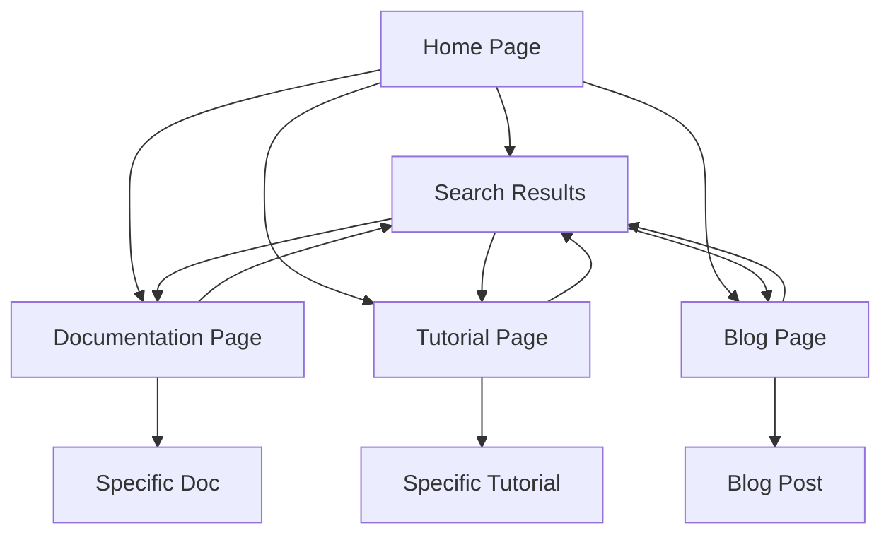

## 1. Product Overview

A static-generated language learning application with efficient local search capabilities for language documentation, designed to serve as a foundation for tutorials and blogs. The app will provide fast, offline-first access to language learning materials with powerful search functionality.

Target users include language learners, developers seeking language documentation, and content creators who want to publish language tutorials and blog posts.

## 2. Core Features

### 2.1 User Roles

| Role            | Registration Method      | Core Permissions                                               |
| --------------- | ------------------------ | -------------------------------------------------------------- |
| Visitor         | No registration required | Browse content, search documentation, read tutorials           |
| Content Creator | Email registration       | Create/edit tutorials, manage blog posts, upload language docs |
| Admin           | Invitation-based         | Full content management, user management, system configuration |

### 2.2 Feature Module

The language learning app consists of the following main pages:

1. **Home page**: Hero section with search, featured content, navigation menu.
2. **Documentation page**: Language documentation browser with sidebar navigation and content viewer.
3. **Search results page**: Advanced search interface with filters and result ranking.
4. **Tutorial page**: Step-by-step language tutorials with code examples and exercises.
5. **Blog page**: Article listings with categories, tags, and reading time estimates.
6. **Blog post page**: Individual blog post with comments and related articles.
7. **About page**: Project information and contributor guidelines.

### 2.3 Page Details

| Page Name           | Module Name        | Feature description                                                                               |
| ------------------- | ------------------ | ------------------------------------------------------------------------------------------------- |
| Home page           | Hero section       | Display search bar with auto-complete, show trending languages and popular tutorials.             |
| Home page           | Featured content   | Carousel showcasing featured tutorials, latest blog posts, and language documentation highlights. |
| Home page           | Navigation menu    | Responsive navigation with language categories, tutorial sections, and blog categories.           |
| Documentation page  | Sidebar navigation | Hierarchical tree view of language documentation with expand/collapse functionality.              |
| Documentation page  | Content viewer     | Render markdown content with syntax highlighting, copy code buttons, and anchor links.            |
| Documentation page  | Search within docs | Real-time search within current documentation section with highlighting.                          |
| Search results page | Search interface   | Full-text search across all content with advanced filters for language, content type, and date.   |
| Search results page | Results display    | Paginated results with relevance scoring, content previews, and direct navigation.                |
| Tutorial page       | Tutorial browser   | Grid/list view of available tutorials with difficulty levels, duration, and language tags.        |
| Tutorial page       | Tutorial viewer    | Step-by-step tutorial interface with progress tracking, code examples, and interactive exercises. |
| Blog page           | Article listings   | Chronological list of blog posts with categories, tags, author info, and reading time.            |
| Blog page           | Category filter    | Sidebar with blog categories and tag cloud for content discovery.                                 |
| Blog post page      | Article content    | Full blog post with markdown rendering, syntax highlighting, and table of contents.               |
| Blog post page      | Comments section   | Disqus or similar commenting system with moderation capabilities.                                 |
| About page          | Project info       | Overview of the project, mission statement, and contribution guidelines.                          |

## 3. Core Process

**Visitor Flow:**

1. User lands on homepage and sees search interface
2. User searches for specific language documentation or browses categories
3. System displays relevant content with instant search results
4. User navigates to documentation, tutorials, or blog posts
5. Content loads instantly from static files
6. User can bookmark or share content

**Content Creator Flow:**

1. Creator logs in via admin interface
2. Creator uploads or edits markdown files for documentation/tutorials
3. System triggers static site generation
4. New content becomes available immediately after build
5. Creator can preview changes before publishing

**Search Process Flow:**

1. User enters search query
2. Local search index processes query
3. Results ranked by relevance and displayed instantly
4. User can filter by content type, language, or date range
5. Clicking result navigates directly to content

## 4. User Interface Design

### 4.1 Design Style

* **Primary colors**: Deep blue (#1e40af) for headers, white (#ffffff) for backgrounds

* **Secondary colors**: Light gray (#f8fafc) for cards, green (#10b981) for success states

* **Button style**: Rounded corners (8px radius), subtle shadows, hover effects

* **Font**: Inter for body text, JetBrains Mono for code blocks

* **Layout style**: Card-based design with consistent spacing (8px grid system)

* **Icons**: Heroicons for UI elements, custom language icons for programming languages

### 4.2 Page Design Overview

| Page Name           | Module Name      | UI Elements                                                                                                |
| ------------------- | ---------------- | ---------------------------------------------------------------------------------------------------------- |
| Home page           | Hero section     | Centered search bar with gradient background, language icons floating animation, prominent call-to-action. |
| Home page           | Featured content | 3-column responsive grid, hover cards with elevation effect, smooth transitions.                           |
| Documentation page  | Sidebar          | Collapsible tree navigation with indentation, active item highlighting, smooth expand/collapse animations. |
| Documentation page  | Content area     | Clean white background, syntax-highlighted code blocks with copy buttons, responsive typography.           |
| Search results page | Search bar       | Prominent search input with filter chips, instant search suggestions dropdown.                             |
| Tutorial page       | Tutorial grid    | Card-based layout with progress indicators, difficulty badges, estimated time.                             |
| Blog page           | Article list     | Clean typography with reading time estimates, author avatars, category pills.                              |

### 4.3 Responsiveness

* **Desktop-first approach**: Optimized for 1440px+ screens

* **Mobile adaptation**: Responsive breakpoints at 768px and 480px

* **Touch optimization**: Larger tap targets on mobile, swipe gestures for navigation

* **Performance**: Static generation ensures instant loading on all devices

