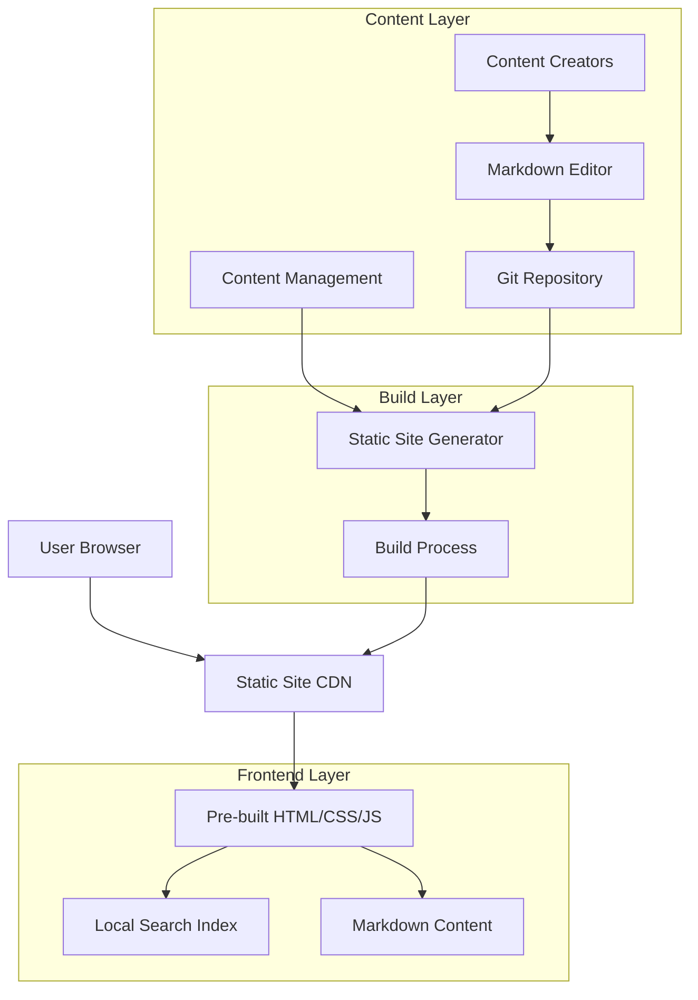

## 1. Architecture design



## 2. Technology Description

- **Frontend**: Next.js@14 with TypeScript, Tailwind CSS@3
- **Static Site Generator**: Next.js SSG with ISR (Incremental Static Regeneration)
- **Search Engine**: Lunr.js for client-side search indexing
- **Content Format**: Markdown with frontmatter YAML
- **Syntax Highlighting**: Prism.js with language-specific themes
- **Build Tool**: Next.js build system with custom webpack configuration
- **Content Management**: Git-based workflow with markdown files
- **Deployment**: Static hosting (Vercel/Netlify compatible)

## 3. Route definitions

| Route | Purpose |
|-------|---------|
| / | Homepage with search and featured content |
| /docs/[...slug] | Documentation pages with hierarchical routing |
| /tutorials | Tutorial listing with filters and categories |
| /tutorials/[slug] | Individual tutorial pages with step-by-step content |
| /blog | Blog post listings with pagination |
| /blog/[slug] | Individual blog post pages |
| /blog/category/[category] | Category-filtered blog posts |
| /blog/tag/[tag] | Tag-filtered blog posts |
| /search | Search interface with advanced filters |
| /about | Project information and contribution guidelines |

## 4. Content Structure

### 4.1 Documentation Structure
```
content/
├── docs/
│   ├── getting-started/
│   │   ├── installation.md
│   │   └── quick-start.md
│   ├── languages/
│   │   ├── javascript/
│   │   │   ├── basics.md
│   │   │   └── advanced.md
│   │   └── python/
│   │       ├── introduction.md
│   │       └── best-practices.md
│   └── api/
│       ├── reference.md
│       └── examples.md
├── tutorials/
│   ├── beginner/
│   │   ├── javascript-fundamentals.md
│   │   └── python-basics.md
│   └── advanced/
│       ├── async-programming.md
│       └── design-patterns.md
└── blog/
    ├── 2024/
    │   ├── january/
    │   │   ├── new-features-announcement.md
    │   │   └── learning-tips.md
    │   └── february/
    └── 2023/
```

### 4.2 Frontmatter Schema
```yaml
---
title: "JavaScript Fundamentals"
description: "Learn the basics of JavaScript programming"
date: "2024-01-15"
author: "John Doe"
category: "JavaScript"
tags: ["beginner", "fundamentals", "javascript"]
difficulty: "beginner"
estimatedTime: "30 minutes"
language: "javascript"
prerequisites: ["html-basics", "css-basics"]
---
```

## 5. Search Implementation

### 5.1 Search Index Structure
```javascript
interface SearchDocument {
  id: string;
  title: string;
  content: string;
  type: 'doc' | 'tutorial' | 'blog';
  category?: string;
  tags: string[];
  language?: string;
  difficulty?: string;
  url: string;
  excerpt: string;
  date?: string;
}

interface SearchIndex {
  documents: SearchDocument[];
  lunrIndex: lunr.Index;
}
```

### 5.2 Build-time Search Generation
```javascript
// scripts/build-search-index.js
import { buildSearchIndex } from './search-builder';
import { getAllContent } from './content-loader';

export async function generateSearchIndex() {
  const content = await getAllContent();
  const searchIndex = buildSearchIndex(content);
  
  // Write to public directory for client-side access
  fs.writeFileSync(
    'public/search-index.json',
    JSON.stringify(searchIndex)
  );
}
```

## 6. Performance Optimization

### 6.1 Static Generation Strategy
- **Pre-rendering**: All pages pre-built at build time
- **Incremental Static Regeneration**: Update content without full rebuild
- **Code Splitting**: Automatic chunking for optimal loading
- **Image Optimization**: Next.js Image component with lazy loading
- **Font Optimization**: Subset fonts with fallback strategies

### 6.2 Search Performance
- **Client-side Index**: Lunr.js index loaded once per session
- **Progressive Enhancement**: Search works offline after initial load
- **Debounced Input**: 300ms debounce on search input
- **Result Caching**: Cache search results in memory
- **Virtual Scrolling**: For large result sets

### 6.3 Bundle Size Optimization
- **Tree Shaking**: Remove unused code automatically
- **Dynamic Imports**: Load components on demand
- **Asset Optimization**: Minify CSS, JS, and HTML
- **Compression**: Gzip/Brotli compression for all assets

## 7. Development Workflow

### 7.1 Content Creation Process
1. Content creators write markdown files with proper frontmatter
2. Files committed to git repository
3. Build process triggered (CI/CD)
4. Static site generated with updated search index
5. New content deployed to CDN

### 7.2 Local Development
```bash
# Install dependencies
npm install

# Start development server
npm run dev

# Build search index locally
npm run build:search

# Generate static site
npm run build

# Preview production build
npm run start
```

### 7.3 Content Validation
- **Frontmatter validation**: Ensure required fields are present
- **Markdown linting**: Consistent formatting across content
- **Link validation**: Verify internal and external links
- **Image optimization**: Compress and optimize images during build

## 8. Deployment Architecture

### 8.1 Static Hosting Configuration
- **CDN Distribution**: Global edge locations for fast access
- **Cache Headers**: Optimal caching strategies for different asset types
- **Custom Domain**: Domain configuration with SSL/TLS
- **Environment Variables**: Build-time configuration injection

### 8.2 CI/CD Pipeline
```yaml
# .github/workflows/deploy.yml
name: Deploy Language Learning App
on:
  push:
    branches: [main]
  pull_request:
    branches: [main]

jobs:
  build-and-deploy:
    runs-on: ubuntu-latest
    steps:
      - uses: actions/checkout@v3
      - name: Setup Node.js
        uses: actions/setup-node@v3
        with:
          node-version: '18'
      - name: Install dependencies
        run: npm ci
      - name: Build search index
        run: npm run build:search
      - name: Build static site
        run: npm run build
      - name: Deploy to hosting
        run: npm run deploy
```

## 9. Monitoring and Analytics

### 9.1 Performance Monitoring
- **Core Web Vitals**: LCP, FID, CLS tracking
- **Search Analytics**: Track popular queries and zero-result searches
- **Error Tracking**: Client-side error monitoring
- **Usage Analytics**: Page views, time on page, bounce rate

### 9.2 SEO Optimization
- **Meta Tags**: Dynamic meta tags for each page
- **Structured Data**: JSON-LD schema markup
- **Sitemap Generation**: Automatic XML sitemap
- **RSS Feeds**: RSS feed for blog content
- **Social Sharing**: Open Graph and Twitter Card meta tags