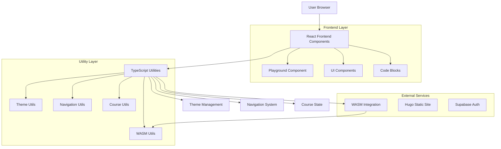
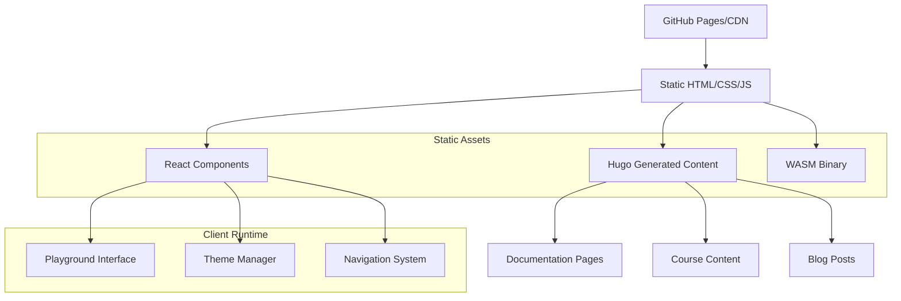
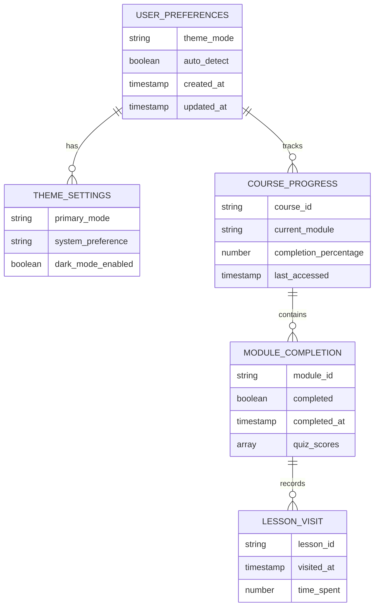
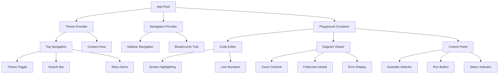

## 1. Architecture Design



## 2. Technology Description

- **Frontend**: React@19 + TypeScript@5 + TailwindCSS@4
- **Initialization Tool**: vite-init (for modern build pipeline)
- **Backend**: Hugo Static Site Generator (no server-side backend required)
- **Database**: LocalStorage for user preferences and course progress
- **WASM**: Go-compiled WebAssembly for Sruja language compilation
- **UI Components**: Radix UI primitives with custom styling
- **Icons**: Lucide React for consistent iconography

## 3. Route Definitions

| Route | Purpose |
|-------|---------|
| / | Homepage with feature overview and navigation |
| /docs/ | Documentation hub with searchable content |
| /docs/concepts/* | Detailed concept explanations |
| /docs/reference/ | API reference and syntax documentation |
| /playground/ | Interactive code editor with live compilation |
| /courses/ | Course catalog and learning paths |
| /courses/system-design-101/ | System Design 101 course modules |
| /courses/system-design-201/ | Advanced system design course |
| /about/ | Project information and team details |
| /community/ | Community links and contribution guidelines |

## 4. API Definitions

### 4.1 WASM Compilation API

```typescript
interface CompileResult {
  error?: string;
  svg?: string;
}

interface SrujaCompiler {
  compileSruja(code: string, filename: string): CompileResult;
}
```

### 4.2 Theme Management API

```typescript
interface ThemeConfig {
  mode: 'light' | 'dark' | 'system';
  autoDetect: boolean;
}

interface ThemeManager {
  getTheme(): ThemeConfig;
  setTheme(mode: ThemeConfig['mode']): void;
  toggleTheme(): void;
}
```

### 4.3 Course Progress API

```typescript
interface CourseState {
  visited: string[];
  quizResults: Record<string, unknown>;
  lastVisited: string | null;
}

interface CourseManager {
  getProgress(): CourseState;
  markVisited(pageId: string): void;
  saveQuizResult(quizId: string, result: unknown): void;
  getLastVisited(): string | null;
}
```

## 5. Server Architecture Diagram

Since this is a static site with no server-side backend, the architecture focuses on client-side components and static asset delivery:



## 6. Data Model

### 6.1 Client-Side Data Model



### 6.2 LocalStorage Schema

```typescript
// User Preferences
interface UserPreferences {
  theme: {
    mode: 'light' | 'dark' | 'system';
    autoDetect: boolean;
  };
  version: string;
}

// Course Progress
interface CourseProgress {
  courses: {
    [courseId: string]: {
      visited: string[];
      quizResults: Record<string, unknown>;
      lastVisited: string | null;
      startedAt: string;
      updatedAt: string;
    };
  };
}

// Playground State
interface PlaygroundState {
  lastCode: string;
  selectedExample: string;
  zoomLevel: number;
}
```

## 7. Component Architecture

### 7.1 React Component Hierarchy



### 7.2 Utility Module Structure

```typescript
// utils/wasm.ts - WASM Integration
export function initSrujaWasm(): Promise<void>
export function compileSrujaCode(code: string, filename: string): CompileResult

// utils/theme.ts - Theme Management  
export function initTheme(): void
export function toggleTheme(): void
export function getPreferredTheme(): 'light' | 'dark'

// utils/navigation.ts - Navigation Logic
export function getSection(path: string): Section
export function filterSidebarBySection(): void
export function setupCollapsibleSidebar(): void

// utils/course-state.ts - Course Progress
export function trackPageVisit(): void
export function getCourseProgress(): CourseState
export function saveQuizResult(quizId: string, result: unknown): void

// utils/code-blocks.ts - Code Enhancement
export function initSrujaCodeBlocks(): void
export function enhanceCodeBlocks(): void
```

## 8. Build Configuration

### 8.1 TypeScript Configuration

The project uses TypeScript with strict mode enabled and modern ES2020 target:

```json
{
  "compilerOptions": {
    "target": "ES2020",
    "module": "ESNext",
    "lib": ["ES2020", "DOM", "DOM.Iterable"],
    "jsx": "react-jsx",
    "moduleResolution": "bundler",
    "strict": true,
    "noUnusedLocals": false,
    "noUnusedParameters": false,
    "skipLibCheck": true
  }
}
```

### 8.2 Asset Pipeline

- **Hugo Asset Pipeline**: Processes and optimizes static assets
- **TailwindCSS**: Utility-first CSS with JIT compilation
- **TypeScript Compilation**: Transpiles React components and utilities
- **WASM Integration**: Loads and initializes Go-compiled WebAssembly

## 9. Performance Considerations

### 9.1 Code Splitting
- React components loaded on-demand
- WASM binary loaded asynchronously
- CSS optimized with Tailwind's JIT compilation

### 9.2 Caching Strategy
- Static assets cached via CDN
- LocalStorage for user preferences
- Session storage for temporary playground state

### 9.3 Bundle Optimization
- Tree shaking for unused code elimination
- Minification for production builds
- Compression for WASM binary and assets

## 10. Shared Monaco Components Usage

### 10.1 Monaco Editor Integration in Learn App

The Learn app shares Monaco editor components with Studio and Docs applications:

```typescript
// Shared Monaco configuration for Learn app
export const learnMonacoConfig = {
  theme: 'vs-dark',
  fontSize: 14,
  minimap: { enabled: true },
  scrollBeyondLastLine: false,
  automaticLayout: true,
  wordWrap: 'on',
  lineNumbers: 'on',
  renderLineHighlight: 'all',
  selectOnLineNumbers: true,
  matchBrackets: 'always',
  autoIndent: 'full',
  formatOnPaste: true,
  formatOnType: true,
  folding: true,
  foldingStrategy: 'auto',
  showFoldingControls: 'always'
};

// Learn-specific language configuration
export const learnLanguages = [
  { id: 'sruja', extensions: ['.sruja'], aliases: ['Sruja'] },
  { id: 'typescript', extensions: ['.ts'], aliases: ['TypeScript'] },
  { id: 'javascript', extensions: ['.js'], aliases: ['JavaScript'] }
];
```

### 10.2 Playground Component Integration

```typescript
// PlaygroundEditor.tsx - Shared component for Learn app
export const PlaygroundEditor: React.FC<PlaygroundEditorProps> = ({
  language = 'sruja',
  initialCode,
  onCodeChange,
  readOnly = false,
  height = '500px',
  showLineNumbers = true,
  enableLinting = true
}) => {
  const editorRef = useRef<MonacoEditor | null>(null);
  const containerRef = useRef<HTMLDivElement>(null);
  const [isEditorReady, setIsEditorReady] = useState(false);
  
  useEffect(() => {
    if (containerRef.current && !editorRef.current) {
      // Register languages for Learn app
      registerLearnLanguages();
      
      const editor = monaco.editor.create(containerRef.current, {
        ...learnMonacoConfig,
        language,
        value: initialCode,
        readOnly,
        lineNumbers: showLineNumbers ? 'on' : 'off'
      });
      
      editorRef.current = editor;
      setIsEditorReady(true);
      
      // Setup linting if enabled
      if (enableLinting) {
        setupSrujaLinting(editor);
      }
      
      // Handle code changes
      editor.onDidChangeModelContent(() => {
        const code = editor.getValue();
        onCodeChange?.(code);
      });
      
      // Setup course-specific features
      if (language === 'sruja') {
        setupCourseLanguageFeatures(editor);
      }
    }
    
    return () => {
      editorRef.current?.dispose();
      editorRef.current = null;
    };
  }, [language, readOnly, showLineNumbers, enableLinting]);
  
  return (
    <div className="playground-editor">
      <div ref={containerRef} style={{ height }} />
      {isEditorReady && (
        <EditorToolbar editor={editorRef.current} language={language} />
      )}
    </div>
  );
};
```

### 10.3 Course-Specific Language Features

```typescript
// Course-specific language features for Learn app
function setupCourseLanguageFeatures(editor: MonacoEditor): void {
  // Enhanced syntax highlighting for educational content
  monaco.languages.setMonarchTokensProvider('sruja-edu', {
    tokenizer: {
      root: [
        // Educational annotations
        [/\/\*\s*@learning\s*\*\//, 'learning-annotation'],
        [/\/\*\s*@concept\s*\*\//, 'concept-annotation'],
        [/\/\*\s*@example\s*\*\//, 'example-annotation'],
        
        // Core Sruja syntax
        [/@\w+/, 'annotation'],
        [/\b(class|interface|enum|component)\b/, 'keyword'],
        [/\b(extends|implements|uses|requires)\b/, 'keyword'],
        
        // Comments and strings
        [/--.*$/, 'comment'],
        [/\/\*[\s\S]*?\*\//, 'comment'],
        [/".*"/, 'string'],
        [/'.*'/, 'string'],
        
        // Numbers and operators
        [/\d+/, 'number'],
        [/[+\-*/=<>!]+/, 'operator'],
        
        // Identifiers
        [/\b[A-Z][a-zA-Z0-9]*\b/, 'type.identifier'],
        [/\b[a-z][a-zA-Z0-9]*\b/, 'identifier']
      ]
    }
  });
  
  // Educational auto-completion
  monaco.languages.registerCompletionItemProvider('sruja-edu', {
    provideCompletionItems: (model, position) => {
      const suggestions = [
        // Learning-focused suggestions
        {
          label: '@learning',
          kind: monaco.languages.CompletionItemKind.Snippet,
          insertText: '@learning\n${1:concept}: ${2:description}',
          documentation: 'Mark a learning objective'
        },
        {
          label: '@concept',
          kind: monaco.languages.CompletionItemKind.Snippet,
          insertText: '@concept\n${1:name}: ${2:explanation}',
          documentation: 'Explain a concept'
        },
        {
          label: '@example',
          kind: monaco.languages.CompletionItemKind.Snippet,
          insertText: '@example\n${1:description}\n${2:code}',
          documentation: 'Provide an example'
        },
        
        // Core Sruja suggestions
        {
          label: 'class',
          kind: monaco.languages.CompletionItemKind.Keyword,
          insertText: 'class ${1:Name} {\n\t$0\n}',
          documentation: 'Define a class'
        },
        {
          label: 'component',
          kind: monaco.languages.CompletionItemKind.Keyword,
          insertText: 'component ${1:Name} {\n\t$0\n}',
          documentation: 'Define a component'
        }
      ];
      
      return { suggestions };
    }
  });
  
  // Error markers for educational content
  monaco.languages.setModelMarkers(editor.getModel()!, 'sruja-edu', [
    {
      startLineNumber: 1,
      startColumn: 1,
      endLineNumber: 1,
      endColumn: 10,
      message: 'Consider adding a @learning annotation',
      severity: monaco.MarkerSeverity.Info
    }
  ]);
}
```

## 11. React 19 Compatibility for Learn App

### 11.1 Updated Hook Usage

```typescript
// React 19 hooks in Learn app components
'use client';

import { use, useOptimistic, useFormStatus, useTransition } from 'react';

export const CoursePlayground: React.FC<CoursePlaygroundProps> = ({ 
  courseId, 
  lessonId, 
  initialCode 
}) => {
  const [code, setCode] = useState(initialCode);
  const [isPending, startTransition] = useTransition();
  const [optimisticCompilation, setOptimisticCompilation] = useOptimistic(
    { status: 'idle', result: null },
    (state, newStatus) => ({ ...state, ...newStatus })
  );
  
  const handleCompile = useCallback(async () => {
    startTransition(() => {
      setOptimisticCompilation({ status: 'compiling' });
      
      // Track learning progress
      trackLearningProgress(courseId, lessonId, 'compile_attempt');
      
      compileSrujaCode(code).then(result => {
        setOptimisticCompilation({ 
          status: 'completed', 
          result 
        });
        
        // Track successful compilation
        trackLearningProgress(courseId, lessonId, 'compile_success');
      }).catch(error => {
        setOptimisticCompilation({ 
          status: 'error', 
          result: error 
        });
        
        // Track compilation error for learning analytics
        trackLearningProgress(courseId, lessonId, 'compile_error', error.message);
      });
    });
  }, [code, courseId, lessonId]);
  
  return (
    <div className="course-playground">
      <PlaygroundEditor
        language="sruja"
        initialCode={code}
        onCodeChange={setCode}
        height="400px"
      />
      
      {isPending && (
        <div className="compiling-indicator">
          Compiling your Sruja code...
        </div>
      )}
      
      {optimisticCompilation.status === 'completed' && (
        <DiagramRenderer diagram={optimisticCompilation.result} />
      )}
      
      {optimisticCompilation.status === 'error' && (
        <ErrorDisplay error={optimisticCompilation.result} />
      )}
    </div>
  );
};
```

### 11.2 Form Status Handling

```typescript
// React 19 form handling in Learn app
export const QuizForm: React.FC<QuizFormProps> = ({ quizId, questions }) => {
  const { pending } = useFormStatus();
  
  return (
    <form action={submitQuizAnswers}>
      {questions.map((question, index) => (
        <div key={question.id} className="quiz-question">
          <h3>{question.text}</h3>
          {question.type === 'multiple-choice' && (
            <select name={`answer_${question.id}`} disabled={pending}>
              {question.options.map(option => (
                <option key={option.value} value={option.value}>
                  {option.text}
                </option>
              ))}
            </select>
          )}
          {question.type === 'code' && (
            <PlaygroundEditor
              language="sruja"
              initialCode={question.initialCode || ''}
              onCodeChange={(code) => {
                // Update form data with code answer
                updateFormAnswer(`answer_${question.id}`, code);
              }}
              height="200px"
              readOnly={pending}
            />
          )}
        </div>
      ))}
      
      <button type="submit" disabled={pending}>
        {pending ? 'Submitting...' : 'Submit Quiz'}
      </button>
    </form>
  );
};
```

### 11.3 TypeScript Configuration Updates

```json
{
  "compilerOptions": {
    "target": "ES2022",
    "lib": ["ES2022", "DOM", "DOM.Iterable"],
    "jsx": "react-jsx",
    "moduleResolution": "bundler",
    "allowImportingTsExtensions": true,
    "noEmit": true,
    "strict": true,
    "skipLibCheck": true,
    "types": ["react/next", "react-dom/next"],
    "paths": {
      "@/*": ["./src/*"],
      "@/components/*": ["./src/components/*"],
      "@/utils/*": ["./src/utils/*"],
      "@/hooks/*": ["./src/hooks/*"]
    }
  },
  "include": [
    "src/**/*",
    "public/**/*",
    "hugo/**/*"
  ]
}
```

## 12. Asset Placement and Loading Strategies

### 12.1 Asset Organization for Learn App

```
public/
├── assets/
│   ├── learn/
│   │   ├── monaco/
│   │   │   ├── themes/
│   │   │   ├── languages/
│   │   │   └── workers/
│   │   ├── courses/
│   │   │   ├── system-design-101/
│   │   │   │   ├── diagrams/
│   │   │   │   ├── code-examples/
│   │   │   │   └── quizzes/
│   │   │   └── system-design-201/
│   │   ├── playground/
│   │   │   ├── templates/
│   │   │   └── examples/
│   │   └── themes/
│   │       ├── learn-light.json
│   │       └── learn-dark.json
│   ├── wasm/
│   │   └── sruja-compiler.wasm
│   └── workers/
│       ├── learn-worker.js
│       └── compiler-worker.js
├── hugo/
│   ├── content/
│   │   ├── docs/
│   │   ├── courses/
│   │   └── blog/
│   └── static/
└── src/
    ├── components/
    ├── utils/
    └── hooks/
```

### 12.2 Dynamic Asset Loading

```typescript
// Learn app asset loader with educational content caching
export class LearnAssetLoader {
  private courseCache = new Map<string, CourseContent>();
  private exampleCache = new Map<string, CodeExample>();
  private wasmCache = new Map<string, WebAssembly.Module>();
  
  async loadCourseContent(courseId: string): Promise<CourseContent> {
    if (this.courseCache.has(courseId)) {
      return this.courseCache.get(courseId)!;
    }
    
    try {
      const response = await fetch(`/assets/learn/courses/${courseId}/content.json`);
      const content = await response.json();
      
      this.courseCache.set(courseId, content);
      return content;
    } catch (error) {
      console.error(`Failed to load course ${courseId}:`, error);
      throw new Error(`Course loading failed: ${error.message}`);
    }
  }
  
  async loadCodeExample(exampleId: string): Promise<CodeExample> {
    if (this.exampleCache.has(exampleId)) {
      return this.exampleCache.get(exampleId)!;
    }
    
    try {
      const response = await fetch(`/assets/learn/playground/examples/${exampleId}.json`);
      const example = await response.json();
      
      this.exampleCache.set(exampleId, example);
      return example;
    } catch (error) {
      console.error(`Failed to load example ${exampleId}:`, error);
      throw new Error(`Example loading failed: ${error.message}`);
    }
  }
  
  async loadWasmCompiler(): Promise<WebAssembly.Module> {
    const wasmUrl = '/assets/wasm/sruja-compiler.wasm';
    
    if (this.wasmCache.has(wasmUrl)) {
      return this.wasmCache.get(wasmUrl)!;
    }
    
    try {
      const response = await fetch(wasmUrl);
      const bytes = await response.arrayBuffer();
      const module = await WebAssembly.compile(bytes);
      
      this.wasmCache.set(wasmUrl, module);
      return module;
    } catch (error) {
      console.error('Failed to load WASM compiler:', error);
      throw new Error(`WASM loading failed: ${error.message}`);
    }
  }
}
```

### 12.3 Theme and Monaco Asset Loading

```typescript
// Learn app theme management
export async function loadLearnTheme(themeName: 'light' | 'dark'): Promise<LearnTheme> {
  const themeUrl = `/assets/learn/themes/learn-${themeName}.json`;
  
  try {
    const response = await fetch(themeUrl);
    const theme = await response.json();
    
    // Apply theme to Monaco editor
    monaco.editor.defineTheme(`learn-${themeName}`, {
      base: themeName === 'dark' ? 'vs-dark' : 'vs',
      inherit: true,
      rules: theme.monacoRules || [],
      colors: theme.monacoColors || {}
    });
    
    // Apply theme to UI components
    applyLearnTheme(theme);
    
    return theme;
  } catch (error) {
    console.error(`Failed to load theme ${themeName}:`, error);
    throw new Error(`Theme loading failed: ${error.message}`);
  }
}

function applyLearnTheme(theme: LearnTheme): void {
  // Apply CSS custom properties
  const root = document.documentElement;
  
  Object.entries(theme.cssVariables).forEach(([key, value]) => {
    root.style.setProperty(key, value);
  });
  
  // Apply Monaco theme
  monaco.editor.setTheme(theme.monacoTheme);
}
```

### 12.4 Vite Configuration for Learn App

```typescript
// vite.config.ts - Learn app specific configuration
export default defineConfig({
  assetsInclude: [
    '**/*.svg',
    '**/*.json',
    '**/*.wasm',
    '**/*.md',
    '**/*.yaml',
    '**/*.yml'
  ],
  build: {
    rollupOptions: {
      output: {
        assetFileNames: (assetInfo) => {
          if (assetInfo.name.includes('learn')) {
            return 'assets/learn/[name]-[hash][extname]';
          }
          if (assetInfo.name.includes('monaco')) {
            return 'assets/monaco/[name]-[hash][extname]';
          }
          if (assetInfo.name.includes('wasm')) {
            return 'assets/wasm/[name]-[hash][extname]';
          }
          return 'assets/[name]-[hash][extname]';
        }
      }
    }
  },
  server: {
    headers: {
      'Cache-Control': 'public, max-age=31536000',
      'Cross-Origin-Embedder-Policy': 'require-corp',
      'Cross-Origin-Opener-Policy': 'same-origin'
    }
  },
  optimizeDeps: {
    include: ['monaco-editor', '@monaco-editor/react']
  }
});
```