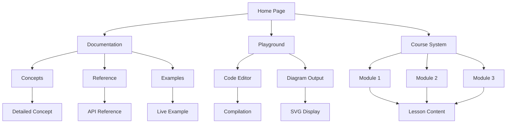

## 1. Product Overview

The Sruja Learn App Refactor project aims to transform the current monolithic JavaScript implementation into a modular, maintainable, and scalable architecture. This refactoring will improve code organization, enhance developer experience, and establish a foundation for future feature development while preserving all existing functionality.

The current learn app is a Hugo-based documentation site with integrated playground functionality for the Sruja architecture modeling language. The refactor addresses critical maintainability issues including a 577-line monolithic JavaScript file, mixed concerns, and lack of testing infrastructure.

## 2. Core Features

### 2.1 User Roles

| Role | Registration Method | Core Permissions |
|------|---------------------|------------------|
| Visitor | No registration required | Browse documentation, use playground, view courses |
| Learner | Optional progress tracking | Save course progress, track learning journey |
| Developer | GitHub contribution | Contribute to documentation, submit improvements |

### 2.2 Feature Module

The refactored learn app consists of the following core modules:

1. **Documentation Browser**: Hugo-powered documentation site with navigation, search, and content display
2. **Interactive Playground**: WASM-powered code editor with real-time compilation and diagram generation
3. **Course System**: Structured learning paths with progress tracking and module organization
4. **Theme Management**: Dark/light mode switching with persistent user preferences
5. **Navigation System**: Multi-level navigation with sidebar filtering and collapsible sections

### 2.3 Page Details

| Page Name | Module Name | Feature description |
|-----------|-------------|---------------------|
| Home Page | Hero Section | Display project overview, key features, and call-to-action buttons |
| Home Page | Navigation Bar | Top navigation with theme toggle, search, and section links |
| Home Page | Feature Showcase | Highlight key capabilities and benefits of Sruja |
| Documentation | Content Display | Render markdown content with syntax highlighting and internal linking |
| Documentation | Sidebar Navigation | Filterable, collapsible sidebar with hierarchical structure |
| Documentation | Search Functionality | Full-text search across all documentation content |
| Playground | Code Editor | Textarea with syntax highlighting and example code loading |
| Playground | Compilation Engine | WASM-based Sruja compiler with error handling |
| Playground | Diagram Viewer | SVG output display with zoom, pan, and fullscreen capabilities |
| Playground | Example Loader | Pre-defined examples with dropdown selection |
| Course Page | Module Navigation | Progress through structured learning modules |
| Course Page | Lesson Content | Display lesson text, examples, and exercises |
| Course Page | Progress Tracking | Track visited pages and quiz completion status |
| Theme Manager | Mode Toggle | Switch between light and dark themes |
| Theme Manager | Preference Storage | Persist theme choice in localStorage |
| Theme Manager | System Detection | Auto-detect system theme preference |

## 3. Core Process

### Visitor Flow
1. User lands on homepage and explores feature overview
2. Navigates to documentation to learn about Sruja concepts
3. Uses playground to experiment with architecture modeling
4. Follows course structure for guided learning experience
5. Switches themes based on preference

### Learner Flow
1. Visitor engages with course content systematically
2. Progress is tracked across modules and lessons
3. Quiz results are stored for completion tracking
4. Last visited page is remembered for continuity

## 4. User Interface Design

### 4.1 Design Style

- **Primary Colors**: Blue (#3B82F6) for primary actions, Gray (#6B7280) for secondary elements
- **Secondary Colors**: Dark background (#1F2937) for dark mode, White (#FFFFFF) for light mode
- **Button Style**: Rounded corners (8px radius), consistent padding (8px 16px)
- **Font Family**: System fonts with fallbacks (Inter, -apple-system, BlinkMacSystemFont)
- **Font Sizes**: 14px for body text, 16px for headings, 12px for captions
- **Layout Style**: Card-based design with consistent spacing (16px gaps)
- **Icon Style**: Lucide React icons with consistent stroke width (2px)
- **Animation**: Subtle transitions (200ms ease-in-out) for theme changes and interactions

### 4.2 Page Design Overview

| Page Name | Module Name | UI Elements |
|-----------|-------------|-------------|
| Home Page | Hero Section | Full-width gradient background, centered headline text, dual CTA buttons with hover effects |
| Home Page | Navigation Bar | Sticky top bar with logo, menu items aligned right, theme toggle switch |
| Playground | Code Editor | Monospace font, line numbers, syntax highlighting, resizable panels |
| Playground | Diagram Viewer | SVG container with zoom controls, fullscreen modal, error message display |
| Documentation | Sidebar | Collapsible tree structure, active item highlighting, section filtering |
| Course Page | Progress Bar | Visual progress indicator, completion checkmarks, module status |

### 4.3 Responsiveness

The application follows a **desktop-first** design approach with mobile adaptations:
- **Desktop**: Full feature set with multi-column layouts (1200px+ width)
- **Tablet**: Single column with collapsible navigation (768px-1199px width)  
- **Mobile**: Simplified layout with hamburger menu (below 768px width)
- **Touch Optimization**: Larger tap targets (44px minimum), swipe gestures for navigation
- **Performance**: Progressive enhancement with lazy loading for heavy components