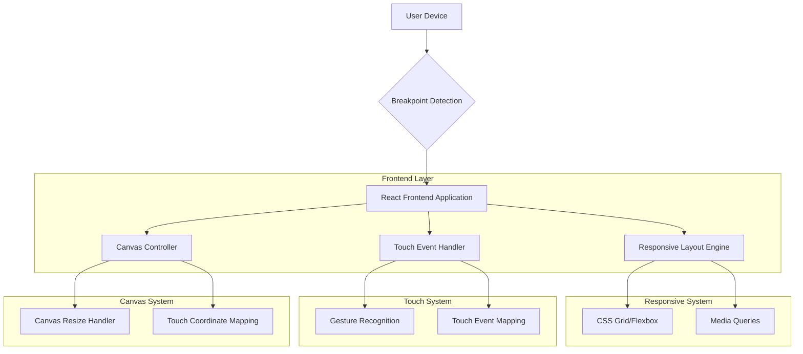
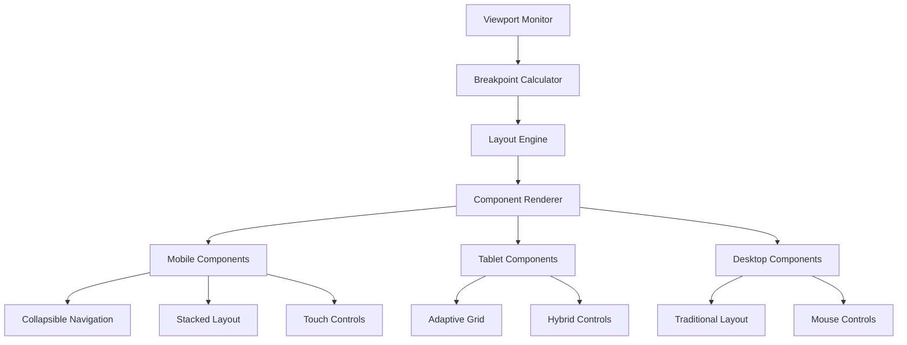

## 1. Architecture Design



## 2. Technology Description
- **Frontend**: React@18 + tailwindcss@3 + vite
- **Initialization Tool**: vite-init
- **Responsive Framework**: CSS Grid + Flexbox + Tailwind responsive utilities
- **Touch Events**: Native browser Touch API with custom gesture recognition
- **Canvas Library**: HTML5 Canvas with touch coordinate mapping
- **Backend**: None (frontend-only enhancement)

## 3. Route Definitions
| Route | Purpose |
|-------|---------|
| / | Main application with responsive layout |
| /mobile | Mobile-optimized view (optional) |
| /canvas | Full-screen canvas with touch controls |

## 4. Component Architecture

### 4.1 Responsive Components
```typescript
// Breakpoint detection hook
interface Breakpoint {
  isMobile: boolean;
  isTablet: boolean;
  isDesktop: boolean;
  width: number;
  height: number;
}

// Responsive layout props
interface ResponsiveProps {
  mobileLayout?: React.ReactNode;
  tabletLayout?: React.ReactNode;
  desktopLayout?: React.ReactNode;
  breakpoint?: Breakpoint;
}
```

### 4.2 Touch Event Types
```typescript
// Touch gesture interfaces
interface TouchPoint {
  x: number;
  y: number;
  identifier: number;
}

interface TouchGesture {
  type: 'tap' | 'swipe' | 'pinch' | 'pan';
  points: TouchPoint[];
  deltaX?: number;
  deltaY?: number;
  scale?: number;
}

// Canvas touch mapping
interface CanvasTouchEvent {
  canvasX: number;
  canvasY: number;
  viewportX: number;
  viewportY: number;
  pressure?: number;
}
```

## 5. Responsive System Architecture



## 6. CSS Breakpoint System

### 6.1 Tailwind Configuration
```javascript
// tailwind.config.js
module.exports = {
  theme: {
    extend: {
      screens: {
        'xs': '320px',
        'sm': '640px',
        'md': '768px',
        'lg': '1024px',
        'xl': '1280px',
        '2xl': '1536px',
      },
      spacing: {
        'touch-safe': '44px',
        'mobile-padding': '16px',
        'desktop-padding': '24px',
      }
    }
  }
}
```

### 6.2 CSS Custom Properties
```css
:root {
  --breakpoint-mobile: 320px;
  --breakpoint-tablet: 768px;
  --breakpoint-desktop: 1024px;
  --touch-target-size: 44px;
  --mobile-padding: 16px;
  --desktop-padding: 24px;
}

/* Responsive container queries */
@container (max-width: 768px) {
  .responsive-container {
    flex-direction: column;
  }
}
```

## 7. Touch Event Implementation

### 7.1 Touch Handler Component
```typescript
interface TouchHandlerProps {
  onTap?: (event: TouchEvent) => void;
  onSwipe?: (direction: 'left' | 'right' | 'up' | 'down', distance: number) => void;
  onPinch?: (scale: number) => void;
  onPan?: (deltaX: number, deltaY: number) => void;
  children: React.ReactNode;
}

const TouchHandler: React.FC<TouchHandlerProps> = ({
  onTap,
  onSwipe,
  onPinch,
  onPan,
  children
}) => {
  // Touch gesture recognition logic
  // Coordinate mapping for canvas
  // Event cleanup and optimization
}
```

### 7.2 Canvas Touch Mapping
```typescript
class CanvasTouchMapper {
  private canvas: HTMLCanvasElement;
  private context: CanvasRenderingContext2D;
  private scale: number = 1;
  private offset: { x: number; y: number } = { x: 0, y: 0 };

  mapTouchToCanvas(touch: Touch): CanvasTouchEvent {
    const rect = this.canvas.getBoundingClientRect();
    const dpr = window.devicePixelRatio || 1;
    
    return {
      canvasX: (touch.clientX - rect.left) * dpr / this.scale - this.offset.x,
      canvasY: (touch.clientY - rect.top) * dpr / this.scale - this.offset.y,
      viewportX: touch.clientX,
      viewportY: touch.clientY,
      pressure: touch.force || 0.5
    };
  }
}
```