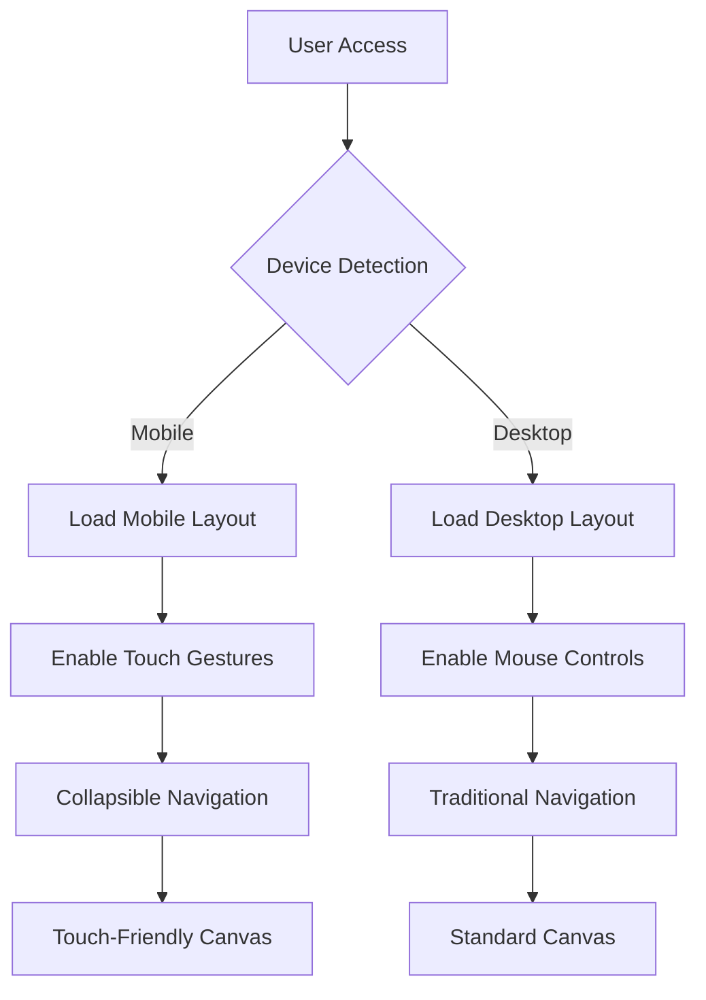

## 1. Product Overview

Make the existing application fully mobile responsive with touch-friendly interactions. This enhancement ensures optimal user experience across all device sizes while maintaining desktop functionality.

## 2. Core Features

### 2.1 User Roles

| Role         | Device Type            | Core Permissions                          |
| ------------ | ---------------------- | ----------------------------------------- |
| Mobile User  | Touch devices          | Full app access with touch gestures       |
| Desktop User | Mouse/keyboard devices | Full app access with traditional controls |

### 2.2 Feature Module

Mobile responsive requirements consist of the following main enhancements:

1. **Responsive Layout System**: Breakpoint-based design adaptation
2. **Collapsible Navigation**: Mobile-optimized navigation panels
3. **Touch-Friendly Canvas**: Enhanced canvas interactions for mobile devices
4. **Adaptive UI Components**: Responsive form controls and buttons

### 2.3 Page Details

| Page Name     | Module Name       | Feature description                                                          |
| ------------- | ----------------- | ---------------------------------------------------------------------------- |
| All Pages     | Breakpoint System | Adapt layout for mobile (320px), tablet (768px), desktop (1024px+).          |
| Navigation    | Collapsible Panel | Implement hamburger menu that slides in from left, collapses on mobile.      |
| Canvas Area   | Touch Controls    | Add pinch-to-zoom, pan gestures, touch-friendly tool selection.              |
| UI Controls   | Responsive Forms  | Resize buttons (44px minimum), increase spacing, stack vertically on mobile. |
| Content Areas | Reflow Layout     | Convert multi-column layouts to single column on mobile devices.             |

## 3. Core Process

## 4. User Interface Design

### 4.1 Design Style

* **Breakpoints**: 320px (mobile), 768px (tablet), 1024px (desktop)

* **Primary Colors**: Maintain existing color scheme with mobile-optimized contrast

* **Button Style**: Minimum 44px touch targets, rounded corners, increased padding

* **Font Sizes**: 16px minimum for mobile, scale up for larger screens

* **Layout Style**: Fluid grid system with flexible containers

* **Icon Style**: SVG icons with touch-friendly hit areas

### 4.2 Page Design Overview

| Page Name  | Module Name  | UI Elements                                                                     |
| ---------- | ------------ | ------------------------------------------------------------------------------- |
| Navigation | Mobile Menu  | Hamburger icon (24x24px), slide-out panel (80% screen width), overlay backdrop. |
| Canvas     | Touch Area   | 100% viewport width on mobile, maintain aspect ratio, gesture indicators.       |
| Controls   | Button Grid  | 2-column grid on mobile, 4-column on tablet, horizontal on desktop.             |
| Forms      | Input Fields | Full-width inputs on mobile, stacked labels, increased line height.             |

### 4.3 Responsiveness

* **Mobile-First Approach**: Design for smallest screens first, progressively enhance

* **Touch Optimization**: 44px minimum touch targets, gesture support

* **Viewport Meta**: Proper viewport configuration for mobile devices

* **Flexible Images**: Responsive images with srcset for different screen densities

### 4.4 Touch Interaction Guidelines

* **Tap**: Primary interaction for buttons and selections

* **Swipe**: Navigation between panels, dismiss modals

* **Pinch**: Zoom in/out on canvas elements

* **Pan**: Move canvas content with two fingers

* **Long Press**: Context menus, additional options

* **Double Tap**: Quick zoom to specific areas

