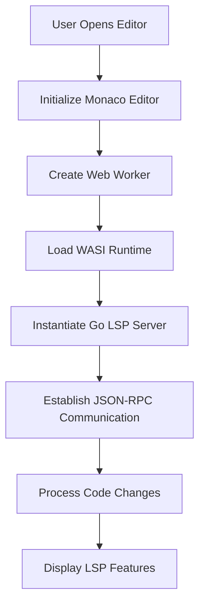

## 1. Product Overview
A zero-backend language server protocol (LSP) integration that runs Go-based language servers directly in the browser using WebAssembly (WASI). This enables real-time code intelligence features like autocomplete, hover information, and error detection for Studio applications and documentation platforms without requiring server infrastructure.

The product solves the problem of providing rich code editing experiences in browser-based environments while maintaining the performance and reliability of native Go language servers.

## 2. Core Features

### 2.1 User Roles
| Role | Registration Method | Core Permissions |
|------|---------------------|------------------|
| Developer | No registration required | Access code editor with LSP features |
| Content Creator | No registration required | Use LSP in documentation examples |

### 2.2 Feature Module
Our Monaco + WASI Go LSP integration consists of the following main components:
1. **Code Editor Interface**: Monaco editor with LSP client integration
2. **Language Server Bridge**: Web Worker that manages WASI runtime and Go LSP server
3. **Shared Package**: Reusable LSP integration library for Studio and Docs applications

### 2.3 Page Details
| Page Name | Module Name | Feature description |
|-----------|-------------|---------------------|
| Code Editor | Monaco Integration | Initialize Monaco editor with LSP client configuration and syntax highlighting |
| LSP Bridge | Web Worker Manager | Load WASI runtime, instantiate Go LSP server, handle JSON-RPC communication |
| Shared Package | LSP Utilities | Provide reusable functions for initializing LSP connections and managing editor states |

## 3. Core Process
The main user operation flow involves loading a code editor that automatically connects to a Go LSP server running in the browser:

1. User opens code editor page
2. Monaco editor initializes with LSP client
3. Web Worker loads WASI runtime and Go LSP WASM module
4. LSP server processes code and returns intelligence data
5. Editor displays autocomplete, hover info, and error highlighting

## 4. User Interface Design

### 4.1 Design Style
- **Primary Colors**: Dark theme (#1e1e1e) with syntax highlighting colors
- **Secondary Colors**: Light gray (#d4d4d4) for UI elements
- **Button Style**: Minimal, flat design with hover states
- **Font**: Consolas, Monaco, monospace for code; system UI for interface
- **Layout Style**: Full-screen code editor with integrated LSP panels
- **Icons**: VS Code-style icons for file types and LSP features

### 4.2 Page Design Overview
| Page Name | Module Name | UI Elements |
|-----------|-------------|-------------|
| Code Editor | Monaco Integration | Full-screen editor with syntax highlighting, line numbers, minimap, and integrated autocomplete dropdown |
| LSP Bridge | Status Indicator | Small status bar showing LSP connection state and server readiness |

### 4.3 Responsiveness
Desktop-first design approach with mobile-adaptive layout for documentation examples. Touch interaction optimized for tablet-based code viewing.