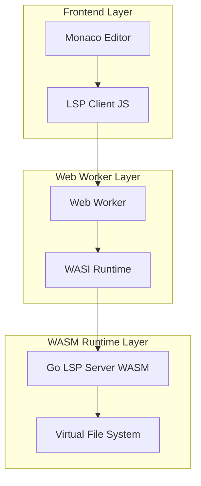
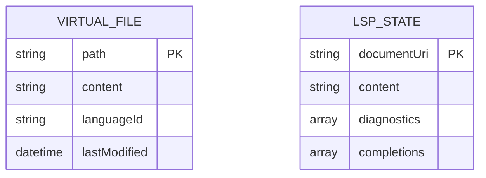

## 1. Architecture design



## 2. Technology Description
- Frontend: React@18 + Monaco Editor + TypeScript
- Initialization Tool: vite-init
- Backend: None (zero-backend architecture)
- WASM Runtime: @wasmer/wasi + @wasmer/wasmfs
- Language Server: Go LSP compiled to WASI target

## 3. Route definitions
| Route | Purpose |
|-------|---------|
| / | Main editor page with Monaco + LSP integration |
| /demo | Demo page showcasing LSP features |
| /docs | Documentation with embedded code examples |

## 4. API definitions

### 4.1 LSP Communication Protocol

Web Worker Message Interface
```typescript
interface WorkerMessage {
  type: 'init' | 'editor-message' | 'lsp-message';
  payload?: any;
}

interface LSPMessage {
  jsonrpc: string;
  id?: string | number;
  method?: string;
  params?: any;
  result?: any;
  error?: any;
}
```

### 4.2 Shared Package Interface

```typescript
interface LSPConfig {
  wasmUrl: string;
  fileExtensions: string[];
  languageId: string;
}

interface LSPClient {
  initialize(config: LSPConfig): Promise<void>;
  sendMessage(message: LSPMessage): void;
  onMessage(callback: (message: LSPMessage) => void): void;
  dispose(): void;
}
```

## 5. Server architecture diagram
Not applicable - zero-backend architecture with client-side WASM execution.

## 6. Data model

### 6.1 Virtual File System Structure


### 6.2 Data Definition Language

Virtual file system managed by @wasmer/wasmfs - no SQL tables required. File operations handled through WASI filesystem API:

```javascript
// File system operations through WASMFS
const wasmFs = new WasmFs();
wasmFs.fs.writeFileSync('/workspace/main.go', goCodeContent);
const fileContent = wasmFs.fs.readFileSync('/workspace/main.go', 'utf8');
```

## 7. Shared Monaco Components Usage

### 7.1 Monaco Editor Integration Pattern

The Monaco editor is shared between Studio and Docs applications with consistent configuration:

```typescript
// Shared Monaco configuration
export const monacoConfig = {
  theme: 'vs-dark',
  fontSize: 14,
  minimap: { enabled: false },
  scrollBeyondLastLine: false,
  automaticLayout: true,
  wordWrap: 'on',
  lineNumbers: 'on',
  renderLineHighlight: 'all',
  selectOnLineNumbers: true,
  matchBrackets: 'always'
};

// Shared initialization function
export function initializeMonaco(container: HTMLElement, options: MonacoOptions): MonacoEditor {
  const editor = monaco.editor.create(container, {
    ...monacoConfig,
    ...options
  });
  
  // Setup LSP client if language server available
  if (options.language && options.lspEnabled) {
    setupLSPClient(editor, options.language);
  }
  
  return editor;
}
```

### 7.2 LSP Client Setup

Shared LSP client configuration for consistent language server integration:

```typescript
interface LSPClientOptions {
  language: string;
  wasmUrl: string;
  fileExtensions: string[];
  workspaceRoot: string;
}

export async function setupLSPClient(
  editor: MonacoEditor, 
  options: LSPClientOptions
): Promise<LSPClient> {
  const worker = new Worker('/workers/lsp-worker.js');
  const client = new LSPClient(worker, options);
  
  await client.initialize();
  
  // Setup Monaco language features
  monaco.languages.registerCompletionItemProvider(options.language, {
    provideCompletionItems: async (model, position) => {
      const completions = await client.getCompletions(model.uri.toString(), position);
      return completions;
    }
  });
  
  return client;
}
```

### 7.3 Component Reusability

Shared Monaco wrapper components for both applications:

```typescript
// MonacoEditorWrapper.tsx - Shared component
export const MonacoEditorWrapper: React.FC<MonacoWrapperProps> = ({
  language,
  value,
  onChange,
  lspEnabled = true,
  height = '400px',
  readOnly = false
}) => {
  const editorRef = useRef<MonacoEditor | null>(null);
  const containerRef = useRef<HTMLDivElement>(null);
  
  useEffect(() => {
    if (containerRef.current) {
      const editor = initializeMonaco(containerRef.current, {
        language,
        value,
        lspEnabled,
        readOnly,
        theme: getPreferredTheme()
      });
      
      editorRef.current = editor;
      
      editor.onDidChangeModelContent(() => {
        onChange?.(editor.getValue());
      });
    }
    
    return () => {
      editorRef.current?.dispose();
    };
  }, []);
  
  return <div ref={containerRef} style={{ height }} />;
};
```

## 8. React 19 Compatibility

### 8.1 Migration Considerations

The project has been updated to support React 19 with the following compatibility measures:

```typescript
// React 19 compatible hooks and patterns
import { use, useOptimistic, useFormStatus } from 'react';

// Server components compatibility
'use client'; // For client-side components

// Updated lifecycle methods
useEffect(() => {
  // React 19 effect cleanup
  return () => {
    // Cleanup logic
  };
}, []);

// Concurrent features
const [isPending, startTransition] = useTransition();

// Usage in components
const handleCompile = useCallback(() => {
  startTransition(() => {
    // Compilation logic
    compileCode(code);
  });
}, [code]);
```

### 8.2 TypeScript Configuration Updates

```json
{
  "compilerOptions": {
    "target": "ES2022",
    "lib": ["ES2022", "DOM", "DOM.Iterable"],
    "jsx": "react-jsx",
    "moduleResolution": "bundler",
    "allowImportingTsExtensions": true,
    "noEmit": true,
    "composite": false,
    "strict": true,
    "downlevelIteration": true,
    "skipLibCheck": true,
    "types": ["react/next", "react-dom/next"]
  }
}
```

### 8.3 Dependency Updates

Key dependencies updated for React 19 compatibility:

```json
{
  "dependencies": {
    "react": "^19.0.0",
    "react-dom": "^19.0.0",
    "@types/react": "^19.0.0",
    "@types/react-dom": "^19.0.0"
  },
  "devDependencies": {
    "@vitejs/plugin-react": "^4.3.0",
    "vite": "^6.0.0"
  }
}
```

## 9. WASI LSP Build Process

### 9.1 Go LSP Server Compilation

Complete build pipeline for Go LSP server targeting WASI:

```bash
#!/bin/bash
# build-lsp.sh - Complete LSP build script

# Set Go environment for WASI target
export GOOS=wasip1
export GOARCH=wasm
export CGO_ENABLED=0

# Build the LSP server
echo "Building Go LSP server for WASI..."
go build -o dist/lsp-server.wasm -tags wasi ./cmd/lsp-server

# Verify the build
if [ -f "dist/lsp-server.wasm" ]; then
    echo "✓ LSP server built successfully"
    ls -lh dist/lsp-server.wasm
else
    echo "✗ Build failed"
    exit 1
fi

# Optimize WASM size (optional)
echo "Optimizing WASM binary..."
wasm-opt -Os dist/lsp-server.wasm -o dist/lsp-server-optimized.wasm

# Generate TypeScript definitions
echo "Generating TypeScript definitions..."
npx wasm-bindgen-cli dist/lsp-server.wasm --typescript --out-dir dist/bindings
```

### 9.2 Go Module Requirements

```go
// go.mod - Module dependencies
module github.com/sruja-lang/lsp-server

go 1.21

require (
    github.com/tliron/glsp v0.2.1
    github.com/sourcegraph/jsonrpc2 v0.2.0
    golang.org/x/tools v0.16.0
)

// WASI-specific build constraints
//go:build wasi
// +build wasi
```

### 9.3 Build Configuration in package.json

```json
{
  "scripts": {
    "build:lsp": "bash scripts/build-lsp.sh",
    "build:wasm": "npm run build:lsp && npm run build:workers",
    "build:workers": "vite build --config vite.workers.config.ts",
    "dev:wasm": "concurrently \"npm run build:lsp:watch\" \"npm run dev\"",
    "build:lsp:watch": "nodemon --watch cmd/lsp-server --exec 'npm run build:lsp'"
  }
}
```

## 10. Asset Placement and Loading

### 10.1 Asset Directory Structure

```
public/
├── assets/
│   ├── wasm/
│   │   ├── lsp-server.wasm
│   │   ├── lsp-server-optimized.wasm
│   │   └── bindings/
│   │       ├── lsp-server.d.ts
│   │       └── lsp-server.js
│   ├── workers/
│   │   ├── lsp-worker.js
│   │   └── compiler-worker.js
│   └── monaco/
│       ├── editor/
│       └── languages/
├── workers/
│   ├── lsp-worker.ts
│   └── compiler-worker.ts
└── wasm/
    └── lsp-server.go
```

### 10.2 Dynamic Asset Loading

```typescript
// Asset loader with caching and fallback
export class AssetLoader {
  private cache = new Map<string, any>();
  
  async loadWasm(url: string): Promise<WebAssembly.Module> {
    if (this.cache.has(url)) {
      return this.cache.get(url);
    }
    
    try {
      const response = await fetch(url);
      const bytes = await response.arrayBuffer();
      const module = await WebAssembly.compile(bytes);
      
      this.cache.set(url, module);
      return module;
    } catch (error) {
      console.error(`Failed to load WASM from ${url}:`, error);
      throw new Error(`WASM loading failed: ${error.message}`);
    }
  }
  
  async loadWorker(url: string): Promise<Worker> {
    const worker = new Worker(url, { type: 'module' });
    
    return new Promise((resolve, reject) => {
      worker.onmessage = (event) => {
        if (event.data.type === 'ready') {
          resolve(worker);
        }
      };
      
      worker.onerror = (error) => {
        reject(new Error(`Worker loading failed: ${error.message}`));
      };
      
      // Timeout after 10 seconds
      setTimeout(() => {
        reject(new Error('Worker initialization timeout'));
      }, 10000);
    });
  }
}
```

### 10.3 Vite Asset Configuration

```typescript
// vite.config.ts - Asset handling
export default defineConfig({
  assetsInclude: ['**/*.wasm'],
  worker: {
    format: 'es'
  },
  build: {
    rollupOptions: {
      output: {
        assetFileNames: (assetInfo) => {
          if (assetInfo.name.endsWith('.wasm')) {
            return 'assets/wasm/[name]-[hash][extname]';
          }
          if (assetInfo.name.includes('worker')) {
            return 'assets/workers/[name]-[hash][extname]';
          }
          return 'assets/[name]-[hash][extname]';
        }
      }
    }
  },
  server: {
    headers: {
      'Cross-Origin-Embedder-Policy': 'require-corp',
      'Cross-Origin-Opener-Policy': 'same-origin'
    }
  }
});
```

### 10.4 Runtime Asset Resolution

```typescript
// Runtime asset URL resolution
export function getAssetUrl(path: string): string {
  const baseUrl = import.meta.env.BASE_URL || '/';
  return new URL(path, baseUrl).toString();
}

export const ASSET_URLS = {
  LSP_WORKER: getAssetUrl('/assets/workers/lsp-worker.js'),
  COMPILER_WORKER: getAssetUrl('/assets/workers/compiler-worker.js'),
  LSP_WASM: getAssetUrl('/assets/wasm/lsp-server.wasm'),
  MONACO_WORKER: getAssetUrl('/assets/monaco/editor/worker.js')
} as const;
```