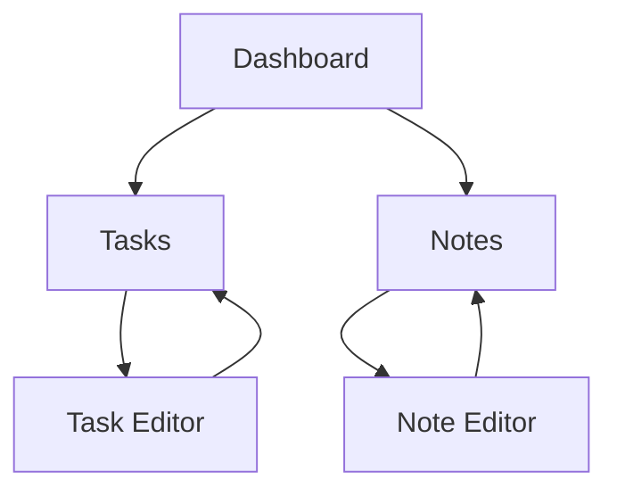

## 1. Product Overview
A single-user productivity application designed for personal use without user management or authentication requirements. This application provides essential tools for individual task management and note-taking.

The product solves the problem of scattered personal information by providing a centralized, offline-first solution for organizing tasks and notes. It's perfect for individuals who want a simple, private workspace without the complexity of user accounts or cloud services.

## 2. Core Features

### 2.1 User Roles
This application is designed for single-user use only. No user roles, registration, or authentication required.

### 2.2 Feature Module
Our single-user application consists of the following main pages:
1. **Dashboard**: Overview of tasks and quick notes, summary statistics.
2. **Tasks**: Task management with creation, editing, and completion tracking.
3. **Notes**: Note-taking functionality with rich text editing and organization.

### 2.3 Page Details
| Page Name | Module Name | Feature description |
|-----------|-------------|---------------------|
| Dashboard | Overview section | Display today's tasks, recent notes, and completion statistics. |
| Dashboard | Quick add | Add new tasks or notes directly from dashboard. |
| Tasks | Task list | View all tasks with filtering by status (active/completed). |
| Tasks | Task editor | Create and edit tasks with title, description, due date, and priority. |
| Tasks | Task actions | Mark tasks as complete, delete tasks, or archive completed items. |
| Notes | Note list | Browse all notes with search and categorization. |
| Notes | Note editor | Rich text editing with formatting options and auto-save. |
| Notes | Note organization | Create categories and tags for better organization. |

## 3. Core Process
The user interacts with the application through a simple navigation flow. Starting from the Dashboard, users can quickly access their tasks and notes. The application saves all data locally in the browser's local storage, ensuring privacy and offline functionality.

## 4. User Interface Design

### 4.1 Design Style
- **Primary Color**: #2563eb (Modern blue)
- **Secondary Color**: #64748b (Slate gray)
- **Button Style**: Rounded corners with subtle shadows
- **Font**: System fonts (Inter, -apple-system, BlinkMacSystemFont)
- **Layout**: Card-based design with clean spacing
- **Icons**: Minimalist line icons using Lucide React

### 4.2 Page Design Overview
| Page Name | Module Name | UI Elements |
|-----------|-------------|-------------|
| Dashboard | Overview section | Grid layout with cards for tasks and notes, clean typography with 16px base font size. |
| Dashboard | Quick add | Floating action button with plus icon, positioned bottom-right. |
| Tasks | Task list | Scrollable list with checkboxes, priority indicators, and due date badges. |
| Tasks | Task editor | Modal dialog with form fields, save/cancel buttons, and priority selector. |
| Notes | Note list | Sidebar with note previews, search bar at top, category filters. |
| Notes | Note editor | Full-screen editor with toolbar for formatting, auto-save indicator. |

### 4.3 Responsiveness
Desktop-first design approach with mobile responsiveness. The application adapts to different screen sizes with responsive layouts, touch-friendly interactions on mobile devices, and collapsible navigation for smaller screens.