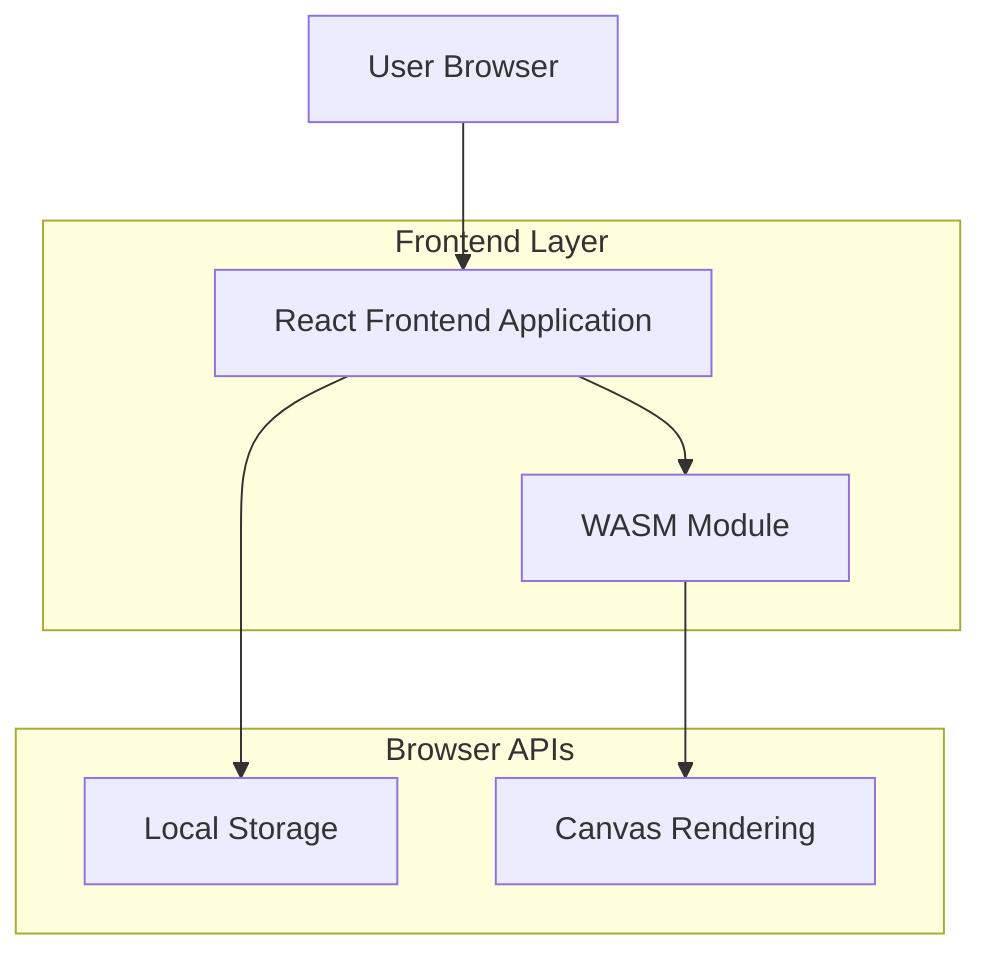
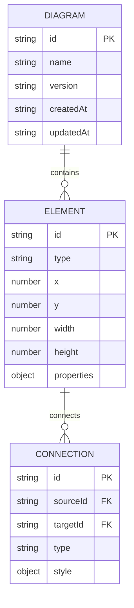

## 1. Architecture design



## 2. Technology Description
- Frontend: React@18 + TypeScript + Vite
- Initialization Tool: vite-init
- Backend: None (zero-backend architecture)
- Storage: Browser Local Storage
- Rendering: HTML5 Canvas + WebAssembly
- Styling: Tailwind CSS@3

## 3. Route definitions

| Route | Purpose |
|-------|---------|
| / | Editor page, main diagramming workspace |
| /export | Export modal for downloading diagrams |

## 4. API definitions

### 4.1 Core API

Diagram export functionality
```typescript
interface ExportOptions {
  format: 'png' | 'svg' | 'pdf' | 'json';
  quality: number;
  width: number;
  height: number;
}

interface DiagramData {
  elements: DiagramElement[];
  connections: Connection[];
  metadata: {
    version: string;
    created: string;
    modified: string;
  };
}

interface DiagramElement {
  id: string;
  type: string;
  x: number;
  y: number;
  width: number;
  height: number;
  properties: Record<string, any>;
}
```

## 5. Server architecture diagram
No server architecture required - application runs entirely in browser.

## 6. Data model

### 6.1 Data model definition


### 6.2 Data Definition Language
Local storage schema for diagram persistence:

```typescript
// Diagram storage interface
interface LocalDiagram {
  id: string;
  name: string;
  data: DiagramData;
  version: string;
  createdAt: string;
  updatedAt: string;
}

// Local storage keys
const STORAGE_KEYS = {
  CURRENT_DIAGRAM: 'public_studio_current',
  DIAGRAM_LIST: 'public_studio_diagrams',
  SETTINGS: 'public_studio_settings'
} as const;
```

Browser storage implementation using localStorage API with JSON serialization for complex data structures.

## 7. Shared Monaco Components Integration

### 7.1 Monaco Editor Configuration

The Studio application shares Monaco editor components with the Docs application for consistent code editing experience:

```typescript
// Shared Monaco configuration for Studio
export const studioMonacoConfig = {
  theme: 'vs-dark',
  fontSize: 14,
  minimap: { enabled: false },
  scrollBeyondLastLine: false,
  automaticLayout: true,
  wordWrap: 'on',
  lineNumbers: 'on',
  renderLineHighlight: 'all',
  selectOnLineNumbers: true,
  matchBrackets: 'always',
  autoIndent: 'full',
  formatOnPaste: true,
  formatOnType: true
};

// Studio-specific language configuration
export const diagramLanguages = [
  { id: 'sruja', extensions: ['.sruja'], aliases: ['Sruja'] },
  { id: 'mermaid', extensions: ['.mmd'], aliases: ['Mermaid'] },
  { id: 'plantuml', extensions: ['.puml'], aliases: ['PlantUML'] }
];
```

### 7.2 Component Reusability Pattern

```typescript
// StudioEditorWrapper.tsx - Shared with Docs
export const StudioEditorWrapper: React.FC<StudioEditorProps> = ({
  language = 'sruja',
  value,
  onChange,
  readOnly = false,
  height = '600px',
  showMinimap = true,
  enableFormatting = true
}) => {
  const editorRef = useRef<MonacoEditor | null>(null);
  const containerRef = useRef<HTMLDivElement>(null);
  
  useEffect(() => {
    if (containerRef.current) {
      // Register custom languages
      registerStudioLanguages();
      
      const editor = monaco.editor.create(containerRef.current, {
        ...studioMonacoConfig,
        language,
        value,
        readOnly,
        minimap: { enabled: showMinimap }
      });
      
      editorRef.current = editor;
      
      // Setup formatting if enabled
      if (enableFormatting) {
        setupAutoFormatting(editor);
      }
      
      // Handle content changes
      editor.onDidChangeModelContent(() => {
        onChange?.(editor.getValue());
      });
      
      // Setup diagram-specific features
      if (language === 'sruja') {
        setupSrujaLanguageFeatures(editor);
      }
    }
    
    return () => {
      editorRef.current?.dispose();
    };
  }, [language, readOnly, showMinimap, enableFormatting]);
  
  return <div ref={containerRef} style={{ height, border: '1px solid #e1e5e9' }} />;
};
```

### 7.3 Language Feature Integration

```typescript
// Sruja-specific language features
function setupSrujaLanguageFeatures(editor: MonacoEditor): void {
  // Syntax highlighting
  monaco.languages.setMonarchTokensProvider('sruja', {
    tokenizer: {
      root: [
        [/@\w+/, 'annotation'],
        [/\b(class|interface|enum|component)\b/, 'keyword'],
        [/\b(extends|implements|uses)\b/, 'keyword'],
        [/--.*$/, 'comment'],
        [/".*"/, 'string'],
        [/\d+/, 'number']
      ]
    }
  });
  
  // Auto-completion
  monaco.languages.registerCompletionItemProvider('sruja', {
    provideCompletionItems: (model, position) => {
      const suggestions = [
        {
          label: 'class',
          kind: monaco.languages.CompletionItemKind.Keyword,
          insertText: 'class ${1:Name} {\n\t$0\n}'
        },
        {
          label: 'component',
          kind: monaco.languages.CompletionItemKind.Keyword,
          insertText: 'component ${1:Name} {\n\t$0\n}'
        },
        {
          label: 'interface',
          kind: monaco.languages.CompletionItemKind.Keyword,
          insertText: 'interface ${1:Name} {\n\t$0\n}'
        }
      ];
      
      return { suggestions };
    }
  });
}
```

## 8. React 19 Compatibility Updates

### 8.1 Updated Component Patterns

```typescript
// React 19 compatible Studio components
'use client';

import { use, useOptimistic, useFormStatus } from 'react';
import { startTransition } from 'react';

export const DiagramEditor: React.FC<DiagramEditorProps> = ({ initialCode }) => {
  const [code, setCode] = useState(initialCode);
  const [isPending, startTransition] = useTransition();
  const [optimisticDiagram, setOptimisticDiagram] = useOptimistic(
    null,
    (state, newDiagram) => newDiagram
  );
  
  const handleCodeChange = useCallback((newCode: string) => {
    setCode(newCode);
    
    startTransition(() => {
      // Optimistically update diagram
      setOptimisticDiagram({ code: newCode, status: 'generating' });
      
      // Generate diagram
      generateDiagram(newCode).then(diagram => {
        setOptimisticDiagram({ code: newCode, status: 'completed', diagram });
      }).catch(error => {
        setOptimisticDiagram({ code: newCode, status: 'error', error });
      });
    });
  }, []);
  
  return (
    <div>
      <StudioEditorWrapper
        language="sruja"
        value={code}
        onChange={handleCodeChange}
        height="400px"
      />
      {isPending && <div>Generating diagram...</div>}
      {optimisticDiagram && (
        <DiagramRenderer diagram={optimisticDiagram} />
      )}
    </div>
  );
};
```

### 8.2 Form Handling Updates

```typescript
// React 19 form status handling
export const ExportForm: React.FC<ExportFormProps> = ({ diagramData }) => {
  const { pending } = useFormStatus();
  
  return (
    <form action={exportDiagram}>
      <select name="format" disabled={pending}>
        <option value="png">PNG</option>
        <option value="svg">SVG</option>
        <option value="pdf">PDF</option>
        <option value="json">JSON</option>
      </select>
      
      <button type="submit" disabled={pending}>
        {pending ? 'Exporting...' : 'Export Diagram'}
      </button>
    </form>
  );
};
```

### 8.3 TypeScript Configuration for React 19

```json
{
  "compilerOptions": {
    "target": "ES2022",
    "lib": ["ES2022", "DOM", "DOM.Iterable"],
    "jsx": "react-jsx",
    "moduleResolution": "bundler",
    "allowImportingTsExtensions": true,
    "noEmit": true,
    "strict": true,
    "skipLibCheck": true,
    "types": ["react/next", "react-dom/next"]
  },
  "include": [
    "src/**/*",
    "public/**/*"
  ]
}
```

## 9. Asset Placement and Optimization

### 9.1 Asset Organization

```
public/
├── assets/
│   ├── studio/
│   │   ├── icons/
│   │   │   ├── diagram-types/
│   │   │   └── toolbar-icons/
│   │   ├── templates/
│   │   │   ├── architecture-templates/
│   │   │   └── flowchart-templates/
│   │   └── themes/
│   │       ├── light-theme.json
│   │       └── dark-theme.json
│   ├── monaco/
│   │   └── editor/
│   └── workers/
│       └── studio-worker.js
├── diagrams/
│   └── examples/
└── styles/
    └── studio.css
```

### 9.2 Dynamic Asset Loading

```typescript
// Studio asset loader with caching
export class StudioAssetLoader {
  private templateCache = new Map<string, DiagramTemplate>();
  private iconCache = new Map<string, string>();
  
  async loadTemplate(templateId: string): Promise<DiagramTemplate> {
    if (this.templateCache.has(templateId)) {
      return this.templateCache.get(templateId)!;
    }
    
    try {
      const response = await fetch(`/assets/studio/templates/${templateId}.json`);
      const template = await response.json();
      
      this.templateCache.set(templateId, template);
      return template;
    } catch (error) {
      console.error(`Failed to load template ${templateId}:`, error);
      throw new Error(`Template loading failed: ${error.message}`);
    }
  }
  
  async loadIcon(iconName: string): Promise<string> {
    if (this.iconCache.has(iconName)) {
      return this.iconCache.get(iconName)!;
    }
    
    try {
      const response = await fetch(`/assets/studio/icons/${iconName}.svg`);
      const svgContent = await response.text();
      
      this.iconCache.set(iconName, svgContent);
      return svgContent;
    } catch (error) {
      console.error(`Failed to load icon ${iconName}:`, error);
      return this.getDefaultIcon();
    }
  }
  
  private getDefaultIcon(): string {
    return '<svg viewBox="0 0 24 24"><rect width="24" height="24" fill="currentColor"/></svg>';
  }
}
```

### 9.3 Theme Asset Management

```typescript
// Dynamic theme loading for Studio
export async function loadStudioTheme(themeName: 'light' | 'dark'): Promise<StudioTheme> {
  const themeUrl = `/assets/studio/themes/${themeName}-theme.json`;
  
  try {
    const response = await fetch(themeUrl);
    const theme = await response.json();
    
    // Apply theme to Monaco editor
    monaco.editor.defineTheme(`studio-${themeName}`, {
      base: themeName === 'dark' ? 'vs-dark' : 'vs',
      inherit: true,
      rules: theme.monacoRules || [],
      colors: theme.monacoColors || {}
    });
    
    return theme;
  } catch (error) {
    console.error(`Failed to load theme ${themeName}:`, error);
    throw new Error(`Theme loading failed: ${error.message}`);
  }
}
```

### 9.4 Vite Configuration for Studio Assets

```typescript
// vite.config.ts - Studio-specific asset handling
export default defineConfig({
  assetsInclude: ['**/*.svg', '**/*.json', '**/*.wasm'],
  build: {
    rollupOptions: {
      output: {
        assetFileNames: (assetInfo) => {
          if (assetInfo.name.includes('studio')) {
            return 'assets/studio/[name]-[hash][extname]';
          }
          if (assetInfo.name.includes('monaco')) {
            return 'assets/monaco/[name]-[hash][extname]';
          }
          return 'assets/[name]-[hash][extname]';
        }
      }
    }
  },
  server: {
    headers: {
      'Cache-Control': 'public, max-age=31536000',
      'Cross-Origin-Embedder-Policy': 'require-corp',
      'Cross-Origin-Opener-Policy': 'same-origin'
    }
  }
});
```