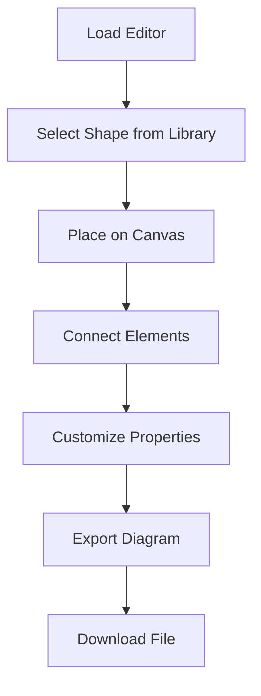

## 1. Product Overview
Public Studio is a browser-based diagramming tool similar to draw.io that enables users to create, edit, and export diagrams without requiring any backend services. The application runs entirely in the browser using WebAssembly for high-performance diagram rendering and manipulation.

The tool targets users who need quick diagram creation capabilities with offline functionality, eliminating the need for account registration or cloud storage while maintaining professional diagramming features.

## 2. Core Features

### 2.1 User Roles
This is a public tool with no user authentication required. All users have the same access level and functionality.

### 2.2 Feature Module
Public Studio consists of the following main pages:
1. **Editor page**: Canvas workspace, toolbar, shape library, property panel.
2. **Export page**: Export options, format selection, download functionality.

### 2.3 Page Details

| Page Name | Module Name | Feature description |
|-----------|-------------|---------------------|
| Editor page | Canvas workspace | Create and manipulate diagrams with drag-and-drop functionality. Zoom, pan, and select elements. |
| Editor page | Toolbar | Access drawing tools, undo/redo actions, zoom controls, and view options. |
| Editor page | Shape library | Browse and insert predefined shapes, connectors, and diagram templates. |
| Editor page | Property panel | Modify element properties like colors, sizes, text, and styling options. |
| Export page | Format selection | Choose export formats (PNG, SVG, PDF, JSON). |
| Export page | Download functionality | Save diagrams locally with customizable quality and size settings. |

## 3. Core Process
Users can start creating diagrams immediately upon accessing the application. The workflow involves selecting shapes from the library, placing them on the canvas, connecting elements, customizing properties, and exporting the final diagram.

## 4. User Interface Design

### 4.1 Design Style
- Primary colors: Blue (#2563eb) for primary actions, Gray (#6b7280) for secondary elements
- Button style: Rounded corners with subtle shadows for depth
- Font: System fonts (Inter, -apple-system, BlinkMacSystemFont) for optimal performance
- Layout style: Three-panel layout with left sidebar for shapes, center canvas, right properties panel
- Icons: Material Design icons for consistency and familiarity

### 4.2 Page Design Overview

| Page Name | Module Name | UI Elements |
|-----------|-------------|-------------|
| Editor page | Canvas workspace | White background with grid overlay, infinite scroll capability, zoom controls in bottom-right |
| Editor page | Toolbar | Horizontal bar at top with tool icons, grouped by function (draw, edit, view) |
| Editor page | Shape library | Collapsible left sidebar with categorized shape groups, search functionality |
| Editor page | Property panel | Right sidebar showing context-sensitive options for selected elements |
| Export page | Format selection | Modal dialog with format icons and quality settings |

### 4.3 Responsiveness
Desktop-first design approach with responsive breakpoints for tablet and mobile devices. Touch interaction optimization for tablet use, with simplified mobile interface for basic viewing and editing.