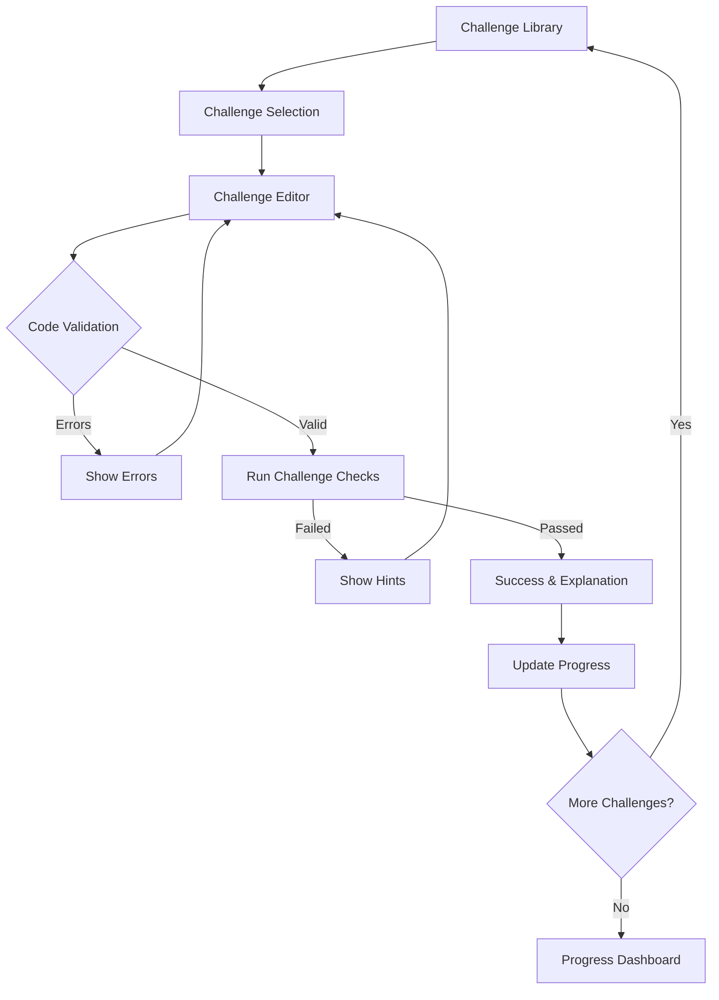

## 1. Product Overview

A hands-on learning platform for Sruja DSL (Domain Specific Language) that teaches architecture design through practical challenges. Users fix broken architectures, write actual Sruja code, and learn system design principles interactively with immediate feedback.

The platform helps developers learn architecture modeling by solving real-world problems - from fixing missing relations between components to optimizing deployment strategies and identifying architectural violations.

## 2. Core Features

### 2.1 User Roles

| Role | Registration Method | Core Permissions |
|------|---------------------|------------------|
| Learner | Email registration | Access challenges, track progress, view solutions |
| Guest User | No registration | Try sample challenges, limited progress tracking |

### 2.2 Feature Module

Our Sruja DSL learning platform consists of the following main pages:

1. **Challenge Library**: Browse and filter architecture challenges by difficulty, topic, and type
2. **Challenge Editor**: Interactive code editor with Sruja syntax highlighting and real-time validation
3. **Learning Path**: Structured curriculum from basics to advanced architecture patterns
4. **Progress Dashboard**: Track completed challenges, achievements, and skill development
5. **Cheatsheet Reference**: Quick reference guide for Sruja syntax and best practices

### 2.3 Page Details

| Page Name | Module Name | Feature description |
|-----------|-------------|---------------------|
| Challenge Library | Challenge Grid | Display challenges in card layout with difficulty badges, completion status, and estimated time |
| Challenge Library | Filter & Search | Filter by difficulty (Beginner/Intermediate/Advanced), topic (Relations/Deployment/Validation), and completion status |
| Challenge Library | Challenge Preview | Show challenge description, learning objectives, and initial broken architecture diagram |
| Challenge Editor | Code Editor | Monaco editor with Sruja syntax highlighting, auto-completion, and error indicators |
| Challenge Editor | Live Preview | Real-time architecture diagram rendering as user types Sruja code |
| Challenge Editor | Validation Panel | Show parsing errors, validation warnings, and challenge-specific checks |
| Challenge Editor | Hint System | Provide contextual hints and progressive disclosure of solutions |
| Learning Path | Path Overview | Visual learning path with modules for Relations, Deployment, Components, Systems |
| Learning Path | Module Progress | Track completion within each learning module with skill badges |
| Progress Dashboard | Achievement System | Earn badges for first challenge, streak completion, architecture mastery |
| Progress Dashboard | Skill Analytics | Visualize progress in different architecture domains over time |
| Cheatsheet Reference | Syntax Guide | Complete Sruja syntax reference with examples and common patterns |
| Cheatsheet Reference | Quick Examples | Copy-paste ready code snippets for common architecture scenarios |

## 3. Core Process

### Learner Flow
1. User browses Challenge Library and selects a challenge based on difficulty and topic
2. Challenge Editor loads with broken architecture code and clear objectives
3. User writes/modifies Sruja DSL code to fix the architecture issues
4. Real-time validation provides immediate feedback on syntax and logic errors
5. Challenge-specific checks verify the solution meets requirements
6. Upon success, user sees explanation and can proceed to next challenge
7. Progress is tracked and achievements are awarded

### Guest User Flow
1. Access sample challenges without registration
2. Try challenges with limited attempts
3. View basic progress but cannot save long-term achievements

## 4. User Interface Design

### 4.1 Design Style
- **Primary Colors**: Deep blue (#1e40af) for primary actions, emerald (#059669) for success states
- **Secondary Colors**: Gray scale for backgrounds and text, orange (#ea580c) for warnings
- **Button Style**: Rounded corners with subtle shadows, clear hover states
- **Font**: Inter for body text, JetBrains Mono for code editor
- **Layout**: Card-based design with consistent spacing, responsive grid layouts
- **Icons**: Lucide React icons for consistency, custom architecture icons for DSL elements

### 4.2 Page Design Overview

| Page Name | Module Name | UI Elements |
|-----------|-------------|-------------|
| Challenge Library | Challenge Grid | 3-column responsive grid, difficulty badges with color coding (green/orange/red), progress indicators |
| Challenge Editor | Split View | Left panel: Monaco editor with line numbers and syntax highlighting; Right panel: Live architecture diagram |
| Challenge Editor | Status Bar | Bottom bar showing parsing status, error count, challenge progress percentage |
| Learning Path | Visual Path | Horizontal timeline with connected nodes, completion checkmarks, module descriptions |
| Progress Dashboard | Achievement Cards | Grid of achievement badges with unlock animations, progress bars for skills |
| Cheatsheet Reference | Tabbed Layout | Syntax tabs with copy buttons, collapsible sections for quick scanning |

### 4.3 Responsiveness
- **Desktop-first**: Optimized for 1440px+ screens with full editor experience
- **Mobile-adaptive**: Simplified mobile view focusing on challenge cards and basic editor
- **Touch optimization**: Larger tap targets on mobile, swipe navigation between challenges