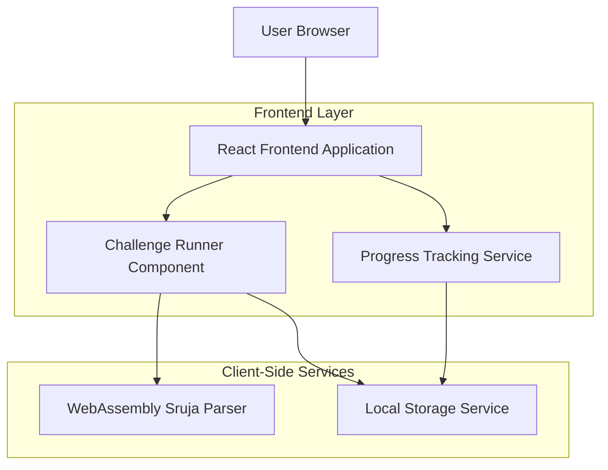
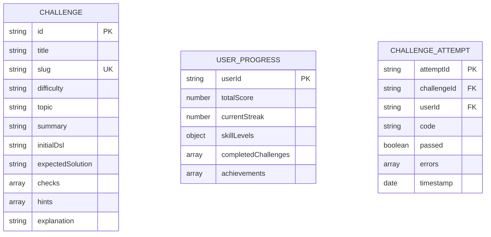

## 1. Architecture design



## 2. Technology Description

- Frontend: React@18 + TypeScript + Vite
- Styling: TailwindCSS@3 + HeadlessUI
- Code Editor: Monaco Editor (VS Code editor)
- Architecture Rendering: Custom WASM-based viewer
- State Management: React Context + Local Storage
- Initialization Tool: vite-init
- Backend: None (fully client-side)

## 3. Route definitions

| Route | Purpose |
|-------|---------|
| / | Landing page with platform overview |
| /challenges | Challenge library with filtering |
| /challenges/:slug | Individual challenge with editor |
| /learn | Structured learning path |
| /progress | User progress dashboard |
| /cheatsheet | Quick reference guide |
| /playground | Free-form Sruja editor |

## 4. Core Components

### 4.1 Challenge Runner Component
```typescript
interface ChallengeRunnerProps {
  challenge: {
    title: string
    slug: string
    summary: string
    initialDsl: string
    checks: ValidationCheck[]
  }
}

interface ValidationCheck {
  type: 'noErrors' | 'relationExists' | 'componentExists' | 'deploymentValid'
  source?: string
  target?: string
  message: string
}
```

### 4.2 Progress Tracking Service
```typescript
interface UserProgress {
  completedChallenges: string[]
  currentStreak: number
  totalScore: number
  skillLevels: {
    relations: number
    deployment: number
    validation: number
    components: number
  }
  achievements: Achievement[]
}

interface Achievement {
  id: string
  name: string
  description: string
  unlockedAt: Date
  icon: string
}
```

### 4.3 Local Storage Schema
```typescript
interface StoredProgress {
  version: 1
  userId: string
  progress: UserProgress
  challengeAttempts: Record<string, ChallengeAttempt[]>
  lastActive: Date
}

interface ChallengeAttempt {
  timestamp: Date
  code: string
  passed: boolean
  errors: string[]
}
```

## 5. Challenge Content Structure

### 5.1 Challenge Schema
```json
{
  "title": "Fix Missing Relations",
  "slug": "fix-relations",
  "difficulty": "beginner",
  "topic": "relations",
  "summary": "Connect WebApp to API and ensure model parses with no errors.",
  "learningObjectives": [
    "Understand component relationships",
    "Practice writing relation syntax"
  ],
  "initialDsl": "architecture \\"Shop\\" {\\n  system App {\\n    container WebApp \\"Web\\"\\n    container API \\"API\\"\\n    datastore DB \\"Database\\"\\n  }\\n}",
  "expectedSolution": "architecture \\"Shop\\" {\\n  system App {\\n    container WebApp \\"Web\\"\\n    container API \\"API\\"\\n    datastore DB \\"Database\\"\\n  }\\n  WebApp -> API \\"Calls\\"\\n  API -> DB \\"Reads/Writes\\"\\n}",
  "checks": [
    { "type": "noErrors", "message": "DSL parsed successfully" },
    { "type": "relationExists", "source": "WebApp", "target": "API", "message": "Add relation WebApp -> API" },
    { "type": "relationExists", "source": "API", "target": "DB", "message": "Add relation API -> DB" }
  ],
  "hints": [
    "Relations connect components in your architecture",
    "Use the -> syntax to create a relation",
    "Don't forget the description label"
  ],
  "explanation": "This challenge teaches basic relation syntax..."
}
```

### 5.2 Challenge Categories

**Beginner Challenges:**
- Fix Missing Relations: Add basic component connections
- Complete the System: Fill in missing containers
- Basic Validation: Fix syntax errors

**Intermediate Challenges:**
- Deployment Optimization: Improve deployment architecture
- Component Refactoring: Restructure for better separation
- External Integration: Add external system connections

**Advanced Challenges:**
- Performance Architecture: Optimize for scale
- Security Architecture: Add security layers
- Multi-System Design: Complex multi-system architectures

## 6. Client-Side Services

### 6.1 WebAssembly Integration
```typescript
interface SrujaParser {
  parse(dsl: string): ParseResult
  validate(dsl: string): ValidationResult
  getDiagram(dsl: string): SVGResult
}

interface ParseResult {
  success: boolean
  ast: ArchitectureNode | null
  errors: ParseError[]
}

interface ValidationResult {
  errors: ValidationError[]
  warnings: ValidationWarning[]
}
```

### 6.2 Progress Tracking Service
```typescript
class ProgressTracker {
  private storage: LocalStorageAdapter
  
  trackChallengeComplete(challengeId: string, code: string): void
  getProgress(): UserProgress
  getStreak(): number
  unlockAchievement(achievementId: string): void
  getLeaderboardPosition(): number
}
```

### 6.3 Challenge Validation Engine
```typescript
class ChallengeValidator {
  validateChallenge(challenge: Challenge, userCode: string): ValidationResult
  private checkNoErrors(parseResult: ParseResult): boolean
  private checkRelationExists(ast: ArchitectureNode, check: ValidationCheck): boolean
  private checkComponentExists(ast: ArchitectureNode, check: ValidationCheck): boolean
}
```

## 7. Data Model

### 7.1 Challenge Data Model


### 7.2 Local Storage Implementation
```typescript
// Challenge storage key pattern
const CHALLENGE_KEY = (id: string) => `sruja:challenge:${id}`
const PROGRESS_KEY = 'sruja:user:progress'
const SETTINGS_KEY = 'sruja:user:settings'

// Storage interface
interface StorageAdapter {
  get<T>(key: string): T | null
  set<T>(key: string, value: T): void
  remove(key: string): void
  clear(): void
}
```

## 8. Performance Considerations

### 8.1 WebAssembly Loading
- Lazy load WASM module only when editor is opened
- Cache compiled WASM in browser memory
- Provide fallback for WASM-unsupported browsers

### 8.2 Editor Performance
- Debounce validation checks (300ms after typing stops)
- Virtual scrolling for large DSL files
- Syntax highlighting optimization for Monaco

### 8.3 Progress Tracking
- Batch progress updates to local storage
- Use IndexedDB for large challenge history
- Implement data cleanup for old attempts