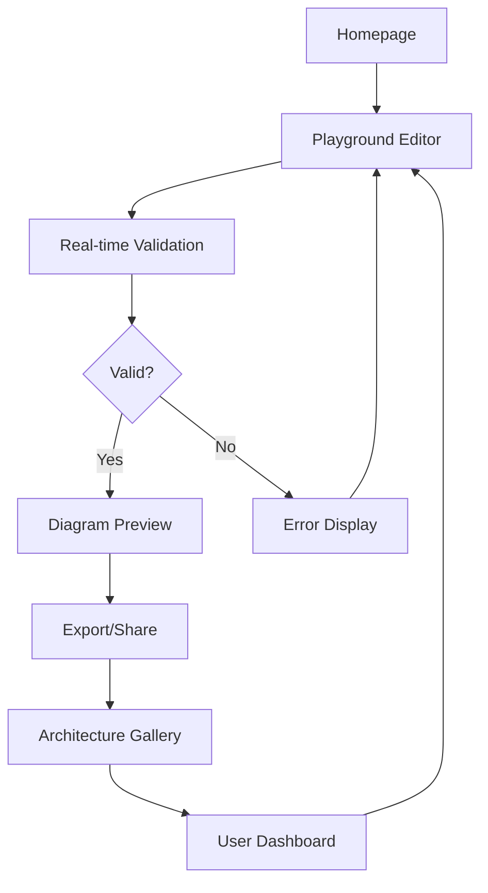

## 1. Product Overview

Sruja Playground is an interactive web-based development environment for the Sruja architecture-as-code language. It enables architects and developers to write, validate, and visualize system architecture diagrams in real-time without installing any local tools.

The playground serves as both a learning platform for new users and a productivity tool for experienced architects, providing immediate feedback on architecture validity and automatic diagram generation.

## 2. Core Features

### 2.1 User Roles

| Role | Registration Method | Core Permissions |
|------|---------------------|------------------|
| Anonymous User | No registration required | Browse examples, edit code, compile diagrams, basic validation |
| Registered User | Email or GitHub OAuth | Save personal projects, share architectures, access advanced features |

### 2.2 Feature Module

Our playground requirements consist of the following main pages:

1. **Playground Editor**: Code editor with syntax highlighting, real-time validation, diagram preview, example browser, export functionality
2. **Architecture Gallery**: Browse community-shared architectures, search and filter, fork and modify examples
3. **User Dashboard**: Saved projects management, sharing settings, profile configuration

### 2.3 Page Details

| Page Name | Module Name | Feature description |
|-----------|-------------|---------------------|
| Playground Editor | Code Editor | Monaco-based editor with Sruja syntax highlighting, auto-completion, error highlighting, line numbers, theme switching |
| Playground Editor | Real-time Validation | Parse and validate code on typing with debouncing, display errors inline and in problems panel |
| Playground Editor | Diagram Preview | Render compiled diagrams (D2/Mermaid), zoom controls, pan functionality, fullscreen mode, export as PNG/SVG |
| Playground Editor | Example Browser | Dropdown with categorized examples, search functionality, one-click load, example descriptions |
| Playground Editor | Export Options | Download as PNG, SVG, PDF, copy diagram code, share via URL, embed code |
| Architecture Gallery | Browse Gallery | Grid/list view of community architectures, preview thumbnails, popularity sorting, recent additions |
| Architecture Gallery | Search & Filter | Search by keywords, filter by complexity, technology stack, architecture pattern, author |
| Architecture Gallery | Architecture Details | Full-screen view, code preview, diagram rendering, fork functionality, author information |
| User Dashboard | Project Management | Create, rename, delete projects, organize into folders, search personal projects |
| User Dashboard | Sharing & Collaboration | Generate shareable links, set permissions (public/private), view access statistics |
| User Dashboard | Profile Settings | Update display name, avatar, bio, notification preferences, account deletion |

## 3. Core Process

### Anonymous User Flow
1. User lands on playground homepage
2. Loads example or starts with blank template
3. Writes/edits Sruja code in editor
4. Real-time validation shows errors/warnings
5. Diagram preview updates automatically
6. User exports or shares architecture

### Registered User Flow
1. User logs in via email or GitHub
2. Accesses personal dashboard
3. Creates new project or opens existing
4. Collaborates on shared projects
5. Publishes architectures to gallery
6. Manages sharing permissions

## 4. User Interface Design

### 4.1 Design Style
- **Primary Colors**: Deep blue (#1E40AF) for primary actions, slate gray (#475569) for secondary elements
- **Secondary Colors**: Success green (#10B981) for validation, error red (#EF4444) for issues, warning amber (#F59E0B)
- **Button Style**: Rounded corners (8px radius), subtle shadows, hover effects with color transitions
- **Typography**: Inter font family, 14px base size for code, 16px for UI text, consistent line heights
- **Layout**: Three-column responsive layout (editor, preview, tools), card-based components with subtle borders
- **Icons**: Heroicons for consistency, emoji for friendly touches in examples and notifications

### 4.2 Page Design Overview

| Page Name | Module Name | UI Elements |
|-----------|-------------|-------------|
| Playground Editor | Editor Panel | Monaco editor with dark theme, line numbers, syntax highlighting, minimap disabled for space efficiency |
| Playground Editor | Preview Panel | Responsive diagram container with zoom controls (±, reset), pan cursor, error badge overlay |
| Playground Editor | Header Toolbar | Example dropdown, compile status indicator, export menu, user menu (if authenticated) |
| Architecture Gallery | Gallery Grid | Masonry layout with architecture cards, preview thumbnails, metadata badges, fork count |
| Architecture Gallery | Search Bar | Prominent search input with filter chips, sort dropdown, view toggle (grid/list) |
| User Dashboard | Project List | Table view with project names, last modified dates, sharing status, action buttons |
| User Dashboard | Sidebar | Navigation menu with icons, profile section, settings link, logout button |

### 4.3 Responsiveness
- **Desktop-first**: Optimized for 1440px+ screens with full three-panel layout
- **Tablet adaptation**: Collapsible panels, touch-friendly controls, simplified toolbar
- **Mobile support**: Single-column layout, swipe gestures, modal-based navigation, touch-optimized buttons
- **Touch interactions**: Pan/zoom for diagrams, swipe for gallery navigation, long-press for context menus