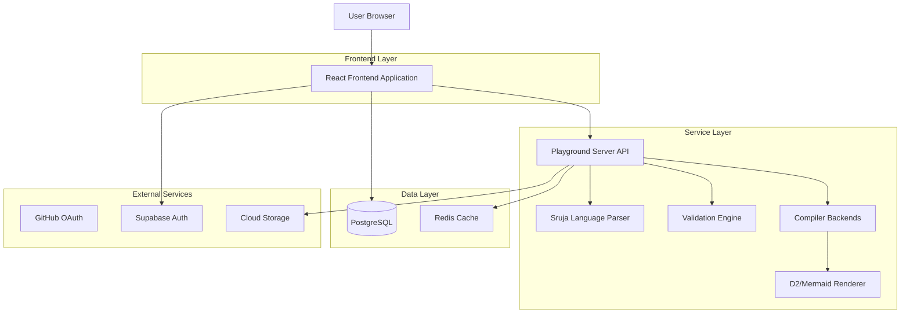
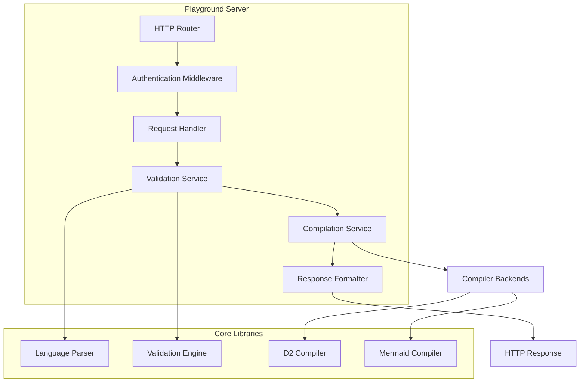
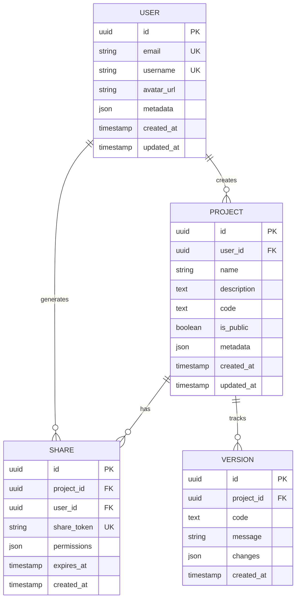

## 1. Architecture Design



## 2. Technology Description

- **Frontend**: React@19 + TypeScript + Vite + TailwindCSS
- **Backend**: Go + Gin Framework (existing playground server)
- **Database**: PostgreSQL (via Supabase)
- **Authentication**: Supabase Auth with GitHub OAuth
- **File Storage**: Supabase Storage for architecture exports
- **Real-time**: WebSocket for collaborative editing (future)
- **Diagram Rendering**: D2.js + Mermaid.js
- **Code Editor**: Monaco Editor with custom Sruja language support

## 3. Route Definitions

| Route | Purpose |
|-------|---------|
| / | Playground homepage with editor and preview |
| /gallery | Browse community architecture examples |
| /gallery/:id | View specific architecture with details |
| /dashboard | User dashboard for saved projects |
| /dashboard/new | Create new architecture project |
| /dashboard/:id/edit | Edit existing project |
| /api/compile | Compile Sruja code to diagram |
| /api/validate | Validate Sruja syntax and rules |
| /api/auth/login | User authentication |
| /api/projects | CRUD operations for user projects |
| /api/share/:id | Share architecture via public link |

## 4. API Definitions

### 4.1 Core API Endpoints

#### Compile Architecture
```
POST /api/compile
```

Request:
| Param Name | Param Type | isRequired | Description |
|------------|-------------|-------------|-------------|
| code | string | true | Sruja source code |
| format | string | false | Output format (d2, mermaid, svg) |

Response:
| Param Name | Param Type | Description |
|------------|-------------|-------------|
| valid | boolean | Compilation success status |
| d2 | string | D2 diagram code (if applicable) |
| svg | string | Rendered SVG (if applicable) |
| errors | string[] | Compilation errors |
| warnings | string[] | Validation warnings |

Example:
```json
{
  "code": "system User \"User\"\\nsystem API \"API Service\" {\\n  container WebApp \"Web Application\"\\n}\\nUser -> WebApp \"Uses\"",
  "format": "svg"
}
```

#### Validate Code
```
POST /api/validate
```

Request:
| Param Name | Param Type | isRequired | Description |
|------------|-------------|-------------|-------------|
| code | string | true | Sruja source code to validate |

Response:
| Param Name | Param Type | Description |
|------------|-------------|-------------|
| valid | boolean | Validation result |
| errors | string[] | Syntax and validation errors |
| warnings | string[] | Best practice warnings |

### 4.2 User Management API

#### Create Project
```
POST /api/projects
```

Request Headers:
```
Authorization: Bearer <jwt_token>
```

Request:
| Param Name | Param Type | isRequired | Description |
|------------|-------------|-------------|-------------|
| name | string | true | Project name |
| code | string | true | Sruja source code |
| description | string | false | Project description |
| is_public | boolean | false | Public visibility flag |

#### Get User Projects
```
GET /api/projects
```

Response:
```json
{
  "projects": [
    {
      "id": "uuid",
      "name": "E-commerce Architecture",
      "description": "Microservices architecture for online store",
      "code": "system User...",
      "is_public": true,
      "created_at": "2024-01-15T10:00:00Z",
      "updated_at": "2024-01-15T12:30:00Z"
    }
  ]
}
```

## 5. Server Architecture Diagram



## 6. Data Model

### 6.1 Database Schema



### 6.2 Data Definition Language

```sql
-- Users table
CREATE TABLE users (
    id UUID PRIMARY KEY DEFAULT gen_random_uuid(),
    email VARCHAR(255) UNIQUE NOT NULL,
    username VARCHAR(50) UNIQUE NOT NULL,
    avatar_url TEXT,
    metadata JSONB DEFAULT '{}',
    created_at TIMESTAMP WITH TIME ZONE DEFAULT NOW(),
    updated_at TIMESTAMP WITH TIME ZONE DEFAULT NOW()
);

-- Projects table
CREATE TABLE projects (
    id UUID PRIMARY KEY DEFAULT gen_random_uuid(),
    user_id UUID NOT NULL REFERENCES users(id) ON DELETE CASCADE,
    name VARCHAR(255) NOT NULL,
    description TEXT,
    code TEXT NOT NULL,
    is_public BOOLEAN DEFAULT false,
    metadata JSONB DEFAULT '{}',
    created_at TIMESTAMP WITH TIME ZONE DEFAULT NOW(),
    updated_at TIMESTAMP WITH TIME ZONE DEFAULT NOW()
);

-- Shares table
CREATE TABLE shares (
    id UUID PRIMARY KEY DEFAULT gen_random_uuid(),
    project_id UUID NOT NULL REFERENCES projects(id) ON DELETE CASCADE,
    user_id UUID NOT NULL REFERENCES users(id) ON DELETE CASCADE,
    share_token VARCHAR(64) UNIQUE NOT NULL,
    permissions JSONB DEFAULT '{"read": true, "write": false}',
    expires_at TIMESTAMP WITH TIME ZONE,
    created_at TIMESTAMP WITH TIME ZONE DEFAULT NOW()
);

-- Versions table
CREATE TABLE versions (
    id UUID PRIMARY KEY DEFAULT gen_random_uuid(),
    project_id UUID NOT NULL REFERENCES projects(id) ON DELETE CASCADE,
    code TEXT NOT NULL,
    message VARCHAR(255),
    changes JSONB DEFAULT '{}',
    created_at TIMESTAMP WITH TIME ZONE DEFAULT NOW()
);

-- Indexes for performance
CREATE INDEX idx_projects_user_id ON projects(user_id);
CREATE INDEX idx_projects_is_public ON projects(is_public) WHERE is_public = true;
CREATE INDEX idx_shares_share_token ON shares(share_token);
CREATE INDEX idx_versions_project_id ON versions(project_id);
CREATE INDEX idx_versions_created_at ON versions(created_at DESC);

-- Row Level Security (RLS) policies
ALTER TABLE projects ENABLE ROW LEVEL SECURITY;
ALTER TABLE shares ENABLE ROW LEVEL SECURITY;
ALTER TABLE versions ENABLE ROW LEVEL SECURITY;

-- Projects policies
CREATE POLICY "Users can view their own projects" ON projects
    FOR SELECT USING (auth.uid() = user_id);

CREATE POLICY "Users can view public projects" ON projects
    FOR SELECT USING (is_public = true);

CREATE POLICY "Users can insert their own projects" ON projects
    FOR INSERT WITH CHECK (auth.uid() = user_id);

CREATE POLICY "Users can update their own projects" ON projects
    FOR UPDATE USING (auth.uid() = user_id);

CREATE POLICY "Users can delete their own projects" ON projects
    FOR DELETE USING (auth.uid() = user_id);

-- Grant permissions
GRANT SELECT ON users TO anon;
GRANT SELECT ON projects TO anon;
GRANT ALL ON users TO authenticated;
GRANT ALL ON projects TO authenticated;
GRANT ALL ON shares TO authenticated;
GRANT ALL ON versions TO authenticated;
```

## 7. Security Considerations

- **Authentication**: JWT tokens with 1-hour expiration, refresh token rotation
- **Authorization**: Row Level Security (RLS) in PostgreSQL, role-based access control
- **Input Validation**: Strict validation of Sruja code to prevent injection attacks
- **Rate Limiting**: 100 requests per minute per IP for compilation endpoints
- **CORS**: Configured for specific origins, credentials included for authenticated requests
- **Data Sanitization**: HTML escaping for user-generated content, SQL injection prevention
- **File Upload Security**: Content type validation, size limits, malware scanning (future)

## 8. Performance Optimization

- **Caching**: Redis for compiled diagram results, 5-minute TTL
- **CDN**: Static assets served via CDN with aggressive caching
- **Lazy Loading**: Monaco editor loaded on demand, diagram rendering debounced
- **Database Indexing**: Optimized queries for project retrieval and search
- **Connection Pooling**: Database connection pooling with appropriate limits
- **Compression**: Gzip compression for API responses and static assets