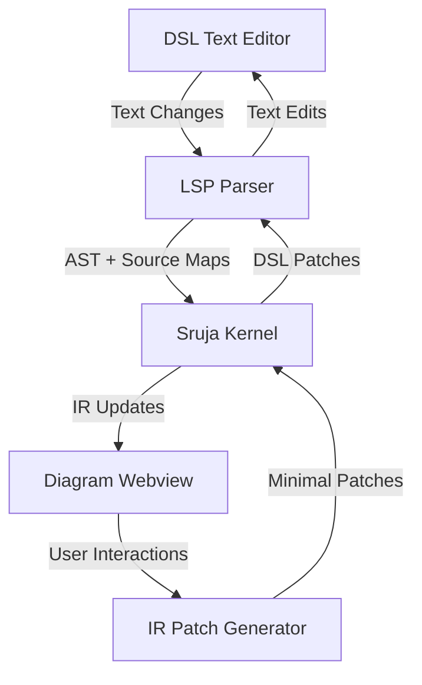

## 1. Product Overview
Sruja Studio is a VS Code extension that transforms DSL (Domain Specific Language) code into interactive visual diagrams inside the VS Code editor. It enables developers to visualize, edit, and maintain complex system architectures through a two-way binding mechanism between text and visual representations.

The product solves the problem of understanding and maintaining large-scale system architectures by providing visual feedback directly in the coding environment, eliminating context switching between code and external diagramming tools.

## 2. Core Features

### 2.1 User Roles
| Role | Registration Method | Core Permissions |
|------|---------------------|------------------|
| Developer | VS Code extension installation | Full access to DSL editing, diagram visualization, and two-way binding |
| Stakeholder | Web-based viewer (optional) | Read-only access to diagrams and architecture views |

### 2.2 Feature Module
Our Sruja Studio requirements consist of the following main pages:
1. **DSL Editor**: VS Code text editor with syntax highlighting, validation, and LSP support
2. **Diagram Panel**: Webview-based visual diagram renderer with interactive elements
3. **Inspector Panel**: Node/edge property editor with real-time updates
4. **Search Palette**: Command palette for quick navigation and actions
5. **AI Sidebar**: AI-powered architecture suggestions and refinements

### 2.3 Page Details
| Page Name | Module Name | Feature description |
|-----------|-------------|---------------------|
| DSL Editor | Syntax Highlighting | Color-coded DSL syntax with custom language support |
| DSL Editor | LSP Integration | Real-time validation, diagnostics, completions, hover docs, goto definition |
| DSL Editor | Error Detection | Inline error markers and problem panel integration |
| Diagram Panel | Graph Rendering | Interactive node-link diagrams using Cytoscape/ELK layout engines |
| Diagram Panel | Zoom/Pan | Mouse wheel zoom, drag pan, fit-to-view controls |
| Diagram Panel | Node Selection | Click to select, multi-select with shift, property highlighting |
| Diagram Panel | Edge Routing | Automatic edge routing with minimal crossings |
| Inspector Panel | Property Editor | Edit node labels, types, connections, and metadata |
| Inspector Panel | Real-time Updates | Immediate reflection of changes in both text and diagram |
| Search Palette | Quick Navigation | Jump to nodes, search by name, filter by type |
| Search Palette | Command Execution | Execute studio commands via text input |
| AI Sidebar | Architecture Import | Import existing codebases and generate initial diagrams |
| AI Sidebar | Refinement Suggestions | AI-powered improvements and optimizations |
| AI Sidebar | Query Interface | Natural language queries about architecture |

## 3. Core Process

### Developer Flow
1. Open `.sruja` DSL file in VS Code
2. Studio automatically activates and renders diagram in webview panel
3. Edit DSL text → LSP parses → Kernel generates IR → Diagram updates automatically
4. Edit diagram → IR patch generated → DSL patch applied → Text editor updates automatically
5. Use inspector to modify node properties with immediate bidirectional synchronization
6. Search and navigate large architectures using command palette
7. Leverage AI for architecture improvements and brownfield code analysis

### Two-Way Binding Flow

## 4. User Interface Design

### 4.1 Design Style
- **Primary Colors**: VS Code theme integration (adapts to current theme)
- **Secondary Colors**: Blue for selected elements, green for new additions, red for errors
- **Button Style**: VS Code native buttons and controls
- **Font**: Consistent with VS Code editor font (typically Monaco/Cascadia Code)
- **Layout Style**: Panel-based layout integrated with VS Code workbench
- **Icons**: VS Code Codicon library for consistency

### 4.2 Page Design Overview
| Page Name | Module Name | UI Elements |
|-----------|-------------|-------------|
| DSL Editor | Text Area | Standard VS Code editor with syntax highlighting, line numbers, folding |
| Diagram Panel | Canvas | Full-width canvas with toolbar at top, zoom controls bottom-right |
| Inspector Panel | Property Grid | Collapsible sections for different property categories |
| Search Palette | Input Field | VS Code quick-open style with fuzzy search |
| AI Sidebar | Chat Interface | Message history, input field, suggestion cards |

### 4.3 Responsiveness
- **Desktop-first**: Designed for VS Code desktop application
- **Touch Support**: Basic touch gestures for diagram interaction on touchscreens
- **Panel Resizing**: All panels support drag-to-resize within VS Code workbench