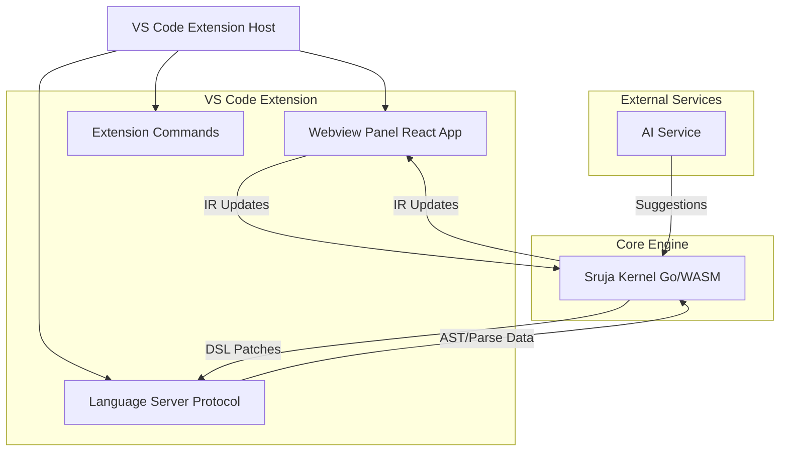
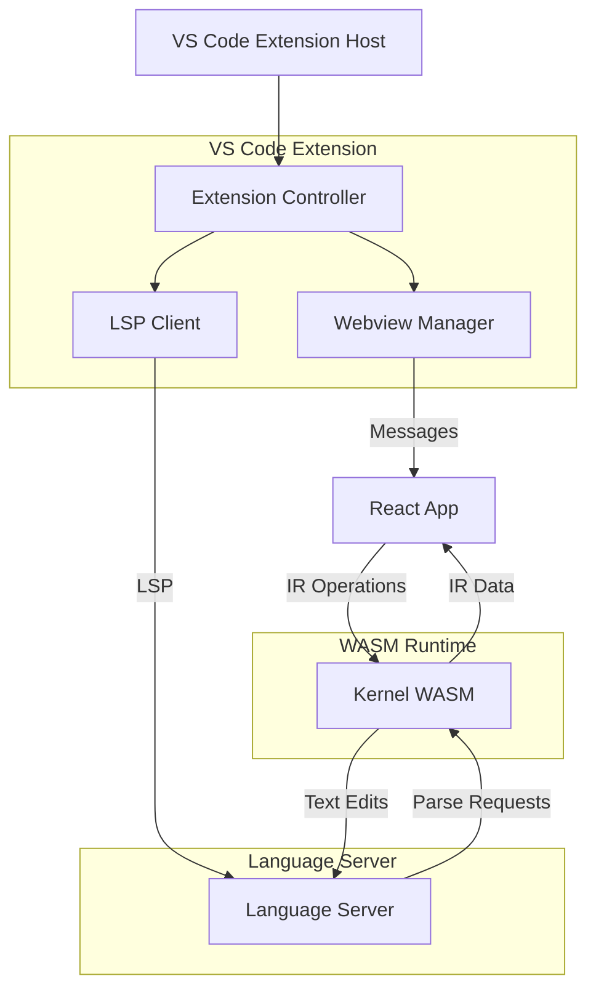
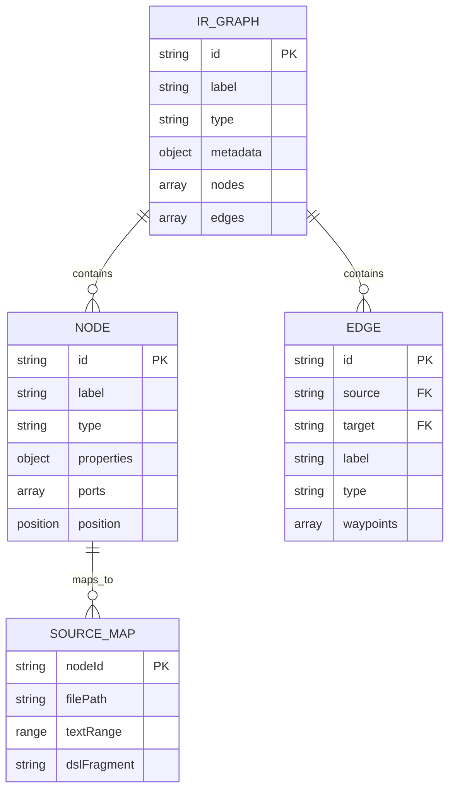

## 1. Architecture design



## 2. Technology Description

* **Frontend**: React\@18 + TypeScript + Vite

* **Visualization**: Cytoscape.js + ELK.js for graph layouts

* **VS Code Integration**: VS Code Extension API + Webview API

* **Language Server**: Node.js + LSP implementation

* **Core Engine**: Go compiled to WASM for DSL parsing and IR generation

* **Initialization Tool**: vite-init for webview development

* **Backend**: None (all processing done client-side via WASM)

## 3. Route definitions

| Route              | Purpose                          |
| ------------------ | -------------------------------- |
| /webview/diagram   | Main diagram visualization panel |
| /webview/inspector | Node/edge property inspector     |
| /webview/ai        | AI assistant sidebar             |
| /webview/search    | Search and command palette       |

Note: Routes are internal to the webview React application, not traditional web routes.

## 4. API definitions

### 4.1 VS Code Extension API

**Command: Open Diagram Panel**

```
sruja-studio.openDiagram
```

**Webview Communication**

```typescript
interface WebviewMessage {
  type: 'updateIR' | 'requestIR' | 'applyPatch' | 'selectNode' | 'search';
  payload: any;
}

interface IRUpdateMessage {
  type: 'updateIR';
  payload: {
    ir: IntermediateRepresentation;
    sourceMap: SourceMap;
  };
}
```

### 4.2 Language Server Protocol Extensions

**Custom LSP Methods**

```typescript
interface SrujaLanguageServer {
  // Parse DSL and return IR
  'sruja/parse': (params: { text: string }) => Promise<ParseResult>;
  
  // Generate DSL patch from IR changes
  'sruja/generatePatch': (params: { originalIR: IR; newIR: IR }) => Promise<TextEdit[]>;
  
  // Validate DSL syntax and semantics
  'sruja/validate': (params: { text: string }) => Promise<Diagnostic[]>;
}
```

## 5. Server architecture diagram



## 6. Data model

### 6.1 Data model definition



### 6.2 Data Definition Language

**IR Graph Table (for caching)**

```sql
-- Create table for IR caching
CREATE TABLE ir_cache (
    id UUID PRIMARY KEY DEFAULT gen_random_uuid(),
    file_path VARCHAR(512) UNIQUE NOT NULL,
    ir_data JSONB NOT NULL,
    source_map JSONB NOT NULL,
    created_at TIMESTAMP WITH TIME ZONE DEFAULT NOW(),
    updated_at TIMESTAMP WITH TIME ZONE DEFAULT NOW()
);

-- Create index for fast file lookups
CREATE INDEX idx_ir_cache_file_path ON ir_cache(file_path);

-- Create index for timestamp queries
CREATE INDEX idx_ir_cache_updated_at ON ir_cache(updated_at DESC);
```

**Node Types Definition**

```typescript
enum NodeType {
  SERVICE = 'service',
  DATABASE = 'database',
  API = 'api',
  QUEUE = 'queue',
  FUNCTION = 'function',
  COMPONENT = 'component'
}

interface Node {
  id: string;
  type: NodeType;
  label: string;
  properties: Record<string, any>;
  ports: Port[];
  position?: { x: number; y: number };
}

interface Edge {
  id: string;
  source: string;
  target: string;
  type: string;
  label?: string;
  waypoints?: { x: number; y: number }[];
}
```

