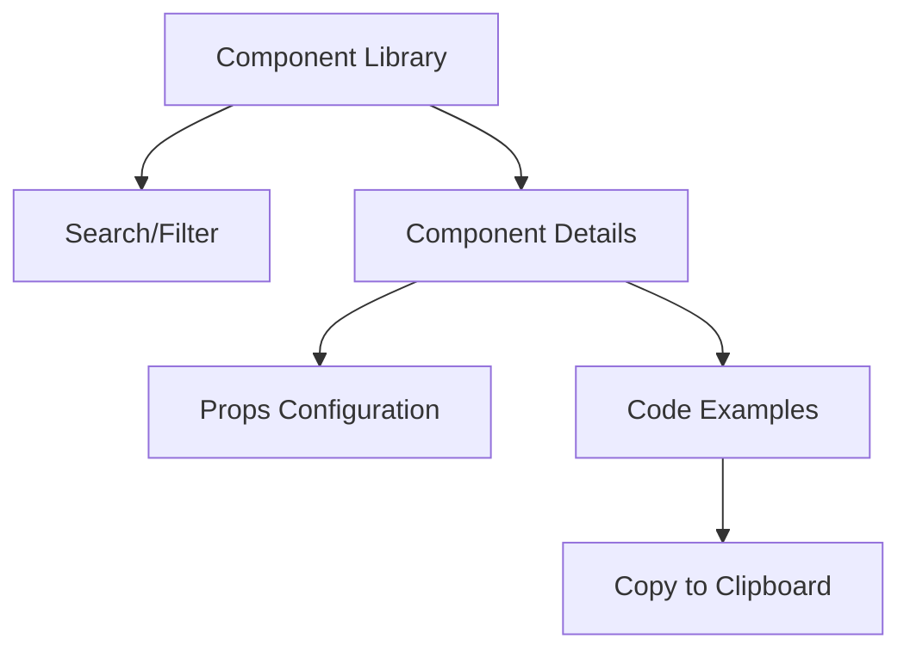

## 1. Product Overview
A standalone Storybook application for previewing and testing @sruja/ui components in isolation. This tool enables developers to quickly review component behavior, props, and visual states without integrating them into a larger application.

The app provides a centralized component library preview environment for faster development cycles and better component documentation.

## 2. Core Features

### 2.1 User Roles
| Role | Registration Method | Core Permissions |
|------|---------------------|------------------|
| Developer | No registration required | Full access to all components, can view code examples and documentation |

### 2.2 Feature Module
The Storybook app consists of the following main pages:
1. **Component Library**: Interactive component preview with controls and documentation
2. **Component Details**: Individual component view with props table and usage examples
3. **Search/Filter**: Component discovery and filtering by category

### 2.3 Page Details
| Page Name | Module Name | Feature description |
|-----------|-------------|---------------------|
| Component Library | Component Grid | Display all @sruja/ui components in a searchable grid layout |
| Component Library | Category Filter | Filter components by type (buttons, forms, layouts, etc.) |
| Component Library | Search Bar | Real-time search through component names and descriptions |
| Component Details | Component Preview | Interactive component with live props editing |
| Component Details | Props Table | Display all available props with types and descriptions |
| Component Details | Code Examples | Show usage examples in different contexts |
| Component Details | Copy Code | Copy component usage code to clipboard |

## 3. Core Process
**Developer Flow**: Navigate to app → Browse component library → Filter/search components → Click component → View details and examples → Copy usage code → Implement in project

## 4. User Interface Design

### 4.1 Design Style
- **Primary Color**: #3B82F6 (blue) for interactive elements
- **Secondary Color**: #6B7280 (gray) for secondary text and borders
- **Button Style**: Rounded corners (8px radius), subtle shadows on hover
- **Font**: Inter or system fonts, 14px base size
- **Layout**: Card-based grid layout with left sidebar for navigation
- **Icons**: Lucide React icons for consistency

### 4.2 Page Design Overview
| Page Name | Module Name | UI Elements |
|-----------|-------------|-------------|
| Component Library | Component Grid | 3-column responsive grid, component cards with preview thumbnails, hover effects with elevation |
| Component Library | Sidebar | Collapsible category navigation, search input at top, dark/light mode toggle |
| Component Details | Preview Area | Centered component preview with configurable background, props panel on right side |
| Component Details | Code Section | Syntax-highlighted code blocks with copy button, tabs for different examples |

### 4.3 Responsiveness
Desktop-first design with mobile-responsive layouts. Touch-friendly interactions for mobile devices with larger tap targets and swipe gestures for navigation.