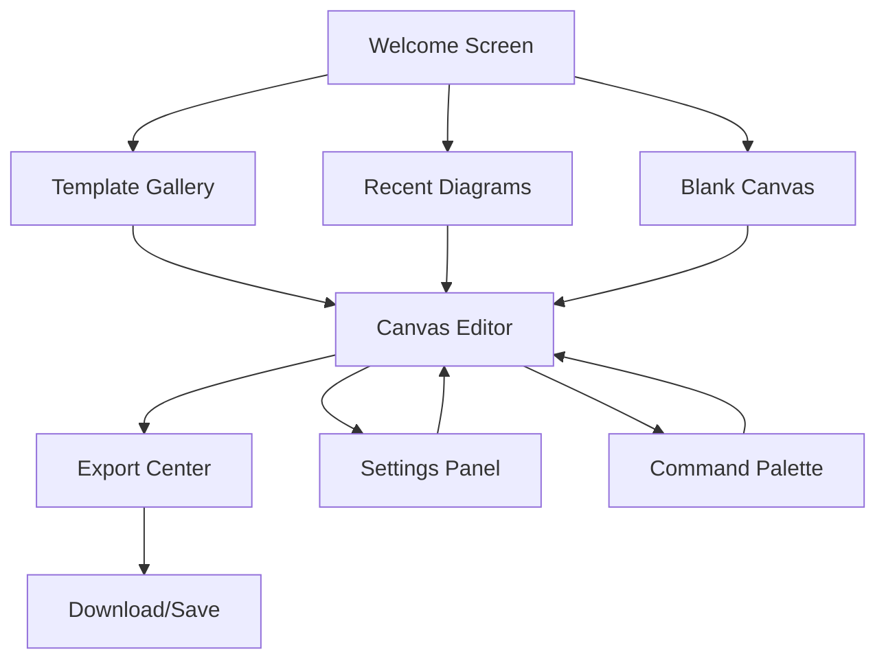

## 1. Product Overview

Redesign the Sruja Studio application to provide a professional, enterprise-grade architecture visualization experience comparable to industry-leading tools like draw.io and Miro. The redesign focuses on creating a fast, intuitive canvas-based interface with professional-grade features for architecture diagramming.

Target users include software architects, system designers, DevOps engineers, and technical leads who need to create, edit, and share professional architecture diagrams with enterprise-level polish and performance.

## 2. Core Features

### 2.1 User Roles

| Role | Registration Method | Core Permissions |
|------|---------------------|------------------|
| Studio User | Email/GitHub authentication | Create, edit, export diagrams |
| Premium User | Subscription upgrade | Advanced export options, collaboration features |
| Enterprise User | Organization invitation | Team sharing, advanced templates, custom branding |

### 2.2 Feature Module

The Studio application consists of the following main pages and modules:

1. **Canvas Editor**: Main diagramming interface with infinite canvas, toolbar, and panels
2. **Template Gallery**: Pre-built architecture templates and patterns library  
3. **Export Center**: Professional export options with presets and customization
4. **Settings Panel**: User preferences, themes, and workspace configuration
5. **Command Palette**: Quick action launcher for all Studio functions

### 2.3 Page Details

| Page Name | Module Name | Feature description |
|-----------|-------------|---------------------|
| Canvas Editor | Canvas Area | Infinite canvas with smooth pan/zoom, grid overlay, snap-to-grid alignment |
| Canvas Editor | Toolbar | Contextual tools for adding elements, connections, and annotations |
| Canvas Editor | Left Panel | Model explorer with hierarchical view of architecture elements |
| Canvas Editor | Right Panel | Properties inspector for selected elements with real-time editing |
| Canvas Editor | Status Bar | Diagram statistics, validation status, zoom level, and save indicator |
| Canvas Editor | Command Palette | Quick launcher for all commands with fuzzy search (Cmd/Ctrl+K) |
| Canvas Editor | Context Menu | Right-click menu with element-specific actions and shortcuts |
| Canvas Editor | Zoom Controls | Floating zoom widget with fit-to-screen and zoom percentage display |
| Template Gallery | Template Browser | Searchable gallery of architecture patterns and templates |
| Template Gallery | Template Preview | Live preview of templates with metadata and usage stats |
| Template Gallery | Quick Insert | One-click template insertion with auto-layout |
| Export Center | Export Dialog | Professional export interface with format selection and options |
| Export Center | Export Presets | Pre-configured export settings for different use cases |
| Export Center | Batch Export | Export multiple formats or diagram levels simultaneously |
| Settings Panel | Theme Selector | Light/dark/high contrast themes with custom color schemes |
| Settings Panel | Editor Preferences | Font size, word wrap, auto-save intervals, and editor behavior |
| Settings Panel | Canvas Preferences | Default zoom, grid settings, snap behavior, and interaction modes |

## 3. Core Process

### Primary User Flow - Creating Architecture Diagram

1. **Landing**: User opens Studio and sees welcome screen with recent diagrams and template options
2. **Template Selection**: User selects from pre-built templates or starts with blank canvas
3. **Canvas Setup**: Canvas initializes with appropriate grid, zoom, and tool configuration
4. **Element Addition**: User adds architecture elements via toolbar, palette, or drag-and-drop
5. **Connection Creation**: User draws relationships between elements with visual feedback
6. **Property Editing**: User refines element properties through the inspector panel
7. **Layout Organization**: User arranges elements with auto-layout and alignment tools
8. **Validation Check**: Real-time validation shows diagram health and suggestions
9. **Export Process**: User selects export format and options through professional dialog
10. **Save & Share**: Diagram saves automatically with version history and sharing options

### Navigation Flow

## 4. User Interface Design

### 4.1 Design Style

**Visual Identity**
- **Primary Colors**: Professional blue (#2563EB) for primary actions, slate gray for secondary elements
- **Secondary Colors**: Success green (#10B981), warning amber (#F59E0B), error red (#EF4444)
- **Typography**: Inter font family with clear hierarchy - 14px base, 16px headers, 12px labels
- **Button Style**: Rounded rectangles (6px radius) with hover states and clear focus indicators
- **Layout Style**: Card-based panels with subtle shadows and consistent 8px spacing grid
- **Icon Style**: Lucide React icons with consistent 16px/20px sizing and proper labeling

**Interaction Patterns**
- **Hover States**: Subtle background color changes with 200ms transitions
- **Active States**: Clear visual feedback with border highlights and shadow changes
- **Loading States**: Skeleton screens and spinners for async operations
- **Error States**: Inline validation with helpful error messages and recovery suggestions

### 4.2 Page Design Overview

| Page Name | Module Name | UI Elements |
|-----------|-------------|-------------|
| Canvas Editor | Main Canvas | Infinite scrollable area with subtle grid pattern, smooth pan/zoom with mouse wheel and trackpad gestures, minimap in bottom-right corner |
| Canvas Editor | Toolbar | Floating horizontal bar with grouped tool buttons (add elements, connections, annotations), contextual tools based on selection |
| Canvas Editor | Left Panel | Collapsible sidebar (280px default) with model tree, search filter, and hierarchical navigation |
| Canvas Editor | Right Panel | Collapsible inspector panel (320px default) with form fields, color pickers, and property editors |
| Canvas Editor | Status Bar | Bottom bar showing diagram name, element count, validation badge, zoom level, and save status |
| Canvas Editor | Command Palette | Modal overlay with search input, categorized commands, keyboard shortcuts display, and fuzzy search |
| Export Center | Export Dialog | Modal with format selection cards, quality presets, metadata fields, and preview thumbnail |
| Template Gallery | Template Grid | Responsive grid layout with card previews, category filters, search bar, and usage statistics |

### 4.3 Responsiveness

**Desktop-First Design**
- Primary interface optimized for 1440px+ desktop screens
- Collapsible panels for smaller desktop screens (1024px+)
- Touch-optimized interactions for tablet use (768px+)
- Simplified mobile interface for viewing and basic editing (375px+)

**Adaptive Features**
- Responsive panel sizing with drag-to-resize handles
- Touch gesture support for pan, zoom, and selection
- Contextual menu adaptation for touch interfaces
- Progressive disclosure of advanced features based on screen size