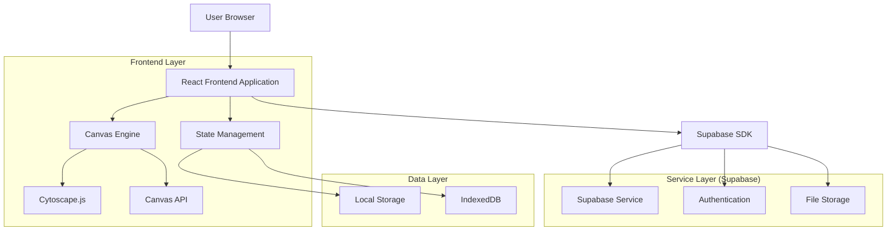
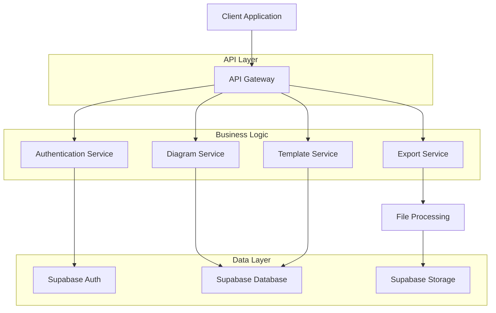
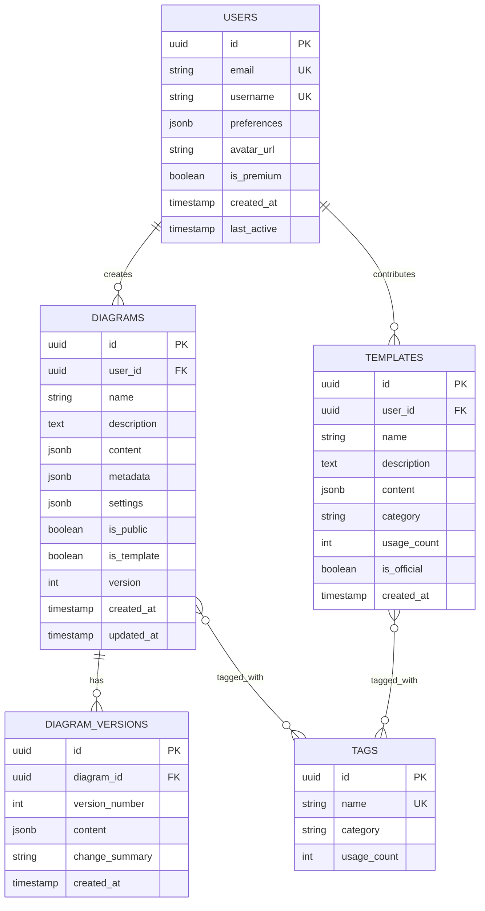

## 1. Architecture Design



## 2. Technology Description

**Frontend Stack**

* Frontend: React\@18 + TypeScript\@5 + Vite\@5

* Styling: TailwindCSS\@3 + PostCSS + CSS Variables

* UI Components: HeadlessUI + Radix UI primitives

* Canvas Rendering: Cytoscape.js\@3 + Custom Canvas API

* State Management: Zustand\@4 + React Context

* Form Handling: React Hook Form + Zod validation

* Animation: Framer Motion + CSS transitions

**Development Tools**

* Initialization Tool: vite-init

* Package Manager: pnpm\@8

* Code Quality: ESLint + Prettier + TypeScript

* Testing: Vitest + React Testing Library + Playwright

**Backend Services (Supabase)**

* Database: PostgreSQL\@15 with Row Level Security

* Authentication: Supabase Auth with GitHub/Google OAuth

* Storage: Supabase Storage for diagram files and exports

* Real-time: Supabase Realtime for collaboration features

## 3. Route Definitions

| Route       | Purpose                                      | Layout                    |
| ----------- | -------------------------------------------- | ------------------------- |
| /           | Studio canvas editor with infinite workspace | Full-screen canvas layout |
| /templates  | Template gallery and pattern library         | Grid layout with filters  |
| /export     | Professional export interface                | Modal overlay on canvas   |
| /settings   | User preferences and workspace config        | Tabbed settings panel     |
| /shared/:id | View-only shared diagram                     | Minimal viewer layout     |
| /embed/:id  | Embedded diagram for external sites          | Chromeless viewer         |

## 4. API Definitions

### 4.1 Core API Endpoints

**Diagram Management**

```
GET /api/diagrams
POST /api/diagrams
GET /api/diagrams/:id
PUT /api/diagrams/:id
DELETE /api/diagrams/:id
```

**Template Operations**

```
GET /api/templates
GET /api/templates/:id
POST /api/templates/:id/use
```

**Export Services**

```
POST /api/export/png
POST /api/export/svg
POST /api/export/pdf
POST /api/export/json
```

### 4.2 Data Types

**Diagram Entity**

```typescript
interface Diagram {
  id: string
  name: string
  description?: string
  content: ArchitectureJSON
  metadata: DiagramMetadata
  settings: CanvasSettings
  created_at: string
  updated_at: string
  user_id: string
  is_public: boolean
  version: number
}

interface DiagramMetadata {
  name: string
  version: string
  author?: string
  tags: string[]
  c4_level: 1 | 2 | 3 | 4
  complexity_score: number
  element_count: number
  relation_count: number
}

interface CanvasSettings {
  theme: 'light' | 'dark' | 'high-contrast'
  grid_enabled: boolean
  snap_to_grid: boolean
  grid_size: number
  default_zoom: number
  auto_save_interval: number
  show_minimap: boolean
  show_validation: boolean
}
```

**Export Options**

```typescript
interface ExportOptions {
  format: 'png' | 'svg' | 'pdf' | 'json'
  quality: 'draft' | 'presentation' | 'print' | 'high-res'
  scale: number
  include_metadata: boolean
  include_timestamp: boolean
  background_color?: string
  custom_filename?: string
  preset?: 'documentation' | 'presentation' | 'print' | 'web'
}
```

## 5. Server Architecture Diagram



## 6. Data Model

### 6.1 Database Schema Design



### 6.2 Data Definition Language

**Users Table**

```sql
CREATE TABLE users (
    id UUID PRIMARY KEY DEFAULT gen_random_uuid(),
    email VARCHAR(255) UNIQUE NOT NULL,
    username VARCHAR(50) UNIQUE NOT NULL,
    preferences JSONB DEFAULT '{}',
    avatar_url TEXT,
    is_premium BOOLEAN DEFAULT false,
    created_at TIMESTAMP WITH TIME ZONE DEFAULT NOW(),
    last_active TIMESTAMP WITH TIME ZONE DEFAULT NOW()
);

-- Indexes for performance
CREATE INDEX idx_users_email ON users(email);
CREATE INDEX idx_users_username ON users(username);
CREATE INDEX idx_users_premium ON users(is_premium);
```

**Diagrams Table**

```sql
CREATE TABLE diagrams (
    id UUID PRIMARY KEY DEFAULT gen_random_uuid(),
    user_id UUID NOT NULL REFERENCES users(id) ON DELETE CASCADE,
    name VARCHAR(255) NOT NULL,
    description TEXT,
    content JSONB NOT NULL,
    metadata JSONB DEFAULT '{}',
    settings JSONB DEFAULT '{}',
    is_public BOOLEAN DEFAULT false,
    is_template BOOLEAN DEFAULT false,
    version INTEGER DEFAULT 1,
    created_at TIMESTAMP WITH TIME ZONE DEFAULT NOW(),
    updated_at TIMESTAMP WITH TIME ZONE DEFAULT NOW()
);

-- Indexes for performance
CREATE INDEX idx_diagrams_user_id ON diagrams(user_id);
CREATE INDEX idx_diagrams_public ON diagrams(is_public);
CREATE INDEX idx_diagrams_template ON diagrams(is_template);
CREATE INDEX idx_diagrams_updated_at ON diagrams(updated_at DESC);

-- RLS Policies
ALTER TABLE diagrams ENABLE ROW LEVEL SECURITY;

-- Users can see their own diagrams
CREATE POLICY "Users can view own diagrams" ON diagrams
    FOR SELECT USING (auth.uid() = user_id);

-- Users can create diagrams
CREATE POLICY "Users can create diagrams" ON diagrams
    FOR INSERT WITH CHECK (auth.uid() = user_id);

-- Users can update own diagrams
CREATE POLICY "Users can update own diagrams" ON diagrams
    FOR UPDATE USING (auth.uid() = user_id);

-- Users can delete own diagrams
CREATE POLICY "Users can delete own diagrams" ON diagrams
    FOR DELETE USING (auth.uid() = user_id);

-- Public diagrams are viewable by everyone
CREATE POLICY "Public diagrams are viewable by all" ON diagrams
    FOR SELECT USING (is_public = true);
```

**Diagram Versions Table**

```sql
CREATE TABLE diagram_versions (
    id UUID PRIMARY KEY DEFAULT gen_random_uuid(),
    diagram_id UUID NOT NULL REFERENCES diagrams(id) ON DELETE CASCADE,
    version_number INTEGER NOT NULL,
    content JSONB NOT NULL,
    change_summary TEXT,
    created_at TIMESTAMP WITH TIME ZONE DEFAULT NOW(),
    UNIQUE(diagram_id, version_number)
);

CREATE INDEX idx_diagram_versions_diagram_id ON diagram_versions(diagram_id);
CREATE INDEX idx_diagram_versions_version ON diagram_versions(version_number DESC);
```

**Templates Table**

```sql
CREATE TABLE templates (
    id UUID PRIMARY KEY DEFAULT gen_random_uuid(),
    user_id UUID NOT NULL REFERENCES users(id) ON DELETE CASCADE,
    name VARCHAR(255) NOT NULL,
    description TEXT,
    content JSONB NOT NULL,
    category VARCHAR(50) NOT NULL,
    usage_count INTEGER DEFAULT 0,
    is_official BOOLEAN DEFAULT false,
    created_at TIMESTAMP WITH TIME ZONE DEFAULT NOW()
);

CREATE INDEX idx_templates_category ON templates(category);
CREATE INDEX idx_templates_official ON templates(is_official);
CREATE INDEX idx_templates_usage ON templates(usage_count DESC);
```

**Supabase Storage Configuration**

```sql
-- Create storage bucket for diagram exports
INSERT INTO storage.buckets (id, name, public, file_size_limit, allowed_mime_types)
VALUES (
    'diagram-exports',
    'diagram-exports',
    true,
    52428800, -- 50MB
    ARRAY['image/png', 'image/svg+xml', 'application/pdf', 'application/json']
);

-- Storage policies for exports
CREATE POLICY "Users can upload own exports" ON storage.objects
    FOR INSERT WITH CHECK (auth.uid() = (storage.foldername(name))[1]::uuid);

CREATE POLICY "Users can view own exports" ON storage.objects
    FOR SELECT USING (auth.uid() = (storage.foldername(name))[1]::uuid);

CREATE POLICY "Users can delete own exports" ON storage.objects
    FOR DELETE USING (auth.uid() = (storage.foldername(name))[1]::uuid);
```

## 7. Component Architecture

### 7.1 Core React Components

**Canvas Layer Architecture**

```
CanvasEditor
├── CanvasContainer (infinite canvas wrapper)
├── CanvasToolbar (floating tool selection)
├── CanvasViewport (render layer)
│   ├── CytoscapeRenderer (graph rendering)
│   ├── GridOverlay (alignment grid)
│   └── SelectionLayer (multi-select box)
├── CanvasMinimap (navigation overview)
└── CanvasContextMenu (right-click actions)
```

**Panel System**

```
PanelManager
├── LeftPanel (collapsible)
│   ├── ModelExplorer (hierarchical tree)
│   ├── TemplateBrowser (template grid)
│   └── SearchPanel (element finder)
├── RightPanel (collapsible)
│   ├── PropertiesInspector (selected element)
│   ├── StyleEditor (visual customization)
│   └── ValidationPanel (error/warning list)
└── BottomPanel
    └── StatusBar (stats and indicators)
```

**State Management Structure**

```
Store (Zustand)
├── CanvasStore
│   ├── elements: Element[]
│   ├── viewport: ViewportState
│   ├── selection: SelectionState
│   └── history: HistoryState
├── UIStore
│   ├── panels: PanelState
│   ├── theme: ThemeState
│   ├── preferences: PreferencesState
│   └── modals: ModalState
└── ExportStore
    ├── formats: ExportFormat[]
    ├── presets: ExportPreset[]
    └── queue: ExportJob[]
```

## 8. Performance Optimization Strategy

### 8.1 Canvas Performance

* **Virtual Rendering**: Only render visible elements for large diagrams

* **Debounced Updates**: Throttle canvas updates during rapid changes

* **Web Workers**: Offload heavy computations to background threads

* **Canvas Caching**: Cache rendered elements for faster redraws

### 8.2 Bundle Optimization

* **Code Splitting**: Lazy load feature modules and panels

* **Tree Shaking**: Remove unused code from production builds

* **Asset Optimization**: Compress and optimize icons and assets

* **CDN Delivery**: Serve static assets from global CDN

### 8.3 Data Management

* **Pagination**: Load diagram elements in chunks for large diagrams

* **Optimistic Updates**: Immediate UI feedback with server sync

* **Background Sync**: Sync changes when connection is available

* **Local Caching**: Cache frequently accessed data locally

