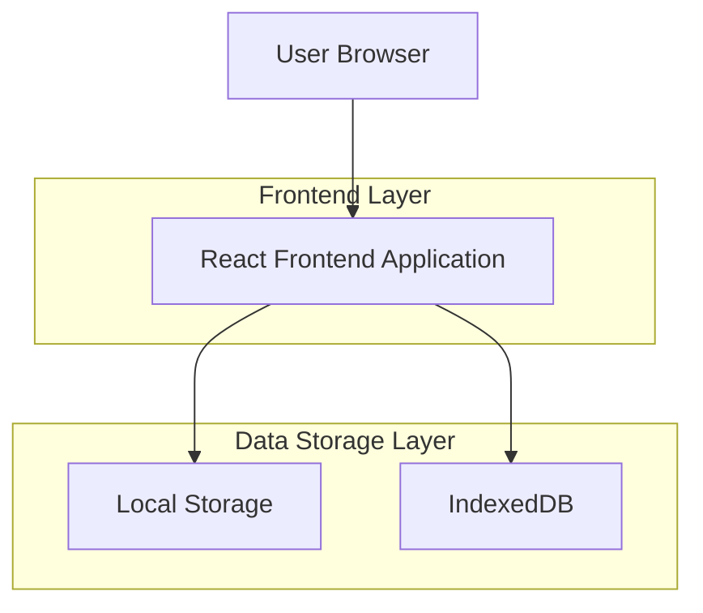
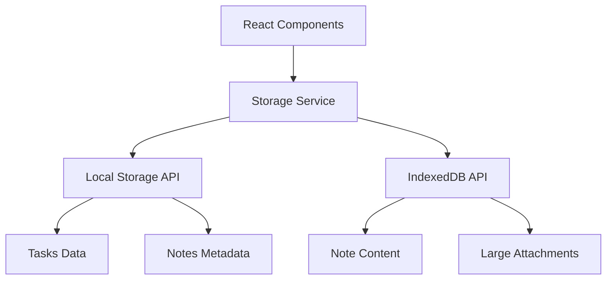
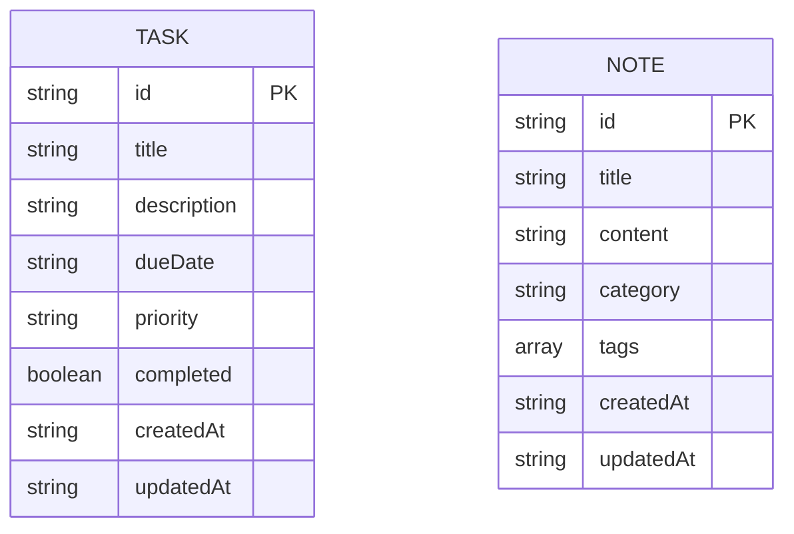

## 1. Architecture design



## 2. Technology Description

- Frontend: React@18 + tailwindcss@3 + vite
- Initialization Tool: vite-init
- Backend: None (client-side only)
- Data Storage: Browser Local Storage + IndexedDB

## 3. Route definitions

| Route | Purpose |
|-------|---------|
| / | Dashboard page, main overview and navigation hub |
| /tasks | Tasks page, manage and organize personal tasks |
| /notes | Notes page, create and manage personal notes |

## 4. API definitions

### 4.1 Core Data Operations

Since this is a single-user application without a backend, all data operations are handled client-side using browser storage APIs.

**Task Management Operations:**
```javascript
// Get all tasks
const getAllTasks = () => {
  const tasks = localStorage.getItem('tasks');
  return tasks ? JSON.parse(tasks) : [];
};

// Create task
const createTask = (taskData) => {
  const tasks = getAllTasks();
  const newTask = {
    id: Date.now().toString(),
    title: taskData.title,
    description: taskData.description,
    dueDate: taskData.dueDate,
    priority: taskData.priority,
    completed: false,
    createdAt: new Date().toISOString()
  };
  tasks.push(newTask);
  localStorage.setItem('tasks', JSON.stringify(tasks));
  return newTask;
};
```

**Note Management Operations:**
```javascript
// Get all notes
const getAllNotes = () => {
  const notes = localStorage.getItem('notes');
  return notes ? JSON.parse(notes) : [];
};

// Create note
const createNote = (noteData) => {
  const notes = getAllNotes();
  const newNote = {
    id: Date.now().toString(),
    title: noteData.title,
    content: noteData.content,
    category: noteData.category,
    tags: noteData.tags || [],
    createdAt: new Date().toISOString(),
    updatedAt: new Date().toISOString()
  };
  notes.push(newNote);
  localStorage.setItem('notes', JSON.stringify(notes));
  return newNote;
};
```

## 5. Data Storage Architecture

The application uses a hybrid storage approach:

- **Local Storage**: Used for small data like tasks, notes metadata, and application settings
- **IndexedDB**: Used for larger content like note bodies and attachments



## 6. Data model

### 6.1 Data model definition



### 6.2 Data Definition Language

Since this is a client-side application, there are no traditional database tables. Instead, data is stored as JSON in browser storage:

**Task Data Structure:**
```javascript
// Example task object
{
  "id": "1234567890",
  "title": "Complete project documentation",
  "description": "Write technical specifications and user guides",
  "dueDate": "2024-01-15",
  "priority": "high",
  "completed": false,
  "createdAt": "2024-01-01T10:00:00Z",
  "updatedAt": "2024-01-10T14:30:00Z"
}
```

**Note Data Structure:**
```javascript
// Example note object
{
  "id": "0987654321",
  "title": "Meeting Notes",
  "content": "Discussed project timeline and deliverables...",
  "category": "work",
  "tags": ["meeting", "planning", "Q1"],
  "createdAt": "2024-01-05T09:00:00Z",
  "updatedAt": "2024-01-05T11:45:00Z"
}
```

**Storage Keys:**
```javascript
// LocalStorage keys
const STORAGE_KEYS = {
  TASKS: 'app_tasks',
  NOTES: 'app_notes',
  SETTINGS: 'app_settings',
  CATEGORIES: 'app_categories'
};
```