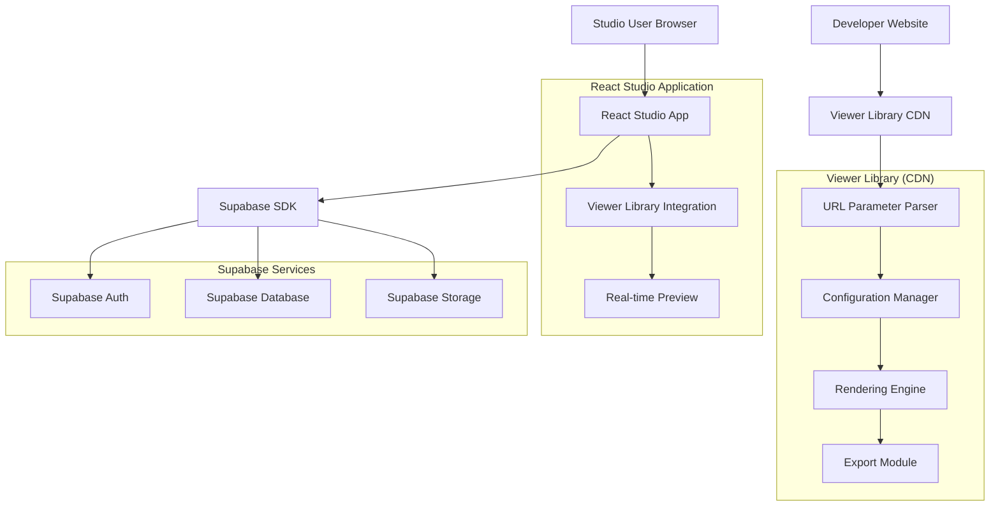
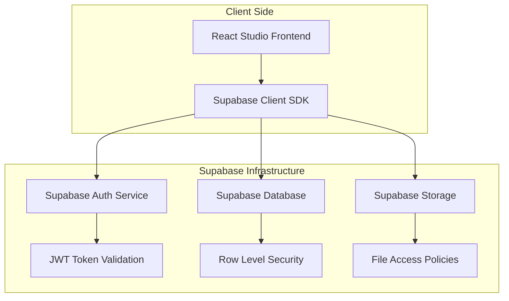
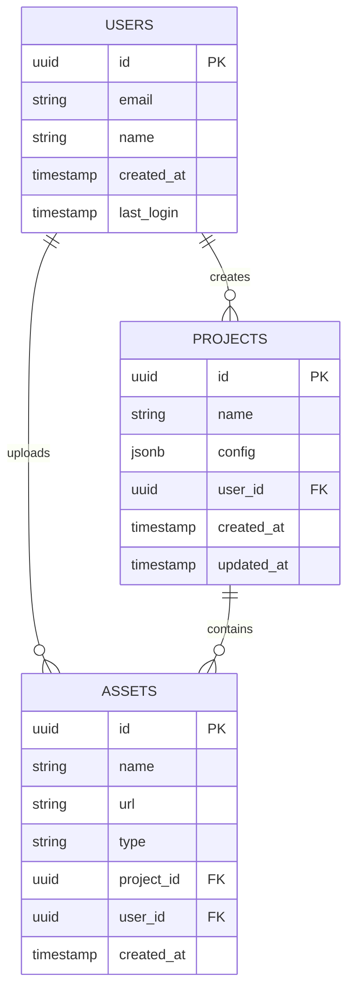

## 1. Architecture design



## 2. Technology Description
- **Viewer Library**: TypeScript@5 + Rollup bundler + ES modules
- **React Studio**: React@18 + Vite + TailwindCSS@3
- **Initialization Tool**: vite-init for studio application
- **Backend**: Supabase (Authentication, PostgreSQL, Storage)
- **Build Tool**: Rollup for library bundling, Vite for studio application

## 3. Route definitions

**React Studio Application Routes:**
| Route | Purpose |
|-------|---------|
| / | Studio dashboard, project overview |
| /login | User authentication page |
| /projects | Project management interface |
| /editor/:projectId | Visual editor for viewer configuration |
| /export/:projectId | Export configuration and embed codes |
| /assets | Asset management interface |

## 4. API definitions

### 4.1 Core API

**Viewer Library API (Browser-based):**
```javascript
// Initialize viewer with configuration
Viewer.init(config: ViewerConfig): Promise<ViewerInstance>

// Export current view
Viewer.export(format: 'png' | 'svg'): Promise<Blob>

// Update configuration
viewer.updateConfig(config: Partial<ViewerConfig>): void

// Event handling
viewer.on(event: string, callback: Function): void
```

**Supabase Database API (via SDK):**

Request:
```typescript
interface Project {
  id: string
  name: string
  config: ViewerConfig
  created_at: string
  updated_at: string
  user_id: string
}

interface Asset {
  id: string
  name: string
  url: string
  type: 'image' | 'font' | 'data'
  project_id: string
  created_at: string
}
```

## 5. Server architecture diagram



## 6. Data model

### 6.1 Data model definition



### 6.2 Data Definition Language

**Users Table**
```sql
CREATE TABLE users (
    id UUID PRIMARY KEY DEFAULT gen_random_uuid(),
    email VARCHAR(255) UNIQUE NOT NULL,
    name VARCHAR(100) NOT NULL,
    created_at TIMESTAMP WITH TIME ZONE DEFAULT NOW(),
    last_login TIMESTAMP WITH TIME ZONE DEFAULT NOW()
);

-- Enable RLS
ALTER TABLE users ENABLE ROW LEVEL SECURITY;

-- Create policies
CREATE POLICY "Users can view own profile" ON users
    FOR SELECT USING (auth.uid() = id);
```

**Projects Table**
```sql
CREATE TABLE projects (
    id UUID PRIMARY KEY DEFAULT gen_random_uuid(),
    name VARCHAR(255) NOT NULL,
    config JSONB NOT NULL DEFAULT '{}',
    user_id UUID NOT NULL REFERENCES users(id) ON DELETE CASCADE,
    created_at TIMESTAMP WITH TIME ZONE DEFAULT NOW(),
    updated_at TIMESTAMP WITH TIME ZONE DEFAULT NOW()
);

-- Enable RLS
ALTER TABLE projects ENABLE ROW LEVEL SECURITY;

-- Create policies
CREATE POLICY "Users can view own projects" ON projects
    FOR SELECT USING (auth.uid() = user_id);

CREATE POLICY "Users can create own projects" ON projects
    FOR INSERT WITH CHECK (auth.uid() = user_id);

CREATE POLICY "Users can update own projects" ON projects
    FOR UPDATE USING (auth.uid() = user_id);

CREATE POLICY "Users can delete own projects" ON projects
    FOR DELETE USING (auth.uid() = user_id);
```

**Assets Table**
```sql
CREATE TABLE assets (
    id UUID PRIMARY KEY DEFAULT gen_random_uuid(),
    name VARCHAR(255) NOT NULL,
    url TEXT NOT NULL,
    type VARCHAR(20) CHECK (type IN ('image', 'font', 'data')),
    project_id UUID REFERENCES projects(id) ON DELETE CASCADE,
    user_id UUID NOT NULL REFERENCES users(id) ON DELETE CASCADE,
    created_at TIMESTAMP WITH TIME ZONE DEFAULT NOW()
);

-- Enable RLS
ALTER TABLE assets ENABLE ROW LEVEL SECURITY;

-- Create policies
CREATE POLICY "Users can view own assets" ON assets
    FOR SELECT USING (auth.uid() = user_id);

CREATE POLICY "Users can create own assets" ON assets
    FOR INSERT WITH CHECK (auth.uid() = user_id);

CREATE POLICY "Users can delete own assets" ON assets
    FOR DELETE USING (auth.uid() = user_id);
```

**Grant Permissions**
```sql
-- Grant basic read access to anon role
GRANT SELECT ON users TO anon;
GRANT SELECT ON projects TO anon;
GRANT SELECT ON assets TO anon;

-- Grant full access to authenticated role
GRANT ALL PRIVILEGES ON users TO authenticated;
GRANT ALL PRIVILEGES ON projects TO authenticated;
GRANT ALL PRIVILEGES ON assets TO authenticated;
```

## 7. Viewer Library Configuration Schema

```typescript
interface ViewerConfig {
  // Display settings
  width?: number
  height?: number
  backgroundColor?: string
  
  // Content settings
  content?: {
    type: 'image' | 'text' | 'custom'
    data: string | object
  }
  
  // Interaction settings
  enableZoom?: boolean
  enablePan?: boolean
  enableExport?: boolean
  
  // Export settings
  exportFormat?: 'png' | 'svg' | 'both'
  exportQuality?: number // 0-1
  
  // Styling
  theme?: 'light' | 'dark' | 'custom'
  customStyles?: Record<string, string>
}
```