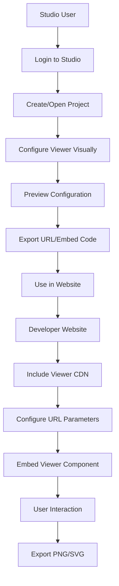

## 1. Product Overview
A TypeScript CDN library that provides an embeddable viewer component with URL parameter configuration and PNG/SVG export capabilities. The library allows developers to easily integrate interactive viewing experiences into their websites with minimal setup.

A separate React Studio application that consumes the viewer library to provide a visual editing environment for creating and configuring viewer instances.

## 2. Core Features

### 2.1 User Roles
| Role | Registration Method | Core Permissions |
|------|---------------------|------------------|
| Developer | No registration required | Embed viewer, configure via URL params |
| Studio User | Email registration | Create projects, export configurations, manage assets |

### 2.2 Feature Module
The viewer library and studio application consist of the following main components:

**Viewer Library (viewer/):**
1. **Core Viewer**: Main rendering engine with URL parameter parsing
2. **Export Module**: PNG/SVG generation and download functionality
3. **Configuration Manager**: URL parameter validation and processing
4. **Event System**: User interaction handling and callbacks

**React Studio (local-studio/):**
1. **Project Dashboard**: Project creation and management interface
2. **Visual Editor**: Drag-and-drop configuration of viewer settings
3. **Export Center**: Generate embed codes and configuration URLs
4. **Asset Manager**: Upload and organize viewer assets

### 2.3 Page Details
| Page Name | Module Name | Feature description |
|-----------|-------------|---------------------|
| Viewer Component | URL Parameter Parser | Parse and validate configuration from URL query parameters |
| Viewer Component | Rendering Engine | Display content based on parsed configuration |
| Viewer Component | Export Controls | Generate PNG/SVG files from current view state |
| Viewer Component | Event Handlers | Capture user interactions and trigger callbacks |
| Studio Dashboard | Project List | Display all user projects with thumbnails and metadata |
| Studio Dashboard | New Project | Create new viewer configuration projects |
| Visual Editor | Canvas Area | Real-time preview of viewer configuration |
| Visual Editor | Property Panel | Adjust viewer settings with form controls |
| Visual Editor | Toolbar | Access common actions like save, preview, export |
| Export Center | Embed Code Generator | Create HTML embed codes with configuration URLs |
| Export Center | URL Builder | Generate shareable URLs with viewer parameters |
| Asset Manager | File Upload | Upload images, fonts, and other viewer assets |
| Asset Manager | Asset Library | Browse and select previously uploaded assets |

## 3. Core Process

**Developer Flow:**
1. Include viewer library CDN script in HTML
2. Configure viewer using URL parameters
3. Embed viewer in desired location
4. Handle user interactions via callbacks
5. Export current view as PNG/SVG when needed

**Studio User Flow:**
1. Login to React Studio application
2. Create new project or open existing one
3. Configure viewer settings visually
4. Preview configuration in real-time
5. Export configuration as URL parameters or embed code
6. Manage and organize viewer assets

## 4. User Interface Design

### 4.1 Design Style
- **Primary Colors**: #2563eb (blue), #1e40af (dark blue)
- **Secondary Colors**: #f3f4f6 (light gray), #6b7280 (medium gray)
- **Button Style**: Rounded corners (8px radius), subtle shadows on hover
- **Font**: Inter font family, 14px base size, 16px for headings
- **Layout**: Card-based design with consistent spacing (16px grid)
- **Icons**: Feather icons for consistency and modern appearance

### 4.2 Page Design Overview
| Page Name | Module Name | UI Elements |
|-----------|-------------|-------------|
| Viewer Component | Main Canvas | Responsive container with configurable aspect ratio, border radius 8px, subtle shadow |
| Viewer Component | Export Button | Floating action button in bottom-right corner, icon-based with tooltip |
| Studio Dashboard | Project Grid | 3-column responsive grid, card shadows on hover, project thumbnails |
| Visual Editor | Split Layout | 70% canvas area, 30% properties panel, resizable divider |
| Visual Editor | Toolbar | Top bar with grouped action buttons, consistent spacing |
| Export Center | Code Preview | Syntax-highlighted embed code with copy button |
| Asset Manager | File Grid | Thumbnail previews, drag-and-drop upload zone |

### 4.3 Responsiveness
- Desktop-first design approach
- Viewer component: Fully responsive with configurable breakpoints
- Studio application: Minimum width 1024px for optimal editing experience
- Touch interaction support for viewer component on mobile devices