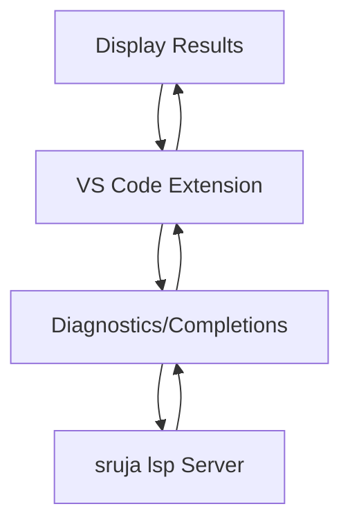

## 1. Product Overview
A VS Code extension that provides comprehensive language support for Sruja DSL, enabling developers to write, validate, and navigate Sruja code efficiently through intelligent autocomplete, real-time diagnostics, formatting, and code navigation features.

This extension bridges the gap between Sruja DSL developers and modern IDE capabilities, making DSL development more productive and error-free by integrating with the existing `sruja lsp` language server.

## 2. Core Features

### 2.1 User Roles
| Role | Registration Method | Core Permissions |
|------|---------------------|------------------|
| DSL Developer | VS Code marketplace installation | Full access to all language features |

### 2.2 Feature Module
The VS Code extension provides the following essential language support features:
1. **Auto Complete**: Context-aware code suggestions for Sruja DSL syntax
2. **Lint/Diagnostics**: Real-time error detection and warning highlighting
3. **Formatter**: Automatic code formatting with configurable style preferences
4. **Hover Information**: Quick documentation and type information on hover
5. **Go to Definition**: Navigate to symbol definitions across files
6. **Find References**: Search for all usages of symbols in the codebase

### 2.3 Page Details
| Page Name | Module Name | Feature description |
|-----------|-------------|---------------------|
| Extension Activation | Auto-activation | Automatically activate when opening .sruja files |
| Language Features | Auto Complete | Provide intelligent code suggestions based on context |
| Language Features | Diagnostics | Display errors and warnings with inline highlighting |
| Language Features | Formatting | Format entire documents or selected code blocks |
| Language Features | Hover Provider | Show documentation and type info on mouse hover |
| Language Features | Definition Provider | Navigate to symbol definitions with F12 or Ctrl+Click |
| Language Features | Reference Provider | Find all references to symbols across the project |
| Configuration | Settings | Configure LSP server path and formatting preferences |
| Status Bar | Connection Status | Show LSP server connection status and health |

## 3. Core Process

### Developer Workflow
1. Install extension from VS Code marketplace
2. Open any .sruja file to activate the extension
3. Extension automatically starts the `sruja lsp` language server
4. Begin coding with real-time language support features
5. Use keyboard shortcuts for navigation and formatting

### Extension-LSP Communication Flow

## 4. User Interface Design

### 4.1 Design Style
- **Primary Colors**: VS Code default theme integration
- **Button Style**: Native VS Code command palette and context menus
- **Font**: Inherits VS Code editor font settings
- **Layout Style**: Integrated into VS Code's native UI panels and status bar
- **Icon Style**: VS Code icon theme consistency

### 4.2 Page Design Overview
| Page Name | Module Name | UI Elements |
|-----------|-------------|-------------|
| Editor | Auto Complete | Native VS Code suggestion widget with syntax highlighting |
| Editor | Diagnostics | Squiggly underlines with hover tooltips for errors/warnings |
| Editor | Formatting | Right-click context menu and keyboard shortcut integration |
| Editor | Hover Info | Native VS Code hover popup with markdown documentation |
| Editor | Go to Definition | Peek definition popup or direct navigation |
| Status Bar | Connection Status | Color-coded status indicator (green=connected, red=disconnected) |

### 4.3 Responsiveness
- **Platform**: Desktop-first design for VS Code desktop application
- **Integration**: Native VS Code UI components ensure consistent experience
- **Touch**: Not applicable - keyboard and mouse interaction optimized