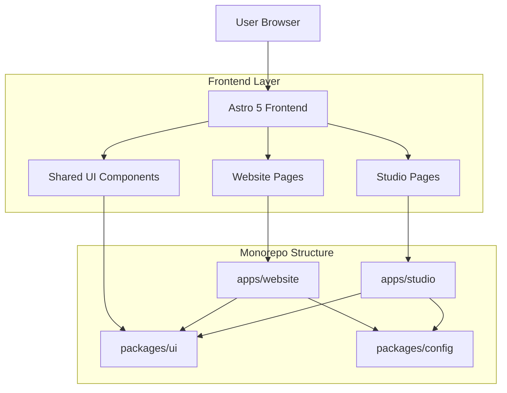
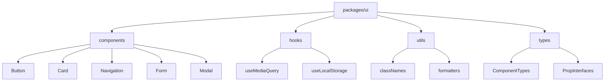

## 1. Architecture Design



## 2. Technology Description

- **Frontend Framework**: Astro 5 with React 19 integration
- **Build Tool**: Vite 7 (built into Astro 5)
- **Styling**: Tailwind CSS 4
- **Package Manager**: pnpm (for monorepo management)
- **Monorepo Tool**: pnpm workspaces
- **UI Components**: React 19 components with TypeScript
- **Initialization Tool**: create-astro

## 3. Route Definitions

| Route | Purpose |
|-------|---------|
| / | Website homepage with hero section and navigation |
| /about | Company information and team details |
| /contact | Contact form and company details |
| /blog | Blog posts listing page |
| /blog/[slug] | Individual blog post page |
| /studio | Studio dashboard and login |
| /studio/dashboard | Content management overview |
| /studio/editor | Content creation and editing interface |
| /studio/media | Media library management |

## 4. Monorepo Structure

### 4.1 Package Structure
```
website2/
├── apps/
│   ├── website/          # Marketing website Astro app
│   └── studio/           # Studio management Astro app
├── packages/
│   ├── ui/               # Shared React components
│   ├── config/           # Shared configuration
│   └── utils/            # Shared utilities
├── pnpm-workspace.yaml   # pnpm workspaces configuration
└── package.json          # Root package configuration
```

### 4.2 Package Dependencies
- **apps/website**: Astro 5, React 19, Tailwind 4, @website2/ui, @website2/config
- **apps/studio**: Astro 5, React 19, Tailwind 4, @website2/ui, @website2/config
- **packages/ui**: React 19, Tailwind 4, TypeScript
- **packages/config**: TypeScript, ESLint, Prettier configurations

## 5. Shared Components Architecture

### 5.1 UI Components Structure


### 5.2 Component Examples
**Button Component**
```typescript
interface ButtonProps {
  variant?: 'primary' | 'secondary' | 'outline'
  size?: 'sm' | 'md' | 'lg'
  children: React.ReactNode
  onClick?: () => void
  disabled?: boolean
}

export const Button: React.FC<ButtonProps> = ({ 
  variant = 'primary', 
  size = 'md', 
  children, 
  ...props 
}) => {
  // Component implementation
}
```

## 6. Build Configuration

### 6.1 Astro Configuration
```javascript
// astro.config.mjs
export default defineConfig({
  integrations: [
    react(),
    tailwind({
      applyBaseStyles: false,
    }),
  ],
  vite: {
    resolve: {
      alias: {
        '@website2/ui': path.resolve(__dirname, '../../packages/ui/src'),
        '@website2/config': path.resolve(__dirname, '../../packages/config/src'),
      },
    },
  },
})
```

### 6.2 TypeScript Configuration
- Shared TypeScript configuration in `