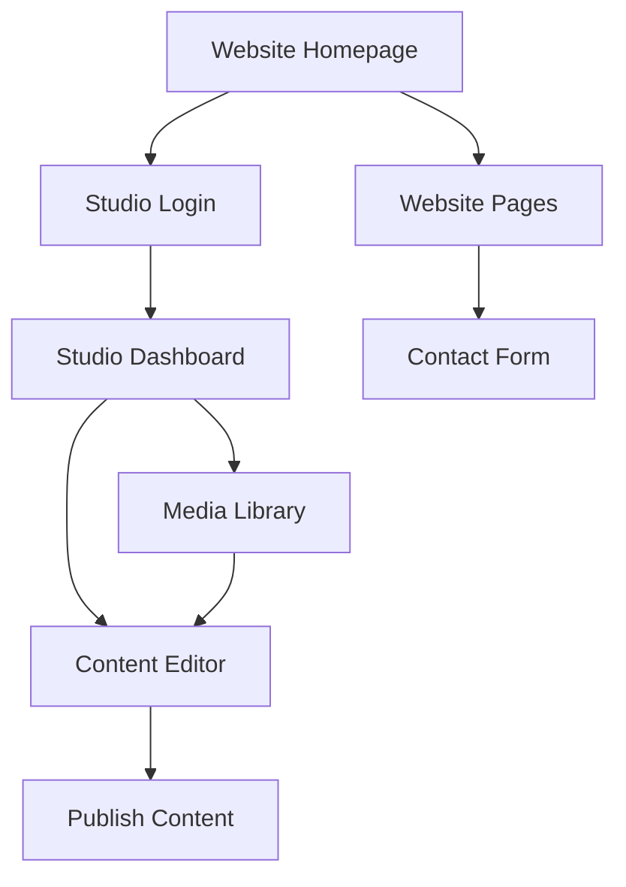

## 1. Product Overview
Website2 is a unified platform combining a marketing website and content management studio. It provides a seamless experience for visitors browsing the website and content creators managing their digital assets through an integrated studio interface.

The platform solves the problem of maintaining separate website and studio applications by offering a single codebase with shared UI components, reducing development overhead and ensuring design consistency across both interfaces.

## 2. Core Features

### 2.1 User Roles
| Role | Registration Method | Core Permissions |
|------|---------------------|------------------|
| Website Visitor | No registration required | Browse website content, view pages |
| Content Creator | Email registration | Access studio dashboard, create/edit content |
| Admin | Admin invitation | Full system access, user management |

### 2.2 Feature Module
The website2 platform consists of the following main sections:

1. **Website Section**: Homepage, about pages, contact forms, blog/articles display
2. **Studio Section**: Content management dashboard, editor interface, media library
3. **Shared Components**: Navigation, buttons, forms, cards, modals used across both sections

### 2.3 Page Details
| Page Name | Module Name | Feature description |
|-----------|-------------|---------------------|
| Website Homepage | Hero Section | Display hero banner with call-to-action buttons, feature highlights |
| Website Homepage | Navigation | Responsive navigation bar with links to website and studio sections |
| Website About | Content Display | Show company information, team members, mission statement |
| Website Contact | Contact Form | Form with name, email, message fields and submission handling |
| Studio Dashboard | Content Overview | Display content statistics, recent activities, quick actions |
| Studio Editor | Content Editor | Rich text editor with formatting options, media insertion |
| Studio Media Library | Media Management | Upload, organize, and select images/videos for content |
| Shared Navigation | User Menu | Login/logout functionality, user profile access |
| Shared Components | UI Library | Reusable buttons, cards, forms, modals with consistent styling |

## 3. Core Process
**Visitor Flow**: Homepage → Browse content pages → Contact form submission
**Content Creator Flow**: Login → Studio dashboard → Create/edit content → Publish
**Admin Flow**: Login → Full system access → User management → System configuration

## 4. User Interface Design

### 4.1 Design Style
- **Primary Colors**: Modern blue (#3B82F6) for primary actions, gray (#6B7280) for secondary
- **Secondary Colors**: White backgrounds, dark gray (#1F2937) for text
- **Button Style**: Rounded corners (8px radius), subtle shadows on hover
- **Font**: System fonts with fallback to sans-serif, 16px base size
- **Layout**: Card-based design with consistent spacing (8px grid system)
- **Icons**: Minimalist line icons, consistent stroke width

### 4.2 Page Design Overview
| Page Name | Module Name | UI Elements |
|-----------|-------------|-------------|
| Website Homepage | Hero Section | Full-width banner with gradient overlay, centered headline text, primary CTA button |
| Website Navigation | Header | Sticky navigation bar, logo left-aligned, menu items centered, user menu right-aligned |
| Studio Dashboard | Stats Cards | Grid layout of metric cards, subtle borders, hover effects |
| Studio Editor | Editor Interface | Split pane layout with sidebar for tools, main area for content editing |
| Shared Components | Buttons | Consistent padding (12px 24px), hover states, disabled states |
| Shared Components | Forms | Clean input fields with focus states, proper labels, error handling |

### 4.3 Responsiveness
Desktop-first design approach with mobile adaptation. Breakpoints at 768px (tablet) and 1024px (desktop). Touch interaction optimization for mobile devices with larger tap targets and swipe gestures where appropriate.