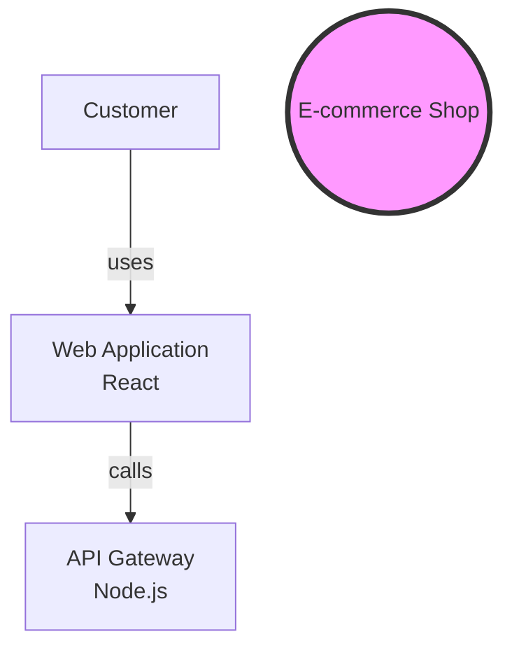

# Sruja 2.0: Complete Strategy & Implementation Plan

**Version:** 1.0  
**Date:** 2025-01-07  
**Status:** Approved  
**Repository:** `sruja-ai/sruja-next`

---

## Table of Contents

1. [Executive Summary](#executive-summary)
2. [Problem Statement](#problem-statement)
3. [Lessons Learned from v1](#lessons-learned-from-v1)
4. [Strategic Pivot](#strategic-pivot)
5. [Product Vision](#product-vision)
6. [Core Principles](#core-principles)
7. [Technical Specification](#technical-specification)
8. [Implementation Plan](#implementation-plan)
9. [Risk Assessment](#risk-assessment)
10. [Success Metrics](#success-metrics)
11. [Distribution & Installation](#distribution--installation)
12. [Testing Strategy](#testing-strategy)
13. [Repository Structure](#repository-structure)
14. [Mistakes to Avoid](#mistakes-to-avoid)
15. [Immediate Next Steps](#immediate-next-steps)
16. [Appendix](#appendix)
    - [E. Complete GitHub Actions Workflows](#e-complete-github-actions-workflows)
    - [F. Code Examples](#f-code-examples)
    - [G. Dependency Specifications](#g-dependency-specifications)
    - [H. Branching Strategy & Git Workflow](#h-branching-strategy--git-workflow)
    - [I. Launch Checklist](#i-launch-checklist)
    - [J. Code Style Guidelines](#j-code-style-guidelines)

---

## Executive Summary

### What is Sruja 2.0?

Sruja 2.0 is a complete rewrite of the architecture documentation tool with a laser focus on **product value and simplicity**.

**Key Changes from v1:**
- ✅ Simplified DSL (elements, relationships, links only)
- ✅ No visual editor (text-based, like code)
- ✅ Mermaid for rendering (no custom engines)
- ✅ Git as backend (no database)
- ✅ Change tracking as core value (diff, blame)
- ✅ SDLC integration (GitHub Actions, Git hooks)
- ✅ Traceability (link elements to ADRs, issues, PRs)

### One Thing Sruja Does Well

> **Track architectural changes over time and validate them in your PRs.**

Everything else supports this core value.

### Timeline

- **Total Duration:** 12 weeks
- **MVP Launch:** Week 12
- **Target Users:** Developers, Tech Leads, Architects

---

## Problem Statement

### What's Wrong with v1?

#### Complexity Overload

**Symptoms:**
- DSL became too complex (SLOs, flows, policies, deployments, requirements)
- Bidirectional sync (visual ↔ code) is a nightmare to implement
- Custom diagram rendering engines are endless work
- Visual editor took disproportionate effort

**Root Cause:**
- Feature creep (adding everything users *might* need)
- Over-indexing on diagram perfection (very hard problem)
- Trying to serve too many user segments (developers, designers, PMs)
- Lack of focus on core value

#### Value Misalignment

**What v1 Built:**
- Beautiful diagrams
- Visual editor for non-technical users
- Bidirectional sync
- Custom rendering engines
- Complex DSL with 20+ features

**What Users Actually Need:**
- Track changes to architecture over time
- Validate architecture in PRs (like tests)
- Link decisions to elements (why did we build this?)
- Simple tooling that fits into their workflow
- Living architecture, not static documentation

#### Technical Debt

**Symptoms:**
- Codebase too complex to maintain
- Difficult to add new features
- Performance issues on large architectures
- Hard to reason about the system
- No clear source of truth (DSL? Visual? Database?)

**Root Cause:**
- Built too much, too fast
- No clear architectural boundaries
- Over-optimized for visual editing
- Didn't prioritize simplicity

---

## Lessons Learned from v1

### 1. Complexity Creep is Real

**Lesson:** Every feature adds complexity exponentially.

**Example:**
- Adding "requirements" to DSL → need parser, validator, renderer, UI, tests
- Adding "bidirectional sync" → conflict resolution, merge logic, real-time sync
- Adding "visual editor" → drag-and-drop, canvas, state management, performance

**Takeaway:** Less is more. Build the smallest thing that delivers core value.

### 2. Diagram Perfection is a Trap

**Lesson:** Making diagrams perfect is endless work.

**Reality:**
- Users don't need perfect layouts
- Mermaid is good enough for 90% of use cases
- Custom rendering engines are maintenance nightmares
- Visual polish is secondary to functionality

**Takeaway:** Use standard tools. Don't reinvent the wheel.

### 3. Bidirectional Sync is Overrated

**Lesson:** Bidirectional sync (visual ↔ code) is complex and rarely needed.

**Why:**
- Developers prefer editing text (DSL is code)
- Non-technical users can view Mermaid diagrams
- Git handles version control
- Sync conflicts are hard to resolve

**Takeaway:** DSL is source of truth. Export to visual formats (one-way).

### 4. Database is Unnecessary

**Lesson:** Git is the best backend for architecture.

**Why:**
- Git handles version control, branching, merging
- Architecture should live with code
- No separate data store to maintain
- Users already know Git

**Takeaway:** Git as backend, `.sruja` files in repo.

### 5. Visual Editor is Not Essential

**Lesson:** Most users are developers who can edit text.

**Evidence:**
- Terraform (no visual editor) - widely used
- Kubernetes YAML (no visual editor) - widely used
- Docker Compose (no visual editor) - widely used

**Takeaway:** Text-based DSL is fine. Visual editor is nice-to-have.

### 6. Focus on Core Value

**Lesson:** What's the ONE thing Sruja does better than anything else?

**v1 Attempted:**
- Diagrams
- Visual editing
- Bidirectional sync
- Documentation generation
- Validation
- Exporting

**v2 Focus:**
- Track architectural changes over time

**Takeaway:** Do one thing extremely well.

---

## Strategic Pivot

### From "Architecture Diagramming Tool" to "Architecture Management for SDLC"

#### Before (v1)

**Positioning:** "Visual architecture editor with live code sync"

**Product:**
- Visual editor for non-technical users
- Bidirectional sync between visual and code
- Custom diagram rendering
- Complex DSL with many features

**Target Users:**
- Developers
- Architects
- Product Managers
- Designers
- Non-technical stakeholders

#### After (v2)

**Positioning:** "Architecture that lives with your code"

**Product:**
- Text-based DSL (like code)
- Change tracking (diff, blame)
- Validation in PRs
- Traceability (links to ADRs, issues, PRs)
- SDLC integration (GitHub Actions, Git hooks)

**Target Users:**
- Developers (primary)
- Tech Leads
- Architects

**Non-technical users:** Can view Mermaid diagrams, but don't edit architecture.

### Why This Pivot?

1. **Alignment with Developer Workflow**
   - Architecture lives in Git (like code)
   - Validated in PRs (like tests)
   - No new tools to learn (CLI + Git)

2. **Simpler to Build**
   - No visual editor
   - No bidirectional sync
   - No custom rendering (use Mermaid)
   - No database (Git is backend)

3. **Clear Value Proposition**
   - Track changes (diff, blame)
   - Validate (PR checks)
   - Trace (link decisions)

4. **Sustainable Development**
   - Small, focused codebase
   - Clear boundaries
   - Easy to maintain
   - Easy to extend

---

## Product Vision

### Vision Statement

> **"Make your architecture living, accountable, and aligned — integrated into your SDLC, not a separate document."**

### Core Value Proposition

**Sruja is NOT:**
- ❌ Another diagramming tool (Draw.io, Miro)
- ❌ A visual editor with perfect diagrams
- ❌ A complex DSL for everything
- ❌ A separate system from your code

**Sruja IS:**
- ✅ Architecture that lives in your Git repo (version-controlled)
- ✅ Every architectural change is tracked and reasoned (diff + blame)
- ✅ Architecture validated in PRs (like tests)
- ✅ Business requirements linked to technical decisions (traceability)
- ✅ Simple CLI that fits into your workflow

### The "Why" Behind Sruja 2.0

#### Problem 1: Architecture Documentation Becomes Stale

**Symptom:**
- Architecture diagrams in Confluence/Google Docs
- Not updated regularly
- Out of sync with actual code

**Sruja Solution:**
- Architecture lives in Git (with code)
- Auto-validated in PRs
- Always in sync

#### Problem 2: No History of Architectural Decisions

**Symptom:**
- "Who changed this architecture and why?"
- "When did we add this service?"
- "Why did we choose this technology?"

**Sruja Solution:**
- `sruja diff <ref>` - See changes
- `sruja blame <element>` - See history
- Links to ADRs, issues, PRs

#### Problem 3: No Validation

**Symptom:**
- Architectural rules are not enforced
- Inconsistent naming, structure
- Violations slip into production

**Sruja Solution:**
- `sruja validate` - Check for errors
- GitHub Action - Validate in PRs
- Pre-commit hooks - Catch errors early

#### Problem 4: Business-Tech Misalignment

**Symptom:**
- Business requirements not linked to architecture
- Technical decisions not explained to stakeholders
- Impact of changes unclear

**Sruja Solution:**
- Links to requirements, ADRs, issues, PRs
- `sruja trace <element>` - See linked items
- `sruja impact <element>` - See what's affected

### Key Goals

1. **Living Architecture** - Architecture evolves with code, never becomes stale
2. **Accountability** - Every change has a reason (ADR, PR, issue)
3. **Alignment** - Business and tech speak the same language
4. **Integration** - Works in your existing workflow (Git, PRs, CI/CD)
5. **Simplicity** - Easy to learn, use, and maintain

---

## Core Principles

### 1. DSL is Source of Truth

**Principle:** Architecture defined in code, version-controlled in Git.

**Implementation:**
- `.sruja` files in Git repo
- One-way export (DSL → visual)
- No bidirectional sync
- Git handles version control, branching, merging

**Anti-Patterns to Avoid:**
- ❌ Database as source of truth
- ❌ Visual editor as primary interface
- ❌ Real-time sync
- ❌ Separate backend service

### 2. Use Standard Tools

**Principle:** Don't reinvent the wheel. Use battle-tested tools.

**Implementation:**
- Mermaid for diagrams (not custom rendering)
- Git for version control (not database)
- Pest for parsing (not hand-written parser)
- Clap for CLI (not custom arg parsing)

**Anti-Patterns to Avoid:**
- ❌ Custom diagram rendering engines
- ❌ Hand-written parsers
- ❌ Database for storage
- ❌ Real-time collaboration (WebSocket)

### 3. Trace Everything

**Principle:** Every decision has context and can be traced.

**Implementation:**
- Elements link to ADRs, requirements, issues, PRs
- `sruja trace <element>` - Show all linked items
- `sruja blame <element>` - Show who changed and why
- Git history provides full timeline

**Anti-Patterns to Avoid:**
- ❌ Orphaned changes (no reason/context)
- ❌ Unexplained decisions
- ❌ Lost history

### 4. Fail Fast

**Principle:** Validate early and often. Catch errors before they propagate.

**Implementation:**
- Pre-commit hooks (catch locally)
- CI/CD checks (catch in PRs)
- Clear error messages with fix suggestions
- `sruja validate --strict` (treat warnings as errors)

**Anti-Patterns to Avoid:**
- ❌ Silent failures
- ❌ Cryptic error messages
- ❌ Late validation (after merge)

### 5. Business Aligned

**Principle:** Non-technical stakeholders can understand architecture.

**Implementation:**
- Simplified Mermaid diagrams
- High-level views (system context, containers)
- Links to business requirements
- Documentation generation

**Anti-Patterns to Avoid:**
- ❌ Technical jargon
- ❌ Over-detailed diagrams
- ❌ No business context

### 6. Simplicity First

**Principle:** Build the smallest thing that delivers value.

**Implementation:**
- Minimal DSL (elements, relationships, links)
- No features unless they support core value
- Optimize for common cases (80/20 rule)
- Document edge cases, don't build them

**Anti-Patterns to Avoid:**
- ❌ Feature creep
- ❌ Premature optimization
- ❌ Building for hypothetical users

---

## Technical Specification

### System Architecture

```
┌─────────────────────────────────────────────────────────────────┐
│                        Sruja CLI (User Interface)                 │
│                                                                   │
│  Commands: init, validate, diff, blame, trace, export, report     │
│                                                                   │
└───────────────────────────┬───────────────────────────────────────┘
                            │
                            ▼
┌─────────────────────────────────────────────────────────────────┐
│                         Core Library                             │
│                                                                   │
│  ┌──────────────┐  ┌──────────────┐  ┌──────────────┐         │
│  │   Parser     │  │  Validator   │  │   Diff       │         │
│  │  (Pest)      │  │              │  │              │         │
│  └──────┬───────┘  └──────┬───────┘  └──────┬───────┘         │
│         │                  │                  │                 │
│         └──────────────────┴──────────────────┘                 │
│                            │                                     │
│                            ▼                                     │
│  ┌───────────────────────────────────────────────┐            │
│  │            Model (AST)                        │            │
│  │  ┌──────────────┐  ┌──────────────┐          │            │
│  │  │  Elements    │  │Relationships  │          │            │
│  │  │  (person,    │  │              │          │            │
│  │  │   system,    │  │  A → B "uses"│          │            │
│  │  │   container) │  │              │          │            │
│  │  └──────────────┘  └──────────────┘          │            │
│  │  ┌──────────────┐                           │            │
│  │  │  Links       │                           │            │
│  │  │  (ADR,       │                           │            │
│  │  │   issue, PR) │                           │            │
│  │  └──────────────┘                           │            │
│  └───────────────────────────────────────────────┘            │
│                                                                   │
│  ┌──────────────┐  ┌──────────────┐  ┌──────────────┐         │
│  │  Exporters   │  │   Trace      │  │    Git       │         │
│  │  (Mermaid,   │  │              │  │Integration   │         │
│  │   Markdown,  │  │              │  │ (libgit2)    │         │
│  │   JSON)      │  │              │  │              │         │
│  └──────────────┘  └──────────────┘  └──────────────┘         │
│                                                                   │
└───────────────────────────┬───────────────────────────────────────┘
                            │
                            ▼
┌─────────────────────────────────────────────────────────────────┐
│                   Git Repository (.sruja files)                   │
│                                                                   │
│  architecture.sruja                                              │
│  docs/adr/                                                       │
│  docs/requirements/                                              │
│  .github/workflows/architecture-check.yml                       │
│                                                                   │
└─────────────────────────────────────────────────────────────────┘
```

### DSL Specification (MVP)

#### Grammar

```ebnf
<file> ::= <import>* <element>* <relationship>*

<import> ::= 'import' '{' <identifier> (',' <identifier>)* '}' 'from' <string>

<element> ::= <person_decl> | <system_decl> | <container_decl>

<person_decl> ::= <id> '=' 'person' <string> '{'? <element_body>? '}'?

<system_decl> ::= <id> '=' 'system' <string> '{'? <element_body>? '}'

<container_decl> ::= <id> '=' 'container' <string> ('{' <element_body> '}')?

<element_body> ::= 
    'description' <string>
  | 'technology' <string>
  | <element>   // nested containers
  | 'links' '{' <link>+ '}'

<link> ::= 
    'adr' <string>
  | 'issue' <string>
  | 'pr' <string>

<relationship> ::= <id> '->' <id> <string>
```

#### Example

```sruja
// Import standard kinds
import { * } from 'sruja.ai/stdlib'

// ============ Elements ============

Customer = person "Customer"

Shop = system "E-commerce Shop" {
  WebApp = container "Web Application" {
    technology "React"
    description "Customer-facing web app"
    
    links {
      adr "docs/adr/005-microservices.md"
      issue "https://github.com/org/repo/issues/123"
    }
  }
  
  API = container "API Gateway" {
    technology "Node.js"
  }
}

// ============ Relationships ============

Customer -> Shop.WebApp "uses"
Shop.WebApp -> Shop.API "calls"
```

#### Key Features

- **Flat Syntax:** All declarations at top level (except nesting in containers)
- **Minimal Keywords:** person, system, container, links, import
- **Standard Kinds:** person, system, container (can import from stdlib)
- **Links:** ADRs, issues, PRs (requirements as external files)
- **No Complexity:** No SLOs, flows, policies, deployments, scale blocks

#### What's NOT in MVP

- ❌ Requirements in DSL (keep as external markdown)
- ❌ SLOs, policies, flows, deployments
- ❌ Complex metadata
- ❌ Scale blocks
- ❌ Multiple diagram styles
- ❌ Views (optional, can add later)

### Core Engines

#### 1. Parser

**Technology:** Rust + Pest

**Responsibility:** Parse DSL text to AST

**Input:** `.sruja` file content

**Output:** AST (Abstract Syntax Tree)

```rust
pub struct Model {
    pub elements: HashMap<ElementId, Element>,
    pub relationships: Vec<Relationship>,
}

pub enum Element {
    Person { name: String, description: Option<String> },
    System { name: String, description: Option<String>, containers: Vec<Element> },
    Container { name: String, technology: Option<String>, description: Option<String>, links: Vec<Link> },
}

pub struct Relationship {
    pub from: ElementId,
    pub to: ElementId,
    pub label: String,
}

pub enum Link {
    Adr { path: String },
    Issue { url: String },
    Pr { url: String },
}
```

**Performance Targets:**
- Parse 100 elements: <10ms
- Parse 1000 elements: <100ms

#### 2. Validator

**Technology:** Rust

**Responsibility:** Check syntax, semantics, references

**Validations:**
- **Syntax:** Correct DSL syntax (handled by Pest)
- **Semantics:** Valid element types, required fields
- **References:** All relationships reference existing elements
- **Uniqueness:** No duplicate element IDs
- **Orphans:** Warning for elements with no relationships

**Error Handling:**

```
❌ Error: Unknown element type in architecture.sruja:10:1
  |
10 |   Microservice = microservice "Cache"
  |   ^^^^^^^^^^^^^^^^^^^^^^^ "microservice" is not a valid kind

💡 Valid kinds: person, system, container

💡 Fix: Use a valid kind or import from stdlib
```

```
❌ Error: Reference not found in architecture.sruja:15:15
  |
15 |   Customer -> UnknownService "uses"
  |               ^^^^^^^^^^^^^^ Element "UnknownService" does not exist

💡 Available elements: Customer, Shop, WebApp, API

💡 Fix: Check spelling or define "UnknownService"
```

#### 3. Diff Engine

**Technology:** Rust

**Responsibility:** Compare two architecture versions

**Algorithm:**
1. Parse both versions
2. Identify added elements
3. Identify deleted elements
4. Identify modified elements (name, technology, description, links)
5. Identify added/removed relationships

**Output:** Structured diff (can be formatted as Markdown, JSON, etc.)

```rust
pub struct Diff {
    pub added_elements: Vec<ElementId>,
    pub deleted_elements: Vec<ElementId>,
    pub modified_elements: Vec<ElementChange>,
    pub added_relationships: Vec<Relationship>,
    pub removed_relationships: Vec<Relationship>,
}

pub struct ElementChange {
    pub id: ElementId,
    pub changes: Vec<Change>,
}

pub enum Change {
    NameChanged { old: String, new: String },
    TechnologyChanged { old: Option<String>, new: Option<String> },
    DescriptionChanged { old: Option<String>, new: Option<String> },
    LinksAdded { links: Vec<Link> },
    LinksRemoved { links: Vec<Link> },
}
```

**Example Output:**

```markdown
# Architecture Changes

## Elements Added
- `Shop.Database` - PostgreSQL database

## Elements Deleted
- `Shop.Cache` - Redis cache

## Elements Modified
- `Shop.API`
  - Technology: `Node.js` → `Go`
  - Added link: ADR docs/adr/010-rewrite-api.md

## Relationships Added
- `Shop.API` → `Shop.Database` "reads/writes"

## Relationships Removed
- `Shop.API` → `Shop.Cache` "caches"
```

#### 4. Exporters

**Technology:** Rust

**Responsibility:** Convert model to various formats

#### Mermaid Exporter



#### Markdown Exporter

```markdown
# Architecture: E-commerce Shop

## Overview

This document describes the architecture of the e-commerce shop system.

## System Context

### External Actors

#### Customer
End user of the e-commerce platform

### Systems

#### E-commerce Shop
Main e-commerce platform

### Relationships

- Customer → E-commerce Shop

## Containers

#### Web Application
- **Technology:** React
- **Description:** Customer-facing web app

#### API Gateway
- **Technology:** Node.js

### Relationships

- Web Application → API Gateway

## Traceability

### Linked ADRs
- [ADR-005: Move to microservices](docs/adr/005-microservices.md)

### Linked Issues
- [#123: Implement microservices](https://github.com/org/repo/issues/123)
```

#### JSON Exporter

```json
{
  "elements": {
    "Customer": {
      "id": "Customer",
      "kind": "person",
      "name": "Customer"
    },
    "Shop": {
      "id": "Shop",
      "kind": "system",
      "name": "E-commerce Shop"
    }
  },
  "relationships": [
    {
      "from": "Customer",
      "to": "Shop",
      "label": "uses"
    }
  ]
}
```

#### 5. Traceability Engine

**Technology:** Rust

**Responsibility:** Track links and dependencies

**Commands:**

```bash
$ sruja trace Shop.WebApp

Shop.WebApp
├── ADR: docs/adr/005-microservices.md
├── Issue: #123 (Implement microservices)
└── Depends on:
    └── Shop.API
```

```bash
$ sruja impact Shop.WebApp

Shop.WebApp is used by:
├── Customer (person)
└── Depends on:
    └── Shop.API
```

### CLI Specification

#### Commands

| Command | Description | Example |
|---------|-------------|---------|
| `sruja init` | Initialize new architecture | `sruja init my-project` |
| `sruja validate` | Validate DSL syntax and semantics | `sruja validate architecture.sruja` |
| `sruja diff` | Show architecture changes | `sruja diff main` |
| `sruja blame` | Show who changed element | `sruja blame Shop.WebApp` |
| `sruja trace` | Show element traceability | `sruja trace Shop.WebApp` |
| `sruja impact` | Show element impact | `sruja impact Shop.WebApp` |
| `sruja export` | Export to various formats | `sruja export mermaid` |
| `sruja report` | Generate reports | `sruja report --traceability` |

#### Flags

| Flag | Description | Example |
|------|-------------|---------|
| `--strict` | Treat warnings as errors | `sruja validate --strict` |
| `--fail-on-breaking` | Fail if breaking changes | `sruja diff origin/main --fail-on-breaking` |
| `--output` | Output file | `sruja export mermaid --output diagram.md` |

### Error Handling

#### Error Categories

| Category | Example | CLI Behavior | Exit Code |
|----------|---------|--------------|-----------|
| **Syntax Error** | Missing brace | Show exact line + fix suggestion | 1 |
| **Semantic Error** | Unknown element type | Clear message + valid types | 1 |
| **Reference Error** | Element not found | Show all available elements | 1 |
| **Warning** | Orphan element | Show warning, continue | 0 |
| **Critical** | Circular dependency | Show cycle, abort | 1 |

#### Error Message Format

```
❌ Error: <Error Type> in <file>:<line>:<column>
  |
<line> |  <code with error highlighted>
  |           ^ <error indicator>

💡 <Helpful message>

💡 Fix: <Suggested fix>
```

### Performance Targets

| Metric | Target | Measurement |
|--------|--------|-------------|
| Parse 100 elements | <10ms | `time sruja parse` |
| Parse 1000 elements | <100ms | `time sruja parse` |
| Validate 1000 elements | <100ms | `time sruja validate` |
| Diff 2 versions (1000 elements) | <200ms | `time sruja diff` |
| Export Mermaid | <50ms | `time sruja export mermaid` |
| Binary size | <5MB | `ls -lh target/release/sruja` |
| Startup time | <200ms | `time sruja --help` |

---

## Implementation Plan

### Overview: 12 Weeks

| Phase | Duration | Key Deliverables |
|-------|----------|------------------|
| Phase 1: Foundation | Weeks 1-3 | Parser, Validator, Basic CLI |
| Phase 2: Core Features | Weeks 4-6 | Diff, Export (Mermaid/Markdown) |
| Phase 3: SDLC Integration | Weeks 7-8 | Git integration, GitHub Action |
| Phase 4: Polish & Launch | Weeks 9-12 | Documentation, examples, testing |

### Phase 1: Foundation (Weeks 1-3)

**Goal:** Working parser, validator, and CLI with basic commands

#### Week 1: DSL & Parser

**Tasks:**
- [ ] Design simplified DSL grammar (2 days)
  - Define grammar (EBNF)
  - Define AST structures
  - Document in `docs/dsl-spec.md`
- [ ] Implement parser with Pest (2 days)
  - Set up Pest grammar
  - Implement parsing logic
  - Write parser tests
- [ ] Write parser unit tests (1 day)
  - Test valid DSL
  - Test invalid DSL
  - Test edge cases

**Deliverables:**
- DSL specification document
- Working parser (can parse valid DSL)
- Parser unit tests

**Success Criteria:**
- Can parse 100% of test examples
- Error messages are clear
- Parser is performant (<10ms for 100 elements)

#### Week 2: Validator

**Tasks:**
- [ ] Implement syntax validation (2 days)
  - Validate element types
  - Validate required fields
  - Validate keywords
- [ ] Implement semantic validation (2 days)
  - Validate unique IDs
  - Validate relationships reference existing elements
  - Validate links (ADR paths, issue URLs)
- [ ] Add reference checking (1 day)
  - Check all relationships
  - Check all links

**Deliverables:**
- Working validator
- Clear error messages
- Validator unit tests

**Success Criteria:**
- Catches all syntax errors
- Catches all semantic errors
- Error messages are helpful (not cryptic)

#### Week 3: CLI & Commands

**Tasks:**
- [ ] Set up CLI with Clap (1 day)
  - Define CLI structure
  - Define commands and flags
  - Set up help text
- [ ] Implement `sruja init` (1 day)
  - Create new project structure
  - Generate template `architecture.sruja`
  - Create basic docs folder structure
- [ ] Implement `sruja validate` (2 days)
  - Integrate validator
  - Parse file, validate, report errors
  - Add `--strict` flag
- [ ] Implement `sruja parse` (for debugging) (1 day)
  - Parse and pretty-print AST
  - Useful for debugging

**Deliverables:**
- Working CLI with 3 commands: `init`, `validate`, `parse`
- Clear help text
- CLI unit tests

**Success Criteria:**
- Can initialize new project
- Can validate DSL files
- Can parse and display AST
- Help text is clear

---

### Phase 2: Core Features (Weeks 4-6)

**Goal:** Diff engine and export capabilities

#### Week 4: Diff Engine

**Tasks:**
- [ ] Design diff algorithm (element-wise) (1 day)
  - Define diff structure
  - Define comparison logic
  - Handle additions, deletions, modifications
- [ ] Implement diff comparison (2 days)
  - Parse both versions
  - Compare elements
  - Compare relationships
- [ ] Add Git integration (read history) (2 days)
  - Use libgit2 to read Git history
  - Get file at specific ref
  - Implement `sruja diff <ref>`

**Deliverables:**
- Working diff engine
- Git integration
- Diff command

**Success Criteria:**
- Correctly identifies additions, deletions, modifications
- Works with Git refs (branches, commits)
- Diff output is clear

#### Week 5: Export Engines

**Tasks:**
- [ ] Implement Mermaid exporter (2 days)
  - Convert AST to Mermaid format
  - Handle styles
  - Test output renders correctly
- [ ] Implement Markdown exporter (1 day)
  - Generate markdown documentation
  - Include diagrams, elements, relationships
  - Include traceability
- [ ] Implement JSON exporter (1 day)
  - Export full model as JSON
  - Useful for tooling
- [ ] Add `sruja export` command (1 day)
  - Integrate all exporters
  - Add `--output` flag

**Deliverables:**
- Mermaid exporter
- Markdown exporter
- JSON exporter
- Export command

**Success Criteria:**
- Mermaid output renders correctly
- Markdown is well-formatted
- JSON is complete and valid

#### Week 6: Traceability

**Tasks:**
- [ ] Implement link parsing (ADR, issue, PR) (1 day)
  - Parse links from DSL
  - Validate link formats
  - Store in model
- [ ] Implement `sruja blame` command (2 days)
  - Read Git history
  - Track changes to elements
  - Show who changed and when
- [ ] Implement `sruja trace` command (2 days)
  - Show all linked items
  - Show dependencies
  - Format output nicely

**Deliverables:**
- Link parsing
- Blame command
- Trace command

**Success Criteria:**
- Links are parsed correctly
- Blame shows history accurately
- Trace shows all linked items

---

### Phase 3: SDLC Integration (Weeks 7-8)

**Goal:** Git workflow integration

#### Week 7: GitHub Integration

**Tasks:**
- [ ] Design GitHub Action workflow (1 day)
  - Define workflow stages
  - Define failure conditions
  - Define success reporting
- [ ] Implement GitHub Action (2 days)
  - Install Sruja
  - Run validation
  - Run diff
  - Report results
- [ ] Add PR comment generation (1 day)
  - Generate diff as markdown
  - Post as PR comment
  - Include link to documentation
- [ ] Implement `sruja export diff` (1 day)
  - Export diff as markdown
  - Suitable for PR comments

**Deliverables:**
- GitHub Action for PR validation
- PR comment with diff
- `sruja export diff` command

**Success Criteria:**
- GitHub Action runs on PR
- Validates architecture changes
- Comments on PR with diff

#### Week 8: Git Hooks

**Tasks:**
- [ ] Implement pre-commit hook (1 day)
  - Run validation before commit
  - Fail if errors
  - Show helpful messages
- [ ] Create hook installer (`sruja hooks install`) (1 day)
  - Install hooks in `.git/hooks`
  - Add uninstall command
  - Support multiple repos
- [ ] Add git integration tests (2 days)
  - Test GitHub Action
  - Test git hooks
  - Test diff with real Git repos
- [ ] Write SDLC integration docs (1 day)
  - Getting started with GitHub Actions
  - Setting up git hooks
  - Best practices

**Deliverables:**
- Pre-commit git hook
- Hook installer
- Integration tests
- SDLC integration documentation

**Success Criteria:**
- Hooks catch errors before commit
- GitHub Action validates PRs
- Documentation is clear

---

### Phase 4: Polish & Launch (Weeks 9-12)

**Goal:** Documentation, examples, testing, and launch

#### Week 9: Documentation

**Tasks:**
- [ ] Write Getting Started guide (2 days)
  - Installation
  - Initialize project
  - First architecture
  - Validation
  - Diff
  - Export
- [ ] Write CLI reference (1 day)
  - All commands
  - All flags
  - Examples
- [ ] Write DSL specification (2 days)
  - Grammar
  - Examples
  - Best practices

**Deliverables:**
- Getting Started guide
- CLI reference
- DSL specification

**Success Criteria:**
- Can get started in <5 minutes
- All commands documented
- DSL is fully specified

#### Week 10: Examples & Templates

**Tasks:**
- [ ] Create 5 example architectures (2 days)
  - Basic web app
  - Microservices
  - Monolith
  - Event-driven
  - Legacy system
- [ ] Create 3 templates (2 days)
  - Basic (simple system)
  - Microservices
  - Web application
- [ ] Add example walkthroughs (1 day)
  - Step-by-step guides
  - Screenshots of outputs

**Deliverables:**
- 5 example architectures
- 3 templates
- Example walkthroughs

**Success Criteria:**
- Examples demonstrate all features
- Templates are copy-paste ready
- Walkthroughs are easy to follow

#### Week 11: Testing & QA

**Tasks:**
- [ ] Integration tests (end-to-end) (2 days)
  - Full workflow (init → edit → validate → export)
  - Git integration tests
  - GitHub Action tests
- [ ] Performance testing & optimization (1 day)
  - Benchmark all commands
  - Optimize bottlenecks
  - Ensure targets met
- [ ] Bug fixes & polish (2 days)
  - Fix reported bugs
  - Improve error messages
  - Polish UX

**Deliverables:**
- Integration tests
- Performance benchmarks
- Bug fixes

**Success Criteria:**
- All tests passing
- Performance targets met
- No critical bugs

#### Week 12: Launch

**Tasks:**
- [ ] Package for distribution (1 day)
  - Build release binaries (Linux, macOS, Windows)
  - Test installation scripts
  - Create Homebrew formula
- [ ] Set up GitHub releases (1 day)
  - Configure automated releases
  - Test release workflow
  - Create v1.0.0 release
- [ ] Write launch blog post/announcement (1 day)
  - What is Sruja 2.0?
  - Why we rebuilt it
  - How to get started
- [ ] Create demo video (1 day)
  - 2-3 minute demo
  - Show key features
  - Include in announcement
- [ ] Final review & launch (1 day)
  - Review all documentation
  - Check all links
  - Launch!

**Deliverables:**
- Release binaries
- v1.0.0 release
- Blog post
- Demo video

**Success Criteria:**
- v1.0.0 released
- Documentation complete
- Announcement published

---

## Risk Assessment

### Risk Matrix

| Risk | Impact | Probability | Mitigation |
|------|--------|-------------|------------|
| **Parser too slow** | High | Low | Use Pest (fast), benchmark early, optimize bottlenecks |
| **Diff algorithm complex** | High | Medium | Start with simple element diff, optimize later, limit scope |
| **User adoption low** | High | Medium | Validate demand early, talk to users, iterate based on feedback |
| **Timeline slip** | Medium | High | Buffer in schedule, prioritize P0 tasks, cut scope if needed |
| **Git integration complex** | Medium | Medium | Use libgit2, limit scope (read-only initially), test extensively |
| **Performance on large files** | Medium | Low | Set targets, test with 1000+ elements, optimize if needed |
| **Mermaid limitations** | Low | High | Accept limitations, document them, use custom themes only if critical |
| **Error messages unclear** | Medium | Medium | Test with users early, iterate on messages, provide examples |
| **DSL too complex** | High | Low | Simplify to absolute minimum, validate with users, cut features |
| **Testing insufficient** | High | Medium | Set coverage targets (80%+), add integration tests, test with real examples |

### Key Mitigation Strategies

#### 1. Validate Demand Early (Week 1-2)

**Actions:**
- Talk to 5-10 potential users
- Get feedback on simplified DSL
- Confirm value proposition resonates
- Validate they would use change tracking

**Success Criteria:**
- 5+ users confirm value
- Users understand DSL in <10 minutes
- Users want to track architectural changes

**If Fails:**
- Reconsider approach
- Adjust DSL
- Pivot to different value prop

#### 2. Fail Fast on Complex Features

**Actions:**
- If diff is too complex → simplify (show list of changes, not pretty diff)
- If Git integration is hard → skip hooks initially
- If performance is bad → limit file size, optimize later

**Success Criteria:**
- Core features work reliably
- Performance targets met
- Code is maintainable

**If Fails:**
- Cut feature from MVP
- Add to backlog for v1.1

#### 3. Continuous Testing

**Actions:**
- Test performance weekly
- Test with real-world examples
- Get user feedback early and often
- Automate as much as possible

**Success Criteria:**
- Performance targets met each week
- Integration tests passing
- User feedback positive

**If Fails:**
- Address issues immediately
- Adjust timeline if needed
- Cut scope if necessary

#### 4. MVP Definition

**Core Value (Must Have):**
- Parser
- Validator
- Diff
- Export (Mermaid, Markdown, JSON)
- Git integration (diff, blame)

**Nice to Have (Can Defer):**
- Traceability (blame, trace)
- GitHub Action
- Git hooks
- Templates
- Examples

**Defer to v1.1:**
- Custom themes
- Multiple diagram styles
- LSP support
- Visual preview

**If Timeline Slips:**
- Cut nice-to-have features first
- Keep core value intact
- Ship MVP, iterate later

---

## Success Metrics

### Technical Metrics

| Metric | Target | Measurement | Frequency |
|--------|--------|-------------|-----------|
| **Test coverage** | >80% | `cargo tarpaulin --out Html` | Every PR |
| **Parser performance** | <10ms (100 elements) | Benchmarking script | Weekly |
| **Parser performance** | <100ms (1000 elements) | Benchmarking script | Weekly |
| **Validator performance** | <100ms (1000 elements) | Benchmarking script | Weekly |
| **Diff performance** | <200ms (2x 1000 elements) | Benchmarking script | Weekly |
| **Export performance** | <50ms (1000 elements) | Benchmarking script | Weekly |
| **Binary size** | <5MB | Build artifacts | Every release |
| **Startup time** | <200ms | `time sruja --help` | Every release |
| **Zero crashes** | 100% | Real-world usage, error logging | Continuous |

### Product Metrics

| Metric | Target | Measurement | Frequency |
|--------|--------|-------------|-----------|
| **Time to first diagram** | <5 minutes | User testing | Monthly |
| **Time to create architecture** | <10 minutes | User testing | Monthly |
| **CLI success rate** | >95% | Error logging (analytics) | Continuous |
| **Feature adoption (diff)** | >50% | Analytics (command usage) | Monthly |
| **Feature adoption (validate)** | >90% | Analytics (command usage) | Monthly |
| **Documentation clarity** | <3 questions to get started | User surveys | Quarterly |
| **Error message clarity** | >80% find helpful | User surveys | Quarterly |
| **Repeat usage** | >60% return within 1 week | Analytics | Weekly |

### Business Metrics

| Metric | Target | Timeline |
|--------|--------|----------|
| **Alpha users** | 10-20 | Week 10 |
| **Beta users** | 50-100 | Week 12 |
| **GitHub stars** | 100+ | 1 month post-launch |
| **GitHub stars** | 500+ | 3 months post-launch |
| **NPM installs** | 500+ | 1 month post-launch |
| **NPM installs** | 2000+ | 3 months post-launch |
| **Homebrew installs** | 100+ | 1 month post-launch |
| **Positive feedback** | >70% | User surveys (quarterly) |
| **Churn rate** | <20% | Monthly (post-launch) |
| **Feature requests** | >10 | Monthly (post-launch) |

### Validation Signals (Week 4 Checkpoint)

**If any of these fail, reconsider approach:**

- [ ] 5+ users confirm value proposition
- [ ] Users can create architecture in <10 minutes
- [ ] Error messages are clear (no "what does this mean?")
- [ ] Diff output is useful (not confusing)
- [ ] Performance targets met
- [ ] Test coverage >60%

**If More Than 2 Fail:**
- Pause development
- Re-evaluate approach
- Adjust plan
- Or pivot

---

## Distribution & Installation

### Installation Methods

#### Priority 1: Must Have

**Binary Download (Linux, macOS, Windows):**
```bash
curl -fsSL https://get.sruja.ai | sh
```

**Cargo Install:**
```bash
cargo install sruja-next
```

#### Priority 2: Should Have

**Homebrew (macOS, Linux):**
```bash
brew install sruja-ai/sruja/sruja-next
```

**NPM:**
```bash
npm install -g @sruja/cli
```

#### Priority 3: Nice to Have

**Docker:**
```bash
docker run sruja-ai/sruja-next:latest
```

**Scoop (Windows):**
```bash
scoop install sruja-next
```

**Chocolatey (Windows):**
```bash
choco install sruja-next
```

### Release Process

**Automated via GitHub Actions:**

**On tag push (e.g., v1.0.0):**

1. Run full test suite
2. Build release binaries (Linux, macOS, Windows)
   - Linux: `x86_64-unknown-linux-gnu`
   - macOS: `x86_64-apple-darwin`, `aarch64-apple-darwin` (Apple Silicon)
   - Windows: `x86_64-pc-windows-msvc`
3. Generate checksums (SHA256)
4. Create GitHub release
5. Upload binaries and checksums
6. Update Homebrew tap
7. Publish to crates.io
8. Publish to npm (if configured)
9. Post announcement to blog

**Installation Script (`install.sh`):**

```bash
#!/bin/bash
set -e

# Detect OS and architecture
OS=$(uname -s)
ARCH=$(uname -m)

# Determine binary name
BINARY="sruja"
case "$OS" in
  Linux*)  BINARY="sruja-linux-amd64" ;;
  Darwin*) BINARY="sruja-macos-amd64" ;;
  MINGW*)  BINARY="sruja-windows-amd64.exe" ;;
  *)      echo "Unsupported OS: $OS"; exit 1 ;;
esac

# Download binary
echo "Downloading Sruja..."
curl -fsSL "https://github.com/sruja-ai/sruja-next/releases/latest/download/$BINARY" -o /tmp/sruja

# Make executable
chmod +x /tmp/sruja

# Install
echo "Installing to /usr/local/bin..."
sudo mv /tmp/sruja /usr/local/bin/sruja

# Verify
echo "Verifying installation..."
sruja --version

echo "Sruja installed successfully!"
```

### Package Managers

#### Homebrew Formula

```ruby
# Formula/sruja-next.rb
class SrujaNext < Formula
  desc "Living architecture for the SDLC"
  homepage "https://github.com/sruja-ai/sruja-next"
  url "https://github.com/sruja-ai/sruja-next/archive/refs/tags/v1.0.0.tar.gz"
  sha256 "..."
  license "Apache-2.0"

  depends_on "rust" => :build

  def install
    system "cargo", "install", *std_cargo_args
  end

  test do
    system "#{bin}/sruja", "--version"
  end
end
```

#### NPM Package

```json
{
  "name": "@sruja/cli",
  "version": "1.0.0",
  "description": "Living architecture for the SDLC",
  "bin": {
    "sruja": "bin/sruja"
  },
  "repository": {
    "type": "git",
    "url": "git+https://github.com/sruja-ai/sruja-next.git"
  }
}
```

---

## Testing Strategy

### Test Pyramid

```
        /\
       /E2E\         Integration tests (20%)
      /------\        - Full workflow tests
     / Integration \  - Git integration tests
    /---------------\  - GitHub Action tests
   /------------------\ Unit tests (50%)
  /----------------------\ - Parser tests
                          - Validator tests
                          - Diff engine tests
                          - Exporter tests
                          - CLI tests
```

### Test Coverage Goals

| Component | Target Coverage | Reason |
|-----------|----------------|--------|
| Parser | 100% | Critical path, must handle all edge cases |
| Validator | 90%+ | Important for user experience (error messages) |
| Diff Engine | 85%+ | Complex logic, needs thorough testing |
| Exporters | 80%+ | Straightforward, lower complexity |
| Traceability | 80%+ | Important feature, but simpler logic |
| CLI | 70%+ | Integration tests more valuable than unit |
| Git Integration | 80%+ | Critical for SDLC integration |
| **Overall** | **>80%** | High quality baseline |

### Test Data

#### Example Files for Testing

**`tests/fixtures/basic.sruja`** - Simple system (10 elements)
```sruja
import { * } from 'sruja.ai/stdlib'

User = person "User"
App = system "My App" {
  Web = container "Web"
  API = container "API"
}

User -> App.Web "uses"
App.Web -> App.API "calls"
```

**`tests/fixtures/ecommerce.sruja`** - Medium (50 elements)
```sruja
import { * } from 'sruja.ai/stdlib'

Customer = person "Customer"
Admin = person "Administrator"

Shop = system "E-commerce Shop" {
  WebApp = container "Web Application" {
    technology "React"
  }
  API = container "API Gateway" {
    technology "Node.js"
  }
  Database = container "PostgreSQL" {
    technology "PostgreSQL"
    kind "database"
  }
}

Customer -> Shop.WebApp "browses"
Shop.WebApp -> Shop.API "calls"
Shop.API -> Shop.Database "reads/writes"
```

**`tests/fixtures/microservices.sruja`** - Complex (100+ elements)
```sruja
// ... 100+ elements, microservices architecture ...
```

**`tests/fixtures/edge-cases.sruja`** - Edge cases
```sruja
import { * } from 'sruja.ai/stdlib'

// Orphan element
Orphan = container "Orphan Service"

// Circular dependency
A = container "Service A"
B = container "Service B"
C = container "Service C"
A -> B "calls"
B -> C "calls"
C -> A "calls"
```

### Unit Tests

**Parser Tests:**

```rust
#[cfg(test)]
mod tests {
    use super::*;
    use pest::Parser;

    #[test]
    fn test_parse_simple_system() {
        let input = r#"
            User = person "User"
            App = system "App"
            User -> App "uses"
        "#;
        
        let result = SrujaParser::parse(Rule::file, input);
        assert!(result.is_ok());
    }

    #[test]
    fn test_parse_nested_containers() {
        let input = r#"
            App = system "App" {
                Web = container "Web"
                API = container "API"
            }
        "#;
        
        let result = SrujaParser::parse(Rule::file, input);
        assert!(result.is_ok());
    }

    #[test]
    fn test_parse_invalid_syntax() {
        let input = "Invalid DSL";
        let result = SrujaParser::parse(Rule::file, input);
        assert!(result.is_err());
    }
}
```

**Validator Tests:**

```rust
#[cfg(test)]
mod tests {
    use super::*;

    #[test]
    fn test_validate_valid_architecture() {
        let model = create_valid_model();
        let result = validate(&model);
        assert!(result.is_ok());
    }

    #[test]
    fn test_validate_duplicate_ids() {
        let mut model = create_valid_model();
        model.elements.insert("Duplicate".to_string(), Element::Person { name: "A".to_string() });
        model.elements.insert("Duplicate".to_string(), Element::Person { name: "B".to_string() });
        
        let result = validate(&model);
        assert!(result.is_err());
    }

    #[test]
    fn test_validate_orphan_element() {
        let model = create_model_with_orphan();
        let result = validate(&model);
        assert!(matches!(result, Ok(report) if report.warnings.len() > 0));
    }
}
```

**Diff Engine Tests:**

```rust
#[cfg(test)]
mod tests {
    use super::*;

    #[test]
    fn test_diff_added_element() {
        let before = create_model();
        let mut after = create_model();
        after.elements.insert("NewElement".to_string(), Element::Person { name: "New".to_string() });
        
        let diff = compute_diff(&before, &after);
        assert_eq!(diff.added_elements.len(), 1);
        assert!(diff.added_elements.contains(&"NewElement".to_string()));
    }

    #[test]
    fn test_diff_modified_element() {
        let mut before = create_model();
        let mut after = create_model();
        
        if let Some(Element::Container { name, .. }) = before.elements.get_mut("WebApp") {
            *name = "Old Name".to_string();
        }
        if let Some(Element::Container { name, .. }) = after.elements.get_mut("WebApp") {
            *name = "New Name".to_string();
        }
        
        let diff = compute_diff(&before, &after);
        assert!(diff.modified_elements.iter().any(|c| c.id == "WebApp"));
    }
}
```

### Integration Tests

**Full Workflow Test:**

```bash
#!/bin/bash
# tests/integration/full-workflow.sh

set -e

# Create temporary directory
TMPDIR=$(mktemp -d)
cd $TMPDIR

# Initialize project
echo "Initializing project..."
sruja init test-project
cd test-project

# Should fail on invalid DSL
echo "Testing invalid DSL..."
echo "invalid syntax" > architecture.sruja
if sruja validate; then
    echo "FAIL: Should have failed on invalid DSL"
    exit 1
fi

# Should pass on valid DSL
echo "Testing valid DSL..."
cp ../../tests/fixtures/ecommerce.sruja architecture.sruja
sruja validate

# Should export
echo "Testing export..."
sruja export mermaid > diagram.md
test -f diagram.md

# Should show diff
echo "Testing diff..."
git init
git add .
git commit -m "Initial"
echo "# Modified" >> architecture.sruja
sruja diff HEAD

# Should blame
echo "Testing blame..."
sruja blame Shop.WebApp

# Should trace
echo "Testing trace..."
sruja trace Shop.WebApp

# Cleanup
cd ../..
rm -rf $TMPDIR

echo "All integration tests passed!"
```

**Git Integration Test:**

```bash
#!/bin/bash
# tests/integration/git-integration.sh

set -e

# Create temporary directory
TMPDIR=$(mktemp -d)
cd $TMPDIR

# Initialize Git repo
git init test-repo
cd test-repo

# Create initial architecture
cp ../../tests/fixtures/ecommerce.sruja architecture.sruja
git add .
git commit -m "Initial architecture"

# Modify architecture
sed -i 's/React/Vue/g' architecture.sruja
git add .
git commit -m "Update technology"

# Test diff
echo "Testing diff..."
OUTPUT=$(sruja diff HEAD~1)
if echo "$OUTPUT" | grep -q "React → Vue"; then
    echo "PASS: Detected technology change"
else
    echo "FAIL: Did not detect technology change"
    exit 1
fi

# Test blame
echo "Testing blame..."
OUTPUT=$(sruja blame Shop.WebApp)
if echo "$OUTPUT" | grep -q "Initial architecture"; then
    echo "PASS: Blame shows initial commit"
else
    echo "FAIL: Blame does not show initial commit"
    exit 1
fi

# Cleanup
cd ../..
rm -rf $TMPDIR

echo "Git integration tests passed!"
```

### Performance Tests

```bash
#!/bin/bash
# tests/performance/benchmark.sh

set -e

echo "Running performance benchmarks..."

# Parser performance (100 elements)
echo "Parser (100 elements)..."
TIME=$(time (cat tests/fixtures/ecommerce.sruja | sruja parse > /dev/null) 2>&1 | grep real)
echo "Result: $TIME"

# Validator performance (1000 elements)
echo "Validator (1000 elements)..."
TIME=$(time (cat tests/fixtures/microservices.sruja | sruja validate) 2>&1 | grep real)
echo "Result: $TIME"

# Diff performance (2x 1000 elements)
echo "Diff (2x 1000 elements)..."
git init /tmp/test-repo
cd /tmp/test-repo
cp tests/fixtures/microservices.sruja architecture.sruja
git add .
git commit -m "Initial"
echo "# Modified" >> architecture.sruja
git add .
git commit -m "Modified"
TIME=$(time (sruja diff HEAD~1 > /dev/null) 2>&1 | grep real)
cd -
rm -rf /tmp/test-repo
echo "Result: $TIME"

# Export performance (1000 elements)
echo "Export (1000 elements)..."
TIME=$(time (cat tests/fixtures/microservices.sruja | sruja export mermaid > /dev/null) 2>&1 | grep real)
echo "Result: $TIME"

echo "Performance benchmarks complete!"
```

### CI/CD Tests

**`.github/workflows/test.yml`:**

```yaml
name: Test

on:
  push:
    branches: [main, develop]
  pull_request:
    branches: [main]

jobs:
  test:
    runs-on: ubuntu-latest
    
    steps:
      - uses: actions/checkout@v4
      
      - name: Install Rust
        uses: actions-rs/toolchain@v1
        with:
          toolchain: stable
          profile: minimal
          override: true
          components: rustfmt, clippy
      
      - name: Cache Cargo
        uses: actions/cache@v3
        with:
          path: ~/.cargo/registry
          key: ${{ runner.os }}-cargo-registry-${{ hashFiles('**/Cargo.lock') }}
      
      - name: Format Check
        run: cargo fmt -- --check
      
      - name: Clippy
        run: cargo clippy --all -- -D warnings
      
      - name: Unit Tests
        run: cargo test --lib
      
      - name: Integration Tests
        run: cargo test --test '*'
      
      - name: Coverage
        run: |
          cargo install cargo-tarpaulin
          cargo tarpaulin --out Xml --output-dir ./coverage
      
      - name: Upload Coverage
        uses: codecov/codecov-action@v3
        with:
          files: ./coverage/cobertura.xml
```

---

## Repository Structure

```
sruja-next/
├── .github/
│   └── workflows/
│       ├── test.yml                    # Run tests on PR
│       ├── release.yml                 # Create releases on tag
│       └── github-action.yml            # GitHub Action for users
│
├── crates/                              # Rust crates
│   ├── sruja-parser/                    # Parser (Pest)
│   │   ├── Cargo.toml
│   │   ├── src/
│   │   │   ├── grammar.pest              # Pest grammar
│   │   │   ├── ast.rs                    # AST structures
│   │   │   └── lib.rs
│   │   └── tests/
│   │       └── parser_tests.rs
│   │
│   ├── sruja-validator/                 # Validator
│   │   ├── Cargo.toml
│   │   ├── src/
│   │   │   ├── validator.rs             # Main validator
│   │   │   ├── checks.rs                # Validation checks
│   │   │   └── lib.rs
│   │   └── tests/
│   │       └── validator_tests.rs
│   │
│   ├── sruja-diff/                      # Diff engine
│   │   ├── Cargo.toml
│   │   ├── src/
│   │   │   ├── diff.rs                  # Diff algorithm
│   │   │   ├── formatter.rs              # Diff formatting
│   │   │   └── lib.rs
│   │   └── tests/
│   │       └── diff_tests.rs
│   │
│   ├── sruja-export/                    # Exporters
│   │   ├── Cargo.toml
│   │   ├── src/
│   │   │   ├── mermaid.rs               # Mermaid exporter
│   │   │   ├── markdown.rs              # Markdown exporter
│   │   │   ├── json.rs                  # JSON exporter
│   │   │   └── lib.rs
│   │   └── tests/
│   │       └── exporter_tests.rs
│   │
│   ├── sruja-trace/                     # Traceability
│   │   ├── Cargo.toml
│   │   ├── src/
│   │   │   ├── blame.rs                 # Blame command
│   │   │   ├── trace.rs                 # Trace command
│   │   │   ├── impact.rs                # Impact analysis
│   │   │   └── lib.rs
│   │   └── tests/
│   │       └── trace_tests.rs
│   │
│   └── sruja-cli/                       # Main CLI
│       ├── Cargo.toml
│       ├── src/
│       │   ├── main.rs                  # CLI entry point
│       │   ├── commands/
│       │   │   ├── init.rs
│       │   │   ├── validate.rs
│       │   │   ├── diff.rs
│       │   │   ├── blame.rs
│       │   │   ├── trace.rs
│       │   │   ├── impact.rs
│       │   │   └── export.rs
│       │   └── lib.rs
│       └── tests/
│           └── cli_tests.rs
│
├── docs/                                # Documentation
│   ├── getting-started.md              # Getting started guide
│   ├── cli-reference.md                # CLI reference
│   ├── dsl-spec.md                     # DSL specification
│   ├── sdhc-integration.md             # SDLC integration guide
│   └── examples/
│       ├── basic.md
│       ├── ecommerce.md
│       └── microservices.md
│
├── examples/                            # Example architectures
│   ├── basic.sruja
│   ├── ecommerce.sruja
│   ├── microservices.sruja
│   ├── monolith.sruja
│   └── edge-cases.sruja
│
├── templates/                           # Project templates
│   ├── basic/
│   │   ├── architecture.sruja
│   │   └── README.md
│   ├── microservices/
│   │   ├── architecture.sruja
│   │   └── README.md
│   └── webapp/
│       ├── architecture.sruja
│       └── README.md
│
├── tests/                               # Integration tests
│   ├── integration/
│   │   ├── full-workflow.sh
│   │   └── git-integration.sh
│   └── performance/
│       └── benchmark.sh
│
├── scripts/                             # Utility scripts
│   ├── install.sh                       # Installation script
│   ├── build.sh                         # Build script
│   └── release.sh                       # Release script
│
├── actions/                             # GitHub Actions for users
│   └── validate.yml                     # GitHub Action workflow
│
├── Cargo.toml                           # Workspace Cargo.toml
├── README.md                            # Main README
├── LICENSE                              # License
├── CHANGELOG.md                         # Changelog
└── install.sh                           # Installation script
```

---

## Mistakes to Avoid

### From v1 Experience

1. **❌ Over-Engineering**
   - Don't build features just because you can
   - Keep DSL minimal
   - Don't build custom rendering engines
   - Don't implement bidirectional sync

2. **❌ Feature Creep**
   - Define MVP and stick to it
   - Defer nice-to-have features
   - Resist pressure to add features
   - Focus on core value

3. **❌ Ignoring User Feedback**
   - Talk to users early
   - Get feedback on DSL
   - Test error messages with users
   - Iterate based on feedback

4. **❌ Poor Error Handling**
   - Error messages must be clear
   - Provide fix suggestions
   - Show line numbers and context
   - Test error messages with users

5. **❌ Skipping Documentation**
   - Document as you build
   - Don't leave it to the end
   - Include examples
   - Write for users, not developers

6. **❌ No Testing Strategy**
   - Define test pyramid
   - Set coverage targets
   - Write integration tests
   - Test with real examples

7. **❌ Ignoring Performance**
   - Set performance targets
   - Benchmark early and often
   - Test with large files
   - Optimize bottlenecks

8. **❌ Complex Architecture**
   - Keep codebase simple
   - Clear boundaries between components
   - Avoid tight coupling
   - Easy to reason about

9. **❌ No Risk Assessment**
   - Identify risks early
   - Have mitigation strategies
   - Monitor risks weekly
   - Adjust plan if needed

10. **❌ Unrealistic Timeline**
    - Add buffer
    - Prioritize tasks
    - Cut scope if slipping
    - Ship MVP, iterate later

### Anti-Patterns to Avoid

| Anti-Pattern | What It Looks Like | What To Do Instead |
|--------------|---------------------|---------------------|
| **Build it and they will come** | Build all features first, then find users | Talk to users early, validate demand |
| **Perfect is the enemy of good** | Spend months polishing diagrams | Ship MVP, iterate based on feedback |
| **YAGNI violation** | Build features for hypothetical users | Build for real users, defer the rest |
| **Over-optimization** | Optimize before measuring | Measure first, optimize if needed |
| **Feature factory** | Add features without value | Focus on core value, cut the rest |
| **Not invented here** | Build custom everything | Use standard tools (Mermaid, Git) |
| **Database as backend** | Store architecture in database | Use Git as backend |
| **Visual editor** | Spend effort on drag-and-drop | Use text-based DSL, defer visual editor |
| **Bidirectional sync** | Complex sync between visual and code | DSL is source of truth, one-way export |
| **Complex DSL** | DSL with 20+ features | Minimal DSL (elements, relationships, links) |

---

## Immediate Next Steps

### This Week (Week 1)

1. **Create Repository** (Today)
   ```bash
   gh repo create sruja-ai/sruja-next --public --description "Sruja 2.0: Living architecture for the SDLC"
   git clone git@github.com:sruja-ai/sruja-next.git
   cd sruja-next
   ```

2. **Set Up Project Structure** (Today)
   ```bash
   cargo init --lib
   mkdir -p {crates,docs,examples,templates,tests,scripts,actions}
   mkdir -p crates/{sruja-parser,sruja-validator,sruja-diff,sruja-export,sruja-trace,sruja-cli}
   mkdir -p docs/examples
   mkdir -p tests/{integration,performance}
   ```

3. **Create Workspace Cargo.toml** (Today)
   ```toml
   [workspace]
   members = [
       "crates/sruja-parser",
       "crates/sruja-validator",
       "crates/sruja-diff",
       "crates/sruja-export",
       "crates/sruja-trace",
       "crates/sruja-cli",
   ]
   resolver = "2"
   ```

4. **User Validation** (Week 1-2)
   - Talk to 5-10 potential users
   - Get feedback on value proposition
   - Confirm they would use change tracking
   - Validate simplified DSL approach

5. **Start Phase 1** (Week 1)
   - Begin DSL design
   - Create `docs/dsl-spec.md`
   - Start parser implementation

### Week 1 Deliverables Checklist

- [ ] Repository created
- [ ] Project structure set up
- [ ] Workspace Cargo.toml created
- [ ] Initial crates created (empty)
- [ ] DSL specification document drafted
- [ ] 5+ user conversations completed
- [ ] Parser implementation started (Pest grammar)
- [ ] CI/CD workflow created (test.yml)
- [ ] README.md drafted

### Week 2-3 Deliverables

- [ ] Parser implementation complete
- [ ] Parser tests passing (>90% coverage)
- [ ] Validator implementation complete
- [ ] Validator tests passing (>80% coverage)
- [ ] CLI with `init`, `validate`, `parse` commands
- [ ] Error messages reviewed by users
- [ ] Performance benchmarks passing

---

## Appendix

### A. Design Decision Records (ADRs)

This section will contain design decisions made during development. Each ADR should follow this format:

#### ADR Template

**Status:** Proposed / Accepted / Deprecated / Superseded by ADR-XXX

**Context:**
[Describe the issue motivating this decision. What is the problem?]

**Decision:**
[Describe the change that was made. What is the solution?]

**Consequences:**
- **Positive:** [What becomes easier or better?]
- **Negative:** [What becomes harder or worse?]

**Alternatives Considered:**
1. **[Alternative 1]**: [Description] - [Why it was rejected]
2. **[Alternative 2]**: [Description] - [Why it was rejected]

---

### B. Glossary

| Term | Definition |
|------|------------|
| **DSL** | Domain-Specific Language - Sruja's text-based architecture definition |
| **AST** | Abstract Syntax Tree - Parsed representation of DSL |
| **C4 Model** | Context, Containers, Components, Code - Architecture modeling framework |
| **ADR** | Architecture Decision Record - Document capturing important architectural decisions |
| **SDLC** | Software Development Life Cycle - Process of developing software |
| **PR** | Pull Request - Code change proposal in Git |
| **CI/CD** | Continuous Integration / Continuous Deployment |
| **Pest** | Parser Expression Toolbox - Rust parser generator |

---

### C. Resources

**Reference Materials:**
- [C4 Model](https://c4model.com/) - Architecture modeling framework
- [Pest Parser](https://pest.rs/) - Rust parser generator
- [Mermaid](https://mermaid.js.org/) - Diagramming tool
- [libgit2](https://libgit2.org/) - Git implementation in C
- [Clap](https://github.com/clap-rs/clap) - Rust CLI parser

**Similar Projects (for inspiration):**
- [Terraform](https://www.terraform.io/) - Infrastructure as code
- [Kubernetes YAML](https://kubernetes.io/docs/concepts/configuration/overview/) - Configuration as code
- [Docker Compose](https://docs.docker.com/compose/) - Multi-container Docker apps

---

### E. Complete GitHub Actions Workflows

#### E.1 Test Workflow (`.github/workflows/test.yml`)

```yaml
name: Test

on:
  push:
    branches: [main, develop]
  pull_request:
    branches: [main]
  workflow_dispatch:

env:
  CARGO_TERM_COLOR: always

jobs:
  test:
    name: Test
    runs-on: ${{ matrix.os }}
    strategy:
      fail-fast: false
      matrix:
        os: [ubuntu-latest, macos-latest, windows-latest]
        rust: [stable, beta, nightly]
    steps:
      - name: Checkout code
        uses: actions/checkout@v4

      - name: Install Rust
        uses: actions-rs/toolchain@v1
        with:
          profile: minimal
          toolchain: ${{ matrix.rust }}
          override: true
          components: rustfmt, clippy

      - name: Cache Cargo registry
        uses: actions/cache@v3
        with:
          path: ~/.cargo/registry
          key: ${{ runner.os }}-cargo-registry-${{ hashFiles('**/Cargo.lock') }}

      - name: Cache Cargo index
        uses: actions/cache@v3
        with:
          path: ~/.cargo/git
          key: ${{ runner.os }}-cargo-index-${{ hashFiles('**/Cargo.lock') }}

      - name: Cache Cargo build
        uses: actions/cache@v3
        with:
          path: target
          key: ${{ runner.os }}-cargo-build-target-${{ hashFiles('**/Cargo.lock') }}

      - name: Format check
        run: cargo fmt --all -- --check

      - name: Clippy
        run: cargo clippy --all-targets --all-features -- -D warnings

      - name: Build
        run: cargo build --verbose --all

      - name: Run tests
        run: cargo test --verbose --all

  coverage:
    name: Coverage
    runs-on: ubuntu-latest
    steps:
      - name: Checkout code
        uses: actions/checkout@v4

      - name: Install Rust
        uses: actions-rs/toolchain@v1
        with:
          profile: minimal
          toolchain: stable
          override: true

      - name: Install tarpaulin
        run: cargo install cargo-tarpaulin

      - name: Run coverage
        run: cargo tarpaulin --verbose --all --out Xml --output-dir ./coverage

      - name: Upload to Codecov
        uses: codecov/codecov-action@v3
        with:
          files: ./coverage/cobertura.xml
          flags: unittests
          name: codecov-umbrella
          fail_ci_if_error: true

      - name: Archive coverage
        uses: actions/upload-artifact@v3
        with:
          name: coverage-report
          path: coverage/

  security-audit:
    name: Security Audit
    runs-on: ubuntu-latest
    steps:
      - name: Checkout code
        uses: actions/checkout@v4

      - name: Install Rust
        uses: actions-rs/toolchain@v1
        with:
          profile: minimal
          toolchain: stable
          override: true

      - name: Install cargo-audit
        run: cargo install cargo-audit

      - name: Run security audit
        run: cargo audit
```

#### E.2 Release Workflow (`.github/workflows/release.yml`)

```yaml
name: Release

on:
  push:
    tags:
      - 'v*'

env:
  CARGO_TERM_COLOR: always

jobs:
  create-release:
    name: Create Release
    runs-on: ubuntu-latest
    steps:
      - name: Checkout code
        uses: actions/checkout@v4

      - name: Get version
        id: version
        run: echo "version=${GITHUB_REF#refs/tags/}" >> $GITHUB_OUTPUT

      - name: Create Release
        uses: softprops/action-gh-release@v1
        with:
          tag_name: ${{ steps.version.outputs.version }}
          name: Release ${{ steps.version.outputs.version }}
          body: |
            ## Sruja ${{ steps.version.outputs.version }}
            
            See [CHANGELOG.md](https://github.com/sruja-ai/sruja-next/blob/main/CHANGELOG.md) for details.
          draft: false
          prerelease: false
          generate_release_notes: true
        env:
          GITHUB_TOKEN: ${{ secrets.GITHUB_TOKEN }}

  build-and-upload:
    name: Build and Upload
    needs: create-release
    runs-on: ${{ matrix.os }}
    strategy:
      matrix:
        include:
          - os: ubuntu-latest
            target: x86_64-unknown-linux-gnu
            artifact_name: sruja-linux
            asset_name: sruja-linux-amd64
          - os: macos-latest
            target: x86_64-apple-darwin
            artifact_name: sruja-macos
            asset_name: sruja-macos-amd64
          - os: macos-latest
            target: aarch64-apple-darwin
            artifact_name: sruja-macos-arm
            asset_name: sruja-macos-arm64
          - os: windows-latest
            target: x86_64-pc-windows-msvc
            artifact_name: sruja.exe
            asset_name: sruja-windows-amd64.exe

    steps:
      - name: Checkout code
        uses: actions/checkout@v4

      - name: Install Rust
        uses: actions-rs/toolchain@v1
        with:
          profile: minimal
          toolchain: stable
          override: true
          target: ${{ matrix.target }}

      - name: Build release binary
        run: cargo build --release --target ${{ matrix.target }}

      - name: Strip binary (Linux/macOS)
        if: runner.os != 'Windows'
        run: strip target/${{ matrix.target }}/release/sruja

      - name: Rename binary
        shell: bash
        run: |
          cd target/${{ matrix.target }}/release
          if [ "${{ runner.os }}" = "Windows" ]; then
            mv sruja.exe ${{ matrix.artifact_name }}
          else
            mv sruja ${{ matrix.artifact_name }}
          fi

      - name: Upload to release
        uses: softprops/action-gh-release@v1
        with:
          files: target/${{ matrix.target }}/release/${{ matrix.artifact_name }}
        env:
          GITHUB_TOKEN: ${{ secrets.GITHUB_TOKEN }}

      - name: Generate checksums
        shell: bash
        run: |
          cd target/${{ matrix.target }}/release
          if [ "${{ runner.os }}" = "Windows" ]; then
            sha256sum ${{ matrix.artifact_name }} > ${{ matrix.asset_name }}.sha256
          else
            shasum -a 256 ${{ matrix.artifact_name }} > ${{ matrix.asset_name }}.sha256
          fi

      - name: Upload checksums to release
        uses: softprops/action-gh-release@v1
        with:
          files: target/${{ matrix.target }}/release/${{ matrix.asset_name }}.sha256
        env:
          GITHUB_TOKEN: ${{ secrets.GITHUB_TOKEN }}

  publish-crate:
    name: Publish to crates.io
    needs: build-and-upload
    runs-on: ubuntu-latest
    steps:
      - name: Checkout code
        uses: actions/checkout@v4

      - name: Install Rust
        uses: actions-rs/toolchain@v1
        with:
          profile: minimal
          toolchain: stable
          override: true

      - name: Login to crates.io
        run: cargo login ${{ secrets.CRATES_IO_TOKEN }}

      - name: Publish
        run: cargo publish

  publish-npm:
    name: Publish to npm
    needs: build-and-upload
    runs-on: ubuntu-latest
    steps:
      - name: Checkout code
        uses: actions/checkout@v4

      - name: Setup Node.js
        uses: actions/setup-node@v3
        with:
          node-version: '18'
          registry-url: 'https://registry.npmjs.org'

      - name: Build binary
        run: |
          cargo build --release
          mkdir -p bin
          cp target/release/sruja bin/sruja

      - name: Publish to npm
        run: npm publish
        env:
          NODE_AUTH_TOKEN: ${{ secrets.NPM_TOKEN }}
```

#### E.3 GitHub Action for Users (`.github/workflows/architecture-check.yml`)

```yaml
name: Architecture Check

on:
  pull_request:
    paths:
      - '**/*.sruja'
  workflow_dispatch:

jobs:
  validate:
    name: Validate Architecture
    runs-on: ubuntu-latest
    steps:
      - name: Checkout code
        uses: actions/checkout@v4
        with:
          fetch-depth: 0

      - name: Install Sruja
        run: |
          curl -fsSL https://get.sruja.ai | sh
          echo "$HOME/.cargo/bin" >> $GITHUB_PATH

      - name: Validate architecture
        run: |
          for file in $(git diff --name-only origin/main...HEAD | grep '\.sruja$'); do
            echo "Validating $file..."
            sruja validate $file --strict || exit 1
          done

      - name: Check for breaking changes
        run: |
          if sruja diff origin/main --fail-on-breaking; then
            echo "✅ No breaking changes detected"
          else
            echo "❌ Breaking changes detected"
            exit 1
          fi

  generate-diff:
    name: Generate Architecture Diff
    runs-on: ubuntu-latest
    needs: validate
    if: github.event_name == 'pull_request'
    steps:
      - name: Checkout code
        uses: actions/checkout@v4
        with:
          fetch-depth: 0

      - name: Install Sruja
        run: |
          curl -fsSL https://get.sruja.ai | sh
          echo "$HOME/.cargo/bin" >> $GITHUB_PATH

      - name: Generate diff
        run: |
          sruja export diff origin/main > arch-diff.md

      - name: Comment on PR
        uses: actions/github-script@v7
        with:
          script: |
            const fs = require('fs');
            const diff = fs.readFileSync('arch-diff.md', 'utf8');
            
            github.rest.issues.createComment({
              issue_number: context.issue.number,
              owner: context.repo.owner,
              repo: context.repo.repo,
              body: `## Architecture Changes\n\n${diff}`
            });
```

---

### F. Code Examples

#### F.1 Parser Implementation (Pest)

**File:** `crates/sruja-parser/src/grammar.pest`

```pest
WHITESPACE = _{ " " | "\t" | "\r" | "\n" }

file = { SOI ~ import* ~ element* ~ relationship* ~ EOI }

import = { "import" ~ "{" ~ identifier+ ~ "}" ~ "from" ~ string }

identifier = @{ ASCII_ALPHA ~ (ASCII_ALPHANUMERIC | "_")* }
string = @{ "\"" ~ (!"\"" ~ ANY)* ~ "\"" }

element = { person_decl | system_decl | container_decl }

person_decl = { identifier ~ "=" ~ "person" ~ string ~ ("{" ~ element_body? ~ "}")? }
system_decl = { identifier ~ "=" ~ "system" ~ string ~ ("{" ~ element_body? ~ "}")? }
container_decl = { identifier ~ "=" ~ "container" ~ string ~ ("{" ~ element_body ~ "}")? }

element_body = { 
    (description | technology | element | links)*
}

description = { "description" ~ string }
technology = { "technology" ~ string }

links = { "links" ~ "{" ~ link+ ~ "}" }
link = { (adr_link | issue_link | pr_link) }

adr_link = { "adr" ~ string }
issue_link = { "issue" ~ string }
pr_link = { "pr" ~ string }

relationship = { identifier ~ "->" ~ identifier ~ string }
```

**File:** `crates/sruja-parser/src/ast.rs`

```rust
use std::collections::HashMap;
use pest::iterators::Pairs;

#[derive(Debug, Clone)]
pub struct Model {
    pub elements: HashMap<String, Element>,
    pub relationships: Vec<Relationship>,
}

#[derive(Debug, Clone)]
pub enum Element {
    Person {
        name: String,
        description: Option<String>,
    },
    System {
        name: String,
        description: Option<String>,
        containers: Vec<Element>,
    },
    Container {
        name: String,
        technology: Option<String>,
        description: Option<String>,
        links: Vec<Link>,
    },
}

#[derive(Debug, Clone)]
pub struct Relationship {
    pub from: String,
    pub to: String,
    pub label: String,
}

#[derive(Debug, Clone)]
pub enum Link {
    Adr { path: String },
    Issue { url: String },
    Pr { url: String },
}

pub fn build_ast(pairs: Pairs<Rule>) -> Model {
    let mut model = Model {
        elements: HashMap::new(),
        relationships: Vec::new(),
    };
    
    for pair in pairs {
        match pair.as_rule() {
            Rule::element => {
                let element = build_element(pair);
                model.elements.insert(element.id().clone(), element);
            }
            Rule::relationship => {
                let rel = build_relationship(pair);
                model.relationships.push(rel);
            }
            _ => {}
        }
    }
    
    model
}

fn build_element(pair: Pair<Rule>) -> Element {
    let inner = pair.into_inner();
    let id = inner.as_str().to_string();
    
    // Parse element type and attributes
    // Implementation details...
    
    Element::Person {
        name: id.clone(),
        description: None,
    }
}

fn build_relationship(pair: Pair<Rule>) -> Relationship {
    // Parse relationship
    // Implementation details...
    
    Relationship {
        from: "".to_string(),
        to: "".to_string(),
        label: "".to_string(),
    }
}
```

#### F.2 Validator Implementation

**File:** `crates/sruja-validator/src/validator.rs`

```rust
use crate::model::Model;

pub struct ValidationResult {
    pub errors: Vec<ValidationError>,
    pub warnings: Vec<ValidationWarning>,
}

#[derive(Debug)]
pub struct ValidationError {
    pub message: String,
    pub line: usize,
    pub column: usize,
    pub suggestion: Option<String>,
}

#[derive(Debug)]
pub struct ValidationWarning {
    pub message: String,
    pub line: usize,
}

pub fn validate(model: &Model) -> ValidationResult {
    let mut result = ValidationResult {
        errors: Vec::new(),
        warnings: Vec::new(),
    };
    
    // Check for unique IDs
    check_unique_ids(model, &mut result);
    
    // Check references
    check_references(model, &mut result);
    
    // Check for orphan elements
    check_orphans(model, &mut result);
    
    result
}

fn check_unique_ids(model: &Model, result: &mut ValidationResult) {
    let mut seen = std::collections::HashSet::new();
    
    for id in model.elements.keys() {
        if seen.contains(id) {
            result.errors.push(ValidationError {
                message: format!("Duplicate element ID: {}", id),
                line: 0,
                column: 0,
                suggestion: Some(format!("Use a unique ID for element {}", id)),
            });
        } else {
            seen.insert(id.clone());
        }
    }
}

fn check_references(model: &Model, result: &mut ValidationResult) {
    for rel in &model.relationships {
        if !model.elements.contains_key(&rel.from) {
            result.errors.push(ValidationError {
                message: format!("Unknown element: {}", rel.from),
                line: 0,
                column: 0,
                suggestion: Some(format!(
                    "Available elements: {}",
                    model.elements.keys().cloned().collect::<Vec<_>>().join(", ")
                )),
            });
        }
        
        if !model.elements.contains_key(&rel.to) {
            result.errors.push(ValidationError {
                message: format!("Unknown element: {}", rel.to),
                line: 0,
                column: 0,
                suggestion: Some(format!(
                    "Available elements: {}",
                    model.elements.keys().cloned().collect::<Vec<_>>().join(", ")
                )),
            });
        }
    }
}

fn check_orphans(model: &Model, result: &mut ValidationResult) {
    for (id, _) in &model.elements {
        let has_incoming = model.relationships.iter().any(|r| &r.to == id);
        let has_outgoing = model.relationships.iter().any(|r| &r.from == id);
        
        if !has_incoming && !has_outgoing {
            result.warnings.push(ValidationWarning {
                message: format!("Element '{}' has no relationships", id),
                line: 0,
            });
        }
    }
}
```

#### F.3 Diff Engine Implementation

**File:** `crates/sruja-diff/src/diff.rs`

```rust
use crate::model::Model;

#[derive(Debug)]
pub struct Diff {
    pub added_elements: Vec<String>,
    pub deleted_elements: Vec<String>,
    pub modified_elements: Vec<ElementChange>,
    pub added_relationships: Vec<RelationshipChange>,
    pub removed_relationships: Vec<RelationshipChange>,
}

#[derive(Debug)]
pub struct ElementChange {
    pub id: String,
    pub changes: Vec<ElementDelta>,
}

#[derive(Debug)]
pub enum ElementDelta {
    NameChanged { old: String, new: String },
    TechnologyChanged { old: Option<String>, new: Option<String> },
    DescriptionChanged { old: Option<String>, new: Option<String> },
    LinksAdded { links: Vec<String> },
    LinksRemoved { links: Vec<String> },
}

pub fn compute_diff(before: &Model, after: &Model) -> Diff {
    let mut diff = Diff {
        added_elements: Vec::new(),
        deleted_elements: Vec::new(),
        modified_elements: Vec::new(),
        added_relationships: Vec::new(),
        removed_relationships: Vec::new(),
    };
    
    // Check for added elements
    for id in after.elements.keys() {
        if !before.elements.contains_key(id) {
            diff.added_elements.push(id.clone());
        }
    }
    
    // Check for deleted elements
    for id in before.elements.keys() {
        if !after.elements.contains_key(id) {
            diff.deleted_elements.push(id.clone());
        }
    }
    
    // Check for modified elements
    for id in before.elements.keys() {
        if let (Some(before_elem), Some(after_elem)) = 
            (before.elements.get(id), after.elements.get(id)) {
            
            let changes = compare_elements(before_elem, after_elem);
            if !changes.is_empty() {
                diff.modified_elements.push(ElementChange {
                    id: id.clone(),
                    changes,
                });
            }
        }
    }
    
    // Compare relationships
    compare_relationships(&before.relationships, &after.relationships, &mut diff);
    
    diff
}

fn compare_elements(before: &Element, after: &Element) -> Vec<ElementDelta> {
    let mut changes = Vec::new();
    
    match (before, after) {
        (Element::Container { technology: t1, .. }, Element::Container { technology: t2, .. }) => {
            if t1 != t2 {
                changes.push(ElementDelta::TechnologyChanged {
                    old: t1.clone(),
                    new: t2.clone(),
                });
            }
        }
        _ => {}
    }
    
    changes
}

fn compare_relationships(
    before: &[Relationship],
    after: &[Relationship],
    diff: &mut Diff,
) {
    // Simple comparison - can be optimized for large sets
    for rel in before {
        if !after.contains(rel) {
            diff.removed_relationships.push(RelationshipChange {
                from: rel.from.clone(),
                to: rel.to.clone(),
                label: rel.label.clone(),
            });
        }
    }
    
    for rel in after {
        if !before.contains(rel) {
            diff.added_relationships.push(RelationshipChange {
                from: rel.from.clone(),
                to: rel.to.clone(),
                label: rel.label.clone(),
            });
        }
    }
}
```

---

### G. Dependency Specifications

#### G.1 Workspace Cargo.toml

**File:** `Cargo.toml`

```toml
[workspace]
members = [
    "crates/sruja-parser",
    "crates/sruja-validator",
    "crates/sruja-diff",
    "crates/sruja-export",
    "crates/sruja-trace",
    "crates/sruja-cli",
]
resolver = "2"

[workspace.package]
version = "1.0.0"
edition = "2021"
rust-version = "1.70.0"
license = "Apache-2.0"
authors = ["Sruja Team <team@sruja.ai>"]
homepage = "https://github.com/sruja-ai/sruja-next"
repository = "https://github.com/sruja-ai/sruja-next"

[workspace.dependencies]
# Core dependencies
pest = "2.7"
pest_derive = "2.7"

# CLI dependencies
clap = { version = "4.5", features = ["derive", "env"] }
anyhow = "1.0"
thiserror = "1.0"

# Git integration
git2 = "0.18"

# Serde (for JSON export)
serde = { version = "1.0", features = ["derive"] }
serde_json = "1.0"

# Testing
proptest = "1.4"

# Development dependencies
criterion = "0.5"
```

#### G.2 Parser Crate Cargo.toml

**File:** `crates/sruja-parser/Cargo.toml`

```toml
[package]
name = "sruja-parser"
version.workspace = true
edition.workspace = true
rust-version.workspace = true
license.workspace = true
authors.workspace = true
homepage.workspace = true
repository.workspace = true

[dependencies]
pest = { workspace = true }
pest_derive = { workspace = true }
anyhow = { workspace = true }
thiserror = { workspace = true }

[dev-dependencies]
proptest = { workspace = true }
criterion = { workspace = true }

[[bench]]
name = "parser_benchmark"
harness = false
```

#### G.3 CLI Crate Cargo.toml

**File:** `crates/sruja-cli/Cargo.toml`

```toml
[package]
name = "sruja"
version.workspace = true
edition.workspace = true
rust-version.workspace = true
license.workspace = true
authors.workspace = true
homepage.workspace = true
repository.workspace = true

[[bin]]
name = "sruja"
path = "src/main.rs"

[dependencies]
sruja-parser = { path = "../sruja-parser" }
sruja-validator = { path = "../sruja-validator" }
sruja-diff = { path = "../sruja-diff" }
sruja-export = { path = "../sruja-export" }
sruja-trace = { path = "../sruja-trace" }

clap = { workspace = true }
anyhow = { workspace = true }
thiserror = { workspace = true }
colored = "2.1"
indicatif = "0.17"

[dev-dependencies]
proptest = { workspace = true }
```

#### G.4 Tool Versions

| Tool | Version | Purpose |
|------|---------|---------|
| **Rust** | 1.70.0+ | Language version |
| **Cargo** | Latest | Package manager (comes with Rust) |
| **Pest** | 2.7 | Parser generator |
| **Clap** | 4.5 | CLI argument parser |
| **git2** | 0.18 | Git integration |
| **Serde** | 1.0 | Serialization (JSON) |
| **Proptest** | 1.4 | Property-based testing |
| **Criterion** | 0.5 | Benchmarking |

#### G.5 CI/CD Dependencies

| Tool | Version | Purpose |
|------|---------|---------|
| **actions/checkout** | v4 | Checkout code |
| **actions-rs/toolchain** | v1 | Install Rust |
| **actions/cache** | v3 | Cache Cargo builds |
| **softprops/action-gh-release** | v1 | Create GitHub releases |
| **codecov/codecov-action** | v3 | Upload coverage |

---

### H. Branching Strategy & Git Workflow

#### H.1 Branch Structure

```
main (protected)
  ↑
  |
develop (default development branch)
  ↑
  |
feature/phase-1-foundation
feature/phase-2-core-features
feature/parser-improvement
bugfix/validator-error
```

#### H.2 Branching Rules

**Main Branch**
- Protected branch
- Only PRs can merge
- Requires:
  - All tests passing
  - Coverage >80%
  - Code review approval (1+ reviewers)
  - No merge conflicts
- Tags: `v*` (e.g., v1.0.0, v1.1.0)

**Develop Branch**
- Default development branch
- No protection (for now)
- Merge `feature/*` branches into this
- Regularly merge `develop` into `main` (after phase completion)

**Feature Branches**
- Naming: `feature/<short-description>`
- Example: `feature/parser`, `feature/diff-engine`
- Branch from: `develop`
- Merge to: `develop` via PR
- Must pass all tests before merge

**Bugfix Branches**
- Naming: `bugfix/<short-description>`
- Example: `bugfix/validator-crash`
- Branch from: `main` or `develop` (depending on severity)
- Merge to: same branch as source

**Release Branches**
- Naming: `release/vX.Y.Z`
- Example: `release/v1.0.0`
- Branch from: `develop`
- Merge to: `main` and `develop` after release
- Only for final testing and release notes

#### H.3 Git Workflow

```bash
# Start new feature
git checkout develop
git pull origin develop
git checkout -b feature/my-feature

# Work on feature
# ... make changes ...

# Commit changes
git add .
git commit -m "feat: implement parser"

# Push to remote
git push origin feature/my-feature

# Create PR
gh pr create --base develop --title "Implement parser" --body "Description..."

# After review and merge
git checkout develop
git pull origin develop
git branch -d feature/my-feature

# Update local main
git checkout main
git pull origin main
```

#### H.4 Commit Message Format

Follow [Conventional Commits](https://www.conventionalcommits.org/):

```
<type>(<scope>): <subject>

<body>

<footer>
```

**Types:**
- `feat`: New feature
- `fix`: Bug fix
- `docs`: Documentation changes
- `style`: Code style changes (formatting, etc.)
- `refactor`: Code refactoring
- `perf`: Performance improvements
- `test`: Test additions or changes
- `chore`: Build process or auxiliary tool changes

**Examples:**
```
feat(parser): add support for nested containers

Implement parsing of nested containers in systems.
This allows users to define container hierarchies.

Closes #123
```

```
fix(validator): handle circular dependencies correctly

Previously, circular dependencies would cause the validator
to hang. This fix implements cycle detection and reports
an error when cycles are detected.

Fixes #456
```

#### H.5 PR Template

**File:** `.github/pull_request_template.md`

```markdown
## Description
<!-- Describe your changes in detail -->

## Type of Change
<!-- Mark with an 'x' all that apply -->
- [ ] Bug fix (non-breaking change which fixes an issue)
- [ ] New feature (non-breaking change which adds functionality)
- [ ] Breaking change (fix or feature that would cause existing functionality to not work as expected)
- [ ] Documentation update
- [ ] Performance improvement

## Testing
<!-- Describe how you tested your changes -->
- [ ] Unit tests added/updated
- [ ] Integration tests added/updated
- [ ] Manual testing performed

## Checklist
<!-- Mark with an 'x' all that apply -->
- [ ] My code follows the style guidelines of this project
- [ ] I have performed a self-review of my code
- [ ] I have commented my code, particularly in hard-to-understand areas
- [ ] I have made corresponding changes to the documentation
- [ ] My changes generate no new warnings
- [ ] I have added tests that prove my fix is effective or that my feature works
- [ ] New and existing unit tests pass locally with my changes
- [ ] All CI checks pass

## Related Issues
<!-- Link to related issues -->
Closes #(issue number)
Related to #(issue number)
```

---

### I. Launch Checklist

#### I.1 Pre-Launch (Week 11)

- [ ] **Code Quality**
  - [ ] All P0 tasks completed
  - [ ] All tests passing (>80% coverage)
  - [ ] No critical bugs
  - [ ] No high-priority bugs
  - [ ] Performance targets met
  - [ ] Security audit passing

- [ ] **Documentation**
  - [ ] README.md complete
  - [ ] Getting Started guide complete
  - [ ] CLI reference complete
  - [ ] DSL specification complete
  - [ ] SDLC integration guide complete
  - [ ] Examples documented
  - [ ] All links working

- [ ] **Examples & Templates**
  - [ ] 5 example architectures created
  - [ ] 3 templates created
  - [ ] All examples tested
  - [ ] All templates tested

- [ ] **Distribution**
  - [ ] Installation script tested (`install.sh`)
  - [ ] Cargo install tested
  - [ ] Homebrew formula created and tested
  - [ ] NPM package created and tested
  - [ ] Release binaries tested (all platforms)
  - [ ] Checksums generated

- [ ] **CI/CD**
  - [ ] Test workflow working
  - [ ] Release workflow tested
  - [ ] GitHub Action for users tested
  - [ ] All workflows passing

#### I.2 Launch Week (Week 12)

- [ ] **Monday: Final Testing**
  - [ ] Run full test suite
  - [ ] Run integration tests
  - [ ] Run performance benchmarks
  - [ ] Test on fresh machines (Linux, macOS, Windows)
  - [ ] Fix any bugs found

- [ ] **Tuesday: Prepare Release**
  - [ ] Create release notes
  - [ ] Update CHANGELOG.md
  - [ ] Update version numbers
  - [ ] Tag commit: `git tag v1.0.0`
  - [ ] Push tag: `git push origin v1.0.0`
  - [ ] Trigger release workflow

- [ ] **Wednesday: Verify Release**
  - [ ] Check GitHub release created
  - [ ] Verify all binaries uploaded
  - [ ] Verify checksums uploaded
  - [ ] Test installation from release
  - [ ] Test `sruja --version`
  - [ ] Test basic commands

- [ ] **Thursday: Publish to Package Managers**
  - [ ] Publish to crates.io
  - [ ] Publish to npm
  - [ ] Update Homebrew tap
  - [ ] Verify all installations work

- [ ] **Friday: Announce**
  - [ ] Write blog post
  - [ ] Create demo video
  - [ ] Post to Twitter
  - [ ] Post to LinkedIn
  - [ ] Post to Reddit (r/rust, r/devops)
  - [ ] Email to early access users
  - [ ] Update Hacker News (launch post)

#### I.3 Post-Launch (Week 1-2)

- [ ] **Monitoring**
  - [ ] Set up error tracking (Sentry)
  - [ ] Set up analytics (PostHog)
  - [ ] Monitor GitHub issues
  - [ ] Monitor downloads

- [ ] **Support**
  - [ ] Respond to all GitHub issues within 24h
  - [ ] Respond to all GitHub discussions
  - [ ] Respond to all social media mentions

- [ ] **Iteration**
  - [ ] Collect user feedback
  - [ ] Prioritize v1.1 features
  - [ ] Start v1.1 development

---

### J. Code Style Guidelines

#### J.1 Rust Conventions

**Use Standard Rust Style**
- Follow [Rust API Guidelines](https://rust-lang.github.io/api-guidelines/)
- Use `rustfmt` (automatic formatting)
- Use `clippy` (linting)

**Example:**
```rust
// Good
pub fn parse(input: &str) -> Result<Model, ParseError> {
    // Implementation
}

// Bad (missing Result for error handling)
pub fn parse(input: &str) -> Model {
    // Implementation
}
```

#### J.2 Naming Conventions

**Functions & Methods**
- Use snake_case
- Be descriptive
- Use verbs for actions

```rust
// Good
pub fn validate_model(model: &Model) -> ValidationResult {
    // Implementation
}

// Bad (not descriptive)
pub fn validate(m: &Model) -> ValidationResult {
    // Implementation
}
```

**Structs & Enums**
- Use PascalCase
- Be descriptive

```rust
// Good
pub struct ValidationError {
    pub message: String,
    pub line: usize,
}

// Bad (not descriptive)
pub struct Error {
    pub msg: String,
    pub l: usize,
}
```

**Variables**
- Use snake_case
- Be descriptive
- Avoid abbreviations (unless common)

```rust
// Good
let element_id = "ServiceA";

// Bad (not descriptive)
let eid = "ServiceA";
```

#### J.3 Error Handling

**Use Result Types**
- Always return `Result<T, E>` for fallible operations
- Use `anyhow` for application errors
- Use `thiserror` for library errors

```rust
use anyhow::{Context, Result};

pub fn parse_file(path: &Path) -> Result<Model> {
    let content = std::fs::read_to_string(path)
        .context("Failed to read file")?;
    
    parse(&content)
}
```

**Use Context for Errors**
- Provide helpful context
- Chain errors with `.context()`

```rust
// Good
pub fn validate(model: &Model) -> Result<ValidationResult> {
    check_unique_ids(model)
        .context("Failed to check for unique IDs")?;
    
    Ok(ValidationResult::default())
}

// Bad (no context)
pub fn validate(model: &Model) -> Result<ValidationResult> {
    check_unique_ids(model)?;
    Ok(ValidationResult::default())
}
```

#### J.4 Documentation

**Document Public APIs**
- Use `///` for public items
- Include examples
- Document errors

```rust
/// Parses a Sruja DSL string into a Model.
///
/// # Arguments
///
/// * `input` - The DSL string to parse
///
/// # Returns
///
/// Returns a `Result<Model, ParseError>` containing the parsed model
/// or a parse error if the input is invalid.
///
/// # Examples
///
/// ```ignore
/// let model = parse("User = person \"User\"").unwrap();
/// ```
pub fn parse(input: &str) -> Result<Model, ParseError> {
    // Implementation
}
```

**Document Complex Logic**
- Use `//` for inline comments
- Explain "why", not "what"
- Comment non-obvious code

```rust
// Check for circular dependencies using depth-first search
// This is O(V+E) where V is vertices (elements) and E is edges (relationships)
fn check_cycles(model: &Model) -> Result<(), ValidationError> {
    // Implementation
}
```

#### J.5 Testing

**Unit Tests**
- Name tests descriptively: `test_<what>_<expected>`
- Test happy path and error cases
- Use proptest for property-based testing

```rust
#[cfg(test)]
mod tests {
    use super::*;

    #[test]
    fn test_parse_valid_dsl_returns_model() {
        let input = "User = person \"User\"";
        let result = parse(input);
        assert!(result.is_ok());
    }

    #[test]
    fn test_parse_invalid_dsl_returns_error() {
        let input = "invalid dsl";
        let result = parse(input);
        assert!(result.is_err());
    }
}
```

**Integration Tests**
- Test real workflows
- Test with real files
- Test error messages

```rust
#[test]
fn test_validate_with_invalid_file_returns_error() {
    let path = PathBuf::from("tests/fixtures/invalid.sruja");
    let result = validate_file(&path);
    assert!(result.is_err());
    
    if let Err(e) = result {
        assert!(e.message.contains("Unknown element"));
    }
}
```

#### J.6 Performance

**Avoid Unnecessary Allocations**
- Use `&str` instead of `String` when possible
- Use iterators instead of collecting into Vec
- Reuse buffers when possible

```rust
// Good (no allocation)
pub fn find_element(id: &str, model: &Model) -> Option<&Element> {
    model.elements.get(id)
}

// Bad (unnecessary allocation)
pub fn find_element(id: &str, model: &Model) -> Option<Element> {
    model.elements.get(id).cloned()
}
```

**Use Appropriate Data Structures**
- Use `HashMap` for O(1) lookups
- Use `HashSet` for uniqueness checks
- Use `Vec` for ordered data

```rust
// Good (O(1) lookup)
pub fn has_element(id: &str, model: &Model) -> bool {
    model.elements.contains_key(id)
}

// Bad (O(n) lookup)
pub fn has_element(id: &str, model: &Model) -> bool {
    model.elements.values().any(|e| e.id() == id)
}
```

#### J.7 Code Organization

**Keep Functions Small**
- Functions should be <50 lines
- Functions should do one thing
- Extract helper functions when needed

```rust
// Good (small, focused)
pub fn validate(model: &Model) -> ValidationResult {
    let mut result = ValidationResult::default();
    
    check_unique_ids(model, &mut result);
    check_references(model, &mut result);
    check_orphans(model, &mut result);
    
    result
}

// Bad (large, unfocused)
pub fn validate(model: &Model) -> ValidationResult {
    let mut result = ValidationResult::default();
    
    // ... 100 lines of validation logic ...
    
    result
}
```

**Separate Concerns**
- Parser only parses
- Validator only validates
- Diff only diffs
- Don't mix responsibilities

```rust
// Good (separate crates)
// sruja-parser - parses DSL to AST
// sruja-validator - validates AST
// sruja-diff - compares two ASTs

// Bad (mixed responsibilities)
pub struct Parser {
    // Parsing logic
    // Validation logic
    // Diff logic
}
```

#### J.8 Git Workflow

**Commit Often**
- Small, focused commits
- Atomic changes
- One logical change per commit

**Write Good Commit Messages**
- Follow conventional commits
- Be descriptive
- Reference issues

```
feat(parser): add support for nested containers

Implement parsing of nested containers in systems.
This allows users to define container hierarchies.

Closes #123
```

**Review Your Own Code**
- Self-review before PR
- Use `cargo clippy`
- Use `cargo fmt`
- Run `cargo test`

---

### D. Version History

| Version | Date | Changes |
|---------|------|---------|
| 1.0 | 2025-01-07 | Initial strategy document |
| 1.1 | 2025-01-07 | Added complete GitHub Actions workflows, code examples, dependency specifications, branching strategy, launch checklist, code style guidelines |

---

## Conclusion

This document serves as the north star for Sruja 2.0 development. It captures:

- **Why we're rebuilding** (problems with v1)
- **What we're building** (product vision, simplified DSL)
- **How we're building it** (technical spec, implementation plan)
- **How we'll succeed** (metrics, risks, testing)

### Key Takeaways

1. **Focus on Core Value:** Track architectural changes over time
2. **Keep It Simple:** Minimal DSL, standard tools, no over-engineering
3. **Integrate into SDLC:** Git, PRs, CI/CD, not separate system
4. **Validate Early:** Talk to users, get feedback, iterate
5. **Deliver MVP:** Ship in 12 weeks, iterate based on feedback

### Success Criteria

Sruja 2.0 is successful if:

- ✅ Users can create architecture in <5 minutes
- ✅ Error messages are clear and helpful
- ✅ Performance targets met
- ✅ Users track architectural changes (diff used >50%)
- ✅ Architecture validated in PRs (>90%)
- ✅ Users return within 1 week (>60%)

---

**Let's build it.**