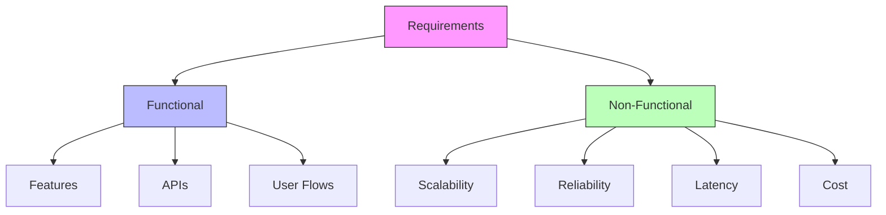

# Lesson 1: The Mindset

## The Shift

When you write code, you are building a single room. You care about the furniture (variables), the flow (logic), and the usability (UI).

**System Design is city planning.**

You stop caring about the furniture in every room. instead, you care about:

- **Traffic flow**: Can the roads handle rush hour? (Throughput)
- **Utilities**: Is there enough water and electricity? (Capacity)
- **Disaster recovery**: What happens if the power plant explodes? (Reliability)
- **Expansion**: Can we add a new suburb next year? (Scalability)

> [!IMPORTANT]
> **The golden rule**: In system design, there are no right answers, only **trade-offs**.

## Functional vs Non-Functional

Every system has two sets of requirements. In an interview (and real life), 90% of your initial grade comes from clarifying these **before you draw a single box**.

### 1. Functional Requirements (The "What")

These are the features. If the system doesn't do this, it's useless.

- User can post a tweet.
- User can follow others.
- User sees a news feed.

### 2. Non-Functional Requirements (The "How")

These are the constraints. If the system doesn't meet these, it will crash/fail/be too slow.

- **Scalability**: Must handle 100M daily active users.
- **Latency**: Feed must load in < 200ms.
- **Consistency**: A tweet must appear on followers' feeds within 5 seconds.



## The "It Depends" Game

Junior engineers search for the "best" database. Senior engineers ask "what are we optimizing for?"

| You Optimize For      | You Might Sacrifice | Example                                                              |
| :-------------------- | :------------------ | :------------------------------------------------------------------- |
| **Consistency**       | **Availability**    | Banking (Balances must be correct, even if system goes down briefly) |
| **Availability**      | **Consistency**     | Social Media (Better to show _old_ likes than an error page)         |
| **Write Speed**       | **Read Speed**      | Logging (Write fast, read rarely)                                    |
| **Development Speed** | **Performance**     | Startups (Ship Python/Ruby MVP fast, rewrite later)                  |

## Sruja Integration

In Sruja, we treat requirements as code. This keeps your constraints right next to your architecture.

### Why Kinds and Types Matter

In Sruja, you declare **kinds** to establish the vocabulary of your architecture. This isn't just syntax—it provides real benefits:

1. **Early Validation**: If you typo an element type (e.g., `sytem` instead of `system`), Sruja catches it immediately.
2. **Better Tooling**: IDEs can provide autocomplete and validation based on your declared kinds.
3. **Self-Documentation**: Anyone reading your model knows exactly which element types are available.
4. **Custom Vocabulary**: You can define your own kinds (e.g., `microservice = kind "Microservice"`) to match your domain.
5. **Flat and Clean**: With Sruja's flat syntax, these declarations live at the top of your file—no `specification` wrapper block required.

### Example: Requirements-Driven Architecture

```sruja
import { * } from 'sruja.ai/stdlib'

// 1. Defining the "What" (Functional)
requirement R1 functional "Users can post short text messages (tweets)"

// 2. Defining the "How" (Non-Functional)
requirement R2 performance "500ms p95 latency for reading timeline"
requirement R3 scale "Store 5 years of tweets (approx 1PB)"
requirement R4 availability "99.9% uptime SLA"

// 3. The Architecture follows the requirements
Twitter = system "The Platform" {
    description "Satisfies R1, R2, R3, R4"

    TimelineAPI = container "Timeline API" {
        technology "Go"
        description "Satisfies R2 - optimized for low latency"

        slo {
            latency {
                p95 "500ms"
                window "7 days"
            }
            availability {
                target "99.9%"
                window "30 days"
            }
        }
    }

    TweetDB = database "Tweet Storage" {
        technology "Cassandra"
        description "Satisfies R3 - distributed storage for 1PB scale"
    }

    TimelineAPI -> TweetDB "Reads/Writes"
}

// 4. Document the decision
ADR001 = adr "Use Cassandra for tweet storage" {
    status "Accepted"
    context "Need to store 1PB of tweets with high write throughput"
    decision "Use Cassandra for distributed, scalable storage"
    consequences "Excellent scalability, eventual consistency trade-off"
}

view index {
title "Twitter Platform Overview"
include *
}

// Performance-focused view
view performance {
title "Performance View"
include Twitter.TimelineAPI Twitter.TweetDB
}
```

## Knowledge Check

<details>
<summary><strong>Q: My boss says "We need to handle infinite users". How do you respond?</strong></summary>

**Bad Answer**: "Okay, I'll use Kubernetes and sharding."

**Senior Answer**: "Infinite is expensive. Do we expect 1k users or 100M users? The design for 1k costs $50/mo. The design for 100M costs $50k/mo. Let's define a realistic target for the next 12 months."

</details>

<details>
<summary><strong>Q: Why not just use the fastest database for everything?</strong></summary>

Because "fastest" depends on the workload. A database fast at reading (Cassandra) might be complex to manage. A database fast at relationships (Neo4j) might scale poorly for heavy writes. **Trade-offs.**

</details>

## Next Steps

Now that we have the mindset, let's learn the language.
👉 **[Lesson 2: The Vocabulary of Scale](./lesson-2)**
