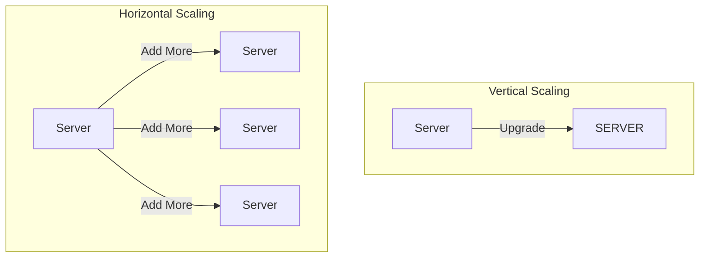

# Lesson 2: The Vocabulary of Scale

To design big systems, you need to speak the language.

## 1. Scaling: Up vs Out

When your website crashes because too many people are using it, you have two choices.

### Vertical Scaling (Scaling Up)
**"Get a bigger machine."**
You upgrade from a 4GB RAM server to a 64GB RAM server.
-   **Pros**: Easy. No code changes.
-   **Cons**: Expensive. Finite limit (you can't buy a 100TB RAM server... easily). Single point of failure.

### Horizontal Scaling (Scaling Out)
**"Get more machines."**
You buy 10 cheap servers and split the traffic between them.
-   **Pros**: Infinite scale (google has millions of servers). Resilient (if one dies, others take over).
-   **Cons**: Complex. You need load balancers and data consistency strategies.



## 2. Speed: Latency vs Throughput

In interviews, never just say "it needs to be fast". Be specific.

-   **Latency**: The time it takes for **one person** to get a result. 
    -   *Metaphor*: The time it takes to drive from A to B.
    -   *Unit*: Milliseconds (ms).
-   **Throughput**: The number of people the system can serve **at the same time**.
    -   *Metaphor*: The width of the highway (how many cars per hour).
    -   *Unit*: Requests per Second (RPS).

> [!TIP]
> **Use the right word**: A system can have **low latency** (fast response) but **low throughput** (crashes if 5 people use it). A highway can have **high throughput** (10 lanes) but **high latency** (traffic jam).

## 3. Sruja in Action

Sruja allows you to define horizontal scaling requirements explicitly using the `scale` block.

```sruja
specification {
  element person
  element system
  element container
  element component
  element datastore
  element queue
}

model {
    ECommerce = system "E-Commerce System" {
        WebServer = container "Web App" {
            technology "Go, Gin"
            
            // Explicitly defining Horizontal Scaling
            scale {
                min 3            // Start with 3 servers
                max 100          // Scale up to 100
                metric "cpu > 80%"
            }
        }
        
        Database = container "Primary DB" {
            technology "PostgreSQL"
            // Describing Vertical Scaling via comments/description
            description "Running on a massive AWS r5.24xlarge instance (Vertical Scaling)"
        }

        WebServer -> Database "Reads/Writes"
    }
}

views {
  view index {
    include *
  }
}
```

## Knowledge Check

<details>
<summary><strong>Q: Why don't we just vertically scale forever?</strong></summary>

Because physics. There is a limit to how fast a single CPU can be. Also, if that one super-computer catches fire, your entire business is dead.
</details>

## Next Steps

We have the mindset, and we have the words. Now let's draw.
👉 **[Lesson 3: The C4 Model (Visualizing Architecture)](./lesson-3)**
