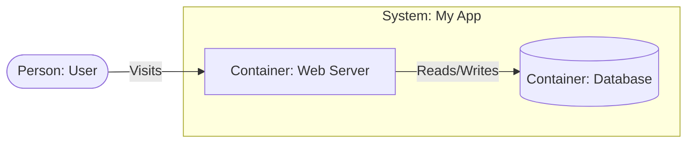

# Getting Started with Sruja

Sruja is **free and open source** (MIT licensed). This guide will help you install Sruja and create your first architecture model.

## Installation

### Automated Install (Recommended)

```bash
curl -fsSL https://raw.githubusercontent.com/sruja-ai/sruja/main/scripts/install.sh | bash
```

Note for macOS (Apple Silicon): If the automated installer reports a missing
Darwin arm64 binary, use one of the alternatives below (Manual Download or Go install).

### Manual Download

Download the latest release for your operating system from the [GitHub Releases](https://github.com/sruja-ai/sruja/releases) page.

### From Source (Go)

If you have Go installed, you can still build from source:

```bash
go install github.com/sruja-ai/sruja/cmd/sruja@latest
```

Verify the installation:

```bash
sruja --version
```

If `sruja` is not found in your shell, add Go's `bin` directory to your `PATH`:

```bash
export PATH="$HOME/go/bin:$PATH"
```

## Core Concepts (The C4 Model)

Before writing code, it helps to know what we are defining. Sruja uses specific terms from the **[C4 Model](/docs/concepts/c4-model)**:

1.  **System:** The highest level. Think of this as your entire application boundary.
2.  **Container:** A deployable part of your system (e.g., a Web App, an API, a Database). _Not a Docker container!_
3.  **Relationship:** How these parts talk to each other (e.g., "Uses", "Sends emails to").

We are going to build this:

> A **User** visits a **Web App**, which reads/writes data to a **Database**.



## Your First Project

**Create a file**: Create a new file named `architecture.sruja`.

**Write your model**:

```sruja
system App "My App" {
  container Web "Web Server"
  datastore DB "Database"
}
person User "User"

User -> App.Web "Visits"
App.Web -> App.DB "Reads/Writes"
```

**Visualize**: Use Studio for interactive diagrams, or export to various formats.

```bash
# Interactive visualization in Studio
# Visit /studio/ and paste your DSL code

# Export to Markdown (with embedded Mermaid diagrams)
sruja export markdown architecture.sruja > architecture.md

# Export to Mermaid diagram code only
sruja export mermaid architecture.sruja > diagram.mmd
```

## Editor Support

### VS Code Extension

For the best editing experience, install the **Sruja VS Code Extension**:

1. Open VS Code
2. Go to Extensions (`Cmd+Shift+X` or `Ctrl+Shift+X`)
3. Search for "Sruja" and install "Sruja DSL Language Support"

The extension provides:

- ✨ **Autocomplete** - Smart suggestions as you type
- 🔍 **Go to Definition** - Navigate to symbol definitions
- 🔎 **Find All References** - See where symbols are used
- ✏️ **Rename Symbol** - Rename symbols and all references
- 📋 **Outline View** - Navigate your architecture structure
- ⚠️ **Real-time Diagnostics** - Errors and warnings as you type
- 💡 **Hover Information** - See symbol details on hover
- 🎨 **Code Formatting** - Format your DSL code

See the [VS Code Extension Guide](/docs/vscode-extension) for complete documentation.

## Next Steps

- **Learn more**: Explore the [concepts](/docs/concepts/overview) and [reference](/docs/reference/syntax) documentation
- **Install VS Code Extension**: Get full LSP support - see [VS Code Extension Guide](/docs/vscode-extension)
- **Join the community**: Get help, share ideas, and contribute on [Discord](https://discord.gg/VNrvHPV5) or [GitHub Discussions](https://github.com/sruja-ai/sruja/discussions)
- **Contribute**: See the [Community](/docs/community) page for ways to get involved
