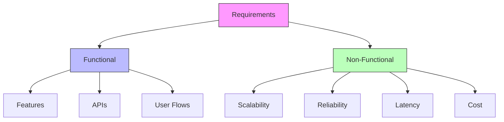

# Lesson 1: The Mindset

## The Shift

When you write code, you are building a single room. You care about the furniture (variables), the flow (logic), and the usability (UI).

**System Design is city planning.**

You stop caring about the furniture in every room. Instead, you care about:

- **Traffic flow**: Can the roads handle rush hour? (Throughput)
- **Utilities**: Is there enough water and electricity? (Capacity)
- **Disaster recovery**: What happens if the power plant explodes? (Reliability)
- **Expansion**: Can we add a new suburb next year? (Scalability)

## Real-World Case Studies

### Case Study 1: The Netflix Chaos Monkey (Success)

In 2008-2011, Netflix faced a critical problem. They moved from DVD-by-mail to streaming, but their single datacenter in Virginia was a single point of failure. One morning, the datacenter experienced a major outage—**millions of customers couldn't watch anything**.

**The System Design Decision**: Instead of buying bigger, better datacenters (Vertical Scaling), Netflix chose to:
- Move everything to **cloud infrastructure (AWS)**
- Adopt a **microservices architecture**
- Build **Chaos Monkey**—a tool that randomly kills services to test resilience

**The Result**: 
- Netflix went from **99.9% uptime** to **99.99%+ uptime**
- They handle **millions of concurrent streams** globally
- When AWS has an outage in one region, Netflix users don't even notice

### Case Study 2: Healthcare.gov Launch (Failure)

In 2013, the US government launched Healthcare.gov with these requirements:
- Handle **millions of users** trying to sign up simultaneously
- Integrate with **dozens of legacy systems** (IRS, insurance companies, etc.)
- **100% data accuracy** (no room for errors in health coverage)

**The System Design Mistakes**:
- No load testing before launch (assumed it would "just work")
- Tightly coupled architecture with **no caching layer**
- Single database bottleneck (no sharding)
- No graceful degradation (the entire site crashed instead of showing partial results)

**The Consequences**:
- **Site crashed immediately**—only 6 people could sign up on day one
- Cost **$1.7 billion** and took 2 years to fix
- Public relations disaster and loss of trust

**The Fix**:
- Added a **caching layer** (Redis) to handle read-heavy traffic
- Implemented **horizontal scaling** with auto-scaling groups
- Added **circuit breakers** to prevent cascading failures
- Built **queue-based architecture** for background processing

### Case Study 3: Instagram's 2010 Growth Spike

When Instagram launched in 2010, they had:
- **2 servers** (one for the app, one for the database)
- **50,000 users** on launch day
- **Within a week**: 1 million users
- **Within a month**: 10 million users

**The Challenge**: Their architecture couldn't handle the exponential growth. The database was overwhelmed, and image uploads were timing out.

**The System Design Solution**:
1. **Database Sharding**: Split user data across multiple database servers by user ID
2. **Content Delivery Network (CDN)**: Host images on edge servers globally
3. **Read Replicas**: Created multiple read-only copies of the database
4. **Async Processing**: Moved image processing to background queues

**The Numbers**:
- Before fix: **95% uptime**, 30-second image uploads
- After fix: **99.9% uptime**, <1-second image uploads
- They scaled from **2 servers to 500+ servers** in 6 months
- Eventually acquired by Facebook for **$1 billion**

> [!IMPORTANT]
> **The golden rule**: In system design, there are no right answers, only **trade-offs**.

## Functional vs Non-Functional

Every system has two sets of requirements. In an interview (and real life), 90% of your initial grade comes from clarifying these **before you draw a single box**.

### 1. Functional Requirements (The "What")

These are the features. If the system doesn't do this, it's useless.

**Basic Examples**:
- User can post a tweet.
- User can follow others.
- User sees a news feed.

**Real-World Examples by Industry**:

| Industry | Functional Requirements | Real System Example |
|----------|------------------------|---------------------|
| **E-commerce** | Browse products, add to cart, checkout, track orders | Amazon, Shopify |
| **Social Media** | Post content, follow users, like/comment, real-time notifications | Twitter, Instagram |
| **Streaming** | Video playback, quality adjustment, search, watchlist | Netflix, YouTube |
| **Banking** | Transfer money, view balance, pay bills, transaction history | Chase, Revolut |
| **Healthcare** | Book appointments, view records, message doctors, prescription management | Teladoc, Epic |

**Advanced Examples from Production Systems**:

**Uber's Real-Time Requirements**:
- Driver tracking updates every **4 seconds**
- Passenger requests must be matched to drivers within **<5 seconds**
- Surge pricing calculated dynamically based on **real-time supply/demand**
- Payment processing within **<2 seconds** after ride completion

**Spotify's Music Streaming Requirements**:
- **<200ms latency** for track start (no buffering delay)
- Support **offline playback** with 10,000+ songs cached
- Real-time collaborative playlists with **<500ms sync**
- Personalized recommendations with **50M+ tracks** in catalog

**Airbnb's Booking Requirements**:
- Support **concurrent bookings** for same property (prevent double-booking)
- **24-hour hold** on bookings before payment
- Real-time availability sync across **190+ countries**
- **Instant book** feature (no host approval required)

### 2. Non-Functional Requirements (The "How")

These are the constraints. If the system doesn't meet these, it will crash/fail/be too slow.

**Basic Examples**:
- **Scalability**: Must handle 100M daily active users.
- **Latency**: Feed must load in < 200ms.
- **Consistency**: A tweet must appear on followers' feeds within 5 seconds.

**Real-World Production Requirements**:

| System | Availability | Latency | Throughput | Data Size |
|--------|-------------|---------|------------|-----------|
| **Google Search** | 99.99% | <0.5 seconds | 63,000 queries/second | 100+ petabytes |
| **Netflix Streaming** | 99.99% | <2 seconds (start) | 100M+ concurrent streams | 1+ petabytes/day |
| **WhatsApp** | 99.9% | <100ms (message delivery) | 65B+ messages/day | 4+ petabytes/year |
| **Twitter (X)** | 99.9% | <200ms (timeline) | 500M+ tweets/day | 500+ petabytes |
| **AWS S3** | 99.999999999% (11 nines) | <100ms (GET) | 20M+ requests/second | 100+ exabytes |

**Industry-Specific Requirements**:

**Finance (Banking/Trading)**:
- **Strong Consistency**: Account balances must be 100% accurate (no eventual consistency)
- **Auditability**: Every transaction must be logged and traceable
- **Compliance**: GDPR, PCI-DSS, SOX compliance required
- **Low Latency**: Trading decisions in microseconds for high-frequency trading

**Healthcare**:
- **HIPAA Compliance**: All data encrypted at rest and in transit
- **High Availability**: Patient data must be accessible 24/7
- **Privacy**: Strict access controls and audit logs
- **Disaster Recovery**: RPO (Recovery Point Objective) < 1 hour, RTO (Recovery Time Objective) < 4 hours

**Gaming**:
- **Real-Time**: <50ms latency for multiplayer gaming
- **High Throughput**: Handle millions of concurrent players
- **Scalable**: Auto-scale for game launches and events
- **Anti-Cheat**: Prevent cheating and hacking

**IoT (Internet of Things)**:
- **High Ingest Rate**: Handle millions of devices sending data simultaneously
- **Edge Computing**: Process data locally to reduce bandwidth
- **Low Power**: Devices operate on battery for years
- **Intermittent Connectivity**: Work with unstable network connections



## The "It Depends" Game

Junior engineers search for the "best" database. Senior engineers ask "what are we optimizing for?"

| You Optimize For      | You Might Sacrifice | Example                                                              |
| :-------------------- | :------------------ | :------------------------------------------------------------------- |
| **Consistency**       | **Availability**    | Banking (Balances must be correct, even if system goes down briefly) |
| **Availability**      | **Consistency**     | Social Media (Better to show _old_ likes than an error page)         |
| **Write Speed**       | **Read Speed**      | Logging (Write fast, read rarely)                                    |
| **Development Speed** | **Performance**     | Startups (Ship Python/Ruby MVP fast, rewrite later)                  |

## Practical Trade-Off Scenarios

### Scenario 1: Building a Real-Time Chat App

**Context**: You're building a chat app like Slack or Discord. Users expect messages to appear instantly.

**The Trade-Off Decisions**:

| Decision | Option A | Option B | What You Choose & Why |
|----------|----------|----------|----------------------|
| **Message Storage** | Relational DB (PostgreSQL) | NoSQL (Cassandra) | **NoSQL** - High write throughput, eventual consistency acceptable |
| **Real-time Updates** | Polling (client asks server every 5s) | WebSockets (server pushes updates) | **WebSockets** - Lower latency, less server load |
| **Message History** | Keep forever | 90-day retention | **90-day retention** - Reduce storage costs, most users don't need old messages |
| **Online Status** | Check on every message | Heartbeat every 30s | **Heartbeat** - Scale better, less database load |

**Performance Impact**:
- Polling approach: 100K users × 1 request/5s = **20,000 requests/second** just for checking messages
- WebSocket approach: **100-200 requests/second** (heartbeat only)

### Scenario 2: Building an E-Commerce Platform

**Context**: You're building Amazon-scale e-commerce. Need to handle Black Friday traffic spikes.

**The Architecture Trade-Offs**:

```sruja
import { * } from 'sruja.ai/stdlib'

ECommerce = system "E-Commerce Platform" {
    description "High-volume retail platform with trade-off decisions documented"
    
    // TRADE-OFF 1: Read-heavy vs Write-heavy
    ProductDB = database "Product Catalog Database" {
        technology "PostgreSQL with Read Replicas"
        description "Optimized for READ operations (99% of traffic is reads)"
        
        metadata {
            decision "Use read replicas for product browsing"
            sacrifice "Write latency (updates take longer to propagate)"
            reason "Users browse products 100x more than they add products"
            metric "Read:Write ratio = 100:1"
        }
    }
    
    // TRADE-OFF 2: Strong vs Eventual Consistency
    CartService = container "Shopping Cart Service" {
        technology "Redis"
        description "In-memory cache for cart state"
        
        metadata {
            decision "Use Redis (in-memory) for cart storage"
            sacrifice "Durability (cart data lost if Redis crashes)"
            reason "Cart data is temporary and can be recreated from product catalog"
            mitigation "Periodic snapshots to persistent storage"
        }
    }
    
    // TRADE-OFF 3: Cost vs Performance
    SearchEngine = container "Product Search" {
        technology "Elasticsearch"
        description "Full-text search with caching layer"
        
        metadata {
            decision "Use expensive Elasticsearch cluster"
            sacrifice "Infrastructure cost ($5K/month)"
            reason "Search performance directly impacts conversion rates (1% latency = 1% revenue loss)"
            metric "Search latency <200ms required for optimal UX"
        }
    }
    
    // TRADE-OFF 4: Availability vs Consistency
    OrderService = container "Order Processing" {
        technology "Kafka + Microservices"
        description "Async order processing pipeline"
        
        metadata {
            decision "Use async messaging (eventual consistency)"
            sacrifice "Real-time inventory accuracy"
            reason "Better availability and scalability during peak traffic"
            mitigation "Compensating transactions to handle over-selling"
        }
    }
}
```

### Scenario 3: CAP Theorem in Practice

**Real-World Example: Netflix vs. PayPal**

**Netflix (Choose Availability)**:
- If a user can't watch a video, they might cancel subscription
- **Trade-off**: Occasionally show stale content recommendations
- **Architecture**: AP system (Available, Partition-tolerant, Eventually consistent)
- **Data**: Video recommendations, watch history, user preferences

**PayPal (Choose Consistency)**:
- If a transaction is processed incorrectly, lawsuits happen
- **Trade-off**: Brief service interruptions during network partitions
- **Architecture**: CP system (Consistent, Partition-tolerant, Limited availability)
- **Data**: Account balances, transaction records, payment processing

**The Decision Matrix**:

```
Ask yourself:
1. What happens if the data is wrong?
   → If lawsuits/financial loss → Prioritize Consistency (PayPal model)
   → If just bad UX → Prioritize Availability (Netflix model)

2. What's the tolerance for downtime?
   → Zero tolerance → Prioritize Availability (Instagram for celebrity photos)
   → Some tolerance OK → Prioritize Consistency (Banking)

3. Can you design around the trade-off?
   → Yes: Use hybrid approach (read-optimized cache + write-optimized DB)
   → No: Pick one and accept the consequences
```

## Sruja Integration

In Sruja, we treat requirements as code. This keeps your constraints right next to your architecture.

### Why Kinds and Types Matter

In Sruja, you declare **kinds** to establish the vocabulary of your architecture. This isn't just syntax—it provides real benefits:

1. **Early Validation**: If you typo an element type (e.g., `sytem` instead of `system`), Sruja catches it immediately.
2. **Better Tooling**: IDEs can provide autocomplete and validation based on your declared kinds.
3. **Self-Documentation**: Anyone reading your model knows exactly which element types are available.
4. **Custom Vocabulary**: You can define your own kinds (e.g., `microservice = kind "Microservice"`) to match your domain.
5. **Flat and Clean**: With Sruja's flat syntax, these declarations live at the top of your file—no `specification` wrapper block required.

### Example: Requirements-Driven Architecture

```sruja
import { * } from 'sruja.ai/stdlib'

// 1. Defining the "What" (Functional)
requirement R1 functional "Users can post short text messages (tweets)"

// 2. Defining the "How" (Non-Functional)
requirement R2 performance "500ms p95 latency for reading timeline"
requirement R3 scale "Store 5 years of tweets (approx 1PB)"
requirement R4 availability "99.9% uptime SLA"

// 3. The Architecture follows the requirements
Twitter = system "The Platform" {
    description "Satisfies R1, R2, R3, R4"

    TimelineAPI = container "Timeline API" {
        technology "Rust"
        description "Satisfies R2 - optimized for low latency"

        slo {
            latency {
                p95 "500ms"
                window "7 days"
            }
            availability {
                target "99.9%"
                window "30 days"
            }
        }
    }

    TweetDB = database "Tweet Storage" {
        technology "Cassandra"
        description "Satisfies R3 - distributed storage for 1PB scale"
    }

    TimelineAPI -> TweetDB "Reads/Writes"
}

// 4. Document the decision
ADR001 = adr "Use Cassandra for tweet storage" {
    status "Accepted"
    context "Need to store 1PB of tweets with high write throughput"
    decision "Use Cassandra for distributed, scalable storage"
    consequences "Excellent scalability, eventual consistency trade-off"
}

view index {
title "Twitter Platform Overview"
include *
}

view performance {
title "Performance View"
include Twitter.TimelineAPI
include Twitter.TweetDB
}
```

## Knowledge Check

<details>
<summary><strong>Q: My boss says "We need to handle infinite users". How do you respond?</strong></summary>

**Bad Answer**: "Okay, I'll use Kubernetes and sharding."

**Senior Answer**: "Infinite is expensive. Do we expect 1k users or 100M users? The design for 1k costs $50/mo. The design for 100M costs $50k/mo. Let's define a realistic target for the next 12 months."

</details>

<details>
<summary><strong>Q: Why not just use the fastest database for everything?</strong></summary>

Because "fastest" depends on the workload. A database fast at reading (Cassandra) might be complex to manage. A database fast at relationships (Neo4j) might scale poorly for heavy writes. **Trade-offs.**

</details>

## Quiz: Test Your Knowledge

Ready to apply what you've learned? Take the interactive quiz for this lesson!

**1. In system design, what do we call requirements that describe the features and functionality of a system (what it should do)?**

<details>
<summary><strong>Click to see answer</strong></summary>

**Answer:** Functional

**Alternative answers:**
- functional requirements

**Explanation:**
Functional requirements define the features and capabilities of the system. Examples: "User can post a tweet," "User can browse products."


</details>

---

**2. In system design, what do we call requirements that describe how the system should perform (constraints like speed, scalability, reliability)?**

<details>
<summary><strong>Click to see answer</strong></summary>

**Answer:** Non-functional

**Alternative answers:**
- non-functional
- non functional
- NFR
- NFRs

**Explanation:**
Non-functional requirements define the quality attributes and constraints of the system. Examples: "Must handle 100M users," "Response time &lt;200ms."


</details>

---

**3. A banking system must ensure that account balances are always accurate and transactions cannot be lost. Which trade-off would you prioritize?**

- [ ] a) Prioritize availability over consistency (it's better to show wrong data than no data)
- [ ] b) Prioritize development speed over performance (ship a MVP first)
- [ ] c) Prioritize write speed over read speed (logging-focused optimization)
- [ ] d) Prioritize consistency over availability (brief downtime is acceptable, but data must be correct)

<button class="check-answer-btn" data-correct="d">Check Answer</button>

<div class="answer-feedback" style="display: none;">
  <p class="feedback-text"></p>
  <div class="explanation" style="display: none;">
    In banking, financial accuracy is critical. You would choose a CP system (Consistent, Partition-tolerant) over AP, accepting brief outages to ensure no incorrect transactions.

  </div>
</div>

---

**4. You're building a real-time chat application like Discord. Users expect messages to appear instantly across all devices. What's the best architecture approach?**

- [ ] a) Use relational database with strong consistency (PostgreSQL) for all message storage
- [ ] b) Use HTTP polling where clients check for new messages every 5 seconds
- [ ] c) Use eventual consistency with 24-hour delay synchronization
- [ ] d) Use WebSockets for real-time push with eventual consistency for message storage

<button class="check-answer-btn" data-correct="d">Check Answer</button>

<div class="answer-feedback" style="display: none;">
  <p class="feedback-text"></p>
  <div class="explanation" style="display: none;">
    Real-time chat requires low latency. WebSockets eliminate the overhead of polling (which generates 20K requests/second for 100K users). Eventual consistency is acceptable for message delivery.

  </div>
</div>

---

**5. Netflix experienced a major outage in 2008 when their single datacenter failed. What was their system design solution?**

- [ ] a) Bought a bigger, more expensive datacenter with better hardware (Vertical scaling)
- [ ] b) Hired more operations engineers to manually failover systems
- [ ] c) Built a single, massive monolithic application on dedicated servers
- [ ] d) Moved to cloud infrastructure with microservices and built Chaos Monkey to test resilience

<button class="check-answer-btn" data-correct="d">Check Answer</button>

<div class="answer-feedback" style="display: none;">
  <p class="feedback-text"></p>
  <div class="explanation" style="display: none;">
    Netflix adopted horizontal scaling on AWS, microservices architecture, and Chaos Monkey (randomly kills services to test resilience). This transformed their availability from 99.9% to 99.99%+.

  </div>
</div>

---

**6. Healthcare.gov's initial launch in 2013 was a disaster. Which of these was NOT one of their system design mistakes?**

- [ ] a) No load testing before launch
- [ ] b) Tightly coupled architecture with no caching layer
- [ ] c) Single database bottleneck with no sharding
- [ ] d) Using cloud infrastructure instead of dedicated on-premise servers

<button class="check-answer-btn" data-correct="d">Check Answer</button>

<div class="answer-feedback" style="display: none;">
  <p class="feedback-text"></p>
  <div class="explanation" style="display: none;">
    Healthcare.gov's actual mistakes were: no load testing, tight coupling, single database bottleneck, and no graceful degradation. Using cloud infrastructure itself wasn't the problem—it was the poor architecture.

  </div>
</div>

---

**7. You're building a product search engine for an e-commerce site handling 10M products. The search feature generates 99% of traffic. What optimization should you prioritize?**

- [ ] a) Optimize for write speed (since products are added frequently)
- [ ] b) Use a single-node relational database for simplicity
- [ ] c) Disable caching to ensure always-fresh search results
- [ ] d) Use read replicas and a specialized search engine like Elasticsearch

<button class="check-answer-btn" data-correct="d">Check Answer</button>

<div class="answer-feedback" style="display: none;">
  <p class="feedback-text"></p>
  <div class="explanation" style="display: none;">
    With a 99% read workload, you optimize for read performance. Read replicas distribute query load, and Elasticsearch provides full-text search capabilities that relational databases lack.

  </div>
</div>

---

**8. Instagram launched with 2 servers and grew to 10M users in one month. What was their key architectural change to handle this growth?**

- [ ] a) Rewrote the entire application in a different programming language
- [ ] b) Bought the biggest available server (vertical scaling)
- [ ] c) Removed all features to reduce complexity
- [ ] d) Implemented database sharding, CDN for images, and async processing for image handling

<button class="check-answer-btn" data-correct="d">Check Answer</button>

<div class="answer-feedback" style="display: none;">
  <p class="feedback-text"></p>
  <div class="explanation" style="display: none;">
    Instagram used database sharding (split data across multiple DBs), CDN for global image delivery, and async processing for heavy operations. This scaled them from 2 servers to 500+ servers in 6 months.

  </div>
</div>

---

**9. Which of the following statements best describes the relationship between latency and throughput?**

- [ ] a) Low latency always means high throughput
- [ ] b) High latency always means high throughput
- [ ] c) Latency and throughput are the same thing
- [ ] d) A system can have low latency but low throughput, or high latency but high throughput

<button class="check-answer-btn" data-correct="d">Check Answer</button>

<div class="answer-feedback" style="display: none;">
  <p class="feedback-text"></p>
  <div class="explanation" style="display: none;">
    Latency = time for ONE request. Throughput = number of concurrent requests. Example: A highway can have high latency (traffic jam) and high throughput (10 lanes), or low latency (empty road) and low throughput (1 lane).

  </div>
</div>

---

**10. Your boss says "We need to handle infinite users." What's the most appropriate response?**

- [ ] a) Great! I'll immediately implement Kubernetes and distributed sharding
- [ ] b) Impossible! Let's cap users at 1,000 and reject anyone else
- [ ] c) Let's build the system assuming unlimited resources regardless of cost
- [ ] d) Infinite is expensive. Let's define realistic targets for the next 12 months (e.g., 100K users) and design for that

<button class="check-answer-btn" data-correct="d">Check Answer</button>

<div class="answer-feedback" style="display: none;">
  <p class="feedback-text"></p>
  <div class="explanation" style="display: none;">
    The best engineers clarify requirements first. The design for 1K users costs $50/month, while 100M users costs $50K/month. Always define realistic, time-boxed targets.

  </div>
</div>

---

**11. What is the term for the system design principle that means every decision involves sacrificing one quality to gain another (e.g., choosing consistency means sacrificing availability)?**

<details>
<summary><strong>Click to see answer</strong></summary>

**Answer:** Trade-off

**Alternative answers:**
- trade-off
- tradeoff

**Explanation:**
Trade-offs are fundamental to system design. There are no perfect solutions—every architecture choice involves benefits and costs. "It depends" is the correct answer because it depends on which trade-offs you choose.


</details>

---

This quiz covers:
- Functional vs Non-functional requirements
- Real-world case studies (Netflix, Healthcare.gov, Instagram)
- Trade-off decisions in system design
- Practical scenarios and decision-making

## Next Steps

Now that we have the mindset, let's learn the language.
👉 **[Lesson 2: The Vocabulary of Scale](./lesson-2)**
