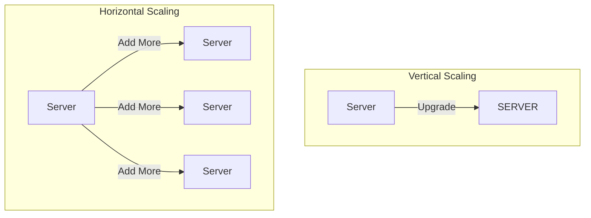

# Lesson 2: The Vocabulary of Scale

To design big systems, you need to speak the language.

## 1. Scaling: Up vs Out

When your website crashes because too many people are using it, you have two choices.

### Vertical Scaling (Scaling Up)

**"Get a bigger machine."**
You upgrade from a 4GB RAM server to a 64GB RAM server.

- **Pros**: Easy. No code changes.
- **Cons**: Expensive. Finite limit (you can't buy a 100TB RAM server... easily). Single point of failure.

### Horizontal Scaling (Scaling Out)

**"Get more machines."**
You buy 10 cheap servers and split the traffic between them.

- **Pros**: Infinite scale (google has millions of servers). Resilient (if one dies, others take over).
- **Cons**: Complex. You need load balancers and data consistency strategies.



## 2. Speed: Latency vs Throughput

In interviews, never just say "it needs to be fast". Be specific.

- **Latency**: The time it takes for **one person** to get a result.
  - _Metaphor_: The time it takes to drive from A to B.
  - _Unit_: Milliseconds (ms).
- **Throughput**: The number of people the system can serve **at the same time**.
  - _Metaphor_: The width of the highway (how many cars per hour).
  - _Unit_: Requests per Second (RPS).

> [!TIP]
> **Use the right word**: A system can have **low latency** (fast response) but **low throughput** (crashes if 5 people use it). A highway can have **high throughput** (10 lanes) but **high latency** (traffic jam).

## 3. Sruja in Action

Sruja allows you to define horizontal scaling requirements explicitly using the `scale` block.

```sruja
// partial
import { * } from 'sruja.ai/stdlib'

ECommerce = system "E-Commerce System" {
    WebServer = container "Web App" {
        technology "Rust, Axum"

        // Explicitly defining Horizontal Scaling
        scale {
            min 3            // Start with 3 servers
            max 100          // Scale up to 100
            metric "cpu > 80%"
        }
    }

    Database = database "Primary DB" {
        technology "PostgreSQL"
        // Describing Vertical Scaling via comments/description
        description "Running on a massive AWS r5.24xlarge instance (Vertical Scaling)"
    }

    WebServer -> Database "Reads/Writes"
}

view index {
include *
}
```

## Knowledge Check

<details>
<summary><strong>Q: Why don't we just vertically scale forever?</strong></summary>

Because physics. There is a limit to how fast a single CPU can be. Also, if that one super-computer catches fire, your entire business is dead.

</details>

## Quiz: Test Your Knowledge

Ready to apply what you've learned? Take the interactive quiz for this lesson!

**1. What type of scaling involves upgrading a single machine with more resources (more RAM, CPU, disk space)?**

<details>
<summary><strong>Click to see answer</strong></summary>

**Answer:** Vertical

**Alternative answers:**
- vertical scaling
- scale up
- scale-up

**Explanation:**
Vertical scaling (or scaling up) means making a single machine more powerful. Example: Upgrading from 4GB RAM to 64GB RAM on one server.

</details>

---

**2. What type of scaling involves adding more machines to distribute the load?**

<details>
<summary><strong>Click to see answer</strong></summary>

**Answer:** Horizontal

**Alternative answers:**
- horizontal scaling
- scale out
- scale-out

**Explanation:**
Horizontal scaling (or scaling out) means adding more machines to handle increased load. Example: Adding 10 servers instead of upgrading one server to be more powerful.

</details>

---

**3. Why don't we just vertically scale forever to handle all growth?**

- [ ] a) Vertical scaling is always more expensive than horizontal scaling
- [ ] b) Vertical scaling requires more maintenance and monitoring
- [ ] c) Vertical scaling is only available on cloud platforms
- [ ] d) There are physical limits to how powerful a single machine can be, and it's a single point of failure

<button class="check-answer-btn" data-correct="d">Check Answer</button>

<div class="answer-feedback" style="display: none;">
  <p class="feedback-text"></p>
  <div class="explanation" style="display: none;">
    Physics limits how fast a single CPU can be. Also, if that one super-computer fails, your entire system goes down. Horizontal scaling provides both infinite growth potential and resilience.

  </div>
</div>

---

**4. Your application needs to handle 10x traffic during a holiday sale (from 100K to 1M users per hour). You have 2 weeks to prepare. What's the best approach?**

- [ ] a) Vertically scale by buying the most powerful server available (it handles 2M users)
- [ ] b) Rewrite the entire application to be microservices-based
- [ ] c) Tell users the site will be slow during the sale
- [ ] d) Implement horizontal scaling with auto-scaling groups that can add servers automatically based on load

<button class="check-answer-btn" data-correct="d">Check Answer</button>

<div class="answer-feedback" style="display: none;">
  <p class="feedback-text"></p>
  <div class="explanation" style="display: none;">
    Auto-scaling allows you to start with minimal servers and automatically add more as traffic increases. This is cost-effective and can handle unpredictable traffic spikes during events like Black Friday.

  </div>
</div>

---

**5. A startup has a monolithic application running on a single server. They expect to grow from 100 to 10,000 users over the next year. What's their best scaling strategy?**

- [ ] a) Immediately migrate to microservices architecture on Kubernetes
- [ ] b) Start with 100 servers to prepare for future growth
- [ ] c) Do nothing and hope the single server handles the load
- [ ] d) Start with vertical scaling, then migrate to horizontal scaling when needed

<button class="check-answer-btn" data-correct="d">Check Answer</button>

<div class="answer-feedback" style="display: none;">
  <p class="feedback-text"></p>
  <div class="explanation" style="display: none;">
    For early-stage startups, vertical scaling is simpler and requires no code changes. As you grow, gradually move to horizontal scaling. Don't over-engineer early—ship first, optimize later.

  </div>
</div>

---

**6. What's the main disadvantage of horizontal scaling?**

- [ ] a) It's more expensive than vertical scaling
- [ ] b) It has a finite limit to how much you can scale
- [ ] c) It can't handle traffic spikes
- [ ] d) It introduces complexity in data consistency, load balancing, and distributed systems management

<button class="check-answer-btn" data-correct="d">Check Answer</button>

<div class="answer-feedback" style="display: none;">
  <p class="feedback-text"></p>
  <div class="explanation" style="display: none;">
    Horizontal scaling requires managing multiple servers, handling data consistency across them, implementing load balancers, and dealing with distributed systems challenges like network partitions and eventual consistency.

  </div>
</div>

---

**7. You're designing a high-frequency trading system where every microsecond matters. Which scaling approach is most appropriate?**

- [ ] a) Horizontal scaling across multiple datacenters worldwide
- [ ] b) Caching everything and accepting stale data
- [ ] c) No scaling needed, as HFT systems don't handle much traffic
- [ ] d) Vertical scaling on a single machine in the same datacenter as the stock exchange

<button class="check-answer-btn" data-correct="d">Check Answer</button>

<div class="answer-feedback" style="display: none;">
  <p class="feedback-text"></p>
  <div class="explanation" style="display: none;">
    In high-frequency trading, network latency matters more than processing capacity. Minimizing distance and hops (using a single, powerful server colocated with the exchange) provides the lowest possible latency.

  </div>
</div>

---

**8. What term describes the time it takes for a single request to complete, measured in milliseconds?**

<details>
<summary><strong>Click to see answer</strong></summary>

**Answer:** Latency

**Alternative answers:**
- response time
- latency

**Explanation:**
Latency is the time from when a request is sent to when the response is received. Think of it as the time it takes to drive from point A to point B.

</details>

---

**9. What term describes how many requests a system can handle simultaneously, measured in requests per second (RPS)?**

<details>
<summary><strong>Click to see answer</strong></summary>

**Answer:** Throughput

**Alternative answers:**
- throughput
- capacity
- concurrent requests

**Explanation:**
Throughput is the volume of work a system can handle. Think of it as the width of a highway—how many cars can travel per hour.

</details>

---

**10. Can a system have low latency but low throughput?**

- [ ] a) No, low latency always means high throughput
- [ ] b) No, these terms are synonyms
- [ ] c) Only in distributed systems
- [ ] d) Yes—a single-lane road has low latency (no traffic jam) but low throughput (few cars per hour)

<button class="check-answer-btn" data-correct="d">Check Answer</button>

<div class="answer-feedback" style="display: none;">
  <p class="feedback-text"></p>
  <div class="explanation" style="display: none;">
    Latency and throughput are independent. A system can be fast for one user but crash if multiple users use it simultaneously. Conversely, a system can handle many users (high throughput) but be slow for each one (high latency).

  </div>
</div>

---

**11. YouTube must serve videos to millions of users simultaneously. What's the most important metric for their success?**

- [ ] a) Low latency for video upload
- [ ] b) High throughput for video streaming
- [ ] c) Strong consistency for user preferences
- [ ] d) High throughput for video streaming with acceptable latency for video start

<button class="check-answer-btn" data-correct="d">Check Answer</button>

<div class="answer-feedback" style="display: none;">
  <p class="feedback-text"></p>
  <div class="explanation" style="display: none;">
    YouTube's primary challenge is serving millions of concurrent video streams. While latency matters (video shouldn't buffer), throughput is the bigger challenge—handling millions of requests per second.

  </div>
</div>

---

**12. A REST API averages 50ms latency but can only handle 100 requests/second before becoming unresponsive. You need to support 1,000 requests/second. What's the first step?**

- [ ] a) Optimize code to reduce latency from 50ms to 5ms
- [ ] b) Increase the timeout to handle more concurrent requests
- [ ] c) Add caching for everything
- [ ] d)  horizontally scale by running multiple instances behind a load balancer

<button class="check-answer-btn" data-correct="d">Check Answer</button>

<div class="answer-feedback" style="display: none;">
  <p class="feedback-text"></p>
  <div class="explanation" style="display: none;">
    The problem is throughput (100 RPS), not latency (50ms is good). Adding more instances in parallel increases throughput without changing latency. A load balancer distributes traffic across all instances.

  </div>
</div>

---

**13. Google Search needs to return results in under 500 milliseconds for 63,000 queries per second. What's their architectural approach?**

- [ ] a) One supercomputer with infinite RAM
- [ ] b) Caching everything for 24 hours
- [ ] c) Accepting slower response times during peak hours
- [ ] d) Horizontal scaling with distributed computing, pre-computed indexes, and edge caching

<button class="check-answer-btn" data-correct="d">Check Answer</button>

<div class="answer-feedback" style="display: none;">
  <p class="feedback-text"></p>
  <div class="explanation" style="display: none;">
    Google uses thousands of servers working in parallel, pre-computed search indexes, and content delivery networks at the edge to achieve both low latency (&lt;500ms) and high throughput (63K queries/sec).

  </div>
</div>

---

**14. Your database has a read-to-write ratio of 1000:1 (users read data 1000x more than they write it). What scaling strategy is most effective?**

- [ ] a) Add more powerful CPUs for write operations
- [ ] b) Shard the database based on write patterns
- [ ] c) Optimize write queries since they're the bottleneck
- [ ] d) Use read replicas to distribute read load across multiple database copies

<button class="check-answer-btn" data-correct="d">Check Answer</button>

<div class="answer-feedback" style="display: none;">
  <p class="feedback-text"></p>
  <div class="explanation" style="display: none;">
    With a 1000:1 read/write ratio, writes are rare. Read replicas allow you to scale read operations horizontally while writes go to a single primary database. This dramatically increases throughput for read-heavy workloads.

  </div>
</div>

---

**15. When should you choose vertical scaling over horizontal scaling?**

- [ ] a) When you need to handle millions of concurrent users
- [ ] b) When your application has no shared state and is stateless
- [ ] c) When cost and complexity are not concerns
- [ ] d) When you need a quick solution, have low traffic, or your application has complex shared state

<button class="check-answer-btn" data-correct="d">Check Answer</button>

<div class="answer-feedback" style="display: none;">
  <p class="feedback-text"></p>
  <div class="explanation" style="display: none;">
    Vertical scaling is ideal for: early-stage startups, applications with complex state management, databases with complex transactions, or when you need to scale quickly without architectural changes.

  </div>
</div>

---

**16. What component distributes incoming network traffic across multiple servers to enable horizontal scaling?**

<details>
<summary><strong>Click to see answer</strong></summary>

**Answer:** Load balancer

**Alternative answers:**
- load balancer
- load balancers
- LB
- proxy

**Explanation:**
Load balancers are the "traffic cops" that distribute requests across multiple servers, enabling horizontal scaling and providing resilience by routing around failed servers.

</details>

---

**17. In a horizontally scaled system, what happens if one server fails?**

- [ ] a) The entire system crashes
- [ ] b) All traffic stops until the server is repaired
- [ ] c) The load balancer sends more traffic to the failed server
- [ ] d) The load balancer stops sending traffic to the failed server and routes it to the remaining healthy servers

<button class="check-answer-btn" data-correct="d">Check Answer</button>

<div class="answer-feedback" style="display: none;">
  <p class="feedback-text"></p>
  <div class="explanation" style="display: none;">
    One of the key benefits of horizontal scaling is resilience. If one server fails, the load balancer detects it and routes traffic to other servers, maintaining system availability.

  </div>
</div>

---

**18. Sruja allows you to define horizontal scaling explicitly. What does `min: 3, max: 100, metric: "cpu > 80%"` mean in a scale block?**

- [ ] a) Always run exactly 3 servers, maximum CPU usage 80%
- [ ] b) Scale vertically when CPU is under 80%
- [ ] c) Never scale down below 3 servers regardless of CPU
- [ ] d) Start with 3 servers, add more up to 100 when CPU exceeds 80%, remove servers when CPU is below threshold

<button class="check-answer-btn" data-correct="d">Check Answer</button>

<div class="answer-feedback" style="display: none;">
  <p class="feedback-text"></p>
  <div class="explanation" style="display: none;">
    This defines auto-scaling behavior: minimum baseline of 3 servers, maximum capacity of 100 servers, and scaling trigger based on CPU usage. This is how cloud platforms like AWS and Kubernetes implement horizontal scaling.

  </div>
</div>

---

**19. Your e-commerce site's product catalog page loads in 2 seconds, but during a sale it slows to 10 seconds. Which metric degraded?**

- [ ] a) Throughput decreased
- [ ] b) The database ran out of storage
- [ ] c) The page size increased
- [ ] d) Latency increased (response time got worse) due to increased load on the system

<button class="check-answer-btn" data-correct="d">Check Answer</button>

<div class="answer-feedback" style="display: none;">
  <p class="feedback-text"></p>
  <div class="explanation" style="display: none;">
    Latency degraded from 2s to 10s because the system was overloaded. This might be caused by insufficient throughput capacity—not enough servers to handle the concurrent users during the sale.

  </div>
</div>

---

**20. A system has 99.9% uptime, meaning it can be down for about 8.77 hours per year. If you want 99.99% uptime, how much downtime is acceptable per year?**

- [ ] a) 8.77 hours (same as 99.9%)
- [ ] b) 1 hour
- [ ] c) 1 minute
- [ ] d) About 52.6 minutes (8.77 hours / 10)

<button class="check-answer-btn" data-correct="d">Check Answer</button>

<div class="answer-feedback" style="display: none;">
  <p class="feedback-text"></p>
  <div class="explanation" style="display: none;">
    Each additional "9" in uptime reduces downtime by a factor of 10. 99.9% = 8.77 hours/year. 99.99% = 52.6 minutes/year. 99.999% = 5.26 minutes/year. Achieving higher uptime requires horizontal scaling and redundancy.

  </div>
</div>

---

This quiz covers:
- Vertical vs Horizontal scaling strategies
- When to use each scaling approach
- Latency vs Throughput concepts
- Real-world scaling scenarios (YouTube, Google, HFT)
- Load balancing and auto-scaling
- Practical scaling decisions

## Next Steps

We have the mindset, and we have the words. Now let's draw.
👉 **[Lesson 3: The C4 Model (Visualizing Architecture)](./lesson-3)**
