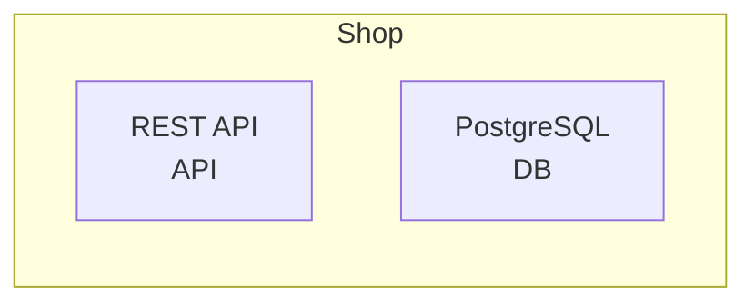
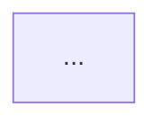

# Custom Views in Markdown

Custom views let you define focused, role-specific architecture diagrams in your Sruja files and export them directly to Markdown.

## Defining Custom Views

Define views in your `.sruja` file:

```sruja
person = kind "Person"
system = kind "System"
container = kind "Container"
database = kind "Database"

Customer = person "Customer"
Admin = person "Administrator"

Shop = system "E-Commerce Shop" {
    WebApp = container "Web Application"
    API = container "REST API"
    DB = database "PostgreSQL"
}

Customer -> Shop.WebApp "browses"
Admin -> Shop.WebApp "manages"
Shop.WebApp -> Shop.API "calls"
Shop.API -> Shop.DB "reads/writes"

// API-focused view
view api_focus {
    title "API Architecture"
    description "Shows API layer and database"
    include Shop.API Shop.DB
}

// Customer journey view
view customer_experience {
    title "Customer Experience"
    description "Components visible to customers"
    include Shop.WebApp.*
    exclude Shop.WebApp.Cart
}
```

## Exporting Custom Views

### Single View to Mermaid

Export a specific view to Mermaid:

```bash
sruja export mermaid architecture.sruja --view api_focus
```

Output:



### All Views to Markdown

Export all custom views to a single Markdown document:

```bash
sruja export markdown architecture.sruja --all-views
```

**Note:** Requires `include_custom_views: true` in `MarkdownOptions` (enabled by `--all-views`).

Output:

````markdown
## Custom Views

### API Architecture

Shows API layer and database


````

### Customer Experience

Components visible to customers


````

## View Patterns

### Wildcard for Descendants

Use `*` to include an element and all its children:

```sruja
view all_components {
    include Shop.*
}
````

### Scoped Views

Use `view of [System]` to scope within a system:

```sruja
view containers of Shop {
    include Shop.WebApp Shop.API Shop.DB
}
```

### Include and Exclude

Combine include with exclude for fine-grained control:

```sruja
view api_without_db {
    include Shop.*
    exclude Shop.DB
}
```

## Integration with mdBook

You can auto-generate markdown diagrams in your mdBook by:

1. **Using a preprocessor** (recommended):
   Create a custom preprocessor that runs `sruja export` and replaces code blocks

2. **Build script**:
   Run export as a pre-build step:

   ```bash
   # In Makefile or build script
   sruja export markdown examples/advanced_views.sruja --all-views > book/src/generated/advanced_views.md
   ```

3. **Manual inclusion**:
   Export once and include in your markdown:

   ```bash
   sruja export markdown examples/advanced_views.sruja --all-views > book/src/generated/advanced_views.md
   ```

   Then in your `.md` files:

   ```markdown
   {{#include ./generated/advanced_views.md}}
   ```

## CLI Options

| Option          | Description                     |
| --------------- | ------------------------------- |
| `--view <name>` | Export a specific view by name  |
| `--all-views`   | Export all defined custom views |

## Example: Multi-View Documentation

Create a comprehensive architecture document with multiple views:

```bash
# Generate documentation with all views
sruja export markdown ecommerce.sruja --all-views > docs/architecture.md
```

This creates a single markdown file with:

- Table of contents
- Each view as a separate section
- Mermaid diagrams embedded for each view
- Descriptions from view definitions

## See Rendered Output

For examples of the actual rendered output, see [Generated View Output](./generated-view-output.md).
