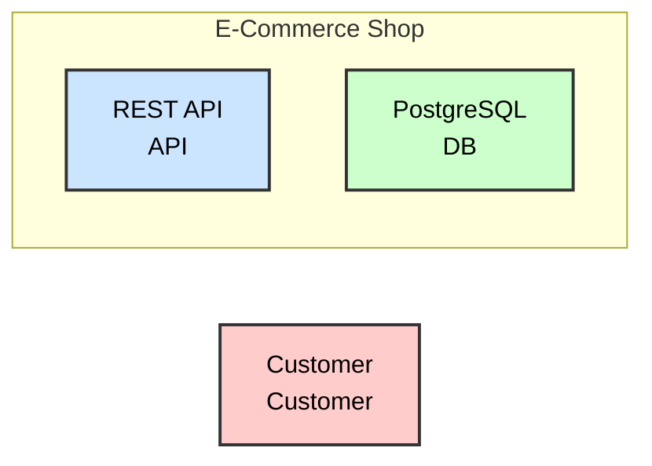
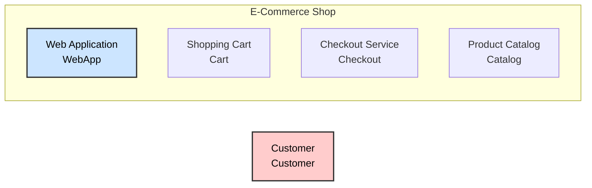
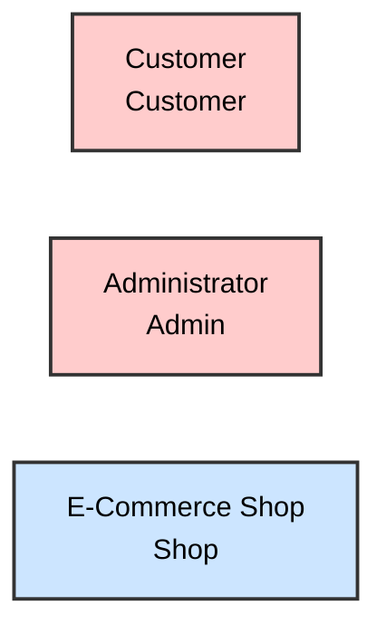
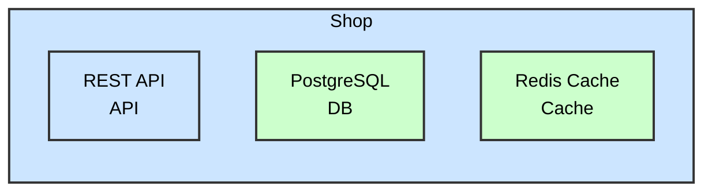
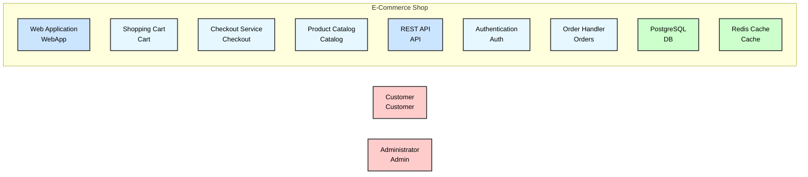

# Generated View Output

This page shows the **actual rendered output** from running Sruja view export commands.

## Example 1: Single View (Mermaid)

Running:

```bash
sruja export mermaid book/valid-examples/advanced-views.sruja --view api_focus
```

**Output:**



---

## Example 2: All Views (Markdown)

Running:

```bash
sruja export markdown book/valid-examples/advanced-views.sruja --all-views
```

**Output:**

````markdown
## Custom Views

### API Architecture

Shows the API layer and its dependencies


````

### Customer Experience

Components directly visible to customers



### System Context

External actors and system overview



### Data Layer

Shows databases and their consumers



````

---

## Example 3: Wildcard Pattern

With this view definition:
```sruja
view all_containers {
    title "All Containers"
    include Shop.*
}
````

Running:

```bash
sruja export mermaid book/valid-examples/advanced-views.sruja --view all_containers
```

**Output:**



---

## How to Generate These Outputs

### From CLI

```bash
# Single view to mermaid
sruja export mermaid book/valid-examples/advanced-views.sruja --view api_focus

# All views to markdown
sruja export markdown book/valid-examples/advanced-views.sruja --all-views > output.md
```

### From mdBook (Auto-generation)

Add a build step to your `book.toml` preprocessor or Makefile:

```bash
# Generate views as part of build
sruja export markdown book/valid-examples/advanced-views.sruja --all-views > book/src/generated/views.md
```

Then include in your markdown:

```markdown
{{#include ./generated/views.md}}
```
