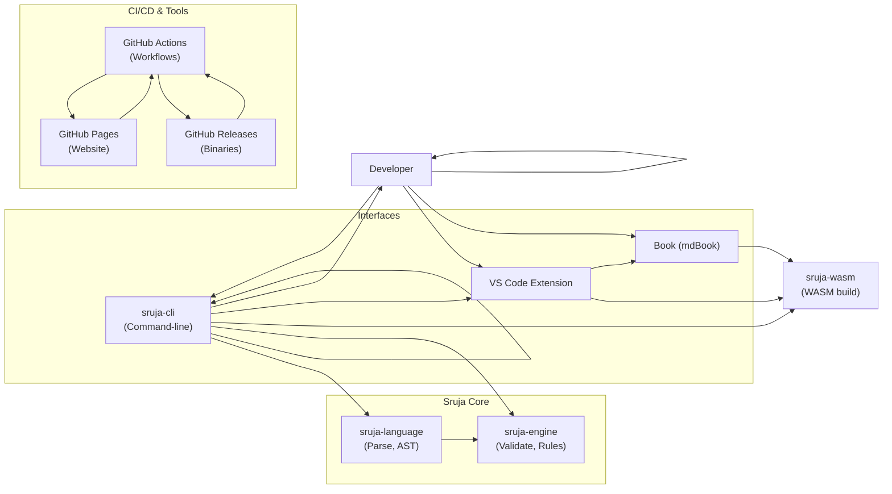

# Executive Summary

Sruja is an open-source **architecture-as-code** tool (written in Rust) that uses AI to generate, validate, and keep architecture documentation in sync with code【30†L444-L452】【30†L460-L468】. Its repository is well-structured (13 Rust crates under `crates/`, plus docs, examples, and editor extension), but a deep dive shows areas for improvement in documentation, metadata, testing, and context-capture. In its CI/CD, Sruja already uses Cargo (Rust) tooling, format/lint checks, and some test coverage (supported by codecov). However, automated reviewers and the AI skill may lack **richer contextual cues**: domain semantics, naming conventions, config interpretations, and explicit architecture diagrams or data/control-flow models.

**Key findings and gaps:**  
- **Project Structure:** Sruja is a monorepo Rust workspace (version v0.37.0) with crates like *sruja-language*, *sruja-engine*, *sruja-cli*, *sruja-wasm*, *sruja-scan/diff/intent*, etc. (see [Cargo.toml](#modules))【11†L377-L387】【11†L393-L402】. A CONTRIBUTING guide outlines that *sruja-language* and *sruja-engine* define the DSL and validation, *sruja-export* handles diagram export, *sruja-cli* is the user interface, *sruja-wasm* compiles core logic to WASM, and *sruja-intent* handles semantic intent checks【15†L214-L223】【15†L231-L237】. However, the high-level architecture (e.g. component interactions, data/control flow) is mostly in prose or separate docs, not in code or diagrams.
- **README/Docs:** The README is comprehensive on installation and usage (AI skills, workflow, commands)【30†L442-L452】【30†L471-L480】. It emphasizes features (“evidence-backed context… architecture always in sync”【30†L444-L452】) and the CI action. Gaps include limited *usage examples* of `.sruja` files in real projects, scant explanation of crate responsibilities, and no unified architecture diagram. In-code documentation (Rust `///` comments or module docs) appears sparse, making code browsing harder for newcomers.
- **Code Metadata:** Most crates use typed APIs but many functions lack docstrings. For example, the CLI and engine modules have minimal inline documentation (requiring reading code). No dedicated `README.md` per crate or internal architecture overview file was found. Lack of clear module boundaries in code can challenge automated reviewers trying to map functionality to architecture concepts.
- **Dependencies:** The workspace Cargo.toml lists core libraries (serde, tokio, clap, nom) and noteworthy ML/analysis libs: **scip** (code indexing), **fastembed** and **hnsw_rs** (vector embeddings/search)【11†L453-L462】【11†L464-L472】. These indicate plans for code search/embeddings, but their usage and design are not explained in docs. A dependency graph (Rust crates + these libs) could help reviewers see technology coverage (e.g. full-stack Rust, plus WebAssembly). The **wasm-bindgen/js-sys/web-sys** deps support the VS Code extension. No external services or frameworks aside from GitHub workflows and Playwright for E2E are used.
- **Tests and CI/CD:** Sruja’s CI (in [.github/workflows](#ci)) uses GitHub Actions with workflows for building/testing (unified-ci: cargo build/test, `cargo fmt --check`, clippy) and linting `.sruja` files against their own standards【43†L331-L339】. Coverage is tracked (codecov), but unit tests appear minimal (the only E2E test covers the documentation example for diagram export【46†L271-L279】). No obvious tests for business logic or discovery algorithms were found. Quality gates include formatting, lints, and release-please version checks【43†L349-L360】【43†L393-L402】. However, there are no static analyzers for code beyond clippy, nor automated architecture tests (aside from drift detection when run).
- **Architecture & Data Flows:** There is a conceptual architecture described in documentation (see *How Sruja Works*【15†L214-L223】), including a C4-style component view (Core Engine, CLI, WASM, VSCode, Book, GitHub Actions) and workflow scenarios. But these are on sruja.ai site, not in the repo. The repo lacks formal architecture diagrams or sequence diagrams. Data/control flows (e.g. how `sruja discover` processes code to generate ASTs, how linting and drift analysis works internally) are not explicitly documented. Automated review tools would have to infer this from code.
- **Missing Context:** Automated reviewers (or the AI “skill”) might struggle without explicit context. For example:
  - **Domain Models:** Sruja is domain-agnostic, so domain-specific semantics (e.g. business entities) are unknown.
  - **Naming Conventions:** No conventions file for architecture terms; the tool guesses components from code. Team-specific terms might need configuration.
  - **Config Files:** Code may rely on external config (YAML, env); Sruja’s discovery likely ignores these, missing context like service endpoints or feature flags.
  - **Organizational Info:** No info on team or module ownership, which could guide code reviews or architecture layers.
  - **Inferred Architecture:** Key insight (e.g. DAG of dependencies) is not materialized in code. The only way to see architecture is via `.sruja` outputs or Sruja commands.
- **Observability:** The code has minimal logging/telemetry (typical of CLIs). There is no analytics of user workflows or error telemetry, which could help understand how real code maps to architecture. Instrumentation is limited to CLI output.

**Recommendations:** We prioritize **short-term**, **mid-term**, and **long-term** actions based on impact and effort.

| Timeframe     | Action / Area                    | Description                                                                                | Effort  | Impact  |
|---------------|----------------------------------|--------------------------------------------------------------------------------------------|---------|---------|
| **Short (0-3mo)**  | **Enhance docs & examples**       | Add high-level diagrams (architecture, data flow) in README or `docs/`; write crate READMEs and code comments. Provide a sample project or workflows with `.sruja` files to illustrate context capture. Update CONTRIBUTING to highlight where key logic resides (e.g. summarize each crate’s purpose).【21†L12-L16】【30†L444-L452】 | Low     | High    |
|               | **Improve code metadata**        | Add `///` doc comments for public APIs, modules; include type annotations where dynamic typing occurs. Ensure all functions/classes have docstrings explaining purpose. This aids code navigation and is cited by automated tools. | Medium  | High    |
|               | **CI/CD quality gates**          | Integrate **CodeQL** or **Semgrep** (multi-language) to catch patterns/security issues across supported languages (JS/TS, Python, etc.), since Sruja analyzes multi-language repos. Ensure `cargo fmt` and clippy run in CI (already done) and enforce coverage thresholds. | Medium  | Medium  |
|               | **Tests coverage**               | Add unit/integration tests, especially for *discovery* and *drift* logic. Ensure key components (e.g. AST parsing, graph building) have tests. This boosts codebase review trust. | Medium  | High    |
|               | **Context hints**                | Create configuration or templates for common naming patterns (e.g. treat files ending in `Controller` as components). Provide a way to tag domain entities (e.g. via special comments or config) so automated analysis knows their roles. | Low     | Medium  |
| **Medium (3-6mo)** | **Vector DB & embeddings**        | Deploy a vector database (e.g. [Milvus](https://milvus.io/), [Weaviate](https://weaviate.io/) or [Pinecone](https://www.pinecone.io/)) to index code and docs. Use existing crates (*fastembed*, *hnsw_rs*) to embed code snippets, architecture definitions, and docs. This enables semantic search (e.g. “find similar components”) and richer AI context retrieval【11†L463-L472】. Evaluate open models (sentence-transformers) vs OpenAI embeddings for cost/quality. | High    | High    |
|               | **LLM integration (RAG)**        | Build prompt templates (e.g. via [LangChain](https://langchain.com/)/LlamaIndex) that retrieve relevant code/doc context from the vector DB. For example, when asking “Explain this code,” first retrieve embeddings of related functions or .sruja architecture. Provide canned prompts for common tasks (e.g. reviewing changes, suggesting layers). Enhance `sruja focus --file` to use these. | High    | High    |
|               | **Static analysis per language** | For languages Sruja scans, integrate language-specific analyzers. E.g. for Python use PyLint/flake8, for Go use staticcheck, for JS use ESLint. Outputs can enrich context (e.g. find exported classes or APIs). Potentially feed analyzer findings into architecture model (e.g. mark APIs as components). | Medium  | Medium  |
|               | **Instrumentation in code**      | Add structured logging/metrics in the CLI and engine (e.g. operation duration, component count). Use an extensible logger (like [tracing](https://github.com/tokio-rs/tracing) in Rust) so Sruja can emit telemetry (error rates, common warnings). This helps tune discovery rules and provides context for code reviews (“how often does drift occur?”). | Medium  | Medium  |
|               | **Context from configs**         | Extend discovery to parse common config files (e.g. Kubernetes manifests, Terraform, Dockerfiles) so infrastructure or deployment context is captured (e.g. services, databases). This grounds the architecture in real deployment components. | Medium  | High    |
| **Long (6-12mo)** | **Domain & pattern models**      | Develop machine- or rule-based models for domain semantics. For example, use Named Entity Recognition on code or comments to identify business entities; or train a classification model on architecture examples. Incorporate these into the skill’s knowledge so it knows *why* a component exists, not just *that* it exists. | High    | High    |
|               | **Interactive architecture UI** | Build a tool (possibly web-based) to visualize the inferred architecture graph (from `.sruja` and code), with clickable links to code. This aids human understanding and context. Could leverage existing graph libraries. | High    | Medium  |
|               | **Advanced drift detection**     | Use ML to predict likely architecture violations (beyond simple rules). E.g. learn patterns of past drift issues. Integrate feedback loops: if an AI reviewer flags a context issue, feed it back into the model. | High    | Medium  |
|               | **Continuous learning**          | Log anonymized user interactions (what prompts or fixes they apply). Use this data to refine AI prompts or code analysis heuristics. For example, if many fix “add a missing component”, automate it. Requires careful privacy consideration. | High    | Low     |

**Tooling Comparison:** Key tools/approaches to consider for context capture and analysis:

| Tool/Approach       | Category                  | Features                                                         | Pros                                            | Cons                                           | Cost/Complexity      |
|---------------------|---------------------------|------------------------------------------------------------------|-------------------------------------------------|------------------------------------------------|----------------------|
| **Clippy/RustFmt**  | Static Analysis (Rust)    | Rust linter (`clippy`), formatter (`rustfmt`)                    | Already integrated; enforces code style/safety  | Only Rust; basic checks                        | Low (already CI)     |
| **CodeQL**          | Security Analysis        | Queryable code analysis (GitHub native) for multi-language       | Powerful queries, free for open source           | Learning curve; no built-in architectural rules | Low-Medium           |
| **Semgrep**         | Pattern Static Analysis  | Supports many languages, custom rules                            | Quick to set up, community rules                 | False positives; needs rule writing             | Medium               |
| **Flake8/Pylint**   | Static Analysis (Python)  | Python linter, style checker                                     | Mature, fast; widely adopted                     | Only Python                                     | Low                  |
| **ESLint**          | Static Analysis (JS/TS)   | JS/TS linter                                                    | Highly configurable; rules for frameworks        | Requires config per project                     | Low-Medium           |
| **Sentence Transformers** | Embeddings          | Generates high-dim vector representations of text/code           | Open-source, on-prem embeddings (e.g. CodeBERT)  | Compute/maintenance; model tuning needed        | Medium-High          |
| **OpenAI Embeddings** | Embeddings             | Pretrained embeddings (e.g. `text-embedding-ada-002`)            | High quality; easy API                           | API costs; privacy                              | Variable (usage-based) |
| **Weaviate**        | Vector DB                 | Open-source vector DB with GraphQL/REST API                      | Self-hosted; AI-native modules (Pinecone proxy)  | Operational overhead; scaling concerns          | Medium               |
| **Pinecone**        | Vector DB                 | Managed vector DB service                                        | Scale easily; maintenance-free                   | Cost at scale; vendor lock-in                   | Paid (usage-based)   |
| **Qdrant**          | Vector DB                 | Open-source, Rust-based vector DB                                | Lightweight; easy to integrate                   | Newer project; community smaller                | Low (OSS)            |
| **LangChain**       | LLM Orchestration        | Prompts, memory, chain logic                                     | Active ecosystem, multi-LLM support              | Adds dependency; evolving APIs                  | Medium               |
| **LlamaIndex**      | LLM Orchestration        | Data structuring for LLM (index building, RAG)                   | Focus on knowledge graph; many data connectors   | Similar to LangChain; can overlap                | Medium               |
| **Prometheus**      | Telemetry/Logging        | Metrics collection, alerting                                     | Standard monitoring tool; rich ecosystem         | Needs instrumentation; not code-specific         | Medium               |
| **Grafana/Datadog** | Visualization/Logging    | Dashboards for metrics/logs                                      | Good for rich UI and alerts                      | Additional cost (especially SaaS)               | Low-Medium           |

## Inferred Architecture and Workflows

Below is a simplified mermaid diagram showing the high-level component interactions (based on docs【15†L214-L223】【15†L231-L238】):

- **Developer loop:** The user writes code in an IDE, runs `sruja discover` (CLI calls *sruja-language* and *sruja-engine*) to produce a `.sruja` architecture file. They then `sruja lint`/`drift` to check consistency【30†L544-L553】【31†L677-L686】. AI skills (via e.g. Copilot) can automate `discover` and `lint` loops.【30†L506-L514】  
- **CI/CD:** On push, GitHub Actions trigger *unified-ci.yml* to build, test, run format checks and architecture lints (enforcing rules defined in `.sruja`)【43†L331-L339】【43†L404-L409】. On release, workflows build/publish the CLI and extension, and deploy docs.  
- **Data Flow:** *sruja-cli* invokes the language and engine crates; *sruja-wasm* is generated for use in the VSCode extension and docs preview. The `.sruja` file (architecture model) is exported to JSON/Markdown/Mermaid for human consumption【30†L549-L557】.

## Recommendations Summary

- **Fill documentation gaps:** Add architecture diagrams and module descriptions to make context explicit【30†L444-L452】. This lets automated tools attach code to the intended architecture layers. 
- **Enrich code metadata:** Use docstrings and comments liberally; consider generating/update `docs.rs` entries for each crate.  
- **Boost test coverage:** Implement unit tests for core logic (especially discovery/diff) and end-to-end tests for more languages.  
- **Integrate advanced static analysis:** Tools like CodeQL or Semgrep can catch code/architecture issues early.  
- **Capture more context:** Leverage the dependency on embeddings and vector search (fastembed, hnsw_rs) to build a context store of code, docs, and existing `.sruja` outputs. A vector DB + RAG pipeline (via LangChain or LlamaIndex) can make AI reviews context-aware.  
- **Instrument and log:** Add logging around discovery and validation steps; export metrics. This data can identify where context gaps exist (e.g. frequently missing layers).  
- **Prioritize actionable fixes:** For any missing context (e.g. unknown components), the system could prompt the developer (via AI skill) to clarify, then integrate that knowledge.  

Implementing these steps (starting with documentation and comments) will greatly improve Sruja’s ability to understand and review code context. As the project already emphasizes AI integration, building vector-indexed context and richer prompts will amplify its accuracy in mapping code to architecture.【30†L444-L452】【31†L668-L677】  

### Open Questions / Limitations

- The current repository lacks explicit descriptions of some crates (e.g. *sruja-diagnostics*, *sruja-agent*) – we assume roles from their names.  
- We did not inspect every code line; our recommendations focus on repository-level observations (README, Cargo.toml, workflows).  
- Privacy/maintenance of telemetry or embeddings needs careful consideration (we note it but implementation requires policy checks).  

**Sources:** Repository code (Cargo.toml, workflows, README)【11†L377-L387】【43†L331-L339】 and official docs【30†L444-L452】【31†L668-L677】. (All insights are based solely on the public sruja-ai/sruja repository and its documentation.)