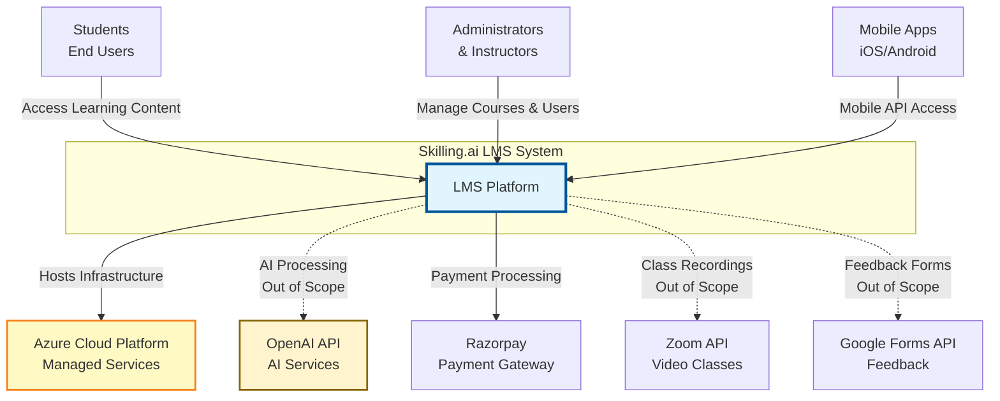
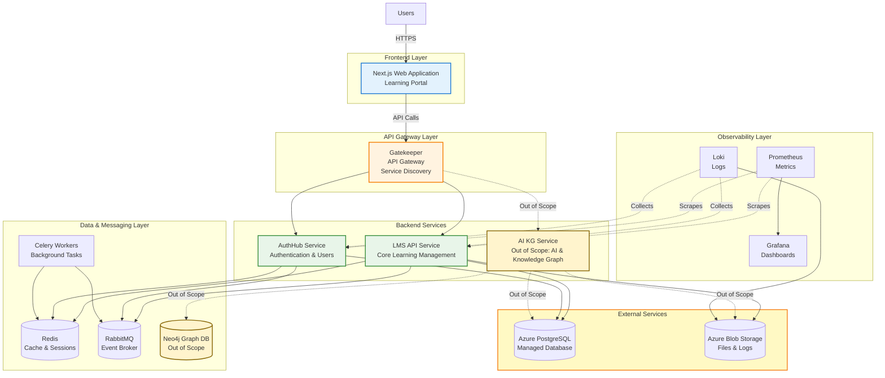
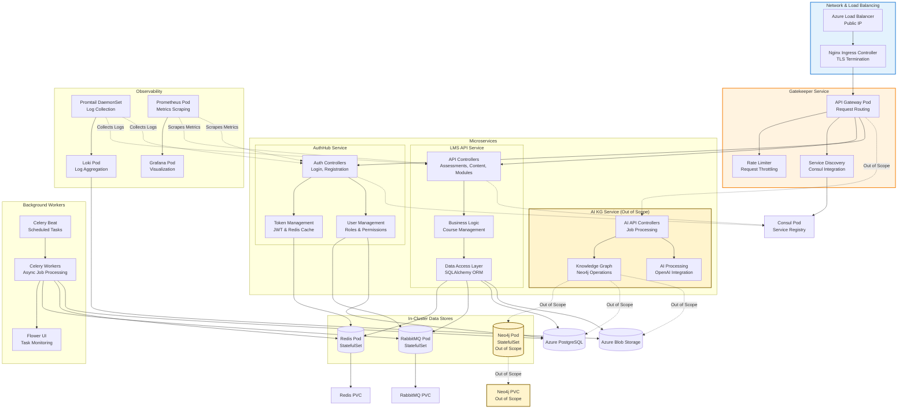

# Implementation Proposal: Skilling.ai LMS on Azure Kubernetes

**Date:** December 23 2025  
**Prepared For:** Skilling.ai  
**Prepared by:** Dilip Kola

---

## 1. Executive Summary

This document proposes a robust, scalable, and cost-efficient deployment architecture for the Skilling.ai Learning Management System (LMS). The solution leverages **Azure Kubernetes Service (AKS)** with Kubernetes providing a cloud-agnostic container orchestration platform that ensures high availability and simplifies future on-premise or multi-cloud deployments.

This proposal focuses on **essential LMS services only** - core learning management features (assessments, content, modules, questions, user management). **Starting at ~$190/month**.

By decoupling the application state (Databases) from the application logic (Microservices), we achieve a balance of **reliability** (through Managed PostgreSQL) and **cost optimization** (through efficient cluster packing).

**Note:** Architecture diagrams include non-essential components (AI KG Service, Neo4j) for reference, but these are **Out of Scope** for this deployment proposal.

## 2. Solution Architecture

The architecture follows a microservices pattern deployed on Kubernetes, utilizing Azure's managed services where they add the most value for stability.

### Architecture Diagrams (C4 Model)

We use the **C4 Model** to describe the architecture at different levels of detail, making it easier to understand for different audiences:

- **L1: System Context** - High-level view for stakeholders (shows system boundaries and external dependencies)
- **L2: Container/System** - Technical overview for architects (shows main applications, databases, and services)
- **L3: Component** - Detailed view for developers (shows internal components of each service)

#### L1: System Context Diagram

Shows the high-level view of the system and its relationships with users and external systems.

#### L2: Container/System Architecture Diagram

Shows the high-level technical building blocks and how they interact.

#### L3: Detailed Component Diagram (AKS Cluster)

Shows the detailed components within the Azure Kubernetes Service cluster, focusing on internal service components.

### Microservices Architecture

The backend consists of **core services** (required for LMS functionality) and **Out of Scope services** (enhancement features):

#### Core Backend Services (Required for LMS)

| Service        | Port | Purpose                                                                  | Key Dependencies            |
| -------------- | ---- | ------------------------------------------------------------------------ | --------------------------- |
| **Gatekeeper** | 8000 | API Gateway, Service Discovery, Rate Limiting, Request Routing           | Consul                      |
| **LMS API**    | 8080 | Core LMS functionality (assessments, content, modules, questions, users) | PostgreSQL, Redis, RabbitMQ |
| **AuthHub**    | 9000 | Authentication & User Management                                         | PostgreSQL, Redis, RabbitMQ |

**Note:** AI KG Service (port 9001) and Neo4j shown in architecture diagrams are **not included** in this deployment proposal, which focuses on essential LMS services only.

### Key Components

| Component             | Technology         | Hosting Strategy                             | Rationale                                                                                                                                     |
| --------------------- | ------------------ | -------------------------------------------- | --------------------------------------------------------------------------------------------------------------------------------------------- |
| **Orchestrator**      | Kubernetes 1.29+   | Azure AKS                                    | Industry standard, allows customers to deploy on their own infra later.                                                                       |
| **Database**          | PostgreSQL 16      | **Managed Azure Database** (Flexible Server) | **Critical State.** Managed service guarantees 99.99% SLA, auto-backups, and point-in-time restore. Kept outside K8s for maximum reliability. |
| **Broker**            | RabbitMQ           | In-Cluster (Helm Chart)                      | **Portable.** Keeps the stack self-contained for easy replication. Used for event publishing.                                                 |
| **Cache**             | Redis              | In-Cluster (Helm Chart)                      | **Low Latency.** Session management, caching, and Celery task broker.                                                                         |
| **Service Discovery** | Consul             | In-Cluster                                   | Enables dynamic service registration/discovery for microservices.                                                                             |
| **Ingress**           | Nginx              | In-Cluster                                   | Standard, easy to configure TLS termination and routing. Routes to Gatekeeper API Gateway.                                                    |
| **Storage**           | Azure Blob Storage | Azure Managed                                | Application file storage (uploads, CVs, attachments) + log storage via Loki.                                                                  |

## 3. Networking & Public Access

Access to the cluster is strictly controlled via the **Ingress Controller**.

### Public Endpoints

An **Nginx Ingress Controller** will be provisioned behind a single Azure Standard Load Balancer (Public IP). This routes all traffic to the **Gatekeeper API Gateway**, which then forwards requests to appropriate backend services.

**Request Flow:** User → Load Balancer → Nginx Ingress → Gatekeeper (API Gateway) → Backend Services (LMS API / AuthHub)

**Note:** Subdomain names listed below are examples and **must be confirmed by the client** before implementation. These will be configured via:

- **Kubernetes Ingress** annotations and routing rules
- **DNS A/CNAME records** pointing to the Azure Load Balancer IP
- **Environment variables** for frontend API URLs (`NEXT_PUBLIC_BACKEND_API_URL`)
- **CORS configuration** in backend services to allow the frontend domain

| Endpoint         | URL Example                    | Description                                                               | Access Level             |
| :--------------- | :----------------------------- | :------------------------------------------------------------------------ | :----------------------- |
| **LMS Frontend** | `https://learning.skilling.ai` | Main User Interface for students/admins.                                  | Public                   |
| **API Gateway**  | `https://api.skilling.ai`      | Backend API Gateway (Gatekeeper). Routes to LMS API and AuthHub services. | Public (CORS restricted) |
| **Grafana**      | `https://monitor.skilling.ai`  | Observability Dashboards (Logs/Metrics).                                  | **Restricted** (OAuth)   |

### Accessing Grafana & Observability

To ensure security while maintaining accessibility for the operations team, we propose a two-tiered access strategy:

#### 1. Zero-Trust Web Access (Recommended for Grafana)

Instead of a heavy VPN client, we use an **Identity Aware Proxy**.

- **Mechanism**: We place **OAuth2-Proxy** in front of Grafana.
- **Flow**: User visits `monitor.skilling.ai` -> Redirected to **Google/Azure AD Login** -> Upon success, access is granted.
- **Benefit**: No VPN client needed, secure, and uses existing corporate credentials.
- **Cost**: **Free**. Uses open-source `oauth2-proxy` and the **Free Tier** of Azure AD (Entra ID) or Google Auth.

#### 2. Kubernetes API Access (`kubectl`)

**You are correct.** We do **not** need a VPN for cluster management.

- **Mechanism**: AKS integration with **Azure Active Directory (Entra ID)**.
- **Flow**: Developers run `az aks get-credentials`. Authentication is handled via browser popup (OAuth). access is controlled via Kubernetes RBAC.
- **Cost**: **Free**.

#### 3. Database Administrative Access

Since the Database is in a **Private Subnet** (security best practice), we use a "Bastion Pod" and `kubectl port-forward` for secure database access. This provides **$0 Cost** administrative access without requiring a VPN.

## 4. External Service Dependencies

The application requires internet connectivity for the following third-party services:

| Service              | Purpose                                             | Cost Model             | Notes                                                                                                  |
| -------------------- | --------------------------------------------------- | ---------------------- | ------------------------------------------------------------------------------------------------------ |
| **OpenAI API**       | AI model inference (GPT-4o) - Used by AI KG Service | Pay-per-use (Variable) | **Only required if deploying AI KG Service.** Costs vary based on API usage volume (tokens processed). |
| **Razorpay**         | Payment processing                                  | Transaction-based      | Indian payment gateway for course payments.                                                            |
| **Zoom API**         | Video class recordings                              | Per account            | **Out of Scope** feature for live classes and recordings.                                              |
| **Google Forms API** | Feedback collection                                 | Free tier available    | **Out of Scope** feature for course feedback.                                                          |

**Important Notes:**

- **OpenAI API costs can vary significantly** based on usage volume and should be monitored separately. Only required if AI KG Service is deployed.
- All external services require internet connectivity from the cluster.

* Rate limiting should be configured to prevent excessive API costs.

## 5. Cost Optimization Strategy & Estimated Pricing

### Monthly Cost Estimate (Indicative)

**Recommended Region: Central India (Pune)**.
_Reasoning_: This is currently the only Azure region in India that supports **Availability Zones**, which is non-negotiable for a high-reliability production setup.

---

### Production Environment Cost Estimate

**Essential LMS Services Only** - **~$190/month**

| Component              | SKU / Configuration                      | Quantity     | Est. Monthly Cost | Notes                                                        |
| :--------------------- | :--------------------------------------- | :----------- | :---------------- | :----------------------------------------------------------- |
| **AKS Cluster**        | `Standard_D2s_v5` (2 vCPU, 8GB RAM)      | 2 (Reserved) | ~$85              | Single scalable pool, 1-Year Reserved, scales up to 10 nodes |
| **PostgreSQL DB**      | Flexible Server `B2ms` (2 vCPU, 8GB RAM) | 1            | ~$65              | Burstable tier, sufficient for initial load                  |
| **Storage & Network**  | Blob (App Files + Logs) + LB             | -            | ~$30              | Application files, logs, and Public IP                       |
| **Persistent Volumes** | Standard SSD                             | -            | ~$10              | RabbitMQ and Redis data                                      |
| **Total**              |                                          |              | **~$190 / month** | Scales automatically with traffic                            |

_Note: Prices are estimates based on **Central India** region pricing._

**Note on Architecture Diagrams:** The diagrams below show non-essential components (AI KG Service, Neo4j) for architectural understanding. These are **Out of Scope** in this proposal, which focuses on essential LMS services only.

### Strategies Explained

1.  **"Start Small, Scale Big" Strategy:**
    - **Consolidated Nodes:** We run System and User pods on the same pool initially to save the ~$60/mo overhead of a dedicated system pool.
    - **Autocaling:** The cluster is configured to automatically add more nodes (Spot or On-Demand) as soon as user traffic increases. You only pay for that extra capacity _when_ users arrive.

To ensure the solution remains budget-friendly without sacrificing performance:

1.  **Spot Instances for Workers:**
    - Utilize **Azure Spot Node Pools** for stateless workloads like _Celery Workers_. This can reduce compute costs by up to **90%**.
    - Keep critical services (API, DBs) on standard Reserved Instances.

2.  **In-Cluster Data Services:**
    - Running Redis and RabbitMQ inside the cluster avoids the high premium of fully managed cloud equivalents for these specific secondary data stores.
    - Neo4j is run in-cluster only when AI KG Service is deployed (Out of Scope). For LMS-only deployments, Neo4j is not required, saving ~$50-100/month.

3.  **Storage Efficiency:**
    - **Application Files**: Azure Blob Storage (Hot tier) for uploads, CVs, attachments. Cost-effective for file storage.
    - **Logs**: Shipped via **Loki** to **Azure Blob Storage (Cool tier)** instead of expensive Managed Disks, drastically reducing long-term retention costs.

### Potential Additional Costs (Transparency Check)

These items are effectively usage-based and excluded from the fixed monthly estimates above.

| Item                               | Estimated Range | Notes                                                                                                     |
| :--------------------------------- | :-------------- | :-------------------------------------------------------------------------------------------------------- |
| **Azure Container Registry (ACR)** | ~$5.00 / month  | (Basic SKU) Required to store your private Docker images.                                                 |
| **Data Transfer (Egress)**         | ~$0.08 / GB     | Cost of data sent _out_ to the internet (e.g., students loading the app). First 100GB is free.            |
| **Azure DNS Zone**                 | ~$0.50 / month  | Hosting the `skilling.ai` DNS records.                                                                    |
| **Persistent Volumes (Disks)**     | ~$10 / month    | Storage for RabbitMQ and Redis (Standard SSD)                                                             |
| **Azure Blob Storage (App Files)** | ~$5-15 / month  | Application file storage (uploads, CVs, attachments). Separate from log storage. Depends on usage volume. |
| **Backup Storage**                 | ~$0.02 / GB     | If Database backups exceed the allocated free storage.                                                    |

## 6. Reliability & High Availability

- **Managed PostgreSQL:** High availability with Zone Redundant configuration for production to survive zone failures.
- **Pod Disruption Budgets (PDB):** Configured to ensure minimum available instances during upgrades.
- **Horizontal Pod Autoscaling (HPA):** Automatically scales frontend/backend pods based on CPU/Memory pressure.
- **Liveness/Readiness Probes:** Configured (as seen in docker-compose) to ensure traffic is only sent to healthy pods.

### Backup & Disaster Recovery (DR)

- **PostgreSQL**: Automatic geo-redundant backups via Azure Managed Service (7-35 day retention).
- **Azure Blob Storage**: Application files stored with redundancy. Backup policies can be configured for critical data.
- **Disaster Recovery**: Infrastructure-as-Code (Terraform) allows rapid re-provisioning of the entire cluster in a secondary Azure region. Terraform modules can be adapted for other cloud providers if needed.

### Security Enhancements

- **Secrets Management**: Integration with **Azure Key Vault Provider for Secrets Store CSI Driver** to securely manage sensitive credentials.
- **Network Security**: All internal communication (Pod-to-Pod) is restricted via Network Policies.

## 7. Observability Plan (The "Missing Pieces")

To move from "deployment" to "production grade," we integrate the following:

### Logging (Loki Stack)

Instead of expensive Azure Monitor Logs or ELK, we use the **PLG Stack (Promtail + Loki + Grafana)**.

- **Promtail**: Runs as a DaemonSet, scraping container logs.
- **Loki**: Aggregates logs and effectively stores them in Azure Blob Storage.
- **Grafana**: Single pane of glass for visualization.

### Metrics (Prometheus)

- Deploy **kube-prometheus-stack** via Helm.
- Provides out-of-the-box dashboards for Cluster Health, Node usage, and Pod performance.

**Implementation Note:** Currently, the application services (LMS API, AuthHub) do not expose Prometheus metrics endpoints. To enable full metrics collection, the following integration work will be performed:

- Add Prometheus client libraries to FastAPI services (Python: `prometheus-client`)
- Instrument application endpoints to expose metrics (request counts, latency, error rates)
- Configure service endpoints for Prometheus scraping (`/metrics` endpoints)
- Add custom business metrics (user registrations, course completions, etc.) as needed
- Create Grafana dashboards for application-specific metrics

**Customer Action:** Please confirm if custom business metrics (e.g., user registrations, course completions, payment transactions) are required for monitoring dashboards.

This work will enable application-level metrics collection in addition to the infrastructure-level metrics (CPU, memory, pod health) provided by kube-prometheus-stack.

### Celery Monitoring (Flower)

- **Flower** (port 5555) deployed for monitoring Celery tasks
- Provides UI for viewing task status, worker health, and debugging background jobs

## 8. Deployment & Deliverables for Clients

To fulfill the requirement of "allowing customers to deploy on their own infrastructure," we will develop and provide **Terraform-based Infrastructure as Code (IaC)** for Azure deployment as part of the implementation.

### Infrastructure as Code (Terraform)

**Terraform** provides a declarative approach to infrastructure management, making deployments reproducible and version-controlled.

- **Initial Delivery**: We will develop and deliver complete Terraform modules for **Azure** deployment
- **Future Flexibility**: Terraform modules can be adapted for other cloud providers (AWS, GCP) or on-premise Kubernetes if customers desire additional deployment options

**Benefits:**

- Single source of truth for infrastructure definitions
- Version-controlled infrastructure with Git
- Reproducible deployments across environments
- Consistent deployment patterns
- Easy modifications and updates

### Deployment Artifacts

1. **Terraform Modules (To Be Developed)**: Complete Azure infrastructure definitions including:
   - Azure Kubernetes Service (AKS)
   - Managed PostgreSQL database (Azure Database for PostgreSQL)
   - Azure Blob Storage
   - Networking (VNet, Load Balancers, Public IPs)
   - Azure Container Registry (ACR)
   - Monitoring and logging infrastructure
   - **Note:** Terraform modules for AWS, GCP, or other cloud providers can be provided in the future if customers require them

2. **Helm Charts (To Be Developed)**: Kubernetes workload deployment:
   - Universal Helm Chart: `helm install skilling-lms`
   - Configuration via `values.yaml`:
     - Toggling between external Postgres (Cloud-managed) and internal Postgres (On-Prem)
     - **Enabling/disabling AI KG Service** and Neo4j (for LMS-only deployments)
     - Configuring service discovery (Consul vs K8s-native)
     - Cloud provider-specific configurations

3. **CI/CD Pipeline**: Fully automated GitHub Actions workflows that provide:
   - **Automated builds**: Docker images built on every code change
   - **Container registry integration**: Automatic push to Azure Container Registry (ACR)
   - **Automated testing**: Run tests before deployment
   - **Consistent deployments**: Same process every time, eliminating human error
   - **Rollback capability**: Quick reversion to previous working versions
   - **Deployment history**: Complete audit trail of what was deployed and when

### Why CI/CD is Essential

**Manual deployments are risky and time-consuming:**

| Challenge           | Manual Deployment                | CI/CD Automated           |
| ------------------- | -------------------------------- | ------------------------- |
| **Deployment Time** | 30-60 minutes                    | 5-10 minutes              |
| **Human Error**     | High risk (typos, wrong configs) | Eliminated (automated)    |
| **Consistency**     | Varies by person                 | Always identical          |
| **Rollback**        | Manual, error-prone              | One-click revert          |
| **Audit Trail**     | Manual documentation             | Automatic logging         |
| **Testing**         | Often skipped to save time       | Always runs automatically |
| **Availability**    | Requires engineer availability   | Runs 24/7                 |

**Key Benefits:**

- **Faster Releases**: Deploy changes in minutes instead of hours
- **Higher Reliability**: Automated processes eliminate human errors
- **Better Quality**: Automated testing catches issues before production
- **Cost Savings**: Reduces engineer time spent on repetitive deployment tasks
- **Business Agility**: Release features faster, respond to market changes quickly
- **Disaster Recovery**: Automated deployments mean faster recovery from failures
- **Team Productivity**: Engineers focus on building features, not deploying them

**For Skilling.ai specifically:**

- **Multiple Environments**: Easily manage staging and production deployments
- **Customer Updates**: Quickly deploy bug fixes and new features to customers
- **Compliance**: Automated deployment logs satisfy audit requirements
- **Scalability**: As your team grows, CI/CD scales with you (no deployment bottlenecks)

**Implementation Approach:**

- **Phase 1**: Automated builds and staging deployments
- **Phase 2**: Manual approval for production deployments (one-click promotion of tested images)

### Future Cloud Provider Support

The Kubernetes-based architecture provides portability across cloud providers. While we are delivering complete Terraform definitions for **Azure** in this proposal, the architecture can be adapted for other cloud providers in the future:

- **AWS Deployment**: Can be adapted to use EKS, RDS PostgreSQL, S3 (if customer requires)
- **GCP Deployment**: Can be adapted to use GKE, Cloud SQL, Cloud Storage (if customer requires)
- **On-Premise**: Kubernetes manifests work on any Kubernetes cluster

**Delivery Scope**: We will develop and deliver complete Terraform modules and deployment documentation for **Azure**. Adaptations for other cloud providers can be provided based on customer requirements.

### Implementation Roadmap

To move from the current application code to the full production deployment described above, the following implementation phases will be executed:

#### Phase 1: Infrastructure Automation (Weeks 1-2)

- **Terraform Development**: Create modules for AKS, PostgreSQL, ACR, and Networking.
- **Helm Chart Creation**: Package all microservices (`lmsapi`, `authhub`, `gateway`) into a unified `skilling-lms` chart.
- **Secrets Management**: Set up Azure Key Vault integration.

#### Phase 2: CI/CD & Security (Week 3)

- **Pipeline Setup**: Implement GitHub Actions for automated building and testing.
- **Security Scanning**: Integrate container scanning and secret detection.
- **Access Control**: Configure RBAC and PIM for team access.

#### Phase 3: Observability & Validation (Week 4)

- **Monitoring Setup**: Deploy Prometheus/Grafana stack and configure dashboards.
- **Load Testing**: Validate cluster autoscaling rules.
- **Client Handoff**: Deliver source code, documentation, and transfer ownership.

### Deployment Workflow (CI/CD)

**Phased Implementation Approach:**

#### Phase 1: Automated Staging

- Every push to `develop` branch automatically:
  1. Builds Docker images
  2. Runs automated tests
  3. Deploys to Staging environment
- **Time Savings**: Eliminates 30-60 minutes of manual work per deployment

#### Phase 2: Manual Production Promotion

- Production deployments require manual approval button click
- One-click promotion of the _exact same Docker image_ already tested in Staging
- **Benefits**: Maximum control, quick deployments (5 minutes), complete audit trail

#### 3. Customer Deployment Package

For customers deploying on their own infrastructure, the final delivery package will include:

- **Terraform Modules**: Complete Azure infrastructure definitions
- **Helm Charts**: Kubernetes workload deployment (works on any Kubernetes cluster)
- **Documentation**: Step-by-step Azure deployment guide
- **Support**: Initial deployment assistance and troubleshooting

**Cloud Provider Support**: We deliver complete Terraform definitions and deployment guides for **Azure**. If customers require deployments on AWS, GCP, or other cloud providers in the future, we can provide adapted Terraform modules based on customer needs.

---

## Appendix A: Access Requirements for Implementation

To implement this deployment independently and efficiently, we require the following access:

### Essential Access Requirements

#### 1. Azure Cloud Access

- **Role:** **Owner** or **User Access Administrator** (required for assigning Role Based Access Control)
- **Resources Needed:**
  - Azure Kubernetes Service (AKS) - Cluster Admin role
  - Azure Database for PostgreSQL - Database Admin (temporary for setup)
  - Azure Blob Storage - Storage Blob Data Contributor
  - Azure Container Registry (ACR) - AcrPush role
  - Azure Key Vault - Key Vault Secrets User
  - Azure DNS - DNS Zone Contributor
- **Access Method:** User account + Service Principal (for CI/CD automation)
- **Note on Permissions:** "Contributor" role is **insufficient** as it does not allow assigning roles (e.g., granting AKS permission to pull images from ACR).

#### 2. Source Code & CI/CD Access

- **GitHub:** Write access to repositories containing:
  - Application codebase
  - Infrastructure as Code (Terraform modules, Helm charts, K8s manifests)
  - CI/CD pipeline configurations
- **GitHub Actions Secrets Required:**
  - `AZURE_CLIENT_ID`, `AZURE_CLIENT_SECRET`, `AZURE_SUBSCRIPTION_ID`, `AZURE_TENANT_ID`
  - `ACR_NAME`, `AKS_CLUSTER_NAME`, `AKS_RESOURCE_GROUP`

#### 3. Database Access

- **PostgreSQL:** Superuser/Admin access for initial schema setup and migrations
- **Post-Setup:** Application uses connection strings from Key Vault (no direct admin access needed)

#### 4. DNS Management

- **DNS Zone Contributor** role for managing DNS records
- Subdomain names to be confirmed by client (examples: `learning.skilling.ai`, `api.skilling.ai`, `monitor.skilling.ai`)

### Security & Access Management

**Access Model:**

- **Principle of Least Privilege:** Minimum required access only
- **Service Principals:** For automated CI/CD pipelines
- **Time-Bound Access:** Access limited to implementation period
- **Audit Logging:** All access logged and auditable
- **Access Revocation:** Immediate revocation upon completion

**Access Request Process:**

<ol>
<li>Provide Azure Subscription ID and Resource Group name</li>
<li>Assign RBAC roles via Azure Portal or CLI</li>
<li>Create Service Principal for CI/CD automation</li>
<li>Grant GitHub repository access</li>
<li>Share database admin credentials securely (rotate after setup)</li>
<li>Provide DNS access (if managing DNS)</li>
</ol>

### Implementation Approach

We require direct access to Azure resources for fast, independent execution:

- **Owner** or **User Access Administrator** role at Resource Group level (for IAM management)
- **Service Principal** for CI/CD automation
- **AKS Cluster Admin** for Kubernetes deployment
- **Database Admin** (temporary) for initial schema setup

This approach enables rapid implementation without dependencies on client team availability for each operation.

### Pre-Implementation Checklist

Required before starting:

- [ ] Azure subscription and resource group created
- [ ] **Owner** or **User Access Administrator** role assigned at Resource Group level
- [ ] Service Principal created with Contributor role
- [ ] GitHub repository write access granted
- [ ] Database admin credentials provided (temporary, rotate after setup)
- [ ] DNS Zone Contributor role assigned (for DNS management)
- [ ] Azure Key Vault created and configured
- [ ] Communication channel established (Slack/Teams/Email)

---
