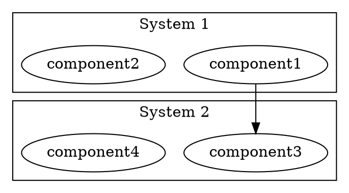
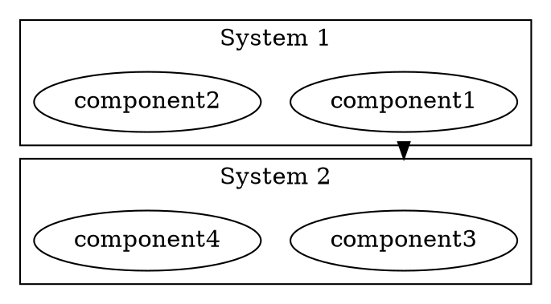

# Container Layout Implementation Guide

## Quick Start: The Main Fix

The single most impactful change is adding `lhead`/`ltail` attributes to cross-cluster edges.

## Before vs After

### Before (Current Sruja)



**Result**: Edge goes from component1 to component3, may cross through cluster borders awkwardly.

### After (With lhead/ltail)



**Result**: Edge starts at System1's boundary and ends at System2's boundary, like a real container-to-container connection.

## Code Changes Required

### 1. Pass parentMap to edge writer

**File**: `pkg/export/dot/dot_generator.go`

```go
func GenerateDOTFromConstraints(
  elements []*Element,
  _ []*Relation,
  constraints LayoutConstraints,
) string {
  sb := engine.GetStringBuilder()
  defer engine.PutStringBuilder(sb)

  writeGraphHeaderFromConstraints(sb, constraints, len(elements))
  writeGlobalNodeAttributesFromConstraints(sb)
  writeGlobalEdgeAttributesFromConstraints(sb)

  rootElements, clusters := groupByParent(elements)

  if constraints.ViewLevel == 3 {
    for _, children := range clusters {
      rootElements = append(rootElements, children...)
    }
    clusters = make(map[string][]*Element)
  }

  for _, elem := range rootElements {
    writeNodeFromConstraints(sb, elem, constraints, "  ")
  }

  for parentID, children := range clusters {
    writeClusterFromConstraints(sb, parentID, children, elements, constraints)
  }

  writeRankConstraintsFromData(sb, constraints.Ranks)

  // NEW: Build parentMap for edge writer
  parentMap := make(map[string]string)
  for _, elem := range elements {
    parentMap[elem.ID] = elem.ParentID
  }

  // Pass parentMap to edge writer
  writeEdgesFromConstraints(sb, constraints.Edges, parentMap)

  sb.WriteString("}\n")
  return sb.String()
}
```

### 2. Modify edge writer to add lhead/ltail

**File**: `pkg/export/dot/dot_generator.go`

```go
// writeEdgesFromConstraints writes edges from constraint data.
func writeEdgesFromConstraints(sb *strings.Builder, edges []EdgeConstraint, parentMap map[string]string) {
  for _, edge := range edges {
    attrs := []string{}

    // Add label if present
    if edge.Label.Text != "" {
      attrs = append(attrs, fmt.Sprintf("label=\"%s\"", escapeLabel(edge.Label.Text)))
      attrs = append(attrs, fmt.Sprintf("fontsize=%d", FontSizeEdge))
      attrs = append(attrs, fmt.Sprintf("fontcolor=\"%s\"", ColorSlate700))
      attrs = append(attrs, "labelfloat=false")

      if edge.Label.Distance != 0 {
        attrs = append(attrs, fmt.Sprintf("labeldistance=%.2f", edge.Label.Distance))
      }
      if edge.Label.Angle != 0 {
        attrs = append(attrs, fmt.Sprintf("labelangle=%.2f", edge.Label.Angle))
      }
      if edge.Label.Position != 0.5 {
        attrs = append(attrs, fmt.Sprintf("labelpos=%.2f", edge.Label.Position))
      }
    }

    // Add weight
    if edge.Weight > 0 {
      attrs = append(attrs, fmt.Sprintf("weight=%d", edge.Weight))
    }

    // Add minimum length
    if edge.MinLen > 0 {
      attrs = append(attrs, fmt.Sprintf("minlen=%d", edge.MinLen))
    }

    // Add ports if specified
    fromPort := ""
    toPort := ""
    if edge.Ports.Tail != "" {
      fromPort = ":" + edge.Ports.Tail
    }
    if edge.Ports.Head != "" {
      toPort = ":" + edge.Ports.Head
    }

    // NEW: Add lhead/ltail for cross-cluster edges
    fromParent, hasFrom := parentMap[edge.From]
    toParent, hasTo := parentMap[edge.To]

    // Add ltail if tail node is in a cluster
    if hasFrom && fromParent != "" {
      attrs = append(attrs, fmt.Sprintf("ltail=\"cluster_%s\"", escapeID(fromParent)))
    }

    // Add lhead if head node is in a cluster
    if hasTo && toParent != "" {
      attrs = append(attrs, fmt.Sprintf("lhead=\"cluster_%s\"", escapeID(toParent)))
    }

    // Add constraint attribute
    if !edge.AffectsLayout {
      attrs = append(attrs, "constraint=false")
    }

    attrStr := ""
    if len(attrs) > 0 {
      attrStr = fmt.Sprintf(" [%s]", strings.Join(attrs, ", "))
    }

    fmt.Fprintf(sb, "  \"%s\"%s -> \"%s\"%s%s;\n",
      escapeID(edge.From), fromPort,
      escapeID(edge.To), toPort,
      attrStr)
  }
}
```

### 3. Update function signature

**File**: `pkg/export/dot/dot_generator.go`

```go
// OLD signature
func writeEdgesFromConstraints(sb *strings.Builder, edges []EdgeConstraint)

// NEW signature
func writeEdgesFromConstraints(sb *strings.Builder, edges []EdgeConstraint, parentMap map[string]string)
```

## Testing the Changes

### 1. Create a test example

```go
// File: pkg/export/dot/dot_generator_test.go

func TestCrossClusterEdgesWithLheadLtail(t *testing.T) {
  elements := []*Element{
    {ID: "system1", Title: "System 1", ParentID: ""},
    {ID: "component1", Title: "Component 1", ParentID: "system1"},
    {ID: "system2", Title: "System 2", ParentID: ""},
    {ID: "component2", Title: "Component 2", ParentID: "system2"},
  }

  relations := []*Relation{
    {From: "component1", To: "component2", Label: "Cross-system"},
  }

  constraints := BuildConstraints(elements, relations, 1, Config{})
  dot := GenerateDOTFromConstraints(elements, relations, constraints)

  // Check that ltail is added
  if !strings.Contains(dot, `ltail="cluster_system1"`) {
    t.Error("Missing ltail attribute for cross-cluster edge")
  }

  // Check that lhead is added
  if !strings.Contains(dot, `lhead="cluster_system2"`) {
    t.Error("Missing lhead attribute for cross-cluster edge")
  }

  // Check that compound=true is present
  if !strings.Contains(dot, "compound=true") {
    t.Error("Missing compound=true in graph attributes")
  }
}
```

### 2. Run the test

```bash
go test ./pkg/export/dot/... -v -run TestCrossClusterEdgesWithLheadLtail
```

### 3. Visual verification

Generate a diagram and compare:

```go
// Example usage
elements := []*Element{
  {ID: "saas", Title: "SaaS Platform", ParentID: ""},
  {ID: "ui", Title: "Frontend", ParentID: "saas"},
  {ID: "backend", Title: "Backend", ParentID: "saas"},
  {ID: "api", Title: "API", ParentID: "backend"},
  {ID: "db", Title: "Database", ParentID: "saas"},
  {ID: "external", Title: "External Service", ParentID: ""},
}

relations := []*Relation{
  {From: "ui", To: "api", Label: "HTTP"},
  {From: "api", To: "db", Label: "Query"},
  {From: "backend", To: "external", Label: "REST"},
}

constraints := BuildConstraints(elements, relations, 2, Config{})
dot := GenerateDOTFromConstraints(elements, relations, constraints)
fmt.Println(dot)
```

## Expected Output

```dot
digraph G {
  graph [
    rankdir="TB",
    nodesep=0.28,
    ranksep=0.56,
    layout="dot",
    compound=true,
    splines=spline,
    TBbalance=min,
    outputorder=nodesfirst,
    newrank=true,
    pad=0.5,
    overlap=false,
    ...
  ];

  subgraph "cluster_saas" {
    label="SaaS Platform";
    style="filled";
    ...
    "ui";
    "backend";
    "db";
  }

  subgraph "cluster_backend" {
    label="Backend";
    ...
    "api";
  }

  "external";

  "ui" -> "api" [label="HTTP", ltail="cluster_saas", lhead="cluster_backend"];
  "api" -> "db" [label="Query", ltail="cluster_backend", lhead="cluster_saas"];
  "backend" -> "external" [label="REST", ltail="cluster_saas"];
}
```

## Visual Impact

**Before**: Edges connect specific nodes, may look messy crossing cluster borders

```
┌─────────────┐
│  SaaS       │
│  ┌───────┐  │
│  │ Front │  │
│  └───────┘  │
│  ┌───────┐  │
│  │ Back  │──┼──┐
│  └───────┘  │  │
│  ┌───────┐  │  │
│  │ DB    │  │  │
│  └───────┘  │  │
└─────────────┘  │
                 │
    ┌────────────┴─┐
    │ External     │
    └──────────────┘
```

**After**: Edges clip to cluster boundaries, cleaner appearance

```
┌─────────────┐
│  SaaS       │
│  ┌───────┐  │
│  │ Front │  │
│  └───────┘  │
│  ┌───────┐  │
│  │ Back  │  │
│  └───────┘  │
│  ┌───────┐  │
│  │ DB    │  │
│  └───────┘  │
└──────┬──────┘
       │
       │ (clean boundary-to-boundary edge)
       │
┌──────┴───────┐
│ External     │
└──────────────┘
```

## Edge Cases to Handle

### 1. Root nodes (no parent)

```go
fromParent, hasFrom := parentMap[edge.From]
toParent, hasTo := parentMap[edge.To]

// Only add ltail if parent exists and is not empty
if hasFrom && fromParent != "" {
  attrs = append(attrs, fmt.Sprintf("ltail=\"cluster_%s\"", escapeID(fromParent)))
}
```

### 2. Same parent (internal edge)

```go
// Only add lhead/ltail if parents are different
if hasFrom && hasTo && fromParent != toParent {
  if fromParent != "" {
    attrs = append(attrs, fmt.Sprintf("ltail=\"cluster_%s\"", escapeID(fromParent)))
  }
  if toParent != "" {
    attrs = append(attrs, fmt.Sprintf("lhead=\"cluster_%s\"", escapeID(toParent)))
  }
}
```

### 3. L3 views (flattened clusters)

```go
// L3 views are already flattened, so parentMap will be empty
// The existing check `hasFrom && fromParent != ""` handles this correctly
```

## Next Steps

1. ✅ Implement lhead/ltail (this guide)
2. 📋 Improve cluster styling (depth-based penwidth, margins)
3. 📋 Add sibling cluster grouping (invisible edges)
4. 📋 Update quality metrics for cluster containment
5. 📋 Visual regression tests

## References

- Graphviz lhead docs: https://graphviz.org/docs/attrs/lhead/
- Graphviz ltail docs: https://graphviz.org/docs/attrs/ltail/
- Graphviz compound docs: https://graphviz.org/docs/attrs/compound/
- LikeC4 research: docs/CONTAINER_LAYOUT_RESEARCH.md
