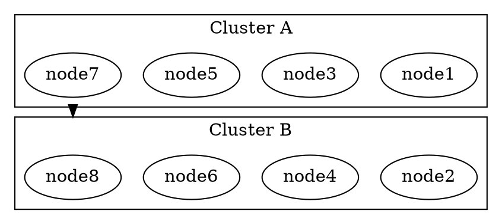

# Container Layout Research for Sruja

## Problem Statement

Sruja's diagram generation is not creating proper container structures for parent nodes to hold all children effectively. While we don't want to use likec4 or PlantUML directly, we can learn from their implementation to improve Sruja's diagram layout quality.

## Research Findings

### 1. LikeC4's Approach

#### Container Definition

- **Natural nesting** through DSL block structure
- **Any element can be a container** - arbitrary nesting levels
- **Namespacing** - nested elements get fully qualified names
- **No explicit "container" keyword** - containment defined by block structure

#### Layout Implementation

- **Engine**: Graphviz `dot` (hierarchical, DAG-oriented)
- **Cluster representation**: Subgraph `cluster_*` pattern
- **Key attributes**:
  - `compound=true` - enables edges between clusters
  - `TBbalance=min` - forces tighter top-bottom alignment
  - `rankdir=TB` or `rankdir=LR`

#### **Critical Finding: lhead/ltail Usage**

LikeC4 uses Graphviz's `lhead` and `ltail` attributes for edges between clusters:



**What lhead/ltail do**:

- When `compound=true`, if `lhead` is defined and is the name of a cluster containing the real head, the edge is **clipped to the boundary of the cluster**
- Same for `ltail` - clips edge to tail cluster boundary
- This ensures edges appear to go from one container to another, not from specific nodes

### 2. PlantUML's Approach

#### Container Definition

- **`package` keyword** defines grouping
- **Nested packages** supported
- **Multiple styles**: `<<Node>>`, `<<Rectangle>>`, `<<Folder>>`, `<<Frame>>`, `<<Cloud>>`, `<<Database>>`

#### Layout Optimization Techniques

1. **`together` keyword** - groups elements to keep them together
2. **Arrow directions** - affect layout (→ vs -->)
3. **Invisible edges** - force layout without visual clutter
4. **Multiple layout engines** - Graphviz (default), Smetana (internal)

#### Best Practices

- Don't fight the layout engine
- Use `together` for logical grouping
- Use invisible edges strategically
- Arrow direction matters for layout

### 3. Sruja's Current Implementation

#### Current State (pkg/export/dot/dot_generator.go)

**What's working:**

- ✅ `compound=true` is set
- ✅ Clusters are created using `subgraph "cluster_*"` pattern
- ✅ Nested hierarchy via ParentID
- ✅ L3 view flattening to prevent Graphviz crashes

**What's missing:**

- ❌ **No lhead/ltail attributes for cross-cluster edges**
- ❌ Edges don't clip to cluster boundaries
- ❌ Relies solely on `compound=true` which may not be enough

**Current Edge Writing** (line 196-258):

```go
func writeEdgesFromConstraints(sb *strings.Builder, edges []EdgeConstraint) {
  for _, edge := range edges {
    // ... builds edge attributes ...
    fmt.Fprintf(sb, "  \"%s\"%s -> \"%s\"%s%s;\n",
      escapeID(edge.From), fromPort,
      escapeID(edge.To), toPort,
      attrStr)
  }
}
```

**Note**: Does NOT emit lhead/ltail attributes.

### 4. Key Differences Summary

| Aspect                     | LikeC4               | PlantUML             | Sruja (Current)      |
| -------------------------- | -------------------- | -------------------- | -------------------- |
| **Container Definition**   | Natural nesting      | `package` keyword    | ParentID reference   |
| **compound=true**          | ✅ Yes               | ✅ Yes               | ✅ Yes               |
| **lhead/ltail**            | ✅ **Yes**           | ✅ Yes               | ❌ **No**            |
| **Cluster Implementation** | subgraph cluster\_\* | subgraph cluster\_\* | subgraph cluster\_\* |
| **Edge Clipping**          | ✅ To boundaries     | ✅ To boundaries     | ❌ No clipping       |
| **View Levels**            | Arbitrary nesting    | Manual               | C4 L1/L2/L3          |

## Recommendations for Sruja

### 1. **Implement lhead/ltail for Cross-Cluster Edges**

**Priority: HIGH**

This is the most impactful change. Add lhead/ltail attributes when edges cross cluster boundaries.

**Implementation Plan:**

1. **Detect cross-cluster edges**:

```go
func isCrossClusterEdge(from, to string, parentMap map[string]string) (fromCluster, toCluster string, isCross bool) {
  fromParent, hasFrom := parentMap[from]
  toParent, hasTo := parentMap[to]

  isCross = hasFrom && hasTo && (fromParent != toParent)
  return fromParent, toParent, isCross
}
```

2. **Modify edge writing** (in `writeEdgesFromConstraints`):

```go
for _, edge := range edges {
  attrs := []string{}

  // ... existing attributes ...

  // Add lhead/ltail for cross-cluster edges
  fromCluster, toCluster, isCross := isCrossClusterEdge(edge.From, edge.To, parentMap)
  if isCross {
    if fromCluster != "" {
      attrs = append(attrs, fmt.Sprintf("ltail=\"cluster_%s\"", escapeID(fromCluster)))
    }
    if toCluster != "" {
      attrs = append(attrs, fmt.Sprintf("lhead=\"cluster_%s\"", escapeID(toCluster)))
    }
  }

  // ... write edge with attributes ...
}
```

**Expected Impact:**

- Edges will properly clip to container boundaries
- Cleaner visual separation between parent and child containers
- More professional appearance like likec4

### 2. **Improve Cluster Styling and Spacing**

**Priority: MEDIUM**

Enhance cluster visual hierarchy:

```go
func writeClusterFromConstraints(sb *strings.Builder, parentID string, children []*Element, allElements []*Element, constraints LayoutConstraints, depth int) {
  fmt.Fprintf(sb, "  subgraph \"cluster_%s\" {\n", escapeID(parentID))

  // Dynamic styling based on depth (nesting level)
  switch depth {
  case 0: // Top-level clusters
    fmt.Fprintf(sb, "    penwidth=%d,\n", 2)
  case 1: // Nested clusters
    fmt.Fprintf(sb, "    penwidth=%d,\n", 1)
  }

  // Better spacing for nested clusters
  fmt.Fprintf(sb, "    margin=%d,\n", MarginCluster + depth*2)

  // ... rest of cluster code ...
}
```

### 3. **Add "Together" Grouping for Sibling Clusters**

**Priority: MEDIUM**

Inspired by PlantUML's `together` keyword:

```go
// Add invisible edges between siblings to keep clusters together
func addSiblingClusterConstraints(edges []EdgeConstraint, clusters map[string][]*Element, parentMap map[string]string) []EdgeConstraint {
  // Group siblings by parent
  siblingsByParent := make(map[string][]string)

  for childID, children := range clusters {
    parent := parentMap[childID]
    siblingsByParent[parent] = append(siblingsByParent[parent], childID)
  }

  // Add invisible edges between first and last sibling
  for parent, siblings := range siblingsByParent {
    if len(siblings) > 1 {
      first := siblings[0]
      last := siblings[len(siblings)-1]
      edges = append(edges, EdgeConstraint{
        From:          first,
        To:            last,
        Weight:        1000, // High priority
        MinLen:        1,
        AffectsLayout: true,
      })
    }
  }

  return edges
}
```

### 4. **Smart Cluster Boundary Detection**

**Priority: LOW**

Add logic to determine when to use cluster boundaries vs direct node-to-node edges:

```go
func shouldUseClusterBoundary(from, to string, parentMap map[string]string) bool {
  fromParent, hasFrom := parentMap[from]
  toParent, hasTo := parentMap[to]

  // Use cluster boundary if:
  // 1. Both nodes are in different clusters
  // 2. The clusters are at the same depth (both are top-level or both are nested)
  // 3. The edge is crossing "public" boundaries (not deeply nested)

  if !hasFrom || !hasTo {
    return false
  }

  if fromParent == toParent {
    return false // Same cluster, no boundary needed
  }

  // TODO: Check depth of clusters
  // For now, use boundaries for all cross-cluster edges
  return true
}
```

### 5. **Quality Metrics Update**

**Priority: LOW**

Add metrics for cluster containment quality:

```go
type LayoutQuality struct {
  // ... existing fields ...

  // New metrics
  ClusterEdgeBoundaryClipping float64  // % of cross-cluster edges with proper clipping (0.0-1.0)
  ClusterContainmentViolations int     // Number of children outside parent boundaries
  ClusterBalance                float64  // Balance of nodes across clusters (0.0-1.0)
}

func (q *LayoutQuality) CalculateScore() {
  score := 1.0

  // ... existing penalties ...

  // Penalize poor cluster edge clipping
  if q.ClusterEdgeBoundaryClipping < 0.9 {
    score -= (0.9 - q.ClusterEdgeBoundaryClipping) * 0.15
  }

  // Penalize containment violations
  if q.ClusterContainmentViolations > 0 {
    penalty := float64(q.ClusterContainmentViolations) * 0.1
    if penalty > 0.3 {
      penalty = 0.3
    }
    score -= penalty
  }

  q.Score = score
}
```

## Implementation Phases

### Phase 1: Core lhead/ltail Implementation (1-2 days)

- [ ] Add parentMap to `GenerateDOTFromConstraints`
- [ ] Implement `isCrossClusterEdge` helper
- [ ] Modify `writeEdgesFromConstraints` to add lhead/ltail
- [ ] Test with existing examples

### Phase 2: Cluster Styling Improvements (0.5-1 day)

- [ ] Add depth-based cluster styling
- [ ] Improve cluster margins and padding
- [ ] Update visual feedback in designer

### Phase 3: Advanced Clustering (1-2 days)

- [ ] Implement sibling cluster grouping
- [ ] Add smart boundary detection
- [ ] Update quality metrics

### Phase 4: Testing & Refinement (1-2 days)

- [ ] Test with real-world examples
- [ ] Fine-tune edge weights and minlen
- [ ] Update documentation

## Testing Strategy

### Unit Tests

```go
func TestLheadLtailGeneration(t *testing.T) {
  elements := []*Element{
    {ID: "parent1", Title: "Parent 1", ParentID: ""},
    {ID: "child1", Title: "Child 1", ParentID: "parent1"},
    {ID: "parent2", Title: "Parent 2", ParentID: ""},
    {ID: "child2", Title: "Child 2", ParentID: "parent2"},
  }

  relations := []*Relation{
    {From: "child1", To: "child2", Label: "cross cluster"},
  }

  dot := GenerateDOTFromConstraints(elements, relations, BuildConstraints(elements, relations, 2, Config{}))

  assert.Contains(t, dot, `ltail="cluster_parent1"`)
  assert.Contains(t, dot, `lhead="cluster_parent2"`)
}
```

### Integration Tests

- Test with nested containers (System → Container → Component)
- Test with mixed edges (internal + cross-cluster)
- Test with large diagrams (>50 nodes)

### Visual Regression Tests

- Generate reference outputs for key examples
- Compare visual output after changes
- Verify container boundaries are respected

## References

### LikeC4

- https://likec4.dev/
- https://github.com/likec4/likec4
- DSL: Natural nesting with arbitrary levels

### PlantUML

- https://plantuml.com/
- Package syntax and layout optimization techniques
- Multiple layout engines

### Graphviz

- https://graphviz.org/docs/attrs/lhead/
- https://graphviz.org/docs/attrs/ltail/
- https://graphviz.org/docs/attrs/compound/
- Clusters and compound edges

### Sruja

- pkg/export/dot/dot_generator.go
- pkg/export/dot/constraints.go
- pkg/export/dot/quality.go
- apps/designer/src/components/SrujaCanvas/layoutEngine.ts

## Conclusion

The primary issue with Sruja's container layout is the **missing lhead/ltail attributes** for cross-cluster edges. LikeC4 and PlantUML both use these attributes to ensure edges clip properly to container boundaries.

Implementing lhead/ltail should be the first priority, followed by cluster styling improvements and advanced clustering techniques. This will give Sruja diagrams a more professional, well-structured appearance similar to likec4 and PlantUML.
