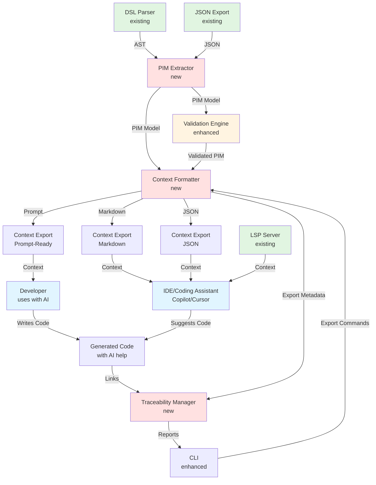

Sruja AI-Assisted Development Pipeline Requirements Specification
1. Executive Summary
This document outlines the requirements for transforming Sruja from a DSL-based architecture modeling tool into an AI-assisted development pipeline. Rather than generating code directly, Sruja provides structured architectural context to AI coding assistants (GitHub Copilot, Cursor, etc.), enabling developers to generate both application code and infrastructure code with full awareness of the architecture model.

**Architecture Model**: This system is modeled using Sruja itself - see [context-pipeline.sruja](./architecture/context-pipeline.sruja) for the complete architecture definition.

2. Functional Requirements
2.1 Context Extraction for AI Assistants
FR-1: PIM Extraction (Platform Independent Model)

Extract technology-agnostic model from Sruja DSL for AI context provisioning
Preserve business logic, relationships, requirements, and scenarios
Maintain traceability between DSL elements and their representation
Support abstract component definitions that AI can interpret

**Purpose**: The PIM serves as structured context that AI coding assistants can understand and use when helping developers write code.

FR-2: Context Formatting and Export

Format PIM model for optimal consumption by AI coding assistants
Support multiple context formats:
- Markdown (human-readable, works with Copilot/Cursor)
- JSON (structured, for programmatic access)
- Prompt-ready format (optimized token usage)
- IDE integration format (for LSP/completion contexts)

**Context Optimization**:
- Token-efficient formatting (prioritize essential information)
- Hierarchical organization (systems → containers → components)
- Relationship visualization in text format
- Requirements and constraints clearly stated
2.2 Traceability System
FR-3: End-to-End Traceability

Track DSL elements → AI prompts → generated code connections
Maintain relationships between architecture model and implemented code
Support impact analysis when architecture changes
Generate traceability reports showing what code was influenced by which architecture elements

**Traceability Link Structure**:
```json
{
  "dslElement": "system.App.container.Web",
  "contextExported": "2024-01-15T10:30:00Z",
  "aiInteractions": [
    {
      "timestamp": "2024-01-15T10:35:00Z",
      "prompt": "Generate a Go HTTP server for the Web container",
      "contextUsed": "system.App.container.Web",
      "generatedFiles": ["app/web/server.go", "app/web/router.go"],
      "aiAssistant": "cursor"
    }
  ],
  "codeFiles": [
    {
      "path": "app/web/server.go",
      "lastModified": "2024-01-15T10:35:00Z",
      "architectureInfluence": ["system.App.container.Web", "system.App.datastore.DB"]
    }
  ]
}
```

**Storage**: Traceability links stored in `.sruja/traceability.json`. Can be manually annotated or automatically tracked when context is exported.

**Query API**: `traceMgr.GetTraceability(elementID)` returns all AI interactions and code files related to that architecture element.

FR-4: Context Metadata Management

Enrich context exports with metadata about what was included
Store context export parameters and configurations
Track which parts of architecture were included in each context export
Support custom metadata extensions for domain-specific information

**Metadata Storage**: Stored with each context export, includes timestamp, included elements, format used, and purpose.
2.3 AI Coding Assistant Integration

**Integration Approach**: Sruja does NOT call LLM APIs directly. Instead, it provides formatted context that developers can use with their preferred AI coding assistants (GitHub Copilot, Cursor, ChatGPT, Claude, etc.).

**Context Export Formats**:
- **Markdown**: Human-readable format that AI assistants can parse easily
- **Structured JSON**: For programmatic access and custom integrations
- **Prompt-ready**: Pre-formatted for direct pasting into AI chat interfaces
- **IDE Integration**: Context provided to LSP server for inline assistance

FR-5: Context Provisioning for AI Assistants

Export structured architectural context in formats optimized for AI consumption
Support context scoping (full architecture, specific system, or component-level)
Generate context that includes relationships, requirements, and constraints
Optimize context for token efficiency while preserving essential information

**Context Export Examples**:

**Markdown Format** (for Copilot/Cursor):
```markdown
# Architecture Context: E-commerce Platform

## System: OrderService
**Purpose**: Handles order processing and payment integration

### Container: API
- **Technology**: Go HTTP server
- **Relationships**: 
  - Receives requests from: WebFrontend
  - Calls: PaymentGateway (external)
  - Reads/Writes: OrderDB (PostgreSQL)
- **Requirements**: 
  - Must handle 1000 req/s
  - Must be idempotent for order creation
- **Constraints**: 
  - Use gRPC for internal services
  - Follow company security standards
```

**Prompt-Ready Format** (for ChatGPT/Claude):
```
You are helping implement the OrderService API container from the architecture.
Context:
- Technology: Go HTTP server
- Must integrate with PaymentGateway (gRPC)
- Database: PostgreSQL (OrderDB)
- Requirements: 1000 req/s, idempotent operations
- Security: Follow OAuth2, input validation required
Generate the main server code...
```

FR-6: AI-Assisted DSL Authoring

Natural language to DSL translation assistance
Architecture suggestions based on requirements
Design pattern recommendations
Automated requirement extraction from documentation

**Note**: These features use AI APIs (optional, user-configured) to help write the DSL itself, separate from the context provisioning for code generation.

FR-7: Architecture Validation

Validate architecture model quality
Security and compliance checking of architecture design
Architecture quality assessment (anti-pattern detection)
Relationship validation and cycle detection

**Note**: Validation focuses on the architecture model itself, not on AI-generated code (that's the developer's responsibility with their AI assistant).
FR-8: Multi-Level Validation

PIM model validation (context structure validation)
Architecture consistency checks
Relationship validation
Requirements completeness validation

FR-9: Quality Metrics

Architecture quality scoring (coupling, cohesion, complexity)
Design pattern adherence
Requirements coverage
Security posture analysis (at architecture level)
3. Non-Functional Requirements
3.1 Performance

**Architecture Size Definitions**:
- Small: <100 elements (systems, containers, components, relations)
- Medium: 100-300 elements
- Large: 300-500 elements
- Enterprise: 500+ elements

**Performance Benchmarks**:
- Small architectures: <5 seconds transformation time
- Medium architectures: <30 seconds transformation time
- Large architectures: <60 seconds transformation time
- Enterprise architectures: <120 seconds transformation time

**Optimization Strategies**:
- Parallel processing for multiple platforms (transformations run concurrently)
- Incremental transformations for changes (only regenerate modified artifacts)
- Caching of PIM models and transformation results
- AI operations are asynchronous and don't block transformations (background processing)
3.2 Scalability
Handle enterprise-level architectures (1000+ elements)
Template registry for 100+ templates
Support multiple concurrent users
Distributed processing capabilities
3.3 Extensibility
Plugin architecture for custom transformers
Custom template development framework
Third-party platform integration
API for external tools
3.4 Usability
Intuitive CLI interface
IDE integration enhancements
Visual transformation pipeline
Comprehensive documentation
4. Technical Architecture
4.1 Core Components



4.2 Data Flow

The context provisioning pipeline follows this data flow:

1. **Input**: `.sruja` DSL files (existing format, unchanged)
2. **Parse**: AST generation using existing `pkg/language` parser
3. **Export**: JSON format via existing `pkg/export/json` (becomes source for PIM)
4. **Extract**: PIM model creation from JSON (technology-agnostic structure)
5. **Validate**: Multi-level validation (PIM validation, existing DSL validation enhanced)
6. **Format**: Context formatting for AI consumption (PIM → formatted context)
7. **Export**: Context exported in chosen format (Markdown/JSON/Prompt-ready)
8. **Use**: Developer uses context with AI coding assistant (Copilot/Cursor/etc.)
9. **Generate**: Developer writes code with AI assistance (AI has architecture context)
10. **Track**: Traceability links created (DSL element → prompt → code file)

**Context Formats**:
- DSL → AST (existing internal representation)
- AST → JSON (existing `ArchitectureJSON` structure)
- JSON → PIM (technology-agnostic JSON, see Section 4.4)
- PIM → Formatted Context (Markdown/JSON/Prompt-ready formats)
- Context → AI Coding Assistant (developer provides context to AI)
- AI + Context → Code (AI helps developer write code with architecture awareness)

4.3 Package Structure

**Separation of Concerns**:
- `pkg/export/json/`: Existing DSL→JSON export (unchanged, used as PIM source)
- `pkg/context/`: NEW - Context extraction and formatting for AI assistants
- `pkg/traceability/`: NEW - Traceability management (links DSL → prompts → code)
- `pkg/ai/`: NEW - Optional AI features for DSL authoring (not code generation)
- `pkg/validation/`: ENHANCED - Multi-level validation (existing validation enhanced)

**Detailed Structure**:
```
pkg/
├── context/          # NEW: Context extraction and formatting
│   ├── extractor.go  # Extract PIM from existing JSON export
│   ├── formatter.go  # Format context for different AI assistant types
│   ├── markdown.go   # Markdown formatter for Copilot/Cursor
│   ├── prompt.go     # Prompt-ready formatter for ChatGPT/Claude
│   └── json.go       # Structured JSON formatter
├── traceability/      # NEW: Traceability system
│   ├── manager.go     # Main traceability manager
│   ├── links.go       # Link structure (DSL → prompt → code)
│   └── store.go       # Storage backend (JSON file-based)
├── ai/               # NEW: AI features for DSL authoring (optional)
│   ├── dsl_assistant.go  # AI help for writing DSL (translation, suggestions)
│   └── llm_client.go  # LLM provider abstraction (for DSL authoring only)
├── validation/       # ENHANCED: Existing validation (pkg/engine)
│   └── enhanced.go   # Enhanced validation rules
└── export/           # EXISTING: DSL→JSON export (unchanged)
    ├── json/         # Existing JSON export (used as PIM source)
    └── traceability.go  # NEW: Export traceability links to reports
```

4.4 PIM Model Schema

The PIM (Platform Independent Model) is a technology-agnostic JSON structure derived from the existing `ArchitectureJSON` format but with platform-specific details removed.

**Key PIM Characteristics**:
- Technology names are abstracted (e.g., "web server" not "nginx")
- Deployment details removed (focuses on logical architecture)
- Preserves business logic, relationships, requirements, scenarios
- Platform-specific properties stored separately (not in PIM)

**Example PIM Structure**:
```json
{
  "pim": {
    "version": "1.0",
    "architecture": {
      "systems": [{
        "id": "App",
        "label": "My Application",
        "containers": [{
          "id": "Web",
          "label": "Web Server",
          "type": "container",
          "properties": {
            "protocol": "http",
            "ports": [80, 443]
          }
        }]
      }]
    },
    "requirements": [],
    "scenarios": []
  }
}
```

4.5 Context Formatting Strategies

**Format Selection**:
- **Markdown**: Best for Copilot/Cursor (readable, preserves structure)
- **JSON**: For programmatic access or custom tooling
- **Prompt-ready**: Pre-formatted for direct pasting into AI chat
- **IDE Integration**: Formatted for LSP server (structured, compact)

**Context Scoping Options**:
- Full architecture (entire model)
- System-level (specific system and its containers/components)
- Component-level (single component with relationships)
- Relationship-focused (specific relationships and involved elements)

**Token Optimization**:
- Include essential relationships only
- Summarize large component lists
- Prioritize active/current work context
- Exclude irrelevant details for specific use case

4.6 Error Handling

**Error Categories**:
1. **Context Extraction Errors**: Invalid PIM, missing required fields, parsing failures
2. **Context Formatting Errors**: Format-specific errors, token limit exceeded
3. **Validation Errors**: PIM validation failures, quality threshold violations
4. **AI Errors** (for DSL authoring features only): LLM timeouts, rate limits, API failures (non-blocking, warnings only)

**Error Handling Strategy**:
- Context extraction errors: Fail fast with clear error messages pointing to DSL issues
- Context formatting errors: Provide fallback format or truncated context with warnings
- Validation errors: Collect all errors, report at end (can be warnings)
- AI errors (DSL authoring): Log warning, continue without AI assistance (context export still works)
5. Integration Strategy

5.1 Integration with Existing Systems

**PIM Extraction from Existing Export**:
The PIM extraction leverages the existing `pkg/export/json` package. The current `ArchitectureJSON` structure serves as the foundation for context extraction:

- Use existing JSON export as starting point
- Extract technology-agnostic PIM from JSON
- Maintain backward compatibility: existing JSON export unchanged

**Context Export Extends (Not Replaces) Current Export**:
- Existing `sruja export json` command remains unchanged
- New `sruja context export` command added alongside existing commands
- JSON export continues to work independently
- Context export can be used with any AI coding assistant

**LSP Server Integration**:
- Provide architectural context in completion/hover suggestions
- Show architecture relationships when hovering over DSL elements
- Offer to export context for specific elements via code actions
- Context can be automatically included in IDE's AI assistant context

**CLI Integration**:
- New `context` subcommand: `sruja context export [options]`
- Existing commands (`fmt`, `tree`, `export`, `validate`) unchanged
- Optional `ai` subcommand: `sruja ai translate` (for DSL authoring help)
- New `trace` subcommand: `sruja trace [options]` (track DSL → code connections)

**Backward Compatibility**:
- All existing `.sruja` files work without modification
- Existing workflows unchanged
- New features are opt-in (no breaking changes)
- Context export works out-of-the-box (no configuration required)

5.2 Usage Workflow

**For Developers Using AI Coding Assistants**:
1. Write/update architecture in `.sruja` DSL files
2. Export context: `sruja context export --format=markdown --system=OrderService`
3. Copy context to clipboard or save to file
4. Use context with AI assistant:
   - **Copilot/Cursor**: Context becomes part of IDE context automatically (via LSP) or manually pasted
   - **ChatGPT/Claude**: Paste context in chat when asking for code generation
5. Generate code with AI assistance (AI has full architecture awareness)
6. (Optional) Track traceability: Link generated code files to DSL elements

**For Teams**:
1. Architecture team maintains `.sruja` DSL files
2. Context exported and shared via docs/wiki/README
3. Developers reference context when writing code with AI assistants
4. Traceability maintained to track which code implements which architecture elements

5.3 Configuration

**Global Configuration**: `~/.sruja/config.yml` (optional)
```yaml
context:
  defaultFormat: markdown
  includeRelationships: true
  maxTokens: 8000
ai:
  enabled: true  # For DSL authoring features only
  provider: openai
  model: gpt-4
```

**Project Configuration**: `.sruja/config.yml` (optional)
```yaml
context:
  defaultScope: system  # full|system|component
  outputDir: ./docs/context
traceability:
  autoTrack: false  # Manual tracking by default
```

6. Implementation Plan
Phase 1: Foundation (Weeks 1-3)
Sprint 1: PIM Extraction

PIM model structures
Extraction from existing JSON export
PIM validation and schema
Sprint 2: Context Formatting

Markdown formatter implementation
JSON formatter (structured context)
Prompt-ready formatter
Context scoping (full/system/component)
Sprint 3: Basic Context Export

CLI context export command
Format selection and options
Basic token optimization
Phase 2: Enhanced Context & Validation (Weeks 4-6)
Sprint 4: Advanced Context Formatting

Token optimization strategies
Relationship prioritization
Context summarization for large models
Sprint 5: Validation Enhancement

Multi-level validation
Quality metrics
Architecture pattern detection
Sprint 6: Traceability System

Traceability link structure
Storage backend
Basic query API
Manual tracking workflows
Phase 3: IDE Integration & Polish (Weeks 7-9)
Sprint 7: LSP Integration

Context provision in LSP server
Hover enhancements with context
Code actions for context export
Sprint 8: Optional AI Features (DSL Authoring)

LLM client for DSL translation
Natural language to DSL conversion
Architecture suggestions (optional feature)
Sprint 9: Documentation & Examples

Usage examples and tutorials
Best practices guide
Integration examples (Copilot, Cursor, ChatGPT)
Phase 4: Testing & Refinement (Weeks 10-12)
Sprint 10: Testing & Quality

Comprehensive test suite
Performance optimization
Context quality validation
Sprint 11: Advanced Features

Automated traceability tracking (optional)
Context versioning
Impact analysis improvements
Sprint 12: Documentation & Community

Complete documentation
Video tutorials
Community examples and patterns
7. Success Criteria
7.1 Technical Metrics
Support for 3+ context formats (Markdown, JSON, Prompt-ready)
90%+ test coverage
<5s context export time for medium architectures (100-300 elements)
Support for 1000+ element architectures
Zero breaking changes to existing functionality
Context exports optimized for token efficiency (<10K tokens for medium architectures)

7.2 User Experience Metrics
<5min onboarding time (understand context export workflow)
<3 commands to export and use context with AI assistant
95%+ user satisfaction with context quality and relevance
Active community contribution and usage examples

7.3 Quality Metrics
Context accuracy (no information loss from DSL to context)
Context relevance (includes necessary information, excludes noise)
Traceability coverage (trackable connections between DSL and code)
Context usability (developers successfully use context with AI assistants)

**Note**: Success is measured by how effectively developers can use the exported context with their AI coding assistants, not by direct code generation metrics.
8. Risk Assessment & Mitigation
8.1 Technical Risks

**Risk**: Context export becomes too large for AI assistants (token limits)
**Mitigation**: Token optimization strategies, context summarization, scoping options (full/system/component), configurable token limits

**Risk**: Context loses important information during formatting
**Mitigation**: Comprehensive testing, validation of context completeness, user feedback loops, multiple format options

**Risk**: Context format not compatible with all AI assistants
**Mitigation**: Support multiple formats (Markdown for most, JSON for custom, prompt-ready for chat), allow format customization

**Risk**: Traceability tracking is manual and error-prone
**Mitigation**: Provide clear workflows, optional automation helpers, good documentation, IDE integration for easier tracking

8.2 Adoption Risks

**Risk**: Steep learning curve for users (understanding context export workflow)
**Mitigation**: Extensive documentation, clear examples, video tutorials, integration guides for popular AI assistants

**Risk**: Migration resistance from existing users
**Mitigation**: Backward compatibility guaranteed, gradual rollout, existing workflows unchanged, context export is opt-in

**Risk**: Developers don't see value in using context with AI assistants
**Mitigation**: Demonstrate clear benefits with examples, show improved code quality when AI has architecture context, community success stories

**Risk**: Context export workflow is too manual/inconvenient
**Mitigation**: CLI tools for quick export, IDE integration for automatic context provision, copy-to-clipboard features, workflow automation options

9. API Design Preview
9.1 CLI Commands

**Context Export**:
```bash
# Export context in Markdown format (default)
sruja context export architecture.sruja --format=markdown --output=./context.md

# Export context for specific system only
sruja context export architecture.sruja --system=OrderService --format=markdown

# Export context for specific component
sruja context export architecture.sruja --component=system.App.container.Web

# Export as prompt-ready format (for ChatGPT/Claude)
sruja context export architecture.sruja --format=prompt --output=./prompt.txt

# Export as structured JSON (for programmatic access)
sruja context export architecture.sruja --format=json --output=./context.json

# Copy context to clipboard (Mac/Linux)
sruja context export architecture.sruja --format=markdown --clipboard

# Export with token limit (for large architectures)
sruja context export architecture.sruja --max-tokens=8000
```

**Error Handling**:
```bash
# On error, CLI exits with non-zero code and prints detailed error
# Example error output:
# Error: context export failed
#   Element: system.App.container.Web
#   Issue: missing required description for context generation
#   Hint: Add description to container or use --include-incomplete flag
```

**Optional AI Commands (for DSL authoring)**:
```bash
# Natural language to DSL translation (helps write DSL, not code)
sruja ai translate "web server connected to database" --output=suggested.sruja

# Architecture suggestions (improves DSL, not generates code)
sruja ai suggest "microservice for user management" --architecture=arch.sruja
```

**Traceability**:
```bash
# Show traceability report
sruja trace architecture.sruja --show-impact

# Export traceability to JSON
sruja trace architecture.sruja --export=traceability.json

# Query specific element traceability
sruja trace architecture.sruja --element=system.App

# Link code file to DSL element (manual tracking)
sruja trace link architecture.sruja --element=system.App.container.Web --file=app/web/server.go
```

**Configuration**:
```bash
# Use project-specific config
sruja context export arch.sruja --config=.sruja/config.yml

# Override format
sruja context export arch.sruja --format=json
```

9.2 Library API

**Transformation Engine**:
```go
import "github.com/sruja-ai/sruja/pkg/transformation"
import "github.com/sruja-ai/sruja/pkg/export/json"

// Load architecture from JSON (existing export)
jsonData, err := json.Export(architecture)
if err != nil {
    return err
}

// Create transformation engine
engine := transformation.NewEngine(jsonData, transformation.Options{
    Platform: "kubernetes",
    OutputDir: "./generated",
    DryRun: false,
})

// Transform to platform-specific model
result, err := engine.Transform()
if err != nil {
    // Handle transformation errors
    if errors.Is(err, transformation.ErrInvalidPIM) {
        // PIM validation failed
    }
    if errors.Is(err, transformation.ErrUnsupportedPlatform) {
        // Platform not supported
    }
    return err
}

// Access generated artifacts
for _, artifact := range result.Artifacts {
    fmt.Printf("Generated: %s\n", artifact.Path)
}
```

**AI Assistant**:
```go
import "github.com/sruja-ai/sruja/pkg/ai"

// Create AI assistant with configuration
assistant, err := ai.NewAssistant(ai.Config{
    Provider: "openai",
    Model: "gpt-4",
    APIKey: os.Getenv("OPENAI_API_KEY"),
    RateLimit: 100,
})
if err != nil {
    return err
}

// Get suggestions (non-blocking, returns immediately with async processing)
ctx := context.Background()
suggestions, err := assistant.SuggestImprovements(ctx, architecture)
if err != nil {
    // Handle errors (network, rate limit, etc.)
    // System continues without AI assistance
    log.Warn("AI suggestions unavailable", "error", err)
    suggestions = nil // Continue without AI
}

if suggestions != nil {
    for _, suggestion := range suggestions {
        fmt.Printf("Suggestion: %s\n", suggestion.Description)
    }
}
```

**Traceability**:
```go
import "github.com/sruja-ai/sruja/pkg/traceability"

// Create traceability manager
traceMgr := traceability.NewManager(traceability.Options{
    StorePath: ".sruja/traceability.json",
})

// Get traceability links for element
links, err := traceMgr.GetTraceability("system.App")
if err != nil {
    return err
}

for _, link := range links {
    fmt.Printf("PIM: %s -> PSM: %s -> Files: %v\n",
        link.PIMElement, link.PSMElement, link.GeneratedFiles)
}

// Generate impact analysis
impact, err := traceMgr.ImpactAnalysis("system.App.container.Web")
if err != nil {
    return err
}
fmt.Printf("Changing this element affects %d platform resources\n", len(impact.Resources))
```

**Error Types**:
```go
// Transformation errors
var (
    ErrInvalidPIM = errors.New("invalid PIM model")
    ErrUnsupportedPlatform = errors.New("unsupported platform")
    ErrTemplateError = errors.New("template execution error")
    ErrValidationFailed = errors.New("validation failed")
)

// AI errors (non-blocking)
var (
    ErrAITimeout = errors.New("AI request timeout")
    ErrAIRateLimit = errors.New("AI rate limit exceeded")
    ErrAIUnavailable = errors.New("AI service unavailable")
)
```
This specification provides a comprehensive roadmap for transforming Sruja into an AI-assisted development pipeline where structured architectural context is provided to coding assistants, enabling developers to generate code with full awareness of the architecture model.