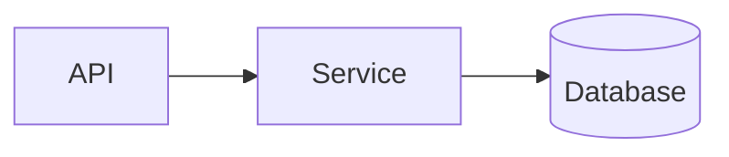

# Architecture Review Workflow

> **Status:** Planned. The `sruja review` command is not yet implemented. This doc describes the intended design.

Sruja will be able to review architecture proposals against your actual codebase, providing grounded feedback on design decisions.

## Quick Start

```bash
# Review a proposal against current repo
sruja review --repo . --proposal docs/proposals/my-feature.md

# Output as JSON for CI integration
sruja review --repo . --proposal proposal.md --format json

# Enrich scan with LLM labels (requires OPENAI_API_KEY)
sruja review --repo . --proposal proposal.md --enrich
```

## Proposal Format

Create a markdown file with your architecture proposal:

```markdown
# Payment Service Architecture

## Components

- **API Gateway** (Node.js) - Routes all incoming requests
- **OrderService** (Go) - Manages order lifecycle
- **PaymentService** (Python) - Processes payments via Stripe
- **UserDatabase** (PostgreSQL) - Stores user data

## Data Flow

- Frontend -> API Gateway "HTTPS"
- API Gateway -> OrderService "REST API"
- OrderService -> UserDatabase "reads/writes"

## Concerns

- Need to handle payment failures gracefully
- Consider adding caching layer

## Requirements

- Must handle 1000 req/s at peak
- Must be PCI-DSS compliant
```

### Supported Sections

| Section | Purpose |
|---------|---------|
| `## Components` | List of components with technology |
| `## Services` | Alternative to Components |
| `## Data Flow` | Relationships between components |
| `## Relationships` | Alternative to Data Flow |
| `## Concerns` | Known issues or questions |
| `## Requirements` | Functional/non-functional requirements |

### Mermaid Diagrams

You can also embed Mermaid diagrams:

````markdown
## Architecture Diagram


````

## Output Formats

### Text (default)

```
════════════════════════════════════════════════════════════
Architecture Review: Payment Service Architecture
════════════════════════════════════════════════════════════

📊 Summary
----------------------------------------
  Proposed components: 6 | Existing: 12
  New: 6 | Missing: 12 | Health Score: 84/100

🆕 New Components (proposed but not in codebase)
----------------------------------------
  • API Gateway (ExternalApi, tech: Node.js)
  • OrderService (Service, tech: Go)

🚨 Concerns
----------------------------------------
  ⚠ Component 'UserDatabase' has no connections
  ⚠ Direct database access from 'Frontend' - consider service layer

💡 Suggestions
----------------------------------------
  1. Add error handling for new synchronous dependencies
  2. Consider data migration strategy for new databases
```

### JSON

```bash
sruja review --repo . --proposal proposal.md --format json
```

Returns structured data for CI integration:

```json
{
  "proposal_title": "Payment Service Architecture",
  "node_diff": {
    "added": [...],
    "removed": [...],
    "matched": [...]
  },
  "edge_diff": {
    "added": [...],
    "removed": [...]
  },
  "violations": [...],
  "suggestions": [...],
  "summary": {
    "health_score": 84
  }
}
```

### Markdown

```bash
sruja review --repo . --proposal proposal.md --format markdown
```

## Detection Rules

The review engine detects:

| Rule | Description |
|------|-------------|
| **Layer Violation** | Direct database access from frontend/module |
| **Orphan Component** | Component with no connections |
| **Undocumented Service** | Service without technology specified |
| **Missing Dependency** | Proposed component not in codebase |
| **New Dependencies** | New relationships introduced |

## CI Integration

```yaml
# .github/workflows/architecture-review.yml
name: Architecture Review

on:
  pull_request:
    paths:
      - 'docs/proposals/*.md'

jobs:
  review:
    runs-on: ubuntu-latest
    steps:
      - uses: actions/checkout@v4
      - name: Install Sruja
        run: cargo install sruja-cli --git https://github.com/sruja-ai/sruja
      - name: Review Proposal
        run: |
          sruja review --repo . --proposal ${{ env.PROPOSAL }} --format json > review.json
          # Fail if health score < 70
          score=$(jq -r '.summary.health_score' review.json)
          if [ "$score" -lt 70 ]; then
            echo "Architecture health score too low: $score"
            exit 1
          fi
```

## How It Works

1. **Scan** - Scans your repository structure (npm, cargo)
2. **Parse** - Parses the markdown proposal
3. **Extract** - Extracts components and relationships
4. **Compare** - Compares proposal vs actual codebase
5. **Detect** - Finds violations and concerns
6. **Report** - Generates actionable feedback

## Supported Repositories

- **Node.js** (package.json)
- **Rust** (Cargo.toml)

More ecosystems coming soon.
