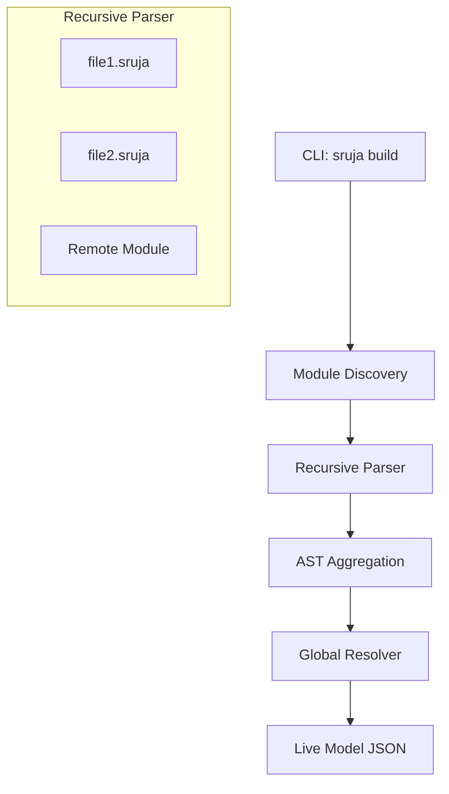

# Sruja Modules: Production-Ready Architecture Imports

## 1. Introduction
To move beyond "scripts and hacks," Sruja requires a first-class **Module System**. Inspired by the Go toolchain, Sruja Modules enable teams to distribute architectural definitions across multiple repositories and combine them into a single, cohesive "Global System Model" with full type-safety and reference resolution.

### Goals
*   **Decoupling**: Service teams own their internal architecture in their own repositories.
*   **Central Governance**: Global systems, standard styles, and shared actors are managed in a "Shared Core" repository.
*   **Determinism**: Version pinning ensures that a project's architecture doesn't change unexpectedly.
*   **Developer Experience**: Direct Git imports (e.g., `import "github.com/org/core"`) eliminate manual file copying.

---

## 2. Core Concepts

### 2.1 The Module (`sruja.mod`)
A **Sruja Module** is a collection of `.sruja` files located in a directory tree. 
*   Defined by a `sruja.mod` file at the root.
*   The module name (e.g., `github.com/acme/infra`) defines the namespace for its exports.

### 2.2 The Workspace
The "Workspace" is the in-memory representation of all files loaded by the engine. 
*   It aggregates multiple modules (local and remote).
*   It performs the **Deep Merge** of all `model` and `extend` blocks.

### 2.3 Import Syntax
Sruja supports three types of imports:
1.  **Relative**: `import { billing } from "./billing.sruja"` (Within the same module)
2.  **Relative Directory**: `import { * } from "./shared"` (Imports all files in a folder)
3.  **Remote Module**: `import { core } from "github.com/acme/core"` (External dependency)

---

## 3. Technical Architecture

### 3.1 The "Load → Merge → Resolve" Pipeline



### 3.2 Deep Merging Logic
When Sruja encounters multiple `ModelBlock` definitions, it doesn't choose between them—it **unions** them.
*   **Specification Merge**: Concatenates all `element` and `tag` definitions.
*   **Structural Merge**: If two files define `System Order`, their containers and relations are merged into the same object.
*   **Shadowing**: Local definitions can "shadow" or "extend" remote definitions using the `extend` keyword.

### 3.3 Reference Resolution
The **Global Resolver** works on the merged model. 
1.  **Phase 1 (Index)**: Build a hash map of every `Fully Qualified Name` (FQN) in the workspace.
2.  **Phase 2 (Link)**: Validate every relationship. If `ServiceA -> ServiceB` is defined, the resolver searches the global index, regardless of which file `ServiceB` was defined in.

---

## 4. Dependency Management (The Go Way)

### 4.1 Global Module Cache
Remote modules are fetched and stored in a shared local cache:
*   **Path**: `~/.sruja/pkg/mod/github.com/org/repo@v1.0.0`
*   **Immutability**: Once a versioned module is cached, it is never modified.

### 4.2 The Lockfile (`sruja.lock`)
To ensure production stability, Sruja generates a lockfile recording the exact Git commit hashes of all dependencies.
```json
{
  "dependencies": {
    "github.com/acme/core": "8f3e2a1...",
    "github.com/acme/shared": "v1.2.3"
  }
}
```

---

## 5. CLI User Experience

### `sruja mod init`
Initializes a new module by creating a `sruja.mod` file.

### `sruja get <url>`
Fetches a remote module, updates the `.mod` file, and adds it to the cache.

### `sruja build [path]` (The Production Ready Build)
The main entry point for CI/CD.
1.  Verify `sruja.mod` and dependencies.
2.  Parse the entire workspace.
3.  Validate all rules (cycles, unique IDs, orphans).
4.  Export to the requested format (JSON, Mermaid, etc.).

---

## 6. Lean MVP Strategy

To avoid excessive scope while delivering immediate production value, the MVP will focus on **Local Multi-file Resolution**. This eliminates the need for complex networking code while still enabling the "Hybrid" architecture model.

### 6.1 MVP Scope (Phase 1)
*   **Directory Parsing**: `sruja build <directory>` recursively loads all `.sruja` files.
*   **Relative Imports**: Support `import { elements } from "./path/to/file.sruja"`.
*   **AST Merging**: Unified in-memory model for all discovered files.
*   **Git Bridge**: For remote repos, users will leverage **Git Submodules**. Sruja will treat submodules as local directories, providing a "Zero-Cost Git Import" experience.

### 6.2 Success Criteria
1.  Ability to define a "Core" architecture in one folder and "Service" architecture in another.
2.  The CLI successfully generates a single diagram/JSON combining both without manual concatenation.
3.  All validation rules (Unique IDs, etc.) work across file boundaries.

---

## 7. Implementation Roadmap

### Phase 1: Workspace Core (Lean MVP - CURRENT)
*   [ ] **Directory Discovery**: Update `Parser` to accept directory paths and find all files.
*   [ ] **AST Merging**: Implement the logic to union multiple `Program` objects into a `Workspace`.
*   [ ] **Relative Imports**: Enable the `import` keyword to resolve against local file paths.
*   [ ] **CLI Update**: Refactor `lint` and `compile` to accept directory arguments.

### Phase 2: Remote Fetching (Enhanced Production)
*   [ ] **The Downloader**: Implement `sruja get` using `exec.Command("git", ... )`.
*   [ ] **The Cache**: Add the `~/.sruja/pkg` directory for shared dependencies.
*   [ ] **Module Mapping**: Map bare imports (e.g. `github.com/...`) to the local cache.

### Phase 3: Stability & Governance
*   [ ] **Locking**: Implement `sruja.lock` to pin Git commit hashes.
*   [ ] **Registry**: Support semantic tags and version resolution logic.
