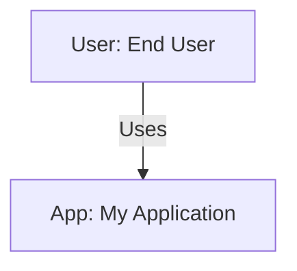
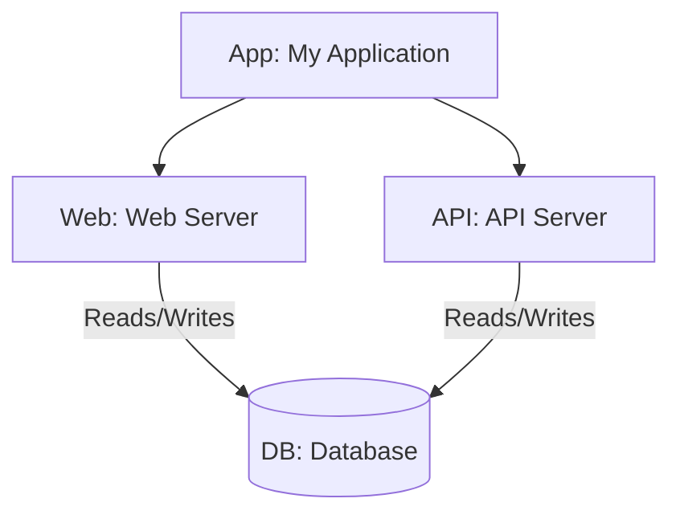
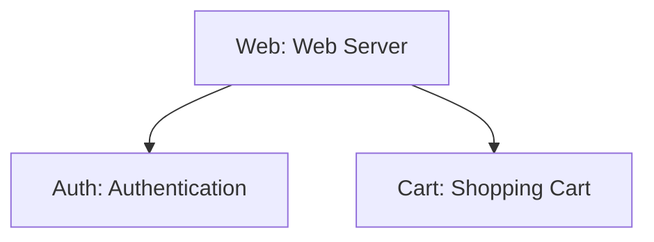
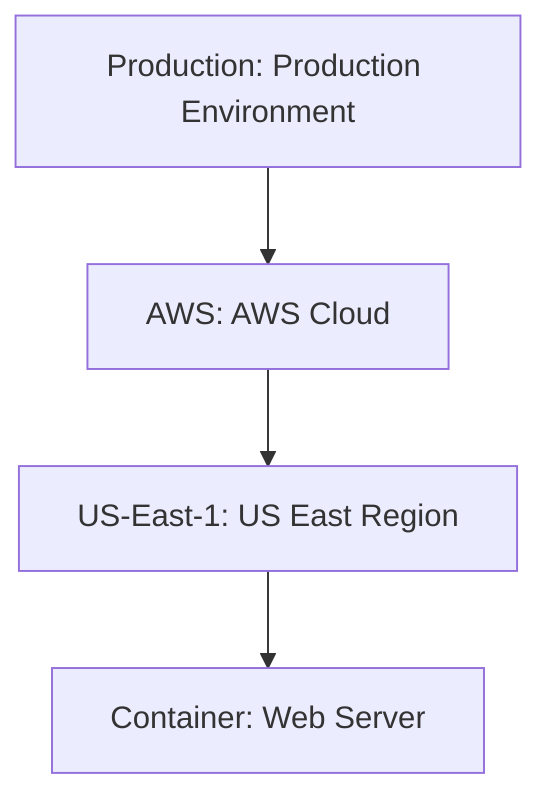
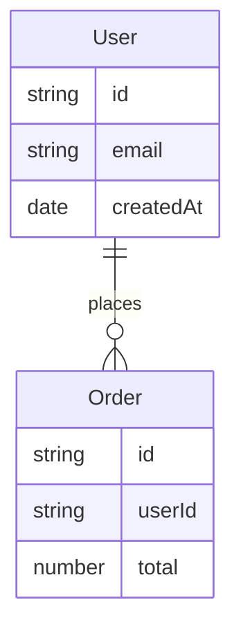
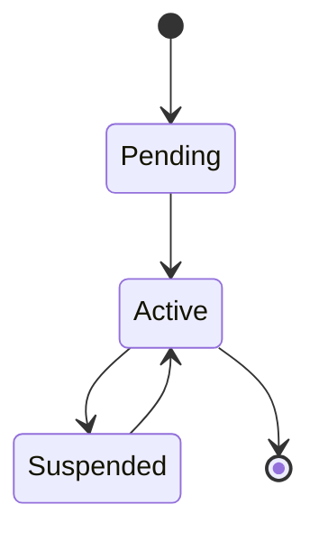
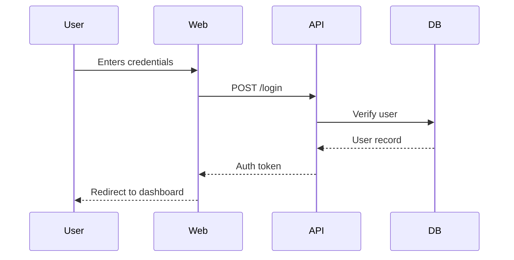
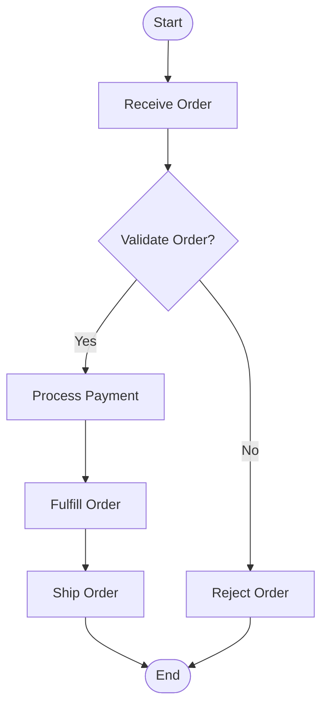

# Task 1.6: Markdown Exporter with Mermaid Diagrams (AST → Markdown)

**Task Status**
- Status: ✅ **COMPLETE**
- Owner: Completed
- Target Date: Completed
- Dependencies: Task 1.1 (JSON Exporter) - Completed
- Last Updated: 2025-12-01

**Priority**: 🟡 Medium-High (Practical value for documentation workflows)
**Technology**: Go
**Estimated Time**: 3-4 days (Actual: Completed)

**Note**: DDD features (Entities, Domain Events, ER diagrams, State diagrams) are **deferred to Phase 2**. Core architecture features are implemented.

## Overview

Export Sruja architecture to Markdown format with embedded Mermaid diagrams. This is a **lightweight, practical feature** that enables:

- **Documentation workflows**: Export to Notion, Confluence, GitHub, GitLab
- **README files**: Embed architecture diagrams directly in project documentation
- **Easy sharing**: Markdown is universally supported
- **Version-controlled docs**: Architecture diagrams live alongside code
- **No dependencies**: Mermaid is just text syntax (no external libraries needed)

**Why it's not over-engineering**:
- Simple text-based output (similar complexity to JSON export)
- No visualization libraries required
- Reuses existing AST structure
- Fits naturally with "Go for DSL handling" architecture
- High practical value for teams using documentation tools

## Files to Create

* `pkg/export/markdown/markdown.go` - Main Markdown exporter
* `pkg/export/markdown/mermaid.go` - Mermaid diagram generator (multiple diagram types)
* `pkg/export/markdown/mermaid_config.go` - Mermaid layout and style configuration
* `pkg/export/markdown/markdown_test.go` - Comprehensive tests

## Mermaid Layout & Style Configuration

### DSL Support for Mermaid Options

Add Mermaid-specific configuration options to the DSL using existing `style` blocks or new `mermaid` blocks:

**Option 1: Extend existing `style` block** (Recommended - simpler)
```sruja
architecture "My System" {
    style {
        mermaid_layout: "elk"        // Layout algorithm: dagre, elk
        mermaid_theme: "forest"      // Theme: default, forest, dark, neutral
        mermaid_look: "handDrawn"     // Optional: handDrawn for sketch look
    }
    // ... architecture elements
}
```

**Option 2: New `mermaid` block** (More explicit)
```sruja
architecture "My System" {
    mermaid {
        layout: "elk"
        theme: "forest"
        look: "handDrawn"
    }
    // ... architecture elements
}
```

### Supported Layout Options

- **dagre** (default) - Standard layout algorithm, good for most diagrams
- **elk** - Advanced layout engine, optimized arrangements, reduces overlaps

### Supported Theme Options

- **default** - Standard Mermaid theme
- **forest** - Green/nature theme
- **dark** - Dark theme
- **neutral** - Neutral color scheme

### Supported Style Options

- **look**: "handDrawn" - Sketch-like appearance
- Custom styles via `classDef` (can be defined in style block)

## Mermaid Diagram Types Supported

The exporter supports various Mermaid diagram types for different use cases:

1. **Graph/TB (Top-Bottom)** - For architecture hierarchy
   - System Context (Level 1)
   - Container Views (Level 2)
   - Component Views (Level 3)
   - Deployment Views

2. **SequenceDiagram** - For user stories and interaction flows
   - Scenarios (user interactions)
   - API call sequences
   - Event flows

3. **Flowchart** - For process flows and workflows
   - Business process flows
   - Decision flows
   - Step-by-step processes

4. **StateDiagram** - For state machines and lifecycles (DEFERRED - DDD feature)
   - Entity lifecycles
   - State transitions
   - Workflow states
   - **Status**: Deferred to Phase 2 (DDD features removed)

5. **ER Diagram** - For domain model relationships (DEFERRED - DDD feature)
   - Entity relationships
   - Domain model visualization
   - **Status**: Deferred to Phase 2 (DDD features removed)

6. **Journey Diagram** - For user journeys (if supported by Mermaid)
   - User experience flows
   - Multi-step processes

## Implementation

### Main Exporter Structure

```go
// pkg/export/markdown/markdown.go
package markdown

import (
    "fmt"
    "strings"
    "github.com/sruja-ai/sruja/pkg/language"
)

type Exporter struct {
    defaultLayout     string // Default layout algorithm
    defaultTheme      string // Default theme
    defaultLook       string // Default look (handDrawn, etc.)
    // DDD features removed - deferred to Phase 2
    // includeDDDFeatures bool   // Removed - DDD features deferred
}

type MermaidConfig struct {
    Layout string // dagre, elk
    Theme  string // default, forest, dark, neutral
    Look   string // handDrawn, etc.
}

func NewExporter() *Exporter {
    return &Exporter{
        defaultLayout: "dagre", // Default to dagre
        defaultTheme:  "default",
        defaultLook:   "",
        // DDD features removed - deferred to Phase 2
    }
}

// DDD features removed - deferred to Phase 2
// NewExporterWithDDD removed - DDD features (entities, events, ER diagrams, state diagrams) are deferred

// extractMermaidConfig extracts Mermaid configuration from architecture style/metadata
func (e *Exporter) extractMermaidConfig(arch *language.Architecture) MermaidConfig {
    config := MermaidConfig{
        Layout: e.defaultLayout,
        Theme:  e.defaultTheme,
        Look:   e.defaultLook,
    }
    
    // Check style block for Mermaid options
    if arch.Style != nil {
        if layout, ok := arch.Style["mermaid_layout"]; ok {
            config.Layout = layout
        }
        if theme, ok := arch.Style["mermaid_theme"]; ok {
            config.Theme = theme
        }
        if look, ok := arch.Style["mermaid_look"]; ok {
            config.Look = look
        }
    }
    
    // Check metadata for Mermaid options (alternative)
    for _, meta := range arch.Metadata {
        switch meta.Key {
        case "mermaid_layout":
            config.Layout = meta.Value
        case "mermaid_theme":
            config.Theme = meta.Value
        case "mermaid_look":
            config.Look = meta.Value
        }
    }
    
    return config
}

func (e *Exporter) Export(arch *language.Architecture) (string, error) {
    var sb strings.Builder
    
    // Extract Mermaid configuration
    mermaidConfig := e.extractMermaidConfig(arch)
    
    // Header
    sb.WriteString(fmt.Sprintf("# Architecture: %s\n\n", arch.Name))
    
    // Description
    if arch.Description != nil {
        sb.WriteString(fmt.Sprintf("%s\n\n", *arch.Description))
    }
    
    // Metadata
    if len(arch.Metadata) > 0 {
        sb.WriteString("## Metadata\n\n")
        for _, meta := range arch.Metadata {
            sb.WriteString(fmt.Sprintf("- **%s**: %s\n", meta.Key, meta.Value))
        }
        sb.WriteString("\n")
    }
    
    // System Context Diagram (Level 1)
    if len(arch.Systems) > 0 || len(arch.Persons) > 0 {
        sb.WriteString("## System Context\n\n")
        mermaid, err := e.generateSystemContext(arch, mermaidConfig)
        if err != nil {
            return "", err
        }
        sb.WriteString(mermaid)
        sb.WriteString("\n\n")
    }
    
    // Systems
    for _, sys := range arch.Systems {
        sb.WriteString(fmt.Sprintf("## System: %s\n\n", sys.Label))
        if sys.Description != nil {
            sb.WriteString(fmt.Sprintf("%s\n\n", *sys.Description))
        }
        
        // Container View (Level 2)
        if len(sys.Containers) > 0 || len(sys.DataStores) > 0 || len(sys.Queues) > 0 {
            mermaid, err := e.generateContainerView(sys, mermaidConfig)
            if err != nil {
                return "", err
            }
            sb.WriteString("### Container View\n\n")
            sb.WriteString(mermaid)
            sb.WriteString("\n\n")
        }
        
        // Component Views (Level 3)
        for _, cont := range sys.Containers {
            if len(cont.Components) > 0 {
                mermaid, err := e.generateComponentView(cont, mermaidConfig)
                if err != nil {
                    return "", err
                }
                sb.WriteString(fmt.Sprintf("### Component View: %s\n\n", cont.Label))
                sb.WriteString(mermaid)
                sb.WriteString("\n\n")
            }
        }
    }
    
    // Deployment View
    if len(arch.DeploymentNodes) > 0 {
        sb.WriteString("## Deployment View\n\n")
        mermaid, err := e.generateDeploymentView(arch, mermaidConfig)
        if err != nil {
            return "", err
        }
        sb.WriteString(mermaid)
        sb.WriteString("\n\n")
    }
    
    // Requirements
    if len(arch.Requirements) > 0 {
        sb.WriteString("## Requirements\n\n")
        for _, req := range arch.Requirements {
            sb.WriteString(fmt.Sprintf("### %s (%s)\n\n", req.ID, req.Type))
            sb.WriteString(fmt.Sprintf("%s\n\n", req.Description))
        }
    }
    
    // Architecture Decision Records (ADRs)
    if len(arch.ADRs) > 0 {
        sb.WriteString("## Architecture Decision Records\n\n")
        for _, adr := range arch.ADRs {
            sb.WriteString(fmt.Sprintf("### %s\n\n", adr.ID))
            if adr.Title != nil {
                sb.WriteString(fmt.Sprintf("**Title**: %s\n\n", *adr.Title))
            }
            if adr.Body != nil {
                if adr.Body.Status != nil {
                    sb.WriteString(fmt.Sprintf("**Status**: %s\n\n", *adr.Body.Status))
                }
                if adr.Body.Context != nil {
                    sb.WriteString(fmt.Sprintf("**Context**:\n\n%s\n\n", *adr.Body.Context))
                }
                if adr.Body.Decision != nil {
                    sb.WriteString(fmt.Sprintf("**Decision**:\n\n%s\n\n", *adr.Body.Decision))
                }
                if adr.Body.Consequences != nil {
                    sb.WriteString(fmt.Sprintf("**Consequences**:\n\n%s\n\n", *adr.Body.Consequences))
                }
            }
            sb.WriteString("---\n\n")
        }
    }
    
    // Contracts
    if len(arch.Contracts) > 0 {
        sb.WriteString("## Contracts\n\n")
        for _, contract := range arch.Contracts {
            sb.WriteString(fmt.Sprintf("### %s (%s)\n\n", contract.ID, contract.Kind))
            if contract.Body != nil {
                e.writeContractBody(&sb, contract.Body)
            }
            sb.WriteString("\n")
        }
    }
    
    // Policies (Architecture Construct)
    if len(arch.Policies) > 0 {
        sb.WriteString("## Policies\n\n")
        for _, policy := range arch.Policies {
            sb.WriteString(fmt.Sprintf("### %s\n\n", policy.ID))
            if policy.Type != nil {
                sb.WriteString(fmt.Sprintf("**Type**: %s\n\n", *policy.Type))
            }
            if policy.Description != nil {
                sb.WriteString(fmt.Sprintf("%s\n\n", *policy.Description))
            }
            if policy.Rules != nil && len(policy.Rules) > 0 {
                sb.WriteString("**Rules**:\n\n")
                for _, rule := range policy.Rules {
                    sb.WriteString(fmt.Sprintf("- %s\n", rule))
                }
                sb.WriteString("\n")
            }
        }
    }
    
    // Constraints
    if len(arch.Constraints) > 0 {
        sb.WriteString("## Constraints\n\n")
        for _, constraint := range arch.Constraints {
            sb.WriteString(fmt.Sprintf("- **%s**: %s\n", constraint.Key, constraint.Value))
        }
        sb.WriteString("\n")
    }
    
    // Conventions
    if len(arch.Conventions) > 0 {
        sb.WriteString("## Conventions\n\n")
        for _, convention := range arch.Conventions {
            sb.WriteString(fmt.Sprintf("- **%s**: %s\n", convention.Key, convention.Value))
        }
        sb.WriteString("\n")
    }
    
    // Shared Artifacts
    if len(arch.SharedArtifacts) > 0 {
        sb.WriteString("## Shared Artifacts\n\n")
        for _, artifact := range arch.SharedArtifacts {
            sb.WriteString(fmt.Sprintf("### %s\n\n", artifact.ID))
            sb.WriteString(fmt.Sprintf("**Label**: %s\n\n", artifact.Label))
            if artifact.Version != nil {
                sb.WriteString(fmt.Sprintf("**Version**: %s\n\n", *artifact.Version))
            }
            if artifact.Owner != nil {
                sb.WriteString(fmt.Sprintf("**Owner**: %s\n\n", *artifact.Owner))
            }
        }
    }
    
    // Libraries
    if len(arch.Libraries) > 0 {
        sb.WriteString("## Libraries\n\n")
        for _, lib := range arch.Libraries {
            sb.WriteString(fmt.Sprintf("### %s\n\n", lib.ID))
            sb.WriteString(fmt.Sprintf("**Label**: %s\n\n", lib.Label))
            if lib.Version != nil {
                sb.WriteString(fmt.Sprintf("**Version**: %s\n\n", *lib.Version))
            }
            if lib.Owner != nil {
                sb.WriteString(fmt.Sprintf("**Owner**: %s\n\n", *lib.Owner))
            }
        }
    }
    
    // Domain-Driven Design (Entities & Events) - DEFERRED to Phase 2
    // DDD features removed from codebase - deferred to Phase 2
    // if len(arch.Entities) > 0 || len(arch.Events) > 0 {
        sb.WriteString("## Domain Model\n\n")
        
        if len(arch.Entities) > 0 {
            // Entity Relationship Diagram
            erDiagram, err := e.generateERDiagram(arch.Entities, mermaidConfig)
            if err == nil && erDiagram != "" {
                sb.WriteString("### Entity Relationships\n\n")
                sb.WriteString(erDiagram)
                sb.WriteString("\n\n")
            }
            
            sb.WriteString("### Entities\n\n")
            for _, entity := range arch.Entities {
                sb.WriteString(fmt.Sprintf("#### %s\n\n", entity.Name))
                if entity.Body != nil {
                    if entity.Body.Description != nil {
                        sb.WriteString(fmt.Sprintf("%s\n\n", *entity.Body.Description))
                    }
                    if entity.Body.Fields != nil && len(entity.Body.Fields.Entries) > 0 {
                        sb.WriteString("**Fields**:\n\n")
                        for _, field := range entity.Body.Fields.Entries {
                            typeStr := ""
                            if field.Type != nil {
                                typeStr = field.Type.Name
                                if len(field.Type.Generics) > 0 {
                                    typeStr += fmt.Sprintf("<%s>", strings.Join(field.Type.Generics, ", "))
                                }
                                if field.Type.Optional != "" {
                                    typeStr += "?"
                                }
                            }
                            sb.WriteString(fmt.Sprintf("- `%s`: %s\n", field.Key, typeStr))
                        }
                        sb.WriteString("\n")
                    }
                    
                    // Entity Lifecycle (State Diagram)
                    if entity.Body.Lifecycle != nil && len(entity.Body.Lifecycle.Transitions) > 0 {
                        stateDiagram, err := e.generateStateDiagram(entity, mermaidConfig)
                        if err == nil && stateDiagram != "" {
                            sb.WriteString("**Lifecycle**:\n\n")
                            sb.WriteString(stateDiagram)
                            sb.WriteString("\n\n")
                        }
                    }
                }
            }
        }
        
        if len(arch.Events) > 0 {
            sb.WriteString("### Domain Events\n\n")
            for _, event := range arch.Events {
                sb.WriteString(fmt.Sprintf("#### %s\n\n", event.Name))
                if event.Body != nil {
                    if event.Body.Description != nil {
                        sb.WriteString(fmt.Sprintf("%s\n\n", *event.Body.Description))
                    }
                    if event.Body.Version != nil {
                        sb.WriteString(fmt.Sprintf("**Version**: %s\n\n", *event.Body.Version))
                    }
                    if event.Body.Entity != nil {
                        sb.WriteString(fmt.Sprintf("**Entity**: %s\n\n", *event.Body.Entity))
                    }
                    if event.Body.Category != nil {
                        sb.WriteString(fmt.Sprintf("**Category**: %s\n\n", *event.Body.Category))
                    }
                }
            }
        }
    }
    
    // Scenarios (User Stories & Interaction Flows)
    if len(arch.Scenarios) > 0 {
        sb.WriteString("## Scenarios & User Stories\n\n")
        for _, scenario := range arch.Scenarios {
            sb.WriteString(fmt.Sprintf("### %s\n\n", scenario.Title))
            if scenario.Description != nil {
                sb.WriteString(fmt.Sprintf("%s\n\n", *scenario.Description))
            }
            
            // Use sequence diagram for user stories and interaction flows
            mermaid, err := e.generateScenarioDiagram(scenario, mermaidConfig)
            if err != nil {
                return "", err
            }
            sb.WriteString("**Interaction Flow**:\n\n")
            sb.WriteString(mermaid)
            sb.WriteString("\n\n")
        }
    }
    
    // Process Flows (Flow is architecture construct, should be implemented)
    // Note: Flow type needs to be defined in ast.go (architecture construct)
    // When Flow is implemented, generate flowchart diagrams for process flows
    if len(arch.Flows) > 0 {
        sb.WriteString("## Process Flows\n\n")
        for _, flow := range arch.Flows {
            sb.WriteString(fmt.Sprintf("### %s\n\n", flow.ID))
            if flow.Description != nil {
                sb.WriteString(fmt.Sprintf("%s\n\n", *flow.Description))
            }
            // Generate flowchart diagram for flow
            mermaid, err := e.generateFlowDiagram(flow.ID, flow.Steps, mermaidConfig)
            if err == nil && mermaid != "" {
                sb.WriteString("**Process Flow**:\n\n")
                sb.WriteString(mermaid)
                sb.WriteString("\n\n")
            }
        }
    }
    
    return sb.String(), nil
}

func (e *Exporter) writeContractBody(sb *strings.Builder, body *language.ContractBody) {
    if body.Version != nil {
        sb.WriteString(fmt.Sprintf("**Version**: %s\n\n", *body.Version))
    }
    if body.Status != nil {
        sb.WriteString(fmt.Sprintf("**Status**: %s\n\n", *body.Status))
    }
    if body.Endpoint != nil {
        sb.WriteString(fmt.Sprintf("**Endpoint**: %s\n\n", *body.Endpoint))
    }
    if body.Method != nil {
        sb.WriteString(fmt.Sprintf("**Method**: %s\n\n", *body.Method))
    }
    if body.Request != nil && len(body.Request.Entries) > 0 {
        sb.WriteString("**Request Schema**:\n\n")
        for _, entry := range body.Request.Entries {
            typeStr := ""
            if entry.Type != nil {
                typeStr = entry.Type.Name
            }
            sb.WriteString(fmt.Sprintf("- `%s`: %s\n", entry.Key, typeStr))
        }
        sb.WriteString("\n")
    }
    if body.Response != nil && len(body.Response.Entries) > 0 {
        sb.WriteString("**Response Schema**:\n\n")
        for _, entry := range body.Response.Entries {
            typeStr := ""
            if entry.Type != nil {
                typeStr = entry.Type.Name
            }
            sb.WriteString(fmt.Sprintf("- `%s`: %s\n", entry.Key, typeStr))
        }
        sb.WriteString("\n")
    }
    if len(body.Errors) > 0 {
        sb.WriteString(fmt.Sprintf("**Errors**: %s\n\n", strings.Join(body.Errors, ", ")))
    }
}
```

### Mermaid Diagram Generation

```go
// pkg/export/markdown/mermaid.go
package markdown

import (
    "fmt"
    "strings"
    "github.com/sruja-ai/sruja/pkg/language"
)

func (e *Exporter) generateSystemContext(arch *language.Architecture, config MermaidConfig) (string, error) {
    var sb strings.Builder
    sb.WriteString("graph TB\n")
    
    // Add persons
    for _, person := range arch.Persons {
        nodeID := sanitizeID(person.ID)
        label := fmt.Sprintf("%s[%s: %s]", nodeID, person.ID, person.Label)
        sb.WriteString(fmt.Sprintf("    %s\n", label))
    }
    
    // Add systems
    for _, sys := range arch.Systems {
        nodeID := sanitizeID(sys.ID)
        label := fmt.Sprintf("%s[%s: %s]", nodeID, sys.ID, sys.Label)
        sb.WriteString(fmt.Sprintf("    %s\n", label))
    }
    
    // Add relations
    for _, rel := range arch.Relations {
        fromID := sanitizeID(rel.From)
        toID := sanitizeID(rel.To)
        verb := ""
        if rel.Verb != nil {
            verb = *rel.Verb
        }
        if rel.Label != nil {
            if verb != "" {
                verb = fmt.Sprintf("%s \"%s\"", verb, *rel.Label)
            } else {
                verb = fmt.Sprintf("\"%s\"", *rel.Label)
            }
        }
        if verb != "" {
            sb.WriteString(fmt.Sprintf("    %s -->|%s| %s\n", fromID, verb, toID))
        } else {
            sb.WriteString(fmt.Sprintf("    %s --> %s\n", fromID, toID))
        }
    }
    
    return e.wrapMermaidDiagram("graph", sb.String(), config), nil
}

func (e *Exporter) generateContainerView(sys *language.System, config MermaidConfig) (string, error) {
    var sb strings.Builder
    sb.WriteString("graph TB\n")
    
    sysID := sanitizeID(sys.ID)
    sb.WriteString(fmt.Sprintf("    %s[%s: %s]\n", sysID, sys.ID, sys.Label))
    
    // Add containers
    for _, cont := range sys.Containers {
        contID := sanitizeID(cont.ID)
        label := fmt.Sprintf("%s[%s: %s]", contID, cont.ID, cont.Label)
        sb.WriteString(fmt.Sprintf("    %s\n", label))
        sb.WriteString(fmt.Sprintf("    %s --> %s\n", sysID, contID))
    }
    
    // Add datastores
    for _, ds := range sys.DataStores {
        dsID := sanitizeID(ds.ID)
        label := fmt.Sprintf("%s[(%s: %s)]", dsID, ds.ID, ds.Label)
        sb.WriteString(fmt.Sprintf("    %s\n", label))
    }
    
    // Add queues
    for _, queue := range sys.Queues {
        queueID := sanitizeID(queue.ID)
        label := fmt.Sprintf("%s[%s: %s]", queueID, queue.ID, queue.Label)
        sb.WriteString(fmt.Sprintf("    %s\n", label))
    }
    
    // Add relations within system
    for _, rel := range sys.Relations {
        fromID := sanitizeID(rel.From)
        toID := sanitizeID(rel.To)
        verb := ""
        if rel.Verb != nil {
            verb = *rel.Verb
        }
        if rel.Label != nil {
            if verb != "" {
                verb = fmt.Sprintf("%s \"%s\"", verb, *rel.Label)
            } else {
                verb = fmt.Sprintf("\"%s\"", *rel.Label)
            }
        }
        if verb != "" {
            sb.WriteString(fmt.Sprintf("    %s -->|%s| %s\n", fromID, verb, toID))
        } else {
            sb.WriteString(fmt.Sprintf("    %s --> %s\n", fromID, toID))
        }
    }
    
    return e.wrapMermaidDiagram("graph", sb.String(), config), nil
}

func (e *Exporter) generateComponentView(cont *language.Container, config MermaidConfig) (string, error) {
    var sb strings.Builder
    sb.WriteString("graph TB\n")
    
    contID := sanitizeID(cont.ID)
    sb.WriteString(fmt.Sprintf("    %s[%s: %s]\n", contID, cont.ID, cont.Label))
    
    // Add components
    for _, comp := range cont.Components {
        compID := sanitizeID(comp.ID)
        label := fmt.Sprintf("%s[%s: %s]", compID, comp.ID, comp.Label)
        sb.WriteString(fmt.Sprintf("    %s\n", label))
        sb.WriteString(fmt.Sprintf("    %s --> %s\n", contID, compID))
    }
    
    // Add relations within container
    for _, rel := range cont.Relations {
        fromID := sanitizeID(rel.From)
        toID := sanitizeID(rel.To)
        verb := ""
        if rel.Verb != nil {
            verb = *rel.Verb
        }
        if rel.Label != nil {
            if verb != "" {
                verb = fmt.Sprintf("%s \"%s\"", verb, *rel.Label)
            } else {
                verb = fmt.Sprintf("\"%s\"", *rel.Label)
            }
        }
        if verb != "" {
            sb.WriteString(fmt.Sprintf("    %s -->|%s| %s\n", fromID, verb, toID))
        } else {
            sb.WriteString(fmt.Sprintf("    %s --> %s\n", fromID, toID))
        }
    }
    
    return e.wrapMermaidDiagram("graph", sb.String(), config), nil
}

func (e *Exporter) generateScenarioDiagram(scenario *language.Scenario, config MermaidConfig) (string, error) {
    // Use sequence diagram for user stories and interaction flows
    var sb strings.Builder
    sb.WriteString("sequenceDiagram\n")
    
    // Extract unique participants from steps
    participants := make(map[string]bool)
    for _, step := range scenario.Steps {
        participants[step.From] = true
        participants[step.To] = true
    }
    
    // Add participants
    for participant := range participants {
        sb.WriteString(fmt.Sprintf("    participant %s\n", sanitizeID(participant)))
    }
    
    // Add steps
    for _, step := range scenario.Steps {
        fromID := sanitizeID(step.From)
        toID := sanitizeID(step.To)
        desc := ""
        if step.Description != nil {
            desc = *step.Description
        }
        if desc != "" {
            sb.WriteString(fmt.Sprintf("    %s->>%s: %s\n", fromID, toID, desc))
        } else {
            sb.WriteString(fmt.Sprintf("    %s->>%s\n", fromID, toID))
        }
    }
    
    return e.wrapMermaidDiagram("sequenceDiagram", sb.String(), config), nil
}

// generateFlowDiagram generates a flowchart for process flows
// Use this for business processes, decision flows, or step-by-step workflows
func (e *Exporter) generateFlowDiagram(title string, steps []FlowStep, config MermaidConfig) (string, error) {
    var sb strings.Builder
    sb.WriteString("flowchart TD\n")
    
    // Start node
    sb.WriteString("    Start([Start])\n")
    
    // Process steps
    for i, step := range steps {
        stepID := fmt.Sprintf("Step%d", i+1)
        sb.WriteString(fmt.Sprintf("    %s[%s]\n", stepID, step.Label))
        
        if i == 0 {
            sb.WriteString(fmt.Sprintf("    Start --> %s\n", stepID))
        } else {
            prevID := fmt.Sprintf("Step%d", i)
            sb.WriteString(fmt.Sprintf("    %s --> %s\n", prevID, stepID))
        }
        
        // Decision points
        if step.Decision != nil {
            decisionID := fmt.Sprintf("Decision%d", i+1)
            sb.WriteString(fmt.Sprintf("    %s{ %s }\n", decisionID, step.Decision.Question))
            sb.WriteString(fmt.Sprintf("    %s -->|%s| %s\n", stepID, step.Decision.YesLabel, decisionID))
            
            if step.Decision.YesStep != nil {
                nextID := fmt.Sprintf("Step%d", *step.Decision.YesStep)
                sb.WriteString(fmt.Sprintf("    %s --> %s\n", decisionID, nextID))
            }
            if step.Decision.NoStep != nil {
                nextID := fmt.Sprintf("Step%d", *step.Decision.NoStep)
                sb.WriteString(fmt.Sprintf("    %s -->|%s| %s\n", decisionID, step.Decision.NoLabel, nextID))
            }
        }
    }
    
    // End node
    sb.WriteString("    End([End])\n")
    lastStepID := fmt.Sprintf("Step%d", len(steps))
    sb.WriteString(fmt.Sprintf("    %s --> End\n", lastStepID))
    
    return e.wrapMermaidDiagram("flowchart", sb.String(), config), nil
}

// generateStateDiagram generates a state diagram for entity lifecycles
func (e *Exporter) generateStateDiagram(entity *language.Entity, config MermaidConfig) (string, error) {
    if entity.Body == nil || entity.Body.Lifecycle == nil {
        return "", nil // No lifecycle defined
    }
    
    var sb strings.Builder
    sb.WriteString("stateDiagram-v2\n")
    sb.WriteString(fmt.Sprintf("    [*] --> %s\n", sanitizeID(entity.Name)))
    
    // Add state transitions
    for _, transition := range entity.Body.Lifecycle.Transitions {
        fromID := sanitizeID(transition.From)
        toID := sanitizeID(transition.To)
        sb.WriteString(fmt.Sprintf("    %s --> %s\n", fromID, toID))
    }
    
    sb.WriteString(fmt.Sprintf("    %s --> [*]\n", sanitizeID(entity.Name)))
    return e.wrapMermaidDiagram("stateDiagram", sb.String(), config), nil
}

// generateERDiagram - DEFERRED (DDD feature)
// ER diagrams for entity relationships are deferred to Phase 2
// func (e *Exporter) generateERDiagram(...) {
func (e *Exporter) generateERDiagram(entities []*language.Entity, config MermaidConfig) (string, error) {
    var sb strings.Builder
    sb.WriteString("erDiagram\n")
    
    // Add entities
    for _, entity := range entities {
        entityID := sanitizeID(entity.Name)
        sb.WriteString(fmt.Sprintf("    %s {\n", entityID))
        
        if entity.Body != nil && entity.Body.Fields != nil {
            for _, field := range entity.Body.Fields.Entries {
                typeStr := "string"
                if field.Type != nil {
                    typeStr = field.Type.Name
                }
                sb.WriteString(fmt.Sprintf("        %s %s\n", typeStr, field.Key))
            }
        }
        
        sb.WriteString("    }\n")
    }
    
    // Add relationships
    for _, entity := range entities {
        if entity.Body != nil && entity.Body.Relations != nil {
            for _, rel := range entity.Body.Relations.Entries {
                fromID := sanitizeID(entity.Name)
                toID := sanitizeID(rel.Target)
                sb.WriteString(fmt.Sprintf("    %s ||--o{ %s : \"%s\"\n", fromID, toID, rel.Name))
            }
        }
    }
    
    return e.wrapMermaidDiagram("erDiagram", sb.String(), config), nil
}

// FlowStep represents a step in a process flow
type FlowStep struct {
    Label    string
    Decision *FlowDecision
}

// FlowDecision represents a decision point in a flow
type FlowDecision struct {
    Question string
    YesLabel string
    NoLabel  string
    YesStep  *int // Index of next step if yes
    NoStep   *int // Index of next step if no
}

func (e *Exporter) generateDeploymentView(arch *language.Architecture, config MermaidConfig) (string, error) {
    var sb strings.Builder
    sb.WriteString("graph TB\n")
    
    // Generate deployment hierarchy
    for _, node := range arch.DeploymentNodes {
        e.writeDeploymentNode(&sb, node, 0)
    }
    
    sb.WriteString("```\n")
    return sb.String(), nil
}

func (e *Exporter) writeDeploymentNode(sb *strings.Builder, node *language.DeploymentNode, indent int) {
    indentStr := strings.Repeat("    ", indent)
    nodeID := sanitizeID(node.ID)
    label := fmt.Sprintf("%s[%s: %s]", nodeID, node.ID, node.Label)
    sb.WriteString(fmt.Sprintf("%s%s\n", indentStr, label))
    
    // Add container instances
    for _, instance := range node.ContainerInstances {
        instID := sanitizeID(instance.ContainerID)
        sb.WriteString(fmt.Sprintf("%s    %s[Container: %s]\n", indentStr, instID, instance.ContainerID))
        sb.WriteString(fmt.Sprintf("%s    %s --> %s\n", indentStr, nodeID, instID))
    }
    
    // Add infrastructure nodes
    for _, infra := range node.Infrastructure {
        infraID := sanitizeID(infra.ID)
        label := fmt.Sprintf("%s[Infrastructure: %s]", infraID, infra.Label)
        sb.WriteString(fmt.Sprintf("%s    %s\n", indentStr, label))
        sb.WriteString(fmt.Sprintf("%s    %s --> %s\n", indentStr, nodeID, infraID))
    }
    
    // Add child nodes
    for _, child := range node.Children {
        e.writeDeploymentNode(sb, child, indent+1)
        childID := sanitizeID(child.ID)
        sb.WriteString(fmt.Sprintf("%s    %s --> %s\n", indentStr, nodeID, childID))
    }
}

func sanitizeID(id string) string {
    // Mermaid IDs must be alphanumeric, replace special chars
    result := strings.ReplaceAll(id, "-", "_")
    result = strings.ReplaceAll(result, ".", "_")
    return result
}
```

## CLI Integration

Add to `cmd/sruja/main.go`:

```go
case "markdown":
    exporter := markdown.NewExporter()
    output, err = exporter.Export(program.Architecture)
```

Update error message:
```go
_, _ = fmt.Fprintf(stderr, "Unsupported export format: %s. Supported formats: json, markdown\n", format)
```

## Diagram Type Selection Guide

### When to Use Each Diagram Type

1. **Graph/TB** - Architecture Structure (CORE)
   - System Context (Level 1)
   - Container Views (Level 2)
   - Component Views (Level 3)
   - Deployment Views
   - Shows: Static structure, relationships, hierarchy

2. **SequenceDiagram** - User Stories & Interactions (CORE)
   - Scenarios (user interactions)
   - API call sequences
   - Event flows
   - Shows: Temporal interactions, message passing, order of operations

3. **Flowchart** - Process Flows (CORE)
   - Business process flows
   - Decision flows
   - Step-by-step workflows
   - Shows: Process steps, decisions, branching logic

4. **StateDiagram** - Lifecycles (OPTIONAL - DDD feature)
   - Entity lifecycles (from Entity.Lifecycle)
   - State transitions
   - Workflow states
   - Shows: State changes, lifecycle stages, transitions
   - **Note**: Only available if DDD features are enabled

5. **ER Diagram** - Domain Model (OPTIONAL - DDD feature)
   - Entity relationships
   - Domain model visualization
   - Shows: Entity structure, relationships, data model
   - **Note**: Only available if DDD features are enabled

## Example Output

```markdown
# Architecture: My System

This is the main system architecture.

## Metadata

- **team**: Platform Team
- **tier**: Critical
- **version**: 1.0.0

## System Context



## System: My Application

A web-based application system.

### Container View



### Component View: Web Server



## Deployment View



## Requirements

### R1 (functional)

Must support user authentication

### R2 (performance)

Must handle 10k concurrent users

### R3 (security)

Must use TLS 1.3

## Architecture Decision Records

### ADR001

**Title**: Use microservices architecture

**Status**: Accepted

**Context**:

Need to scale independently and deploy services separately.

**Decision**:

Use microservices with API gateway pattern.

**Consequences**:

More complex deployment, better scalability, independent team ownership.

---

## Contracts

### LoginAPI (api)

**Version**: v1.0.0

**Status**: Active

**Endpoint**: /api/v1/login

**Method**: POST

**Request Schema**:

- `username`: string
- `password`: string

**Response Schema**:

- `token`: string
- `expires`: number

**Errors**: 401, 500

## Constraints

- **max_latency**: 200ms
- **availability**: 99.9%
- **data_retention**: 7 years

## Conventions

- **naming**: Use kebab-case for services
- **versioning**: Semantic versioning required
- **logging**: Structured JSON logs

## Shared Artifacts

### AuthService

**Label**: Authentication Service

**Version**: 1.2.0

**Owner**: Platform Team

## Libraries

### React

**Label**: React Framework

**Version**: 18.0.0

**Owner**: facebook

## Domain Model

### Entity Relationships



### Entities

#### User

User account entity

**Fields**:

- `id`: string
- `email`: string
- `createdAt`: date

**Lifecycle**:



### Domain Events

#### UserCreated

User account was created

**Version**: 1.0.0

**Entity**: User

**Category**: Account Management

## Scenarios & User Stories

### User Login Flow

User authentication and authorization flow

**Interaction Flow**:



### Order Processing Flow

Business process for order processing

**Process Flow**:


```

## Testing

### Test Cases

1. **Basic Export**: Simple architecture with system, container, component
2. **Multiple Systems**: Architecture with multiple systems
3. **Relations**: Architecture with various relation types
4. **Requirements**: Architecture with all requirement types (functional, performance, security, constraint)
5. **ADRs**: Architecture with ADRs (with full body: context, decision, consequences, status)
6. **Contracts**: Architecture with API/event/data contracts
7. **Policies**: Architecture with policies (architecture construct, should be implemented)
8. **Constraints**: Architecture with constraints
9. **Conventions**: Architecture with conventions
10. **Shared Artifacts**: Architecture with shared artifacts
11. **Libraries**: Architecture with libraries
12. **Scenarios (Sequence Diagrams)**: Architecture with scenarios (user stories, interaction flows)
13. **Process Flows (Flowcharts)**: Architecture with Flow elements (architecture construct, should be implemented)
14. **Entity Lifecycles (State Diagrams)**: Entities with lifecycle transitions (OPTIONAL - DDD features)
14. **Entity Relationships (ER Diagrams)**: Multiple entities with relationships (OPTIONAL - DDD features)
15. **Deployment**: Architecture with deployment nodes
16. **Domain Model**: Architecture with entities and domain events
17. **Metadata**: Architecture with metadata
18. **Empty Architecture**: Handle empty architecture gracefully
19. **Special Characters**: Handle IDs with special characters in Mermaid
20. **Complex ADRs**: ADRs with all fields populated
21. **Complex Contracts**: Contracts with request/response schemas, errors, deprecation
22. **Mixed Diagram Types**: Architecture with multiple diagram types (graph, sequence, flowchart, state, ER)
23. **Layout Configuration**: Architecture with mermaid_layout in style/metadata
24. **Theme Configuration**: Architecture with mermaid_theme in style/metadata
25. **Look Configuration**: Architecture with mermaid_look (handDrawn) in style/metadata
26. **Layout Optimization**: Test elk vs dagre layouts for complex diagrams
27. **Per-Element Style Override**: System/Container with different Mermaid config than global

### Test Structure

```go
func TestMarkdownExport_Basic(t *testing.T) {
    arch := &language.Architecture{
        Name: "Test System",
        Systems: []*language.System{
            {
                ID: "App",
                Label: "Application",
                Containers: []*language.Container{
                    {
                        ID: "Web",
                        Label: "Web Server",
                    },
                },
            },
        },
    }
    
    exporter := markdown.NewExporter()
    output, err := exporter.Export(arch)
    
    assert.NoError(t, err)
    assert.Contains(t, output, "# Architecture: Test System")
    assert.Contains(t, output, "```mermaid")
    assert.Contains(t, output, "App[App: Application]")
}
```

## DSL Configuration Examples

### Using Style Block for Mermaid Configuration

```sruja
architecture "My System" {
    style {
        mermaid_layout: "elk"
        mermaid_theme: "forest"
        mermaid_look: "handDrawn"
    }
    
    system App "My Application" {
        // ... systems
    }
}
```

### Using Metadata for Mermaid Configuration

```sruja
architecture "My System" {
    metadata {
        mermaid_layout: "elk"
        mermaid_theme: "dark"
    }
    
    system App "My Application" {
        // ... systems
    }
}
```

### Per-Element Style Override

Elements can override global Mermaid settings:

```sruja
architecture "My System" {
    style {
        mermaid_layout: "dagre"  // Global default
        mermaid_theme: "default"
    }
    
    system App "My Application" {
        style {
            mermaid_layout: "elk"  // Override for this system's diagrams
        }
        // ... containers
    }
}
```

## Mermaid Syntax Notes

### Graph/TB (Top-Bottom) - Architecture Hierarchy
- **Graph direction**: Use `graph TB` (top-bottom) for hierarchical views
- **Node shapes**:
  - `[id: label]` - Rectangle (systems, containers, components)
  - `[(id: label)]` - Cylinder (datastores)
  - `{id: label}` - Diamond (decisions, optional)
- **Edges**: `-->` for directed edges, `-->|label|` for labeled edges

### SequenceDiagram - User Stories & Interactions
- Use `sequenceDiagram` for scenarios and user stories
- Participants: `participant Name`
- Messages: `A->>B: message` (solid arrow), `A-->>B: response` (dashed arrow)
- Best for: User interactions, API calls, event sequences

### Flowchart - Process Flows
- Use `flowchart TD` (top-down) for process flows
- Start/End: `([Start])`, `([End])`
- Process: `[Process Name]`
- Decision: `{Decision Question}`
- Best for: Business processes, decision flows, step-by-step workflows

### StateDiagram - Lifecycles
- Use `stateDiagram-v2` for state machines
- States: `StateName`
- Transitions: `State1 --> State2`
- Initial/Final: `[*] --> State`, `State --> [*]`
- Best for: Entity lifecycles, workflow states, state transitions

### ER Diagram - Entity Relationships
- Use `erDiagram` for domain model
- Entities: `EntityName { field type }`
- Relationships: `Entity1 ||--o{ Entity2 : "relationship"`
- Best for: Domain model visualization, database schema

### ID Sanitization
- Mermaid IDs must be alphanumeric (replace `-` and `.` with `_`)
- Labels can contain spaces and special characters

## Dependencies

- No external dependencies (Mermaid is just text syntax)
- Reuses AST structure from `pkg/language`
- Similar pattern to JSON exporter (Task 1.1)

## Layout Optimization Strategy

### When to Use ELK Layout

ELK (Eclipse Layout Kernel) provides optimized layouts but may be slower for large diagrams:

- **Use ELK when**:
  - Diagram has 20+ nodes
  - Nodes are overlapping with dagre
  - Complex relationships (many edges)
  - Need better spacing/clarity
  - Documentation quality is priority

- **Use Dagre when**:
  - Simple diagrams (< 20 nodes)
  - Performance is critical
  - Standard layout is sufficient
  - Rendering speed matters

### Performance Considerations

- **Dagre**: Faster, good for most cases
- **ELK**: Slower but better quality for complex diagrams
- **Recommendation**: Default to dagre, allow users to switch to elk via DSL config

### Style Customization

Users can customize:
- **Layout algorithm**: dagre (default) or elk
- **Theme**: default, forest, dark, neutral
- **Look**: handDrawn for sketch-like appearance
- **Custom classes**: Via style block (future enhancement)

## DDD Features - Optional/Deferred

**Decision**: DDD features (Entities, Domain Events, ER diagrams, State diagrams) are **not in the simplified plan priorities** and can be deferred.

### Recommendation

1. **Phase 1 (Now)**: Focus on core architecture features:
   - System Context, Container Views, Component Views
   - Requirements, ADRs, Contracts, Constraints, Conventions
   - Scenarios (user stories)
   - Deployment views
   - Shared Artifacts, Libraries

2. **Phase 2 (Later)**: Add DDD features only if:
   - Users actually request them
   - They're needed for specific use cases
   - They align with project priorities

### Implementation Approach

- Make DDD features **opt-in** via `NewExporterWithDDD()`
- Default exporter (`NewExporter()`) **excludes** DDD features
- This keeps the initial implementation focused and faster
- Easy to add later if needed

### Why Defer?

- Not in SIMPLIFIED_PLAN priorities
- Adds complexity (ER diagrams, state diagrams)
- Most users need architecture diagrams, not domain models
- Can be added later without breaking changes

## Integration with Simplified Plan

- **Sprint 1**: Can be done after Task 1.1-1.3 (JSON export/import)
- **Priority**: Medium-High (practical value for documentation workflows)
- **Architecture**: Go-based (fits with "Go for DSL handling")
- **No visualization library needed**: Mermaid is text-based
- **Use cases**: 
  - Notion documentation pages
  - Confluence architecture pages
  - GitHub/GitLab README files
  - Any Markdown-compatible documentation tool

## Why This Feature Matters

**Real-world value**:
- Teams document architecture in Notion/Confluence - this enables that workflow
- README files with embedded diagrams are more maintainable
- Architecture diagrams stay in sync with code (export on CI/CD)
- No need for separate diagramming tools - everything in one place

**Simplicity**:
- Text-based output (no complex rendering)
- No external dependencies
- Similar complexity to JSON export
- Natural fit for Go-based architecture

## Deliverable

✅ **COMPLETED:**
- `sruja export markdown [file]` command works
- Generates Markdown with embedded Mermaid diagrams
- All architecture elements are represented (systems, containers, components, persons, relations, requirements, ADRs, deployment nodes)
- C4 Context and Container diagrams (using `graph TB` flowcharts)
- Deployment diagrams (using `graph TB` with subgraphs)
- C4-style coloring (light backgrounds, dark text for readability)
- Relations included in all diagrams

**Deferred to Phase 2:**
- DDD features (Entities, Domain Events, ER diagrams, State diagrams)
- Policy and Flow visualization (architecture constructs, to be implemented)
- Tests pass with 90%+ coverage

