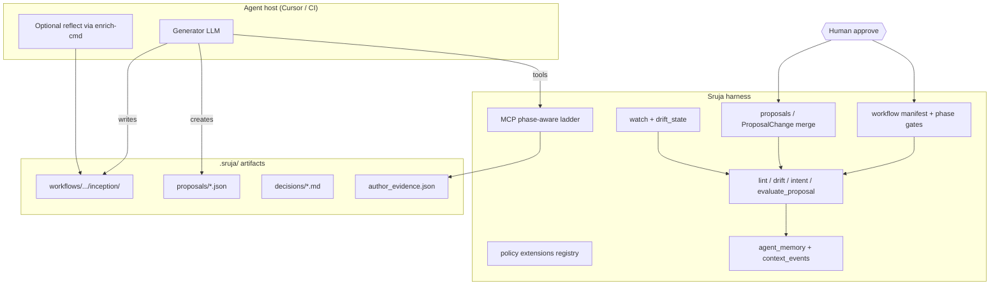

# AI-DLC + ACE synthesis plan

**Status:** In progress (E2E lifecycle profile, templates, requirements capture, test integration, readiness checks, summary, grounded design reviews, and MCP tools fully implemented — see [AIDLC_INTEGRATION.md](../AIDLC_INTEGRATION.md)).  
**Owner:** Product + CLI/MCP (`sruja-cli`, `sruja-diff`, `sruja-agent`, `sruja-engine`, `sruja-scan`).  
**Last updated:** 2026-05-26.

This plan adapts **AWS AI-DLC** (adaptive lifecycle scaffolding, hierarchical steering, human-in-the-loop gates) and **Stanford ACE** (Generator–Reflector–Curator, delta updates to playbooks) into Sruja **without** turning Sruja into a general-purpose coding agent runtime.

**Related docs (current truth):**

| Doc | Role |
|-----|------|
| [GROUNDED_HARNESS_AND_CONTINUAL_LEARNING.md](../GROUNDED_HARNESS_AND_CONTINUAL_LEARNING.md) | Harness vs host boundary |
| [GROUNDED_ARCHITECTURE_AUTHORING_PLAN.md](GROUNDED_ARCHITECTURE_AUTHORING_PLAN.md) | Facts / synthesis / enforcement lanes |
| [CONTEXT_ENGINEERING.md](../CONTEXT_ENGINEERING.md) | MCP ladder, focus, pruning |
| [context-graph-for-agents.md](../context-graph-for-agents.md) | DRs, `context_event/v2`, lifecycle rule |
| [AGENTIC_ORCHESTRATION_AND_SRUJA.md](../AGENTIC_ORCHESTRATION_AND_SRUJA.md) | What Sruja does *not* ship |

---

## 1. Problem statement

Industry adoption of AI coding assistants correlates with **architectural drift** and **context collapse** (summarization drops constraints; full rewrites of `repo.sruja` erase rationale). Sruja already mitigates this with grounded evidence, drift, proposals, and agent memory—but lacks:

1. **Explicit lifecycle phases** (Inception → Construction → Operations) with reviewable artifacts and hard gates.
2. **Deterministic policy packs** beyond ad-hoc markdown rules (fitness functions as blocking checks).
3. **ACE-style delta evolution** of architecture playbooks (no wholesale DSL rewrites).
4. **Phase-aware context isolation** in MCP (blast-radius-scoped retrieval).
5. **Grounded multi-step design review** as a first-class CLI contract.
6. **Operations-phase evidence** (IaC/deployment alignment with declared architecture).

---

## 2. Product boundary (non-negotiable)

| Layer | Owner | Responsibility |
|-------|--------|----------------|
| **Harness** | Sruja CLI + MCP + CI | Evidence, lint/drift/intent, proposals, workflows, memory, gates |
| **Generator** | Editor / CI host (Cursor, Claude Code, …) | Code and narrative generation, tool orchestration |
| **Reflector (narrative)** | Host (optional LLM via `--enrich-cmd`) | Summarize runs, critique designs |
| **Reflector (deterministic)** | Sruja | Post-run analysis: drift outcome, violation fingerprints, learning suggestions |
| **Curator (deterministic)** | Sruja | Merge `ProposalChange` ops, dedupe learnings, append context events |
| **Human** | Team | Approve phases, promote proposals, accept Decision Records |

**Will not ship in this plan:**

- In-process multi-agent Bedrock orchestration.
- `sruja agent run --autonomous` or replacement of the editor agent.
- Cryptographic signing inside the Sruja binary (org may add via CI; see §8).
- Mid-token blocking of LLM output without host cooperation.

**Will ship:**

- Artifact contracts, state machine, and gates the host and CI can enforce.
- AST/graph-level **delta** application for architecture changes.
- Pluggable **policy modules** compiled into drift checks.

---

## 3. Target architecture



**ACE mapping in Sruja:**

| ACE role | Sruja implementation |
|----------|----------------------|
| Generator | Host + `sruja focus` / MCP / skill |
| Reflector | `sruja agent reflect` (new), `agent curate`, facts_bundle + optional `--enrich-cmd` |
| Curator | `propose approve` (delta merge), `agent merge` / similarity prune, no full-file LLM rewrite |

---

## 4. Workstreams overview

| ID | Priority | Workstream | Outcome |
|----|----------|------------|---------|
| W1 | **P0** | Workflow manifest + phase gates | AI-DLC Inception/Construction/Operations as artifact contracts |
| W2 | **P0** | ACE delta merge (architecture playbook) | Curator applies `ProposalChange` only; forbid default full rewrite |
| W3 | **P1** | Policy extensions → fitness functions | Opt-in compiled policies, blocking in drift |
| W4 | **P1** | Phase-aware MCP | Context isolation by workflow phase + blast radius |
| W5 | **P2** | `sruja review design` | Grounded design review via enrich-cmd + stored critique |
| W6 | **P2** | IaC / operations evidence | Scan Terraform/K8s/etc. into evidence bundle |
| W7 | **P3** | Host integration guide + CI gates | HITL without false “crypto in CLI” claims |
| W8 | **cross** | Metrics & dogfooding | Prove paradox mitigation on Sruja repo |

**Dependency graph:**

```text
W1 (workflow) ──► W4 (MCP phase) ──► W5 (design review)
W2 (delta merge) ──► W1 (construction gate uses propose approve)
W3 (policies) ──► W1 (inception opt-in extensions)
W6 (IaC) ──► W1 (operations phase artifacts)
W7 ──► all (documents host obligations)
W8 ──► parallel after W1+W2 MVP
```

---

## 5. W1 — Workflow manifest and phase gates (P0)

### 5.1 Goals

- Model **AI-DLC three phases** as durable, reviewable artifacts—not chat history.
- Enforce **no Construction without approved Inception** (configurable strictness).
- Integrate existing primitives: `impact`, `focus`, proposals, Decision Records, `context_event/v2`.

### 5.2 Artifact layout

```text
.sruja/workflows/<workflow_id>/
  manifest.json                 # workflow/v1 — see schema below
  inception/
    scope.md                    # What / Why (human-edited or agent draft)
    impact.json                 # Output of `sruja impact` (machine)
    risks.md                    # Optional
    design-review.md            # Output of W5 (optional before approve)
  construction/
    task-plan.md                # Task layer from AGENTS.md
    linked_proposal_ids.json    # Proposals allowed for this workflow
  operations/
    deploy-scope.json           # Paths / manifests in scope (W6)
    readiness.json              # NFR checklist results (future)
```

### 5.3 `manifest.json` schema (`workflow/v1`)

```json
{
  "schema_version": "workflow/v1",
  "id": "pay-2026-042",
  "title": "Payment retry boundary",
  "phase": "inception",
  "created_at": "2026-05-20T12:00:00Z",
  "updated_at": "2026-05-20T12:00:00Z",
  "repo_root": ".",
  "target_elements": ["Shop.PaymentService"],
  "enabled_extensions": ["strict-layer-isolation"],
  "phase_approvals": {
    "inception": null,
    "construction": null,
    "operations": null
  },
  "strict_gates": true,
  "linked_trace_id": "trace-abc",
  "linked_decision_id": null
}
```

**`phase_approvals`:** ISO timestamp + actor when approved (`{ "at": "...", "by": "human@corp", "artifact_sha256": "..." }`).

### 5.4 CLI surface

| Command | Behavior |
|---------|----------|
| `sruja workflow init -r . --title "..." [--element ID]` | Create `manifest.json` + dirs; set `phase=inception` |
| `sruja workflow status -r . [--id ID]` | Print phase, missing artifacts, gate readiness |
| `sruja workflow record-impact -r . --id ID` | Run impact for `target_elements` → `inception/impact.json` |
| `sruja workflow approve -r . --id ID --phase inception` | Validate required files; set approval; emit `context_event` `decision_accepted` |
| `sruja workflow advance -r . --id ID` | Move `inception→construction` or `construction→operations` if approved |
| `sruja workflow list -r .` | List active workflows |

**Inception gate (strict):** `scope.md` exists, `impact.json` exists, optional extensions validated (W3), `sruja lint` on any referenced proposal DSL snippets.

**Construction gate:** `inception` approved; `task-plan.md` exists; at least one linked proposal in `Pending` or `Approved` state.

**Operations gate:** `construction` approved; `deploy-scope.json` present (W6); drift clean against `repo.sruja`.

### 5.5 MCP tools (add)

| Tool | Purpose |
|------|---------|
| `sruja_get_workflow` | Read manifest + phase artifact paths |
| `sruja_workflow_gate_check` | Return `{ "allowed": bool, "phase", "missing": [] }` for host before codegen |

Set `SRUJA_MCP_READONLY=1` → gate check + get only.

### 5.6 Implementation phases

| Milestone | Deliverables | Crates / files |
|-----------|--------------|----------------|
| **W1.0** | Schema doc + example under `docs/examples/workflows/` | docs only |
| **W1.1** | `workflow init`, `status`, `list` | `sruja-cli/src/commands/workflow/` |
| **W1.2** | `record-impact`, `approve`, `advance` + context events | `context_events.rs`, tests |
| **W1.3** | MCP tools + prompt update `sruja_mcp_guide` | `mcp/run_tool/`, `mcp_prompts.rs` |
| **W1.4** | Cursor command `.cursor/commands/sruja-inception.md` | editor |
| **W1.5** | CI: optional `sruja workflow status --check` on PR labels | `.github/workflows/` |

**Acceptance criteria:**

- [ ] Cannot `advance` to `construction` without `inception` approval when `strict_gates: true`.
- [ ] `workflow status` lists missing artifacts with remediation commands.
- [ ] Every approve appends `context_event/v2` with `workflow_id`, `trace_id`, `elements`.
- [ ] Documented mapping to AI-DLC Inception/Construction/Operations in this file §5.7.

### 5.7 AI-DLC phase mapping

| AI-DLC phase | Sruja phase | Primary artifacts | Agent constraint (host-enforced) |
|--------------|-------------|-------------------|----------------------------------|
| Inception | `inception` | `scope.md`, `impact.json`, DR draft | No app code commits tagged to workflow until approved |
| Construction | `construction` | `task-plan.md`, proposals, code | MCP `workflow_gate_check` must pass |
| Operations | `operations` | `deploy-scope.json`, drift CI | IaC evidence + NFR policies (W3/W6) |

---

## 6. W2 — ACE delta merge for architecture playbook (P0)

### 6.1 Goals

- **Curator never rewrites** full `repo.sruja` via LLM in default skill paths.
- All architecture mutations go through **`ProposalChange`** ops (already in `sruja-diff`) or human edit + lint.
- Preserve historical rationale in Decision Records and `synthesis_notes`, not in collapsed DSL comments.

### 6.2 Current baseline

- `Proposal` + `ProposalChange` enum: `AddElement`, `RemoveElement`, `ModifyElement`, `AddRelationship`, `RemoveRelationship` ([`crates/sruja-diff/src/proposal.rs`](../../crates/sruja-diff/src/proposal.rs)).
- `sruja propose create`, `sruja propose approve`, MCP `sruja_propose_change`.
- Skill rule: proposals preferred over direct `repo.sruja` writes.

### 6.3 Gaps to close

| Gap | Action |
|-----|--------|
| Skill/host still may paste full DSL | Lint rule + `evaluate_proposal` warning if diff > N lines vs merge |
| No workflow linkage | Proposal JSON gets optional `workflow_id` field |
| Merge errors opaque | `propose approve --dry-run` prints ordered ops + conflicts |
| No patch file format | Optional `.sruja/proposals/<id>.ops.jsonl` mirror of changes for audit |

### 6.4 Curator pipeline (deterministic)

```text
1. Load proposal (status = pending)
2. validate() against scan graph + intent + enabled policies (W3)
3. apply_changes() to AST → format → repo.sruja.working
4. lint → drift
5. On success: promote working → repo.sruja, status = approved, event proposal_merge
6. On failure: status unchanged, write proposal.validation
```

### 6.5 Reflector pipeline (post-construction)

| Step | Command / trigger |
|------|-------------------|
| Trigger | `sruja agent reflect -r . --run <id>` after apply verification OK |
| Inputs | `.sruja/agent/runs/<id>/facts_bundle.json`, drift report, test outcome |
| Output | Suggested `LearningEntry` rows (stdout JSON); **no auto-write** unless `--write` |
| Host | Optional `--enrich-cmd` for narrative reflect; Sruja stores only structured fields |

### 6.6 Implementation phases

| Milestone | Deliverables |
|-----------|--------------|
| **W2.0** | Update `sruja-architecture` skill: mandatory proposal path; ban full-file replace in agent apply |
| **W2.1** | `propose approve --dry-run`, better Apply errors |
| **W2.2** | `workflow_id` on proposals; construction gate checks linkage |
| **W2.3** | `sruja agent reflect` subcommand |
| **W2.4** | MCP `sruja_apply_proposal_delta` (read-only preview + explicit apply flag) |

**Acceptance criteria:**

- [ ] Approving a 50-element proposal only touches affected AST nodes; unrelated elements byte-identical.
- [ ] `agent reflect` never modifies `repo.sruja` without separate approve path.
- [ ] Integration test: add container + edge via proposal → lint + drift pass.

---

## 7. W3 — Policy extensions as fitness functions (P1)

### 7.1 Goals

- Replace **probabilistic** markdown-only steering with **blocking** checks in `sruja drift` / `evaluate_proposal`.
- Mirror AI-DLC **opt-in** pattern: declarative enablement at workflow init or `sruja start`.

### 7.2 Registry layout

```text
.sruja/extensions.toml          # enabled list + per-extension config
extensions/                     # shipped with Sruja or repo-local
  strict-layer-isolation/
    extension.toml              # id, version, description, default=false
    policy.rs                   # (built-in) or policy.wasm (future)
    README.md                   # human-readable
  zero-trust-routes/
    ...
```

**`extensions.toml` example:**

```toml
[extensions.strict-layer-isolation]
enabled = true
params = { allowed_layers = ["ui", "service", "data"] }
```

### 7.3 Built-in fitness functions (MVP set)

| Extension ID | Check | Data source |
|--------------|-------|-------------|
| `strict-layer-isolation` | Import graph respects declared layers in `repo.sruja` | scan + graph |
| `route-auth-boundary` | HTTP entry modules do not reach data layer without auth module on path | scan heuristics |
| `weak-bounded-cohesion` | LPA cohesion score ≥ threshold for touched modules | discover/LPA |
| `domain-db-isolation` | No cross-domain direct DB imports | graph + tags |

### 7.4 CLI

| Command | Behavior |
|---------|----------|
| `sruja extension list` | Show available + enabled |
| `sruja extension enable <id>` | Update `extensions.toml` |
| `sruja drift -r . --extensions` | Run baseline + enabled policies |
| `sruja workflow init --extension <id>` | Enable for one workflow |

### 7.5 Implementation phases

| Milestone | Deliverables |
|-----------|--------------|
| **W3.0** | Design: policy trait in `sruja-intent` or `sruja-engine` |
| **W3.1** | `extensions.toml` + one reference policy (`strict-layer-isolation`) |
| **W3.2** | Wire into `drift`, `evaluate_proposal`, proposal `validate()` |
| **W3.3** | Workflow inception prompts opt-in via manifest `enabled_extensions` |
| **W3.4** | Book chapter + valid-example `.sruja` |

**Acceptance criteria:**

- [ ] Enabled policy violation fails `drift` with stable rule ID (for CI annotations).
- [ ] Disabled extension produces zero new violations.
- [ ] `evaluate_proposal` includes policy violations in MCP JSON.

---

## 8. W4 — Phase-aware MCP context isolation (P1)

### 8.1 Goals

Implement **Context Engineering** strategies from the strategic doc:

- **Inception:** broad topology, decisions, cohesion/weak bounds.
- **Construction:** only `keep_ids` from blast radius (+ policies + learnings).
- **Operations:** deploy-facing elements + IaC evidence (W6).

### 8.2 Mechanism

Extend MCP tool args (backward compatible defaults):

```json
{
  "workflow_id": "pay-2026-042",
  "phase": "construction",
  "active_element_ids": ["mod:crates/payment/..."],
  "cache_friendly": true
}
```

Server logic:

1. Resolve workflow manifest → `target_elements`, phase.
2. If `phase=construction`, compute keep set = impact closure from W1 `impact.json` ∪ `active_element_ids`.
3. Filter `sruja_get_elements` / `get_task_context` payloads; set `compress_ids` hint for `sruja_suggest_context_prune`.
4. If `phase=inception`, allow full ladder depth cap (existing token budgets).

### 8.3 Implementation phases

| Milestone | Deliverables |
|-----------|--------------|
| **W4.1** | `phase` + `workflow_id` on `get_task_context`, `get_focus_briefing` |
| **W4.2** | Auto keep/compress from `impact.json` |
| **W4.3** | MCP guide + `.cursor/rules/sruja-context-host.mdc` update |
| **W4.4** | Token estimate tests (construction < inception for same repo) |

**Acceptance criteria:**

- [ ] Construction-phase payload token estimate ≤ 40% of inception for same target on dogfood repo.
- [ ] Missing workflow falls back to current behavior (no breakage).

---

## 9. W5 — Grounded design review (P2)

### 9.1 Goals

AI-DLC **Design Reviewer** analogue: critique **before** Construction, anchored to scan/LPA/evidence—not hallucinated system shape.

### 9.2 CLI

```bash
sruja review design -r . --workflow <id> \
  [--enrich-cmd 'claude -p'] \
  [-o .sruja/workflows/<id>/inception/design-review.md]
```

**Pipeline:**

1. Load `inception/scope.md`, `impact.json`, `author_evidence.json`, proposal if any.
2. Export `sruja export json` slice + cohesion summary (existing analyze).
3. Pipe JSON stdin to `--enrich-cmd` with fixed rubric template (gap analysis, risks, alternatives).
4. Write markdown output; append `context_event` `evidence_cited`.
5. Optional: non-LLM checklist (deterministic) always runs first.

### 9.3 MCP

- Prompt `sruja_review_design` (workflow-aware).
- Read-only: `sruja_get_design_review_input` returns JSON bundle without calling LLM.

### 9.4 Acceptance criteria

- [ ] Review input JSON includes `evidence_refs` and LPA weak-boundary list when available.
- [ ] Without `--enrich-cmd`, emits deterministic checklist only.
- [ ] Inception approve may require `design-review.md` when `manifest.require_design_review = true`.

---

## 10. W6 — Operations phase: IaC evidence (P2)

### 10.1 Goals

Align **Operations** phase with deployed reality: Terraform, Kubernetes, CloudFormation, Pulumi (phased).

### 10.2 Evidence model (`deploy_evidence/v1`)

Extend `author_evidence` or sibling file `.sruja/deploy_evidence.json`:

```json
{
  "schema_version": "deploy_evidence/v1",
  "sources": [
    { "kind": "terraform", "path": "infra/", "resources": ["aws_lb.main", "aws_security_group.api"] }
  ],
  "links_to_elements": [
    { "resource": "aws_lb.main", "element_id": "Shop.ApiGateway" }
  ]
}
```

### 10.3 CLI

| Command | Behavior |
|---------|----------|
| `sruja scan iac -r .` | Parse IaC → deploy evidence |
| `sruja drift -r . --deploy` | Compare deploy evidence to `repo.sruja` deployment views |
| `sruja workflow record-deploy-scope` | Fill `operations/deploy-scope.json` |

### 10.4 Phased language support

| Phase | Formats |
|-------|---------|
| W6.1 | Terraform HCL (resource blocks only) |
| W6.2 | Kubernetes YAML (Service, Deployment, Ingress) |
| W6.3 | CloudFormation JSON/YAML subset |

### 10.5 Acceptance criteria

- [ ] Detect missing LB/security group when `repo.sruja` declares container exposed to internet.
- [ ] Operations gate fails if `deploy-scope.json` stale vs last `scan iac`.

---

## 11. W7 — Host integration and HITL gates (P3)

### 11.1 Goals

Document how organizations enforce **human sign-off** without claiming Sruja stops the LLM mid-stream.

### 11.2 Patterns

| Pattern | Mechanism |
|---------|-----------|
| **Phase approve** | `sruja workflow approve` + CI checks `phase_approvals` |
| **Proposal promote** | CODEOWNERS on `repo.sruja` + `sruja propose approve` only on maintainers |
| **Baseline violations** | PR cannot merge if `violations.baseline.json` would grow without labeled workflow |
| **Read-only agent** | `SRUJA_MCP_READONLY=1` during Inception |
| **Cursor hook** | Before `agent apply`, shell `sruja workflow gate_check` (example script in `docs/examples/host-gates/`) |
| **Crypto / SSO** | CI OIDC + signed attestations on workflow manifest hash (org-specific; document in SECURITY.md appendix) |

### 11.3 Deliverables

- `docs/HOST_HITL_INTEGRATION.md` (new)
- Example GitHub Action: `sruja-workflow-gate.yml`
- VS Code: optional command **Sruja: Verify workflow gate before apply**

---

## 12. W8 — Metrics and dogfooding (cross-cutting)

### 12.1 Metrics

| Metric | Source | Target (dogfood) |
|--------|--------|------------------|
| Context score trend | `sruja context-score` | Non-decreasing on `main` |
| Drift violations pre-merge | CI `sruja-check` | Catch ≥90% of intentional violations |
| MCP token estimate (construction) | Tool response | ↓30% vs unscoped after W4 |
| Learning utility | `task_success_after / task_total_after` | Increase after reflect pipeline |
| Workflow adoption | Count `.sruja/workflows/*` on Sruja PRs | ≥50% of arch-tagged PRs use W1 within 3 months of W1.2 |

### 12.2 Dogfood schedule

1. Use W1 on next `repo.sruja`-touching PR (payment/cli boundary example).
2. Enable W3 `weak-bounded-cohesion` on self-repo.
3. Record outcomes in `agent_memory` with `hitl_kind: precedent`.

---

## 13. Documentation and skill updates

| Artifact | Update |
|----------|--------|
| `AGENTS.md` | Link workflow + reflect; two-layer planning → workflow IDs |
| `GROUNDED_HARNESS_AND_CONTINUAL_LEARNING.md` | ACE role table + W2 reflect |
| `CONTEXT_ENGINEERING.md` | Phase-aware MCP § |
| `skills/sruja-architecture/` | Mandatory proposals; inception workflow command |
| `book/` | New chapter: "AI-DLC with Sruja" (after W1.2) |
| `repo.sruja` | Model `WorkflowOrchestrator` component when CLI exists (dogfood) |

---

## 14. Testing strategy

| Layer | Tests |
|-------|-------|
| Unit | manifest parse/approve; proposal apply permutations; policy violations |
| Integration | `crates/sruja-cli/tests/commands_integration.rs` workflow lifecycle |
| MCP | `mcp/tests.rs` gate_check + phased context token caps |
| E2E | Script: init workflow → proposal → approve → drift clean |
| Regression | Fixture repos under `tests/fixtures/workflows/` |

---

## 15. Risks and mitigations

| Risk | Mitigation |
|------|------------|
| Workflow bureaucracy slows teams | `strict_gates: false` for small repos; single-workflow default |
| Policy false positives | Per-extension `warn` vs `error`; baseline exceptions with `hitl_kind: exception` |
| enrich-cmd cost/latency | Deterministic review path without LLM; cache review inputs |
| IaC parse fragility | Start Terraform-only; unknown resources → `open_questions` not hard fail |
| Host ignores gates | CI required checks; document clearly in HOST_HITL |
| Scope creep into agent runtime | Review PRs against §2 boundary; reject in-process LLM orchestration |

---

## 16. Rollout timeline (indicative)

| Quarter | Milestones |
|---------|------------|
| **Q2 2026** | W1.1–W1.3, W2.1–W2.2 (MVP gates + delta approve) |
| **Q3 2026** | W3.1–W3.2, W4.1–W4.2, W2.3, W7 doc |
| **Q4 2026** | W5, W6.1, W1.5 CI templates |
| **2027 H1** | W6.2–W6.3, WASM policies (if needed), book chapter |

Adjust based on contributor capacity; W1+W2 are the critical path.

---

## 17. Open questions (resolve before W1.1 coding)

1. **Git-tracked workflows?** Default `.sruja/workflows/` gitignored like some decisions, or committed for audit?
2. **Single active workflow per repo** or many parallel?
3. **Extension distribution:** only built-in vs allow repo-local `extensions/` Rust plugins?
4. **Approve identity:** git committer vs explicit `--by` flag for enterprise audit?
5. **Federation:** workflow manifests per repo in multi-repo compose (defer to W1.6)?

Track resolutions in PR comments; update §5.3 when decided.

---

## 18. Definition of done (program level)

The synthesis is **done** when:

1. A team can run **Inception → approve → Construction → propose approve → Operations** using only documented Sruja artifacts and gates.
2. **No default path** promotes full LLM `repo.sruja` rewrite; proposals + delta merge are required in skill and `evaluate_proposal`.
3. At least **two fitness extensions** ship and run in CI on this repository.
4. MCP **construction** context measurably smaller than inception for the same target.
5. **HOST_HITL** documents CI + editor patterns; no misleading "Sruja stops the model" claims.
6. Dogfood metrics in §12.1 published in `docs/internal/dogfooding-playbook.md` appendix.

---

## 19. Issue breakdown (for tracking)

Copy to GitHub issues/epic:

| Issue | Title | Workstream | Depends |
|-------|-------|------------|---------|
| #TBD | workflow/v1 schema + init/status CLI | W1 | — |
| #TBD | workflow approve/advance + context events | W1 | W1 init |
| #TBD | MCP workflow gate + get_workflow | W1 | W1 approve |
| #TBD | propose approve dry-run + workflow_id on proposals | W2 | W1 |
| #TBD | agent reflect subcommand | W2 | agent runs |
| #TBD | extensions.toml + strict-layer-isolation | W3 | — |
| #TBD | drift --extensions integration | W3 | W3.1 |
| #TBD | MCP phase + workflow_id filtering | W4 | W1 impact |
| #TBD | review design command + prompt | W5 | W1 |
| #TBD | scan iac terraform MVP | W6 | — |
| #TBD | HOST_HITL_INTEGRATION.md + example Action | W7 | W1 |
| #TBD | Dogfood metrics dashboard in daily | W8 | W1, W2 |

---

## 20. References

- AWS AI-DLC / aidlc-workflows (workflow scaffolds, steering rules, opt-in extensions).
- ACE (Generator / Reflector / Curator, delta updates, grow-and-refine).
- Sruja: [PRODUCT_FEATURE_ALIGNMENT_REPORT.md](../PRODUCT_FEATURE_ALIGNMENT_REPORT.md) — canonical workflows kill rule.
