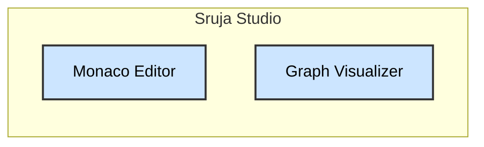

# Sruja Architecture Tooling

## Table of Contents

- [Executive Summary](#executive-summary)
- [Architecture Overview (C4 L1)](#architecture-overview-c4-l1)
- [Systems (C4 L2/L3)](#systems)
- [Persons](#persons)
- [Quality Attributes](#quality-attributes)
- [Security](#security)
- [Capacity Planning](#capacity-planning)
- [Monitoring & Observability](#monitoring--observability)
- [Failure Modes and Recovery](#failure-modes-and-recovery)
- [Dependency Risk Assessment](#dependency-risk-assessment)
- [Compliance & Certifications](#compliance--certifications)
- [Cost Analysis](#cost-analysis)
- [API Versioning](#api-versioning)
- [Multi-Region Architecture](#multi-region-architecture)
- [Data Lifecycle Management](#data-lifecycle-management)
- [Policies](#policies)
- [Flows](#flows)
- [Integration Contracts](#integration-contracts)
- [Scenarios](#scenarios)
- [Relations](#relations)
- [Data Consistency Models](#data-consistency-models)
- [Constraints](#constraints)
- [Conventions](#conventions)
- [Document Metadata](#document-metadata)
- [Glossary](#glossary)


## Executive Summary

### Key Metrics

- **Scale**: Local execution + Web (Client-side)
- **Availability**: CLI: 100% (Offline), Studio: 99.9% (Static Hosting)
- **Cost**: Low (Static hosting + Open Source)

### Architecture Highlights

- Microservices architecture with 4 core services
- Client-heavy, Serverless, Offline-first

### Risk Summary

Not specified


## Architecture Overview (C4 L1)

```mermaid
graph LR

    classDef personStyle fill:#ffcccc,stroke:#333,stroke-width:2px,color:#000
    classDef systemStyle fill:#cce5ff,stroke:#333,stroke-width:2px,color:#000

    Developer["Developer"]
    class Developer personStyle
    Architect["Software Architect"]
    class Architect personStyle
    CLI["Sruja CLI"]
    class CLI systemStyle
    Studio["Sruja Studio"]
    class Studio systemStyle
    VSCode["VS Code Extension"]
    class VSCode systemStyle

    Developer -->|Compiles & Lints| CLI
    Developer -->|Writes code| VSCode
    Architect -->|Visualizes & Reviews| Studio
    VSCode -->|Communicates via RPC| CLI
    Studio -->|Compiles DSL (WASM)| CLI
    VSCode -->|Communicates via RPC| CLI
    Studio -->|Compiles DSL (WASM)| CLI

```


## Systems

### Sruja CLI

Command line interface for processing .sruja files

#### Container View (C4 L2)

```mermaid
graph LR

    classDef personStyle fill:#ffcccc,stroke:#333,stroke-width:2px,color:#000
    classDef systemStyle fill:#cce5ff,stroke:#333,stroke-width:2px,color:#000
    classDef containerStyle fill:#cce5ff,stroke:#333,stroke-width:2px,color:#000
    classDef databaseStyle fill:#ccffcc,stroke:#333,stroke-width:2px,color:#000
    classDef queueStyle fill:#ffe5cc,stroke:#333,stroke-width:2px,color:#000
    classDef externalStyle fill:#eeeeee,stroke:#666,stroke-width:2px,color:#000,stroke-dasharray: 3 3
    classDef componentStyle fill:#e6f7ff,stroke:#333,stroke-width:2px,color:#000

    subgraph CLI["Sruja CLI"]
        Compiler["Compiler"]
        class Compiler containerStyle
        LSP["Language Server"]
        class LSP containerStyle
    end

    VSCode["VS Code Extension"]
    class VSCode externalStyle
    VSCode -->|Communicates via RPC| LSP
    Studio["Sruja Studio"]
    class Studio externalStyle
    Studio -->|Compiles DSL (WASM)| Compiler

```

#### Component View (C4 L3)

##### Compiler (C4 L3)

```mermaid
graph LR

    classDef personStyle fill:#ffcccc,stroke:#333,stroke-width:2px,color:#000
    classDef systemStyle fill:#cce5ff,stroke:#333,stroke-width:2px,color:#000
    classDef containerStyle fill:#cce5ff,stroke:#333,stroke-width:2px,color:#000
    classDef databaseStyle fill:#ccffcc,stroke:#333,stroke-width:2px,color:#000
    classDef queueStyle fill:#ffe5cc,stroke:#333,stroke-width:2px,color:#000
    classDef externalStyle fill:#eeeeee,stroke:#666,stroke-width:2px,color:#000,stroke-dasharray: 3 3
    classDef componentStyle fill:#e6f7ff,stroke:#333,stroke-width:2px,color:#000

    Lexer["Lexer"]
    class Lexer componentStyle
    Parser["Parser"]
    class Parser componentStyle
    Validator["Validator"]
    class Validator componentStyle
    Exporter["Exporter"]
    class Exporter componentStyle
    VSCode["VS Code Extension"]
    class VSCode externalStyle
    VSCode -->|Communicates via RPC| LSP
    Studio["Sruja Studio"]
    class Studio externalStyle
    Studio -->|Compiles DSL (WASM)| Compiler

```

#### Containers

- **Compiler**: Compiler - Parses and validates DSL files
- **LSP**: Language Server - LSP implementation for IDE support

### Sruja Studio

Web-based visualizer and editor

#### Container View (C4 L2)



#### Component View (C4 L3)

#### Containers

- **Editor**: Monaco Editor - Code editor with syntax highlighting
- **Visualizer**: Graph Visualizer - Interactive architecture diagrams

### VS Code Extension

Editor extension for Sruja DSL


## Persons

### Developer

### Software Architect


## Quality Attributes

Not specified


## Security

Not specified


## Capacity Planning

### Current Capacity

- **Sruja Studio**: Client-side rendering (Scales with users)

### Scaling Strategy

Not specified

### Projected Growth

Adoption growing in enterprise sector

### Bottlenecks

Large graph layout performance in browser (WASM)


## Monitoring & Observability

### Metrics

Not specified

### Key Dashboards

Not specified

### Alerting

Not specified

### Logging

Not specified

### Tracing

Not specified


## Failure Modes and Recovery

### Critical Service Failures

#### Sruja CLI Failure
- **Impact**: Complete service outage, 100% of users affected
- **Detection**: Health check failures (>3 consecutive), error rate spike (>5% for 1 minute)
- **Mitigation**: Auto-scaling triggers, circuit breakers activate, read-only mode enabled
- **Recovery**: RTO: 15 minutes, RPO: 5 minutes (last backup). Steps: 1) Identify root cause, 2) Rollback if needed, 3) Scale up, 4) Verify
- **Fallback**: Graceful degradation, queue requests for later processing

#### Sruja Studio Failure
- **Impact**: Complete service outage, 100% of users affected
- **Detection**: Health check failures (>3 consecutive), error rate spike (>5% for 1 minute)
- **Mitigation**: Auto-scaling triggers, circuit breakers activate, read-only mode enabled
- **Recovery**: RTO: 15 minutes, RPO: 5 minutes (last backup). Steps: 1) Identify root cause, 2) Rollback if needed, 3) Scale up, 4) Verify
- **Fallback**: Graceful degradation, queue requests for later processing

#### VS Code Extension Failure
- **Impact**: Service unavailable
- **Detection**: Health check failures (>3 consecutive), error rate spike (>5% for 1 minute)
- **Mitigation**: Auto-scaling triggers, circuit breakers activate
- **Recovery**: RTO: 15 minutes, RPO: 5 minutes (last backup). Steps: 1) Identify root cause, 2) Rollback if needed, 3) Scale up, 4) Verify
- **Fallback**: Graceful degradation, queue requests for later processing


## Dependency Risk Assessment

### External Dependencies

Not specified

### Internal Dependencies

Not specified


## Compliance & Certifications

### Compliance Status

Not specified

### Compliance Controls

Not specified


## Cost Analysis

### Monthly Operating Costs

Not specified

### Cost per Transaction

Not specified

### Cost Optimization

Not specified


## API Versioning

### Versioning Strategy

Not specified

### Version Lifecycle

Not specified

### Migration Guide

Not specified


## Multi-Region Architecture

### Current Deployment

Not specified

### Data Residency

Not specified

### Latency

Not specified

### Future Expansion

Not specified


## Data Lifecycle Management

### Data Retention Policies

- No user data stored centrally. All data stays local or in git.

### Data Archival

Not specified

### Data Deletion

Not specified


## Relations

- Developer → CLI: Compiles & Lints
- Developer → VSCode: Writes code
- Architect → Studio: Visualizes & Reviews
- VSCode → CLI.LSP: Communicates via RPC
- Studio → CLI.Compiler: Compiles DSL (WASM)
- VSCode → CLI: Communicates via RPC
- Studio → CLI: Compiles DSL (WASM)


## Data Consistency Models

### Consistency Guarantees

- **Developer → VSCode**: Strong consistency (ACID transaction)


## Document Metadata

**Metadata**:

- **team**: Sruja Core Team
- **status**: Active
- **version**: 0.5.0
- **scale**: Local execution + Web (Client-side)
- **availability**: CLI: 100% (Offline), Studio: 99.9% (Static Hosting)
- **cost**: Low (Static hosting + Open Source)
- **architecture**: Client-heavy, Serverless, Offline-first
- **dataRetention**: No user data stored centrally. All data stays local or in git.
- **privacy**: No tracking enabled by default.
- **projectedGrowth**: Adoption growing in enterprise sector
- **bottlenecks**: Large graph layout performance in browser (WASM)


## Glossary

- **CLI**: Sruja CLI
- **Studio**: Sruja Studio
- **VSCode**: VS Code Extension
- **Developer**: Developer
- **Architect**: Software Architect


